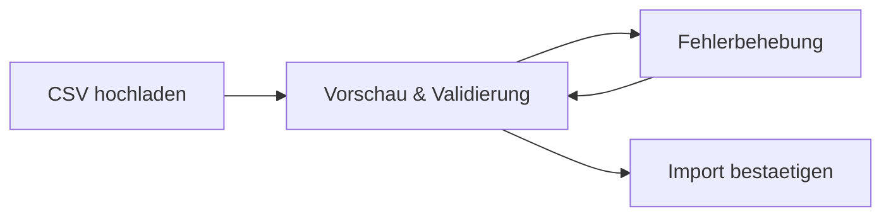

# Stammdaten verwalten

Kamerplanter speichert alle grundlegenden Pflanzendaten -- Arten, Sorten und botanische Familien -- als **Stammdaten**. Diese bilden die Basis fuer Pflanzdurchlaeufe, Naehrstoffplaene, Phasensteuerung und Pflegeerinnerungen.

## Ueberblick

Stammdaten sind die zentrale Wissensgrundlage des Systems. Jede Pflanzenart wird mit bis zu 80+ strukturierten Feldern erfasst:

| Entitaet | Beschreibung | Beispiel |
|----------|-------------|---------|
| **Botanische Familie** | Pflanzenfamilie mit Fruchtfolge-Kategorie | Solanaceae (Nachtschattengewaechse) |
| **Art (Species)** | Botanische Art mit Taxonomie, Klima, Licht, Vermehrung | *Solanum lycopersicum* (Tomate) |
| **Sorte (Cultivar)** | Zuchtform mit sortenspezifischen Eigenschaften | San Marzano, Cherry Roma |

Die Hierarchie ist: Familie → Art → Sorte. Jede Sorte gehoert zu genau einer Art, jede Art zu genau einer Familie.

## Arten verwalten

### Art anlegen

1. Navigiere zu **Stammdaten** > **Arten**
2. Klicke auf **Neue Art**
3. Fuelle mindestens die Pflichtfelder aus:
    - **Wissenschaftlicher Name** (z.B. *Solanum lycopersicum*)
    - **Umgangssprachliche Namen** (z.B. Tomate, Tomato)
    - **Familie** (z.B. Solanaceae)
    - **Gattung** (z.B. Solanum)

!!! tip "Erfahrungsstufen beeinflussen die Sichtbarkeit"
    Im **Einsteiger-Modus** werden nur die wichtigsten Felder angezeigt. Fortgeschrittene Felder wie Allelopathie-Score, Photoperiodismus oder Wurzeltyp erscheinen erst im **Fortgeschrittenen-** bzw. **Experten-Modus**. Du kannst jederzeit ueber den Toggle "Alle Felder anzeigen" auch im Einsteiger-Modus auf alle Felder zugreifen.

### Wichtige Art-Felder

| Feld | Beschreibung | Beispiel |
|------|-------------|---------|
| Lebenszyklus | Annual, Biennial oder Perennial | Annual |
| Wuchsform | Kraut, Strauch, Baum, Kletterpflanze | Kraut |
| Wurzeltyp | Flachwurzler, Pfahlwurzel, Knollig, ... | Faserwurzel |
| Frostempfindlichkeit | Hardy, Half-hardy, Tender | Tender |
| Naehrstoffbedarf | Starkzehrer, Mittelzehrer, Schwachzehrer | Starkzehrer |
| Photoperiodismus | Kurztagspflanze, Langtagspflanze, Tagneutral | Tagneutral |
| Toxizitaet | Giftigkeit fuer Katzen/Hunde (ASPCA-Daten) | Giftig fuer Katzen |

### Art bearbeiten

1. Klicke auf eine Art in der Liste
2. Auf der Detailseite kannst du alle Felder bearbeiten
3. Die Detailseite zeigt auch zugehoerige Sorten, Wachstumsphasen und Naehrstoffplaene

## Sorten verwalten

Sorten (Cultivars) sind Zuchtformen innerhalb einer Art. Sie erben die Grundeigenschaften der Art und ergaenzen sortenspezifische Daten.

### Sorte anlegen

1. Navigiere zur **Detailseite einer Art**
2. Im Abschnitt **Sorten** klicke auf **Neue Sorte**
3. Fuelle die Felder aus:
    - **Name** (z.B. San Marzano)
    - **Zuechter** (optional)
    - **Merkmale** (z.B. krankheitsresistent, ertragreich, kompakt)

## Botanische Familien

Familien gruppieren verwandte Arten und sind die Basis fuer die Fruchtfolge-Planung. Kamerplanter wird mit den gaengigsten Familien vorinstalliert (Solanaceae, Brassicaceae, Fabaceae, Cucurbitaceae, ...).

### Familie anlegen

1. Navigiere zu **Stammdaten** > **Botanische Familien**
2. Klicke auf **Neue Familie**
3. Gib den Namen und optional die Fruchtfolge-Kategorie an

---

## Stammdaten per AI aufbereiten

Das manuelle Zusammentragen aller Pflanzendaten aus verschiedenen Quellen ist zeitaufwaendig. Kamerplanter bietet deshalb eine **AI-gestuetzte Pipeline**, die neue Pflanzen vollstaendig aufbereitet und qualitaetssichert.

Die Pipeline nutzt Claude Code Agents um:

1. **Pflanzendokumente automatisch zu generieren** -- Ein Agent recherchiert Taxonomie, Wachstumsphasen, Naehrstoffprofile, Schaedlinge und Mischkultur-Daten
2. **Fachlich zu reviewen** -- Ein zweiter Agent prueft die Daten aus agrobiologischer Sicht
3. **Import-fertige CSV-Daten zu liefern** -- Jedes Dokument enthaelt fertige CSV-Zeilen fuer den Bulk-Import

!!! example "Beispiel-Aufruf in Claude Code"
    ```
    Erstelle ein Pflanzendokument fuer Basilikum
    ```
    Claude Code erkennt den Kontext und startet automatisch den passenden Agent.

Aktuell sind ueber **32 Pflanzen** vollstaendig dokumentiert -- darunter Gemuese, Kraeuter, Zierpflanzen und Zimmerpflanzen.

:material-arrow-right: **[Ausfuehrliche Anleitung: Pflanzendaten per AI aufbereiten](../guides/ai-plant-data-pipeline.md)**

---

## Stammdaten per CSV importieren

Fuer die Erstbefuellung oder Batch-Aktualisierungen koennen Stammdaten per CSV-Datei importiert werden. Der Import folgt einem sicheren **Zwei-Phasen-Prozess**:



### Unterstuetzte Entitaeten

| Entitaet | Identifikation | Anwendungsfall |
|----------|---------------|----------------|
| Species | `scientific_name` | Erstbefuellung botanischer Arten |
| Cultivar | `name` + `parent_species` | Sortenkatalogeinfuhr |
| BotanicalFamily | `name` | Pflanzenfamilien |
| NutrientPlan | `name` + `source_chart` | Hersteller-Feeding-Charts |

### Import durchfuehren

1. Navigiere zu **Stammdaten** > **Import**
2. Waehle die **Entitaet** (Art, Sorte, Familie oder Naehrstoffplan)
3. Lade deine **CSV-Datei** hoch -- Encoding und Trennzeichen werden automatisch erkannt
4. Pruefe die **Vorschau**: Jede Zeile wird einzeln validiert, Fehler werden pro Feld angezeigt
5. Waehle die **Duplikatstrategie** (Ueberspringen, Aktualisieren oder Abbrechen)
6. Klicke auf **Import bestaetigen**

!!! tip "CSV-Vorlagen herunterladen"
    Unter **Import** > **Vorlagen** stehen CSV-Templates fuer jede Entitaet bereit. Diese enthalten alle unterstuetzten Spalten mit Beispielwerten.

!!! tip "AI-generierte CSV-Daten nutzen"
    Die [AI-Pipeline](../guides/ai-plant-data-pipeline.md) liefert in Abschnitt 8 jedes Pflanzendokuments fertige CSV-Zeilen, die direkt importiert werden koennen.

---

## Voraussetzungen

- Kamerplanter-Instanz gestartet und zugaenglich
- Fuer den CSV-Import: CSV-Datei im UTF-8-Format

## Siehe auch

- [Pflanzendaten per AI aufbereiten](../guides/ai-plant-data-pipeline.md) -- Ausfuehrliche Anleitung zur AI-Pipeline
- [Wachstumsphasen](growth-phases.md) -- Phasensteuerung pro Art
- [Pflanzdurchlaeufe](planting-runs.md) -- Pflanzen von der Aussaat bis zur Ernte begleiten
- [Duenge-Logik](fertilization.md) -- Naehrstoffplaene und Feeding-Charts
