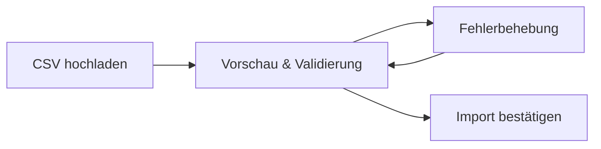

# Stammdaten verwalten

Kamerplanter speichert alle grundlegenden Pflanzendaten — Arten, Sorten und botanische Familien — als **Stammdaten**. Diese bilden die Basis für Pflanzdurchläufe, Nährstoffpläne, Phasensteuerung und Pflegeerinnerungen.

## Überblick

Stammdaten sind die zentrale Wissensgrundlage des Systems. Jede Pflanzenart wird mit bis zu 80+ strukturierten Feldern erfasst:

| Entität | Beschreibung | Beispiel |
|----------|-------------|---------|
| **Botanische Familie** | Pflanzenfamilie mit Fruchtfolge-Kategorie | Solanaceae (Nachtschattengewächse) |
| **Art (Species)** | Botanische Art mit Taxonomie, Klima, Licht, Vermehrung | *Solanum lycopersicum* (Tomate) |
| **Sorte (Cultivar)** | Zuchtform mit sortenspezifischen Eigenschaften | San Marzano, Cherry Roma |

Die Hierarchie ist: Familie → Art → Sorte. Jede Sorte gehört zu genau einer Art, jede Art zu genau einer Familie.

## Arten verwalten

### Art anlegen

1. Navigiere zu **Stammdaten** > **Arten**
2. Klicke auf **Neue Art**
3. Fülle mindestens die Pflichtfelder aus:
    - **Wissenschaftlicher Name** (z.B. *Solanum lycopersicum*)
    - **Umgangssprachliche Namen** (z.B. Tomate, Tomato)
    - **Familie** (z.B. Solanaceae)
    - **Gattung** (z.B. Solanum)

!!! tip "Erfahrungsstufen beeinflussen die Sichtbarkeit"
    Im **Einsteiger-Modus** werden nur die wichtigsten Felder angezeigt. Fortgeschrittene Felder wie Allelopathie-Score, Photoperiodismus oder Wurzeltyp erscheinen erst im **Fortgeschrittenen-** bzw. **Experten-Modus**. Du kannst jederzeit über den Toggle "Alle Felder anzeigen" auch im Einsteiger-Modus auf alle Felder zugreifen.

### Wichtige Art-Felder

| Feld | Beschreibung | Beispiel |
|------|-------------|---------|
| Lebenszyklus | Annual, Biennial oder Perennial | Annual |
| Wuchsform | Kraut, Strauch, Baum, Kletterpflanze | Kraut |
| Wurzeltyp | Flachwurzler, Pfahlwurzel, Knollig, ... | Faserwurzel |
| Frostempfindlichkeit | Hardy, Half-hardy, Tender | Tender |
| Nährstoffbedarf | Starkzehrer, Mittelzehrer, Schwachzehrer | Starkzehrer |
| Photoperiodismus | Kurztagspflanze, Langtagspflanze, Tagneutral | Tagneutral |
| Toxizität | Giftigkeit für Katzen/Hunde (ASPCA-Daten) | Giftig für Katzen |

### Art bearbeiten

1. Klicke auf eine Art in der Liste
2. Auf der Detailseite kannst du alle Felder bearbeiten
3. Die Detailseite zeigt auch zugehörige Sorten, Wachstumsphasen und Nährstoffpläne

## Sorten verwalten

Sorten (Cultivars) sind Zuchtformen innerhalb einer Art. Sie erben die Grundeigenschaften der Art und ergänzen sortenspezifische Daten.

### Sorte anlegen

1. Navigiere zur **Detailseite einer Art**
2. Im Abschnitt **Sorten** klicke auf **Neue Sorte**
3. Fülle die Felder aus:
    - **Name** (z.B. San Marzano)
    - **Züchter** (optional)
    - **Merkmale** (z.B. krankheitsresistent, ertragreich, kompakt)

## Botanische Familien

Familien gruppieren verwandte Arten und sind die Basis für die Fruchtfolge-Planung. Kamerplanter wird mit den gängigsten Familien vorinstalliert (Solanaceae, Brassicaceae, Fabaceae, Cucurbitaceae, ...).

### Familie anlegen

1. Navigiere zu **Stammdaten** > **Botanische Familien**
2. Klicke auf **Neue Familie**
3. Gib den Namen und optional die Fruchtfolge-Kategorie an

---

## Stammdaten per KI aufbereiten

!!! tip "Für Fortgeschrittene"
    Das manuelle Zusammentragen aller Pflanzendaten ist zeitaufwendig. Für Entwickler und fortgeschrittene Nutzer bietet Kamerplanter eine **KI-gestützte Pipeline** (Claude Code Agents), die neue Pflanzen automatisch aufbereitet und qualitätssichert. Für den täglichen Gebrauch im Garten ist diese Funktion nicht erforderlich — die mitgelieferten Stammdaten und der CSV-Import reichen für die meisten Anwendungsfälle aus. Mehr dazu: [Pflanzendaten per KI aufbereiten](../guides/ai-plant-data-pipeline.md).

---

## Stammdaten per CSV importieren

Für die Erstbefüllung oder Batch-Aktualisierungen können Stammdaten per CSV-Datei importiert werden. Der Import folgt einem sicheren **Zwei-Phasen-Prozess**:

```mermaid
flowchart LR
    A["CSV hochladen"] --> B["Vorschau & Validierung"]
    B --> C["Fehlerbehebung"]
    C --> B
    B --> D["Import bestätigen"]
```

### Unterstützte Entitäten

| Entität | Identifikation | Anwendungsfall |
|----------|---------------|----------------|
| Species | `scientific_name` | Erstbefüllung botanischer Arten |
| Cultivar | `name` + `parent_species` | Sortenkatalogeinführ |
| BotanicalFamily | `name` | Pflanzenfamilien |
| NutrientPlan | `name` + `source_chart` | Hersteller-Feeding-Charts |

### Import durchführen

1. Navigiere zu **Stammdaten** > **Import**
2. Wähle die **Entität** (Art, Sorte, Familie oder Nährstoffplan)
3. Lade deine **CSV-Datei** hoch — Encoding und Trennzeichen werden automatisch erkannt
4. Prüfe die **Vorschau**: Jede Zeile wird einzeln validiert, Fehler werden pro Feld angezeigt
5. Wähle die **Duplikatstrategie** (Überspringen, Aktualisieren oder Abbrechen)
6. Klicke auf **Import bestätigen**

!!! tip "CSV-Vorlagen herunterladen"
    Unter **Import** > **Vorlagen** stehen CSV-Templates für jede Entität bereit. Diese enthalten alle unterstützten Spalten mit Beispielwerten.

---

## Voraussetzungen

- Kamerplanter-Instanz gestartet und zugänglich
- Für den CSV-Import: CSV-Datei im UTF-8-Format

## Siehe auch

- [Pflanzendaten per KI aufbereiten](../guides/ai-plant-data-pipeline.md) — Ausführliche Anleitung zur KI-Pipeline
- [Wachstumsphasen](growth-phases.md) — Phasensteuerung pro Art
- [Pflanzdurchläufe](planting-runs.md) — Pflanzen von der Aussaat bis zur Ernte begleiten
- [Dünge-Logik](fertilization.md) — Nährstoffpläne und Feeding-Charts
