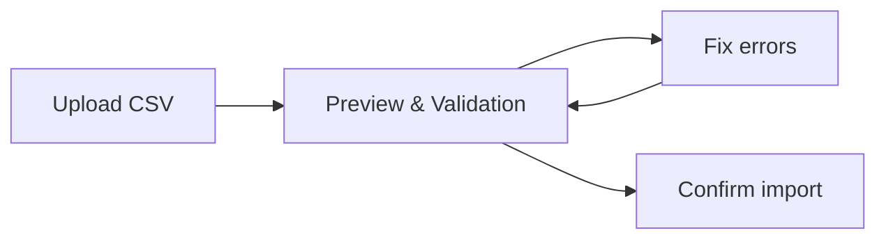

# Stammdaten verwalten

Kamerplanter speichert alle grundlegenden Pflanzendaten — Arten, Sorten und botanische Familien — als **Stammdaten**. Diese bilden die Basis für Pflanzdurchläufe, Nährstoffpläne, Phasensteuerung und Pflegeerinnerungen.

## Überblick

Stammdaten sind die zentrale Wissensgrundlage des Systems. Jede Pflanzenart wird mit bis zu 80+ strukturierten Feldern erfasst:

| Entität | Beschreibung | Beispiel |
|----------|-------------|---------|
| **Botanische Familie** | Pflanzenfamilie mit Fruchtfolge-Kategorie | Solanaceae (Nachtschattengewächse) |
| **Art (Species)** | Botanische Art mit Taxonomie, Klima, Licht, Vermehrung | *Solanum lycopersicum* (Tomate) |
| **Sorte (Cultivar)** | Zuchtform mit sortenspezifischen Eigenschaften | San Marzano, Cherry Roma |

Die Hierarchie ist: Familie → Art → Sorte. Jede Sorte gehört zu genau einer Art, jede Art zu genau einer Familie.

## Arten verwalten

### Art anlegen

1. Navigiere zu **Stammdaten** > **Arten**
2. Klicke auf **Neue Art**
3. Fülle mindestens die Pflichtfelder aus:
    - **Wissenschaftlicher Name** (z.B. *Solanum lycopersicum*)
    - **Umgangssprachliche Namen** (z.B. Tomate, Tomato)
    - **Familie** (z.B. Solanaceae)
    - **Gattung** (z.B. Solanum)

!!! tip "Erfahrungsstufen beeinflussen die Sichtbarkeit"
    Im **Einsteiger-Modus** werden nur die wichtigsten Felder angezeigt. Fortgeschrittene Felder wie Allelopathie-Score, Photoperiodismus oder Wurzeltyp erscheinen erst im **Fortgeschrittenen-** bzw. **Experten-Modus**. Du kannst jederzeit über den Toggle "Alle Felder anzeigen" auch im Einsteiger-Modus auf alle Felder zugreifen.

### Wichtige Art-Felder

Die Feldnamen in der Oberfläche sind deutsch beschriftet; in Klammern findest du den internen Feldnamen (Code-Name), z.B. für API-Zugriffe oder den CSV-Import.

| Feld | Beschreibung | Beispiel |
|------|-------------|---------|
| Lebenszyklus (`cycle_type`, Teil der Lebenszyklus-Konfiguration — siehe [Wachstumsphasen](growth-phases.md)) | Annual, Biennial oder Perennial | Annual |
| Wuchsform (`growth_habit`) | Kraut, Strauch, Baum, Kletterpflanze, ... | Kraut |
| Wurzeltyp (`root_type`) | Faserwurzel, Pfahlwurzel, Knollig, Zwiebel, Rhizom | Faserwurzel |
| Frostempfindlichkeit (`frost_sensitivity`) | Empfindlich, Moderat, Hardy, Sehr hardy | Sehr hardy |
| Nährstoffbedarf (`nutrient_demand_level`) | Starkzehrer, Mittelzehrer, Schwachzehrer, Stickstoffsammler | Starkzehrer |
| Photoperiodismus (`photoperiod_type`, Teil der Lebenszyklus-Konfiguration) | Kurztagspflanze, Langtagspflanze, Tagneutral | Tagneutral |
| Toxizität (`toxicity_severity`) | Giftigkeit für Katzen/Hunde (ASPCA-Daten, ASPCA = American Society for the Prevention of Cruelty to Animals) | Giftig für Katzen |
| **Vermehrungsarten** (`propagation_methods`) | Eine oder mehrere übliche Vermehrungsmethoden (Mehrfachauswahl) | Aussaat, Steckling |

!!! note "Nicht alle Felder stehen im Anlage-Dialog zur Verfügung"
    Der Dialog **Neue Art** deckt nur die in Schritt 3 genannten Pflichtfelder sowie Wuchsform und Wurzeltyp ab. Die übrigen Felder dieser Tabelle pflegst du anschließend auf der Detailseite der Art.

### Vermehrungsarten (propagation_methods)

Das Feld **Vermehrungsarten** ist eine Mehrfachauswahl und dokumentiert, wie eine Art üblicherweise vermehrt wird. Es wird im **Fortgeschrittenen-Modus** (REQ-021) angezeigt.

Die Angabe dient als Hinweis für Pflegeerinnerungen, die Vermehrungsplanung (REQ-017) und den KI-Wissensassistenten. Alle mitgelieferten Kulturpflanzen-Stammdaten sind bereits mit den üblichen Methoden befüllt.

| Wert | Bezeichnung | Beschreibung |
|------|------------|-------------|
| `seed` | Aussaat / Samen | Generative Vermehrung über Samen |
| `cutting` | Steckling | Bewurzelter Trieb von einer Mutterpflanze (Klon) |
| `division` | Teilung | Pflanze wird in mehrere Teile geteilt |
| `rhizome_division` | Rhizomteilung | Teilung unterirdischer Speichertriebe (z.B. Ingwer, Bambus) |
| `bulb` | Zwiebel | Vermehrung über Brutzwiebeln oder Tochterzwiebeln |
| `tuber` | Knolle | Vermehrung über Tochterknollen (z.B. Dahlie, Kartoffel) |
| `offset` | Kindel | Seitentriebe / Ableger (z.B. Aloe vera, Bromelia) |
| `grafting` | Veredelung | Edelreis auf Unterlage (z.B. Tomaten auf Tomatillo) |
| `layering` | Absenker | Trieb im Boden bewurzeln, dann abtrennen |
| `spore` | Sporen | Generative Vermehrung bei Farnen und Moosen |
| `runner` | Ausläufer | Kriechende Bodenläufer (z.B. Erdbeere, Pothos) |
| `leaf_cutting` | Blattsteckling | Blatt oder Blattsegment bewurzeln (z.B. Begonie, Sansevieria) |
| `self_seeding` | Selbstaussaat | Pflanze sät sich ohne Zutun selbst aus (z.B. Borretsch, Ringelblume) |

!!! tip "Mehrere Methoden möglich"
    Eine Art kann mehrere Vermehrungsarten gleichzeitig angegeben haben. Tomate zum Beispiel: `seed` (für den Anbau aus Samen) und `cutting` (für den Ganzjahresanbau im Gewächshaus über Stecklinge).

!!! note "Sichtbarkeit nach Erfahrungsstufe"
    Das Feld **Vermehrungsarten** erscheint ab der Erfahrungsstufe **Fortgeschrittener**. Im Einsteiger-Modus ist es ausgeblendet, kann aber über **Alle Felder anzeigen** eingeblendet werden.

!!! note "Vermehrungsart im Tab \"Aussaat & Ernte\" sichtbar"
    Auf der **Detailseite einer Art** (Stammdaten > Arten) gibt es den Tab **Aussaat & Ernte** (Aussaatübersicht). Dort werden die hinterlegten Vermehrungsarten als Chips angezeigt — `seed` (Aussaat) ist dabei grün hervorgehoben. Wenn eine Art **ausschließlich vegetativ** vermehrt wird (z.B. nur Steckling oder Teilung, kein `seed`-Eintrag), erscheint dort ein Hinweistext, dass für diese Art keine Aussaatzeiträume zu erwarten sind. **Fehlende Aussaatdaten sind in diesem Fall kein Datenfehler**, sondern korrekt — die Art wird eben nicht über Samen vermehrt.

### Beste Vermehrungszeit (propagation_months)

Das Feld **propagation_months** (Beste Vermehrungszeit) ergänzt die Vermehrungsarten um eine Zeitangabe: In welchen Monaten ist die vegetative Vermehrung — also Teilung, Stecklingsnahme, Abnahme von Kindeln oder Ausläufern — am erfolgversprechendsten?

Das Feld ist ebenfalls eine Mehrfachauswahl; gespeichert werden die Monatsnummern 1 (Januar) bis 12 (Dezember), dedupliziert und sortiert.

**Wo in der UI:** Im Tab **Aussaat & Ernte** der Artdetailseite an zwei Stellen:

1. **Vermehrungs-Card** — Die Karte hat einen Lese-/Bearbeiten-Umschalter (Stift-Icon oben rechts):
    - **Leseansicht:** "Beste Vermehrungszeit: März–April" (zusammengefasste Monatsanzeige)
    - **Bearbeitungsmodus:** 12 klickbare Monats-Chips — klicke die gewünschten Monate an, dann **Speichern**

2. **Monats-Zeitachse (Balkendiagramm)** — Die oberste Zeile der Zeitachse trägt den Titel **"Vermehrung"** und zeigt die hinterlegten Monate als farbigen Balken (Teal). Diese Zeile ist **nur zur Anzeige** — bearbeitet wird ausschliesslich über die Vermehrungs-Card (Stift-Icon). Ist kein Monat hinterlegt, bleibt die Zeile leer.

!!! example "Beispiel: Herbst-Anemone (*Anemone hupehensis*)"
    Die Herbst-Anemone bildet dichte Rhizomhorste und lässt sich am besten **im zeitigen Frühjahr teilen**, bevor der Neuaustrieb beginnt. Kamerplanter speichert das als `propagation_months: [3, 4]` — März und April. Das ergibt in der UI die Anzeige "Beste Vermehrungszeit: März–April".

!!! note "Abgrenzung zu Aussaatfeldern"
    Das Feld `propagation_months` bezieht sich **ausschließlich auf vegetative Vermehrung** (Teilung, Steckling, Kindel, Ausläufer, Ableger). Für Aussaatzeitpunkte (generative Vermehrung über Samen) bleiben die separaten Felder `direct_sow_months`, `indoor_start_months` und `transplant_months` zuständig. Beide Felder können gleichzeitig gepflegt sein, wenn eine Art sowohl aus Samen gezogen als auch vegetativ vermehrt werden kann.

!!! tip "Pflegeerinnerungen profitieren automatisch"
    Sobald `propagation_months` gepflegt ist, kann der KI-Wissensassistent (und zukünftig: Pflegeerinnerungen, REQ-017) konkrete Hinweise zum optimalen Vermehrungszeitpunkt ausgeben — ohne dass du dich selbst an den Kalender erinnern musst.

### Vermehrungshinweise (propagation_notes)

Das Feld **Vermehrungshinweise** ist ein fachlicher Freitext (max. 1000 Zeichen, Deutsch) und erklärt **wie** die Vermehrung der Art in der Praxis abläuft — welche Schritte besondere Sorgfalt erfordern, welche Fehler häufig passieren und was den Unterschied zwischen Erfolg und Misserfolg ausmacht.

Das Feld ergänzt die strukturierten Felder `propagation_methods` (Methoden) und `propagation_months` (optimaler Zeitpunkt) um das handwerkliche Detailwissen, das sich nicht in einer einfachen Auswahlliste abbilden lässt.

**Wo in der UI:** Im Tab **Aussaat & Ernte** der Artdetailseite, in der Karte **Vermehrung** — direkt unterhalb der Vermehrungsarten-Chips und der besten Vermehrungszeit. Den Bearbeitungsmodus öffnest du über das Stift-Icon oben rechts in der Karte:

- **Leseansicht:** Der Text erscheint als abgesetzter Hinweis-Block, deutlich vom restlichen Inhalt abgegrenzt. Wenn kein Text hinterlegt ist, bleibt der Bereich leer.
- **Bearbeitungsmodus:** Ein mehrzeiliges Textfeld mit Zeichenzähler (max. 1000 Zeichen). Der Text wird gemeinsam mit den übrigen Feldern der Sektion über den **Speichern**-Button gespeichert.

!!! tip "Wofür eignet sich das Feld?"
    Notiere hier konkrete Praxistipps: Substrattemperatur für die Bewurzelung, empfohlene Hormondosis, Lichtbedarf direkt nach der Bewurzelung, Akklimatisierungsschritte beim Wechsel von Vitro- auf Ex-Vitro-Bedingungen oder der häufigste Grund für scheiternde Stecklinge bei dieser Art. Allgemeine Hinweise, die für alle Arten gleichermaßen gelten, gehören dagegen nicht hier her.

!!! note "Sichtbarkeit nach Erfahrungsstufe"
    Das Feld **Vermehrungshinweise** erscheint ab der Erfahrungsstufe **Fortgeschrittener**. Im Einsteiger-Modus ist es ausgeblendet, kann aber über **Alle Felder anzeigen** eingeblendet werden.

Alle mitgelieferten Arten mit gepflegten Vermehrungsmethoden haben bereits einen fachlichen Hinweistext hinterlegt.

### Art bearbeiten

1. Klicke auf eine Art in der Liste
2. Auf der Detailseite kannst du alle Felder bearbeiten
3. Die Detailseite zeigt auch zugehörige Sorten, Wachstumsphasen und Nährstoffpläne

---

## Referenzbilder in der Artenansicht

Kamerplanter zeigt für jede Pflanzenart Referenzbilder an, die aus öffentlichen Bilddatenbanken (GBIF, Wikimedia Commons) automatisch beschafft wurden. Diese Bilder helfen dir, eine Art schnell wiederzuerkennen — auch dann, wenn du keinen botanischen Hintergrund hast.

### Wo erscheinen Referenzbilder?

**In der Artenliste (Übersicht):** Pro Art erscheint ein kleines Thumbnail in der linken Spalte. Ist für eine Art noch kein Referenzbild verfügbar, siehst du dort ein dezentes Pflanzen-Icon als Platzhalter — das ist kein Fehler, sondern bedeutet schlicht, dass der Referenzbild-Beschaffungslauf für diese Art noch kein geeignetes lizenzfreies Bild gefunden hat.

**Auf der Artdetailseite (Tab „Übersicht"):** Im oberen Bereich erscheint ein großes Hero-Bild. Darunter befindet sich die **Referenzbild-Galerie** mit allen verfügbaren Bildern der Art, sortiert nach Bildorgan (Blatt, Blüte, Frucht, Gesamt).

!!! note "Bilder erscheinen erst nach dem Beschaffungslauf"
    Direkt nach der Installation zeigt die Galerie den Hinweis **„Noch keine Referenzbilder verfügbar"**. Dieser verschwindet, sobald ein Administrator den Referenzbild-Beschaffungslauf ausgeführt hat. Mehr dazu im Abschnitt [Referenzbilder beschaffen](#referenzbilder-beschaffen) weiter unten.

### Bildquellen und Lizenzen

Die Bilder stammen ausschließlich aus Quellen mit lizenzsauberen, öffentlich nutzbaren Fotografien:

| Quelle | Lizenz | Hinweis |
|--------|--------|---------|
| GBIF (Global Biodiversity Information Facility) | CC0 / CC-BY | Größter Backbone für Artfotos |
| Wikimedia Commons | CC0 / Public Domain | Kuratierte, typische Artbilder |

!!! warning "Urhebernennung bei CC-BY-Bildern (rechtlich erforderlich)"
    Bilder unter der Lizenz **CC-BY** erfordern eine sichtbare Urhebernennung. Kamerplanter zeigt diese direkt unter dem jeweiligen Bild in der Galerie an, zum Beispiel:

    > © Jane Doe, via GBIF/iNaturalist · [CC BY 4.0](https://creativecommons.org/licenses/by/4.0/)

    Diese Angabe wird automatisch aus den gespeicherten Metadaten generiert. Du musst nichts manuell eintragen.

    CC0-Bilder (gemeinfrei) tragen keine Urhebernennung, weil der Urheber alle Rechte freigegeben hat.

### Referenzbilder beschaffen

Referenzbilder werden **nicht automatisch** beim Anlegen einer Art geladen. Sie entstehen durch einen einmaligen Beschaffungslauf, den ein Administrator auslöst. Für den laufenden Betrieb ist dieser Lauf nur einmalig nötig — er kann bei Bedarf (z.B. nach dem Import neuer Arten) wiederholt werden.

!!! tip "Für Administratoren"
    Der Beschaffungslauf läuft als Hintergrundprozess (Celery-Task) und kann mehrere Stunden dauern. Während er läuft, tauchen die Bilder Art für Art in der UI auf. Mehr zur technischen Ausführung: [Bilderkennung in Betrieb nehmen](../deployment/inference-service.md#schritt-2-referenz-index-befullen).

**Welche Arten bekommen Bilder?** Der Beschaffungslauf durchsucht für alle angelegten Arten die Bilddatenbanken. Arten, für die keine CC0/CC-BY-Bilder gefunden werden (seltene oder exotische Pflanzen), erhalten keinen Eintrag — das ist transparentes Systemverhalten, kein Datenfehler.

### Zusammenhang mit der Pflanzen-Bilderkennung

Dieselben Referenzbilder, die in der Artenansicht erscheinen, bilden auch die Grundlage für die **Pflanzen-Bilderkennung** (REQ-029-A). Das DINOv2-Erkennungssystem vergleicht ein aufgenommenes Foto mit den gespeicherten Referenz-Embeddings, um die wahrscheinlichste Art zu bestimmen.

Mehr dazu: [Pflanzen-Bilderkennung verwenden](plant-identification.md)

## Sorten verwalten

Sorten (Cultivars) sind Zuchtformen innerhalb einer Art. Sie erben die Grundeigenschaften der Art und ergänzen sortenspezifische Daten.

### Sorte anlegen

1. Navigiere zur **Detailseite einer Art**
2. Im Abschnitt **Sorten** klicke auf **Neue Sorte**
3. Fülle die Felder aus:
    - **Name** (z.B. San Marzano)
    - **Züchter** (optional)
    - **Merkmale** (z.B. krankheitsresistent, ertragreich, kompakt)

## Botanische Familien

Familien gruppieren verwandte Arten und sind die Basis für die Fruchtfolge-Planung. Kamerplanter wird mit den gängigsten Familien vorinstalliert (Solanaceae, Brassicaceae, Fabaceae, Cucurbitaceae, ...).

### Familie anlegen

1. Navigiere zu **Stammdaten** > **Botanische Familien**
2. Klicke auf **Neue Familie**
3. Gib den Namen und optional die Fruchtfolge-Kategorie an

Die eigentliche Fruchtfolge-Planung (empfohlene Nachfolgerfamilien, Wartezeiten, automatische Prüfung beim Anlegen einer Pflanze) verwaltest du separat unter **Stammdaten → Fruchtfolge** — siehe [Mischkultur & Fruchtfolge](../guides/companion-planting.md#fruchtfolge).

---

## Aktivitäten (Tätigkeiten) verwalten

Neben den botanischen Stammdaten pflegt Kamerplanter auch **Aktivitäten** (Tätigkeiten) als eigene Stammdaten — wiederverwendbare Vorlagen für Pflegemaßnahmen wie Entspitzen, Ausgeizen, Umtopfen oder Ernte-Vorbereitung. Sie bilden die Grundlage für den [Aktivitätsplan-Tab eines Pflanzdurchlaufs](planting-runs.md#aktivitätsplan-tab) und für [Workflow-Vorlagen](tasks.md).

### Wo du sie findest

Navigiere zu **Stammdaten → Tätigkeiten**. System-Tätigkeiten (bereits mitgeliefert) lassen sich bearbeiten, aber nicht löschen.

### Tätigkeit anlegen

Klicke auf **Tätigkeit anlegen** und fülle die Abschnitte aus:

| Abschnitt | Felder |
|-----------|--------|
| Bezeichnung | Name und Beschreibung jeweils auf Deutsch und Englisch |
| Klassifizierung | Kategorie (z.B. Training/HST [High-Stress-Training], Training/LST [Low-Stress-Training], Schnitt, Ausgeizen, Umtopfen, Ernte-Vorbereitung, Vermehrung, Allgemein), Schwierigkeitsgrad, Stresslevel, Erholungstage |
| Ausführung | Geschätzte Dauer, benötigtes Werkzeug, ob eine Foto-Dokumentation verlangt wird |
| Geltungsbereich | **Kompatible Arten** — leer gelassen gilt die Tätigkeit für **alle Arten** ("Allgemeingültig"); trägst du Arten ein, gilt sie nur für diese ("Artspezifisch") |
| Phasenbeschränkungen | **Verbotene Phasen** (z.B. Blüte, Keimung) und eingeschränkte Sub-Phasen, in denen die Tätigkeit nur mit Vorsicht ausgeführt werden sollte |
| Tags & Sortierung | Freitext-Tags sowie die Reihenfolge in Listen |

!!! tip "Artspezifisch statt allgemeingültig"
    Nutze **Kompatible Arten**, um z.B. eine Cannabis-spezifische Trainingsmaßnahme (High-Stress-Training) nicht versehentlich für Tomaten oder Zimmerpflanzen vorzuschlagen.

<!-- Quelle: src/frontend/src/pages/stammdaten/ActivityCreateDialog.tsx, src/frontend/src/i18n/locales/de/translation.json (pages.activities) -->

---

## Stammdaten per KI aufbereiten

!!! tip "Für Fortgeschrittene"
    Das manuelle Zusammentragen aller Pflanzendaten ist zeitaufwendig. Für Entwickler und fortgeschrittene Nutzer bietet Kamerplanter eine **KI-gestützte Pipeline** (Claude Code Agents), die neue Pflanzen automatisch aufbereitet und qualitätssichert. Für den täglichen Gebrauch im Garten ist diese Funktion nicht erforderlich — die mitgelieferten Stammdaten und der CSV-Import reichen für die meisten Anwendungsfälle aus. Mehr dazu: [Pflanzendaten per KI aufbereiten](../guides/ai-plant-data-pipeline.md).

---

## Stammdaten per CSV importieren

Für die Erstbefüllung oder Batch-Aktualisierungen können Stammdaten per CSV-Datei importiert werden. Der Import folgt einem sicheren **Zwei-Phasen-Prozess**:

<!-- diagram-source: user-described — two-phase CSV master-data import flow with a validation-and-fix loop before confirmation -->

```mermaid
flowchart LR
    A["Upload CSV"] --> B["Preview & Validation"]
    B --> C["Fix errors"]
    C --> B
    B --> D["Confirm import"]
```

### Unterstützte Entitäten

| Entität | Identifikation | Anwendungsfall |
|----------|---------------|----------------|
| Species | `scientific_name` | Erstbefüllung botanischer Arten |
| Cultivar | `name` + `parent_species` | Sortenkatalogeinführ |
| BotanicalFamily | `name` | Pflanzenfamilien |
| NutrientPlan | `name` + `source_chart` | Hersteller-Feeding-Charts |

### Import durchführen

1. Navigiere zu **Stammdaten** > **Import**
2. Wähle die **Entität** (Art, Sorte, Familie oder Nährstoffplan)
3. Lade deine **CSV-Datei** hoch — Encoding und Trennzeichen werden automatisch erkannt
4. Prüfe die **Vorschau**: Jede Zeile wird einzeln validiert, Fehler werden pro Feld angezeigt
5. Wähle die **Duplikatstrategie** (Überspringen, Aktualisieren oder Abbrechen)
6. Klicke auf **Import bestätigen**

!!! tip "CSV-Vorlagen herunterladen"
    Unter **Import** > **Vorlagen** stehen CSV-Templates für jede Entität bereit. Diese enthalten alle unterstützten Spalten mit Beispielwerten.

!!! tip "KI-generierte CSV-Daten nutzen"
    Die [KI-Pipeline](../guides/ai-plant-data-pipeline.md) liefert im Abschnitt 8 jedes Pflanzendokuments fertige CSV-Zeilen, die sich direkt importieren lassen.

---

## Voraussetzungen

- Kamerplanter-Instanz gestartet und zugänglich
- Für den CSV-Import: CSV-Datei im UTF-8-Format

## Siehe auch

- [Pflanzendaten per KI aufbereiten](../guides/ai-plant-data-pipeline.md) — Ausführliche Anleitung zur KI-Pipeline
- [Pflanzen-Bilderkennung verwenden](plant-identification.md) — Art per Foto identifizieren
- [Bilderkennung in Betrieb nehmen](../deployment/inference-service.md) — Referenzbild-Beschaffungslauf starten (für Administratoren)
- [Wachstumsphasen](growth-phases.md) — Phasensteuerung pro Art
- [Pflanzdurchläufe](planting-runs.md) — Pflanzen von der Aussaat bis zur Ernte begleiten, Aktivitätsplan anwenden
- [Mischkultur & Fruchtfolge](../guides/companion-planting.md) — Kompatibilitäts- und Fruchtfolge-Stammdaten
- [Aufgabenplanung](tasks.md) — Workflow-Vorlagen auf Basis von Aktivitäten
- [Dünge-Logik](fertilization.md) — Nährstoffpläne und Feeding-Charts
- [Vermehrungsmanagement](propagation.md) — Abstammungsgraph, Stecklinge, Veredelung
