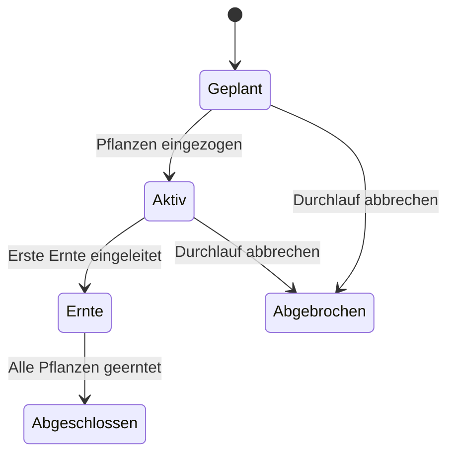

# Pflanzdurchläufe

Ein Pflanzdurchlauf (Planting Run) gruppiert zusammengehörige Pflanzen für ein gemeinsames Lifecycle-Tracking. Statt 20 Tomaten einzeln zu verwalten, legen Sie einen Durchlauf an — und können dann Phasenübergänge, Gießereignisse und Ernte-Batches auf die ganze Gruppe anwenden.

---

## Voraussetzungen

- Mindestens eine Site mit einer Location
- Stammdaten: Pflanzenart (Spezies) muss angelegt sein
- Optional: Nährstoffplan für die Gruppe

---

## Was ist ein Pflanzdurchlauf?

Ein Pflanzdurchlauf ist ein leichtgewichtiger Gruppencontainer. Er selbst hat keinen eigenen Lebenszyklus — er gruppiert nur Pflanzen. Jede Pflanze im Durchlauf behält ihre volle Eigenständigkeit:

- Einzelne Pflanzen können individuell bearbeitet werden
- Eine Pflanze kann jederzeit aus dem Durchlauf herausgelöst werden
- Phasen-Übergänge können für alle Pflanzen gleichzeitig oder für einzelne separat ausgelöst werden

**Drei Typen von Pflanzdurchläufen:**

| Typ | Beschreibung | Beispiel |
|-----|-------------|---------|
| **Monokultur** | Alle Pflanzen sind eine Art und eine Sorte | 20 Tomaten "San Marzano" |
| **Klon** | Stecklinge einer Mutterpflanze | 10 Cannabis-Klone von Mutter "WW-01" |
| **Mischkultur** | Mehrere Arten in einer Gruppe | Tomaten + Basilikum + Tagetes |

---

## Einen neuen Pflanzdurchlauf anlegen

### Schritt 1: Zu Durchläufen navigieren

Klicken Sie in der Navigation auf **Durchläufe**. Die Übersicht zeigt alle aktiven und vergangenen Pflanzdurchläufe.

### Schritt 2: Neuen Durchlauf erstellen

Klicken Sie auf **Neuer Durchlauf**. Ein Dialog öffnet sich.

### Schritt 3: Grunddaten eingeben

| Feld | Beschreibung | Beispiel |
|------|-------------|---------|
| Name | Eindeutiger Name für den Durchlauf | "Tomaten Hochbeet A 2026" |
| Typ | Monokultur, Klon oder Mischkultur | Monokultur |
| Site | Welche Anlage? | "Mein Garten" |
| Standort (Location) | Konkreter Bereich | "Hochbeet A" |
| Geplanter Start | Wann soll gepflanzt werden? | 15.04.2026 |
| Notizen | Besondere Ziele oder Beobachtungen | "Versuch ohne Folienabdeckung" |

### Schritt 4: Pflanzen zum Durchlauf hinzufügen

Klicken Sie auf **Eintrag hinzufügen**:

1. Wählen Sie **Pflanzenart** (Spezies) aus den Stammdaten.
2. Wählen Sie optional eine **Sorte** (Cultivar).
3. Geben Sie die **Anzahl** der Pflanzen ein.
4. Wählen Sie die **Rolle** (Primärpflanze, Begleitpflanze, Fangpflanze).
5. Wählen Sie das **Substrat**.

Bei Mischkultur-Durchläufen können Sie mehrere Einträge mit unterschiedlichen Arten hinzufügen.

!!! example "Beispiel: Mischkultur-Beet"
    - Tomaten "Roma", 8 Stück, Rolle: Primärpflanze
    - Basilikum "Genovese", 12 Stück, Rolle: Begleitpflanze
    - Tagetes, 6 Stück, Rolle: Fangpflanze

### Schritt 5: Pflanzen erstellen lassen

Klicken Sie auf **Pflanzen erstellen**. Kamerplanter legt automatisch alle Einzelpflanzen mit fortlaufenden IDs an (z.B. HOCHBEETA_TOM_01 bis HOCHBEETA_TOM_08).

---

## Status eines Pflanzdurchlaufs

Ein Pflanzdurchlauf durchläuft folgende Zustände:

| Status | Beschreibung |
|--------|-------------|
| **Geplant** | Angelegt, noch nicht gestartet |
| **Aktiv** | Pflanzen eingezogen, Wachstum läuft |
| **Ernte** | Erste Ernte wurde durchgeführt, weitere folgen |
| **Abgeschlossen** | Alle Pflanzen geerntet oder entfernt |
| **Abgebrochen** | Durchlauf wurde vorzeitig beendet |

---

## Batch-Operationen

Die Stärke von Pflanzdurchläufen liegt in den Batch-Operationen — Aktionen, die Sie auf alle Pflanzen gleichzeitig anwenden.

### Batch-Phasenübergang

Alle Pflanzen eines Durchlaufs gleichzeitig in die nächste Phase überführen:

1. Öffnen Sie den Pflanzdurchlauf.
2. Klicken Sie auf **Batch-Phasenwechsel**.
3. Wählen Sie die Zielphase (z.B. "Vegetativ" → "Blüte").
4. Überprüfen Sie die Liste der berechtigten Pflanzen (Pflanzen, die bereits in einer späteren Phase sind, werden ausgeschlossen).
5. Bestätigen Sie.

### Gießen bestätigen (Batch)

Nach dem Gießen dokumentieren Sie das Ereignis für alle Pflanzen gleichzeitig:

1. Klicken Sie auf **Gießen bestätigen**.
2. Das System schlägt die Menge und EC aus dem zugewiesenen Nährstoffplan vor.
3. Passen Sie die Werte an, falls Sie anders gemischt haben.
4. Bestätigen — für alle Pflanzen wird ein Gießereignis erfasst.

### Batch-Ernte erstellen

Eine Ernte für alle Pflanzen des Durchlaufs gleichzeitig dokumentieren:

1. Klicken Sie auf **Ernte-Batch erstellen**.
2. Das System prüft alle Karenzzeiten.
3. Tragen Sie Frischmasse und Qualitätsbewertung ein.
4. Bestätigen — ein Ernte-Batch wird mit allen Pflanzen des Durchlaufs verknüpft.

### Alle Pflanzen entfernen

Am Ende des Zyklus alle Pflanzen auf einmal als entfernt markieren:

1. Klicken Sie auf **Alle Pflanzen entfernen**.
2. Bestätigen Sie. Der Durchlauf wechselt auf Status "Abgeschlossen".

---

## Nährstoffplan zuweisen

Einem Pflanzdurchlauf können Sie einen Nährstoffplan zuweisen. Das vereinfacht die Gießplanung erheblich:

1. Öffnen Sie den Durchlauf.
2. Klicken Sie auf **Nährstoffplan zuweisen**.
3. Wählen Sie einen Plan aus der Liste.

Der Plan bestimmt, welche Dünger in welcher Phase in welcher Dosierung verwendet werden. Beim Gießen schlägt Kamerplanter automatisch die phasengerechten Dosierungen vor.

---

## Einzelne Pflanzen aus dem Durchlauf lösen

Wenn eine Pflanze einen anderen Verlauf nehmen soll als die Gruppe (z.B. eine Pflanze zeigt Mangelerscheinungen und braucht individuelle Behandlung):

1. Öffnen Sie die Pflanze in der Durchlauf-Liste.
2. Klicken Sie auf **Aus Durchlauf lösen**.
3. Die Pflanze bleibt aktiv, ist aber jetzt unabhängig.

Das Entfernen einer Pflanze aus dem Durchlauf löscht die Pflanze nicht.

---

## Sukzessions-Aussaat (gestaffelte Durchläufe)

Für kontinuierliche Ernte (z.B. alle 3 Wochen frischer Salat) unterstützt Kamerplanter gestaffelte Pflanzdurchläufe:

1. Erstellen Sie den ersten Durchlauf wie gewohnt.
2. Klicken Sie auf **Folgepflanzung anlegen**.
3. Wählen Sie das Intervall (z.B. 21 Tage nach dem ersten Durchlauf).
4. Kamerplanter kopiert die Durchlauf-Konfiguration und versetzt das Startdatum entsprechend.

---

## Häufige Fragen

??? question "Muss ich zwingend Pflanzdurchläufe nutzen?"
    Nein. Sie können Pflanzen auch einzeln anlegen und verwalten. Pflanzdurchläufe sind besonders nützlich, wenn Sie mehrere Pflanzen derselben Art gleichzeitig anbauen und gemeinsam verwalten möchten.

??? question "Kann eine Pflanze in mehreren Durchläufen sein?"
    Nein. Eine Pflanze kann zu maximal einem Pflanzdurchlauf gehören. Wenn Sie eine Pflanze einem anderen Durchlauf zuordnen möchten, müssen Sie sie zuerst aus dem aktuellen Durchlauf lösen.

??? question "Was passiert mit den Pflanzen, wenn ich einen Durchlauf abbreche?"
    Die Pflanzen bleiben im System erhalten und werden als "aktiv" markiert. Sie sind dann nur nicht mehr dem Durchlauf zugeordnet. Sie können sie anschließend einzeln weiterführen oder manuell entfernen.

??? question "Kann ich nachträglich Pflanzen zu einem laufenden Durchlauf hinzufügen?"
    Ja, solange der Durchlauf nicht abgeschlossen ist. Öffnen Sie den Durchlauf und klicken Sie auf **Pflanzen hinzufügen**.

---

## Siehe auch

- [Stammdaten: Pflanzenarten](plant-management.md)
- [Wachstumsphasen](growth-phases.md)
- [Ernte](harvest.md)
- [Dünge-Logik](fertilization.md)
