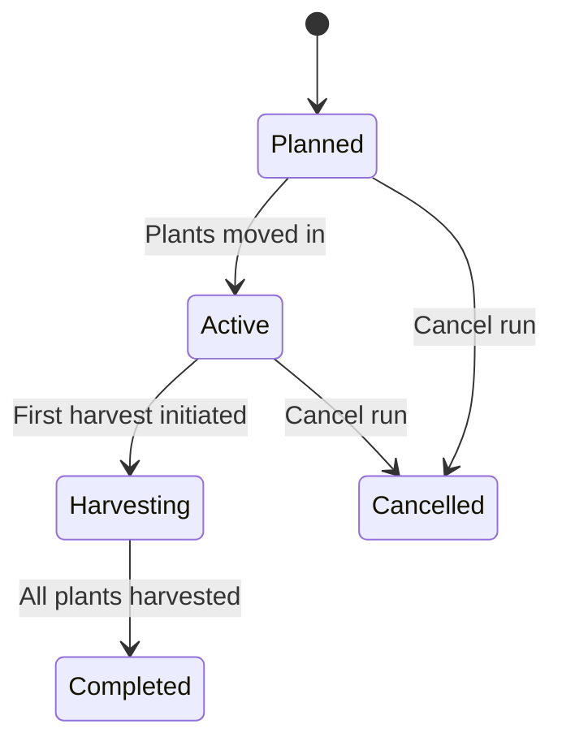

# Pflanzdurchläufe

Ein Pflanzdurchlauf (Planting Run) gruppiert zusammengehörige Pflanzen für ein gemeinsames Lifecycle-Tracking. Statt 20 Tomaten einzeln zu verwalten, legst du einen Durchlauf an — und kannst dann Phasenübergänge und Gießereignisse auf die ganze Gruppe anwenden.

---

## Voraussetzungen

- Mindestens eine Site mit einer Location
- Stammdaten: Pflanzenart (Spezies) muss angelegt sein
- Optional: Nährstoffplan für die Gruppe

---

## Was ist ein Pflanzdurchlauf? {#was-ist-ein-pflanzdurchlauf}

Ein Pflanzdurchlauf ist ein leichtgewichtiger Gruppencontainer. Er selbst hat keinen eigenen Lebenszyklus — er gruppiert nur Pflanzen. Jede Pflanze im Durchlauf behält ihre volle Eigenständigkeit:

- Einzelne Pflanzen können individuell bearbeitet werden (z.B. Notizen)
- Eine Pflanze kann jederzeit aus dem Durchlauf herausgelöst werden
- Solange eine Pflanze zum Durchlauf gehört, wird ihr Phasenwechsel nur **gemeinsam mit der ganzen Gruppe** ausgelöst (Batch-Phasenübergang) — ein Wechsel nur für diese eine Pflanze ist gesperrt, bis sie aus dem Durchlauf gelöst wurde

**Zwei Typen von Pflanzdurchläufen:**

| Typ | Beschreibung | Beispiel |
|-----|-------------|---------|
| **Monokultur** | Alle Pflanzen sind eine Art und eine Sorte | 20 Tomaten "San Marzano" |
| **Klon** | Stecklinge einer Mutterpflanze | 10 Cannabis-Klone von Mutter "WW-01" |

!!! note "Mischkultur wird nicht als eigener Durchlauf-Typ abgebildet"
    Ein Pflanzdurchlauf kennt keinen eigenen Mischkultur-Typ und keine Rollen (Primär-/Begleit-/Fangpflanze). Technisch kannst du einem Durchlauf über mehrere Einträge zwar auch unterschiedliche Arten zuordnen (z.B. für eng verzahnte Kulturen am selben Standort) — beim Batch-Phasenübergang berücksichtigt Kamerplanter dann aber nur die häufigste ("dominante") Phase und überführt lediglich die dazu passenden Pflanzen. Für echte Mischkultur-Beete (z.B. Tomaten + Basilikum + Tagetes) ist deshalb das empfohlene Muster: **mehrere separate Durchläufe je Art am selben Standort**, kombiniert mit der Kompatibilitätsprüfung auf Stammdaten-/Standortebene. Details dazu im Guide [Mischkultur & Fruchtfolge](../guides/companion-planting.md).

---

## Einen neuen Pflanzdurchlauf anlegen

### Schritt 1: Zu Durchläufen navigieren

Klicke in der Navigation im Bereich **Durchläufe** auf **Pflanzdurchläufe**. Die Übersicht zeigt alle aktiven und vergangenen Pflanzdurchläufe.

### Schritt 2: Neuen Durchlauf erstellen

Klicke auf **Durchlauf erstellen**. Ein Dialog öffnet sich.

### Schritt 3: Grunddaten eingeben

| Feld | Beschreibung | Beispiel |
|------|-------------|---------|
| Name | Eindeutiger Name für den Durchlauf | "Tomaten Hochbeet A 2026" |
| Geplanter Start | Wann soll gepflanzt werden? | 15.04.2026 |
| Typ (ab Fortgeschritten) | Monokultur oder Klon | Monokultur |
| Standort (ab Fortgeschritten) | Welche Site/Anlage? | "Mein Garten" |
| Bereich (ab Fortgeschritten) | Konkreter Standort-Bereich (Location) | "Hochbeet A" |
| Notizen (ab Fortgeschritten) | Besondere Ziele oder Beobachtungen | "Versuch ohne Folienabdeckung" |
| Substratcharge (Experte) | Schlüssel der zugeordneten Substratcharge (siehe [Standorte & Substrate](locations-substrates.md#substratchargen-wiederverwendung-zuweisung)) | "ERDE-2026-03" |
| Quellpflanze (Experte, nur bei Typ „Klon") | Schlüssel der Mutterpflanze, von der die Klone stammen | — |

!!! note "Erfahrungsstufen"
    Wie in vielen Formularen blendet Kamerplanter Felder je nach deiner Erfahrungsstufe ein oder aus. Über **Alle Felder anzeigen** siehst du auch als Einsteiger alle Felder auf einmal.

### Schritt 4: Pflanzen-Einträge festlegen — neu anlegen oder bestehende aufnehmen

Für einen neuen Durchlauf hast du zwei Möglichkeiten: neue Pflanzen-Einträge anlegen (Standard) oder bereits bestehende, eigenständige Pflanzen in den Durchlauf aufnehmen. Beides schließt sich gegenseitig aus und wird über den Schalter **Bestehende Pflanzen aufnehmen** umgeschaltet.

#### Neue Pflanzen-Einträge anlegen

Klicke auf **Eintrag hinzufügen** und fülle pro Eintrag aus:

| Feld | Beschreibung |
|------|-------------|
| Pflanzenart (Spezies) | Aus den Stammdaten, Pflicht |
| Sorte (Cultivar) | Optional, abhängig von der gewählten Art |
| Menge | Wie viele Pflanzen dieser Art/Sorte im Durchlauf entstehen sollen |
| ID-Prefix | 2–5 Großbuchstaben, aus denen die Pflanzen-ID gebildet wird (z.B. "TOM" für Tomate). Kamerplanter schlägt das Präfix automatisch aus der Gattung bzw. dem Sortennamen vor — du kannst es überschreiben |

Du kannst mehrere Einträge hinzufügen, wenn ein Durchlauf verschiedene Sorten derselben Art oder — bei entsprechender Planung — mehrere Arten in einem Schritt anlegen soll (siehe Hinweis zur Mischkultur oben).

!!! info "Für technische Nutzer"
    Das Datenmodell kennt pro Eintrag zusätzlich einen Reihenabstand in cm (`spacing_cm`) und eine Notiz. Beide werden in der Detailtabelle des Durchlaufs angezeigt, sobald sie gesetzt sind — die Erstellungsmaske bietet dafür aber noch keine Eingabefelder. Diese Einstellung ist derzeit nur über die API verfügbar.

#### Bestehende Pflanzen aufnehmen

Aktiviere den Schalter **Bestehende Pflanzen aufnehmen**, um statt neuer Einträge bereits vorhandene, noch keinem Durchlauf zugeordnete Pflanzen in den neuen Durchlauf zu übernehmen:

1. Aktiviere den Schalter. Die Eingabefelder für neue Einträge verschwinden, stattdessen erscheint eine durchsuchbare Liste aller eigenständigen Pflanzen.
2. Suche nach ID, Namen oder aktueller Phase und wähle die gewünschten Pflanzen aus (oder nutze **Alle auswählen**).
3. Beim Speichern werden die ausgewählten Pflanzen dem neu erstellten Durchlauf zugeordnet, ohne dass neue Pflanzen-Datensätze entstehen. Der Durchlauf wechselt dabei direkt in den Status "Aktiv".

Das ist nützlich, wenn du zunächst einzelne Pflanzen angelegt hast und sie im Nachhinein zu einer Gruppe zusammenfassen möchtest.

!!! tip "Pflanzen auch nachträglich aufnehmen"
    Die Aufnahme ist nicht auf den Anlage-Zeitpunkt beschränkt: Solange ein Durchlauf im Status "Geplant" oder "Aktiv" ist, kannst du auf seiner Detailseite jederzeit oben auf **Pflanzen aufnehmen** klicken, um weitere bestehende Pflanzen (derselben Art wie die bisherigen Einträge) zu übernehmen.

### Schritt 5: Durchlauf speichern

Klicke auf **Erstellen**.

- **Neuanlage-Modus:** Der Durchlauf wird mit den eingegebenen Einträgen im Status **"Geplant"** angelegt. Die einzelnen Pflanzen-Datensätze existieren noch nicht — dafür ist ein separater Schritt nötig (siehe unten).
- **Aufnahme-Modus:** Die ausgewählten Bestandspflanzen werden sofort übernommen, der Durchlauf ist danach bereits **"Aktiv"**.

### Schritt 6: Pflanzen aus den Einträgen erstellen (nur Neuanlage-Modus)

Solange ein Durchlauf im Status "Geplant" ist und Einträge (keine Aufnahme) verwendet wurden, existieren noch keine Einzelpflanzen. Um sie zu erzeugen:

1. Öffne den Durchlauf.
2. Klicke oben auf **Pflanzen erstellen**.
3. Bestätige die Anzahl der zu erstellenden Pflanzen im Dialog.
4. Kamerplanter legt automatisch alle Einzelpflanzen mit fortlaufenden IDs im Format `BEREICH-SCHLÜSSEL_PRÄFIX_LAUFNUMMER` an (z.B. `hochbeet-a_TOM_01` bis `hochbeet-a_TOM_08`, wobei `hochbeet-a` der interne Schlüssel des gewählten Bereichs ist) und setzt den Durchlauf auf Status **"Aktiv"**.

<!-- Quelle: src/frontend/src/pages/durchlaeufe/PlantingRunCreateDialog.tsx, PlantingRunDetailPage.tsx, src/backend/app/domain/engines/planting_run_engine.py -->

---

## Die Tabs der Durchlauf-Detailseite

Die Detailseite eines Durchlaufs gliedert sich in fünf Tabs:

| Tab | Inhalt |
|-----|-------|
| Details | Übersicht mit Einträgen, zugewiesenem Nährstoffplan, Dosierungsvorschau und Standort-/Tank-Informationen |
| Pflanzen | Liste aller Pflanzen des Durchlaufs inkl. Abtrennen-Aktion |
| Phasen | Phasen-Zeitachse je Art, Ist-Termine, nach Phase gruppierte Pflanzenliste |
| Düngung & Bewässerung | Zugewiesener Nährstoffplan, Gießkalender, Dosierungsrechner |
| Aktivitätsplan | Vorgeschlagene bzw. zugewiesene Pflegeaktivitäten je Phase |

Die folgenden Abschnitte gehen auf die wichtigsten Aktionen in diesen Tabs ein.

---

## Status eines Pflanzdurchlaufs

Ein Pflanzdurchlauf durchläuft folgende Zustände:

<!-- diagram-source: user-described — planting run status lifecycle from planned through harvesting to completed or cancelled -->

```mermaid
stateDiagram-v2
    [*] --> Planned
    Planned --> Active : Plants moved in
    Active --> Harvesting : First harvest initiated
    Harvesting --> Completed : All plants harvested
    Active --> Cancelled : Cancel run
    Planned --> Cancelled : Cancel run
```

| Status | Beschreibung |
|--------|-------------|
| **Geplant** | Angelegt, Einträge vorhanden, Pflanzen-Datensätze aber noch nicht erstellt |
| **Aktiv** | Pflanzen erstellt bzw. aufgenommen, Wachstum läuft |
| **Ernte** | Für Erntedurchläufe vorgesehener Zwischenstatus |
| **Abgeschlossen** | Durchlauf beendet, alle Pflanzen entfernt |
| **Abgebrochen** | Durchlauf wurde vorzeitig beendet |

!!! note "Teilweise verfügbar: Status „Ernte""
    Der Status „Ernte" ist im Datenmodell vorgesehen (u.a. als Zwischenschritt zwischen „Aktiv" und „Abgeschlossen"), wird aber aktuell durch keine Aktion in der Oberfläche automatisch gesetzt — auch nicht beim Anlegen einer Erntecharge zu einer Pflanze des Durchlaufs. Durchläufe wechseln derzeit direkt von „Aktiv" zu „Abgeschlossen"/„Abgebrochen" (siehe [Durchlauf beenden](#durchlauf-beenden)).

---

## Phasenverlauf im Tab „Phasen"

Im Tab **Phasen** zeigt Kamerplanter für jede im Durchlauf vertretene Art eine visuelle Phasen-Zeitachse sowie eine Tabelle mit dem tatsächlichen Verlauf:

| Spalte | Beschreibung |
|--------|-------------|
| Phase | Name der Phase mit Status-Chip (Abgeschlossen / Aktuell / Geplant) |
| Tatsächlicher Start / Tatsächliches Ende | Erfasste Ist-Daten; bei geplanten Phasen ein geschätzter ("voraussichtlicher") Termin |
| Dauer (Tage) | Ist-Dauer bei abgeschlossenen Phasen, bisherige Laufzeit bei der aktuellen Phase, typische Dauer bei geplanten Phasen |

Über das Stift-Symbol lässt sich das tatsächliche Start- oder Enddatum einer abgeschlossenen oder laufenden Phase nachträglich korrigieren — etwa wenn ein Wechsel erst im Nachhinein im System nachgetragen wird. Diese Korrektur gilt für **alle Pflanzen des Durchlaufs gemeinsam**; eine Korrektur nur für einzelne Pflanzen ist hier nicht vorgesehen.

Darunter listet Kamerplanter alle Pflanzen, gruppiert nach ihrer aktuellen Phase, mit direktem Link zur jeweiligen Einzelpflanzen-Seite.

<!-- Quelle: src/frontend/src/pages/durchlaeufe/RunPhaseEditor.tsx -->

---

## Batch-Operationen

Die Stärke von Pflanzdurchläufen liegt in den Batch-Operationen — Aktionen, die du auf alle Pflanzen gleichzeitig anwenden kannst.

### Batch-Phasenübergang

Alle geeigneten Pflanzen eines Durchlaufs gleichzeitig in die nächste Phase überführen:

1. Öffne den Pflanzdurchlauf (Status "Aktiv" oder "Ernte").
2. Klicke auf **Phasenwechsel**.
3. Kamerplanter ermittelt die aktuell häufigste ("dominante") Phase unter den noch aktiven Pflanzen und schlägt dir die Phasen vor, die in der Phasenfolge danach folgen.
4. Wähle die Zielphase aus (z.B. "Vegetativ" → "Blüte").
5. Enthält der Durchlauf mehrere Arten (mehrere Einträge mit unterschiedlicher Art), weist dich Kamerplanter darauf hin, dass nur kompatible Pflanzen überführt werden.
6. Bestätige — Kamerplanter meldet, wie viele Pflanzen überführt, übersprungen (z.B. bereits in einer späteren Phase) oder fehlgeschlagen sind.

!!! note "Individueller Phasenwechsel im Durchlauf gesperrt"
    Solange eine Pflanze zu einem Durchlauf gehört, ist ein Phasenwechsel nur für die ganze Gruppe möglich — ein direkter Wechsel an der Einzelpflanze wird mit dem Konflikt `phase.run_owned` abgelehnt. Details dazu und wie du eine Pflanze bei Bedarf herauslöst, findest du unter [Wachstumsphasen: Warum sich einzelne Pflanzen im Durchlauf nicht separat wechseln lassen](growth-phases.md#warum-sich-einzelne-pflanzen-im-durchlauf-nicht-separat-wechseln-lassen).

### Gießen bestätigen (Batch)

Sobald ein Nährstoffplan zugewiesen ist, zeigt der Tab **Düngung & Bewässerung** einen Kalender mit den fälligen Gieß-/Düngeterminen. Für einen fälligen Termin hast du zwei Möglichkeiten:

- **Schnell bestätigen** — übernimmt die vom System vorgeschlagene Menge/EC direkt, ohne weitere Eingabe.
- **Gießen bestätigen** — öffnet einen Dialog, in dem du gemessene Menge, EC und pH manuell einträgst, falls du anders gemischt hast.

In beiden Fällen wird für den Durchlauf ein Fütterungsereignis erfasst.

### Durchlauf beenden

Am Ende eines Zyklus (oder wenn du ihn vorzeitig abbrechen willst) beendest du den gesamten Durchlauf in einem Schritt:

1. Klicke auf **Durchlauf beenden** (sichtbar, solange der Durchlauf aktiv ist oder sich im Status "Ernte" befindet).
2. Wähle den Endstatus: **Abgebrochen** oder **Abgeschlossen**.
3. Bestätige — alle noch aktiven Pflanzen des Durchlaufs werden als entfernt markiert, der Durchlauf wechselt in den gewählten Endstatus.

Das Beenden des Durchlaufs löscht die Pflanzen nicht aus dem System — sie bleiben abrufbar, gelten aber nicht mehr als aktiv.

### Ernte

Für die Ernte gibt es aktuell **keine** Aktion, die auf einen Schlag alle Pflanzen eines Durchlaufs erfasst — eine „Ernte-Batch"-Funktion auf Durchlauf-Ebene existiert nicht. Jede Ernte wird einzeln pro Pflanze über die Seite **Erntechargen** (Menü **Ernte**) dokumentiert: Dort wählst du die zu erntende Pflanze aus und trägst Frischmasse, Erntetyp und Qualität ein. Details dazu im Guide [Ernte](harvest.md).

<!-- Quelle: src/backend/app/domain/models/harvest.py (HarvestBatch.plant_key — kein run_key) -->

---

## Aktivitätsplan (Tab) {#aktivitätsplan-tab}

Im Tab **Aktivitätsplan** verwaltest du wiederkehrende Pflegetätigkeiten (z.B. Entspitzen, Ausgeizen, Umtopfen) für den Durchlauf:

- **Noch kein Plan zugewiesen:** Klicke auf **Plan generieren**, um aus den art-spezifischen Wachstumsphasen einen Vorschlag zu erzeugen. Kamerplanter gruppiert die vorgeschlagenen Aktivitäten nach Phase und zeigt zu jeder Aktivität Tag-Offset, Kategorie, Stressbelastung, Schwierigkeitsgrad, benötigte Werkzeuge und eine Begründung.
- Passe den Vorschlag an: Aktivitäten einzeln über den Schalter aktivieren/deaktivieren, den Tag-Offset ändern oder eine Aktivität ganz entfernen.
- Kamerplanter markiert Aktivitäten, deren Stressbelastung die Stresstoleranz der jeweiligen Phase übersteigt.
- Klicke auf **Auf Durchlauf anwenden**, um aus dem Plan konkrete Aufgaben für den Durchlauf zu erzeugen.
- **Plan bereits zugewiesen:** Der Tab zeigt stattdessen eine nach Phase gruppierte Liste der zugewiesenen Aufgaben mit Fortschritt (erledigt/gesamt).

!!! note "Verknüpfung mit Workflow-Vorlagen"
    Ein generierter und angewendeter Aktivitätsplan lässt sich als wiederverwendbare Workflow-Vorlage speichern und später auf andere Pflanzen derselben Art anwenden. Details dazu im Guide [Aufgabenplanung](tasks.md).

<!-- Quelle: src/frontend/src/pages/durchlaeufe/ActivityPlanTab.tsx -->

---

## Nährstoffplan zuweisen

Einem Pflanzdurchlauf kannst du einen Nährstoffplan zuweisen. Das vereinfacht die Gießplanung erheblich:

1. Öffne den Durchlauf und wechsle in den Tab **Düngung & Bewässerung**.
2. Klicke auf **Nährstoffplan zuweisen**.
3. Wähle einen Plan aus der Liste.

Der Plan bestimmt, welche Dünger in welcher Phase in welcher Dosierung verwendet werden. Beim Gießen schlägt Kamerplanter automatisch die phasengerechten Dosierungen vor.

---

## Einzelne Pflanzen aus dem Durchlauf lösen

Wenn eine Pflanze einen anderen Verlauf nehmen soll als die Gruppe (z.B. eine Pflanze zeigt Mangelerscheinungen und braucht individuelle Behandlung):

1. Wechsle in den Tab **Pflanzen**.
2. Klicke in der Zeile der betreffenden Pflanze auf **Abtrennen** (nur verfügbar, solange der Durchlauf aktiv ist).
3. Die Pflanze bleibt aktiv, ist aber jetzt unabhängig — ihre Phase lässt sich danach wieder individuell wechseln.

Das Entfernen einer Pflanze aus dem Durchlauf löscht die Pflanze nicht.

---

## Pflanzentagebuch (aktuell nur über die API) {#pflanzentagebuch}

!!! info "Für technische Nutzer"
    Kamerplanter kann bereits Tagebucheinträge zu einzelnen Pflanzen eines Durchlaufs speichern und abrufen — dafür gibt es aber noch keine Oberfläche im Frontend. Diese Funktion ist derzeit nur über die technische API verfügbar.

<!-- Endpunkt: /api/v1/t/{tenant}/planting-runs/{durchlauf}/plants/{pflanze}/diary -->

Jeder Eintrag hat einen Typ (Beobachtung, Problem, Meilenstein, Messung, Foto oder Notiz), einen optionalen Titel, einen Text (bis 5000 Zeichen), optionale Fotoverweise, Tags und freie Messwerte. Über einen zweiten technischen API-Endpunkt lassen sich die Tagebucheinträge aller Pflanzen eines Durchlaufs gesammelt abrufen.

<!-- Quelle: src/backend/app/domain/models/plant_diary_entry.py, src/backend/app/api/v1/planting_runs/tenant_router.py -->

---

## Häufige Fragen

??? question "Muss ich zwingend Pflanzdurchläufe nutzen?"
    Nein. Du kannst Pflanzen auch einzeln anlegen und verwalten. Pflanzdurchläufe sind besonders nützlich, wenn du mehrere Pflanzen derselben Art gleichzeitig anbaust und gemeinsam verwalten möchtest.

??? question "Kann eine Pflanze in mehreren Durchläufen sein?"
    Nein. Eine Pflanze kann zu maximal einem Pflanzdurchlauf gehören. Wenn du eine Pflanze einem anderen Durchlauf zuordnen möchtest, musst du sie zuerst aus dem aktuellen Durchlauf lösen.

??? question "Was passiert mit den Pflanzen, wenn ich einen Durchlauf beende?"
    Die Pflanzen bleiben im System erhalten, werden aber als entfernt markiert und sind dann nicht mehr dem Durchlauf zugeordnet. Du kannst sie anschließend weiterhin einsehen.

??? question "Kann ich nachträglich Pflanzen zu einem laufenden Durchlauf hinzufügen?"
    Ja, solange der Durchlauf nicht abgeschlossen ist. Öffne den Durchlauf und klicke auf **Pflanzen aufnehmen**, um bestehende, noch nicht zugeordnete Pflanzen der passenden Art zu übernehmen. Neue Einträge lassen sich nach dem Anlegen des Durchlaufs aktuell nicht mehr über die Oberfläche hinzufügen.

---

## Siehe auch

- [Stammdaten: Pflanzenarten](plant-management.md)
- [Wachstumsphasen](growth-phases.md)
- [Standorte & Substrate](locations-substrates.md)
- [Mischkultur & Fruchtfolge](../guides/companion-planting.md)
- [Aufgabenplanung](tasks.md)
- [Ernte](harvest.md)
- [Dünge-Logik](fertilization.md)
