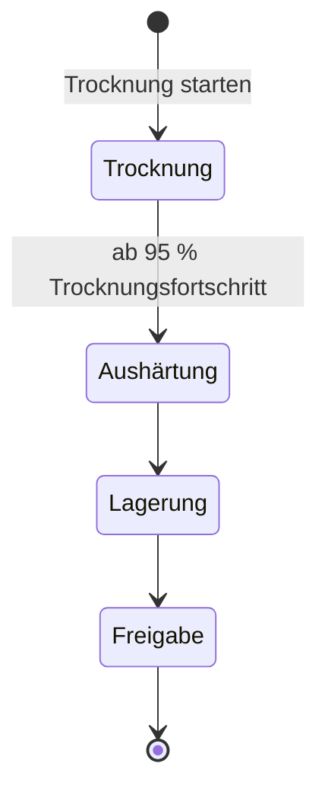

# Nacherntebehandlung

Die Nacherntebehandlung begleitet eine Erntecharge durch die Stufen **Trocknung**, **Aushärtung (Curing)** und **Lagerung** bis zur **Freigabe**. Du verfolgst den Trocknungsfortschritt gewichtsbasiert, bekommst konkrete Handlungsempfehlungen und siehst automatische Schimmel-Warnungen, sobald eine Charge zu feucht wird.

---

## Voraussetzungen

- Mindestens eine [Erntecharge](harvest.md), aus der du eine Nachernte-Charge startest.
- Zum Starten der Trocknung, Erfassen von Fortschritt und Wechseln der Stufe benötigst du die Rolle **Gärtner** oder **Admin** in deinem Mandanten (siehe [Mandanten & Gärten: Rollen und Berechtigungen](tenants.md#rollen-und-berechtigungen)). Als **Betrachter** kannst du Chargen ansehen, aber nicht bearbeiten.

---

## Der Lebenszyklus einer Nachernte-Charge

Eine Nachernte-Charge durchläuft vier Stufen — immer vorwärts, ohne Sprünge oder Rückschritte:

| Stufe | Was passiert |
|-------|-------------|
| Trocknung | Die Charge trocknet, bis die Zielfeuchte erreicht ist. Du erfasst das Gewicht regelmäßig, um den Fortschritt zu verfolgen. |
| Aushärtung (Curing) | In luftdichten Behältern reift die Charge nach: Restfeuchte verteilt sich gleichmäßig, Aroma und Wirkstoffe entwickeln sich weiter. Behälter anfangs täglich kurz öffnen (**Burping**). |
| Lagerung | Die Charge ist eingelagert. Beobachte die Lagerbedingungen und reagiere zeitnah auf Schimmel-Warnungen. |
| Freigabe | Die Nacherntebehandlung ist abgeschlossen — die Charge ist freigegeben. |

**Aushärtung (Curing)** bezeichnet die Nachreifung des bereits getrockneten Ernteguts in einem luftdicht verschlossenen Behälter (z. B. einem Einmachglas). Dabei gleicht sich die Restfeuchte zwischen Stängel und Blüte aus, Chlorophyll baut weiter ab und Aroma sowie Wirkstoffe entwickeln sich weiter — ein Vorgang, der typischerweise mehrere Wochen dauert.

Ein Stufenwechsel lässt sich **nicht rückgängig machen** und **keine Stufe überspringen**: Von der Trocknung geht es ausschließlich zur Aushärtung, von dort ausschließlich zur Lagerung, und von dort ausschließlich zur Freigabe.

!!! danger "Trocknung → Aushärtung: nur ab 95 % Fortschritt"
    Den Wechsel von Trocknung zu Aushärtung blockiert Kamerplanter, solange der Trocknungsfortschritt unter 95 % liegt. Erfasse weitere Gewichtsmessungen, bis die Charge bereit ist.

<!-- Quelle: src/backend/app/domain/engines/post_harvest_stage_engine.py, src/backend/app/domain/services/post_harvest_service.py -->

---

## Trocknung starten

### Schritt 1: Charge übernehmen

1. Öffne **Nacherntebehandlung** in der Navigation unter **Ernte** (`/ernte/nachernte`).
2. Klicke auf **Trocknung starten**.
3. Wähle die **Erntecharge**, die du trocknen möchtest.

### Schritt 2: Angaben zur Trocknung machen

| Feld | Beschreibung |
|------|-------------|
| Erntecharge | Die zu trocknende Erntecharge |
| Produktart | Grobe Einordnung — Blüte, Kraut, Wurzel/Knolle, Frucht oder Pilz |
| Trocknungsmethode | **Hängetrocknung** (am schonendsten), **Gittertrocknung**, **Dörrgerät** (am schnellsten) oder **Lufttrocknung** |
| Startgewicht (g) | Optional. Ohne Angabe übernimmt Kamerplanter automatisch das Nassgewicht der Erntecharge. |
| Ziel-Restfeuchte (%) | Übliches Ziel: rund 10 % Restfeuchte (Bereich 5–15 %) |
| Notizen | Freitext |

Nach dem Speichern erscheint die Charge in der Übersicht in der Stufe **Trocknung**.

---

## Trocknungsfortschritt verfolgen

Öffne die Charge in der Liste, um ihre Detailansicht zu öffnen. Solange sich die Charge in der Stufe **Trocknung** befindet, kannst du dort das **aktuelle Gewicht erfassen**: Trage das Gewicht ein und klicke auf **Erfassen**. Kamerplanter berechnet daraus automatisch:

- den **Trocknungsfortschritt** (0–100 %, als Fortschrittsbalken)
- eine **Handlungsempfehlung** für den nächsten Schritt
- die **geschätzten Resttage** bis zur vollständigen Trocknung

Der Fortschritt ergibt sich aus dem Gewichtsverlust im Verhältnis zur gewählten Ziel-Restfeuchte. Die geschätzten Resttage richten sich zusätzlich nach der gewählten Trocknungsmethode.

### Handlungsempfehlungen

| Fortschritt | Empfehlung |
|-------------|-----------|
| Unter 40 % | Für ausreichende Luftzirkulation sorgen |
| 40 % bis unter 70 % | Temperatur und Luftfeuchtigkeit im Blick behalten |
| 70 % bis unter 95 % | Knacktest durchführen: Ein Stängel sollte brechen, nicht sich biegen |
| Ab 95 % | Bereit für die Aushärtung (Curing) |
| Gewichtsverlust über 85 % (unabhängig vom Fortschritt) | Zu stark getrocknet — zügig mit der Aushärtung beginnen |

!!! warning "Übertrocknet"
    Verliert die Charge mehr als 85 % ihres Ausgangsgewichts, zeigt Kamerplanter statt der üblichen Empfehlung eine Warnung „Zu stark getrocknet". Beginne in diesem Fall zügig mit der Aushärtung, um weiteren Aroma- und Wirkstoffverlust zu vermeiden.

Der **Knacktest** ist eine einfache manuelle Prüfung ohne Messgerät: Biege einen dünnen Stängel — bricht er sauber ab, ist die Charge meist trocken genug; biegt er sich nur, ist noch Restfeuchte vorhanden.

<!-- Quelle: src/backend/app/domain/calculators/drying_calculator.py -->

---

## Wasseraktivität (a_w)

Die **Wasseraktivität** (kurz **a_w**, Skala 0–1) gibt an, wie viel Wasser in der Charge für Mikroorganismen wie Schimmelpilze tatsächlich verfügbar ist — anders als der reine Feuchtigkeitsgehalt in Prozent. Ab einem a_w-Wert über 0,65 steigt das Schimmelrisiko deutlich, selbst wenn sich die Charge bereits trocken anfühlt. Für die Lagerung gilt ein Bereich von rund 0,55–0,65 als sicher.

!!! info "Wasseraktivität nur über API"
    Die Trocknungsfortschritts-Erfassung in der Oberfläche nimmt aktuell nur das **Gewicht** entgegen. Wasseraktivität, CO₂-Konzentration und Knacktest-Ergebnis lassen sich zusätzlich über die API mitschicken (z. B. von einem angeschlossenen Messgerät) und werden dann in der Detailansicht angezeigt, sobald sie vorliegen — ein Eingabefeld dafür gibt es in der Oberfläche noch nicht.

---

## Schimmel-Warnungen

Kamerplanter löst automatisch eine Schimmel-Warnung aus, wenn eine erfasste Umgebungsmessung auf Schimmelrisiko hindeutet — vorrangig anhand der Wasseraktivität, ersatzweise anhand der relativen Luftfeuchte. Eine offene Warnung erscheint als Banner oben in der Chargen-Detailansicht, in zwei Stufen:

| Schweregrad | Bedeutung | Was tun |
|-------------|----------|---------|
| **Warnung** | Erhöhtes Risiko (a_w über 0,60 bzw. relative Luftfeuchte über 62 %) | Beobachte die Charge engmaschig, sorge für ausreichend Luftzirkulation und senke nach Möglichkeit die Luftfeuchtigkeit am Lagerort. |
| **Kritisch** | Hohes Risiko (a_w über 0,65 bzw. relative Luftfeuchte über 65 %) | Prüfe die Charge umgehend auf sichtbaren Schimmel, erhöhe die Luftzirkulation und senke die Luftfeuchtigkeit. Entferne befallene Bereiche und entsorge sie gegebenenfalls. |

!!! danger "Sichtbarer Schimmel"
    Eine Software-Warnung ersetzt keine visuelle Kontrolle. Schimmel (z. B. Botrytis, Grauschimmel) erscheint als grauer oder weißer Flaum und riecht muffig. Entferne befallenes Material bei Verdacht sofort und getrennt von der übrigen Charge — im Zweifel lieber zu früh als zu spät.

!!! info "Umgebungsmessungen nur über API"
    Schimmel-Warnungen werden aus strukturierten Umgebungsmessungen (Temperatur, relative Luftfeuchte, Wasseraktivität, CO₂, visueller und geruchlicher Zustand) berechnet. Diese Messungen lassen sich aktuell nur über die API erfassen — es gibt noch kein Formular dafür in der Oberfläche. Bereits ausgelöste Warnungen erscheinen aber unabhängig davon in der Detailansicht.

<!-- Quelle: src/backend/app/domain/calculators/drying_calculator.py (assess_mold_risk), src/backend/app/domain/services/post_harvest_service.py (record_observation) -->

---

## Stufe wechseln

In der Chargen-Detailansicht zeigt Kamerplanter unten eine Schaltfläche **Weiter zu: <nächste Stufe>**, sobald die Charge nicht bereits in der letzten Stufe (**Freigabe**) ist. Ein Klick überführt die Charge sofort in die nächste Stufe — es gibt keinen Bestätigungsdialog, aber auch keinen Weg zurück.

Solange die Charge sich in der Stufe **Trocknung** befindet und der Trocknungsfortschritt noch unter 95 % liegt, ist die Schaltfläche deaktiviert; ein Hinweis erklärt, dass zunächst weitere Gewichtsmessungen nötig sind.

---

## Für technische Nutzer / Self-Hoster

Eine Charge lässt sich aktuell nicht über die Oberfläche löschen. Über die API steht dafür ein Lösch-Endpunkt bereit, der ausschließlich Mitgliedern mit der Rolle **Administrator** zur Verfügung steht — Details siehe [API-Referenz: Nacherntebehandlung](../reference/api-reference.md#nacherntebehandlung-post-harvest).

---

## Häufige Fragen

??? question "Kann ich eine Charge löschen, wenn ich sie versehentlich angelegt habe?"
    Über die Oberfläche nicht — dafür gibt es aktuell keine Schaltfläche. Ein Administrator deines Mandanten kann die Charge über die API löschen.

??? question "Warum sehe ich keinen Wert bei Wasseraktivität, obwohl ich schon mehrfach Gewicht erfasst habe?"
    Die Oberfläche erfasst beim Wiegen nur das Gewicht. Die Wasseraktivität erscheint erst, wenn sie zusätzlich über die API übermittelt wurde, z. B. von einem angeschlossenen Messgerät.

??? question "Was passiert, wenn ich versuche, eine Stufe zu überspringen oder zurückzuwechseln?"
    Das ist nicht möglich. Kamerplanter erlaubt ausschließlich den nächsten Schritt in der festen Reihenfolge Trocknung → Aushärtung → Lagerung → Freigabe.

??? question "Ich habe eine Schimmel-Warnung erhalten, aber sehe nichts Auffälliges — was jetzt?"
    Prüfe die Charge trotzdem sorgfältig, idealerweise mit einer Lupe und am Geruch — beginnender Schimmel ist mit bloßem Auge nicht immer sofort erkennbar. Senke vorsorglich die Luftfeuchtigkeit am Lagerort und sorge für mehr Luftzirkulation, auch wenn (noch) nichts sichtbar ist.

---

## Siehe auch

- [Ernte](harvest.md)
- [Nachernte: Trocknung, Curing & Lagerung — fachlicher Guide](../guides/post-harvest.md)
- [Sensorik](sensors.md)
- [Mandanten & Gärten](tenants.md)
