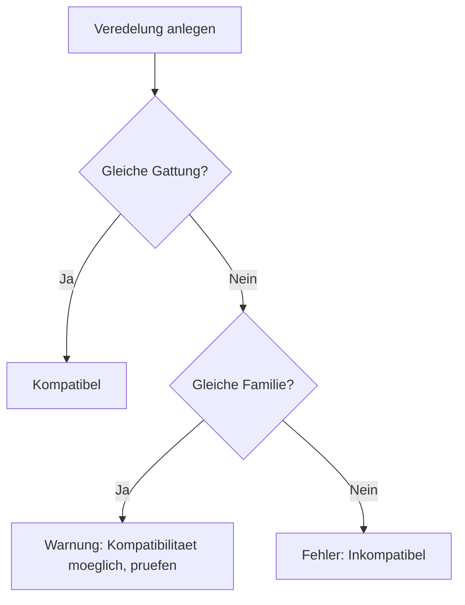
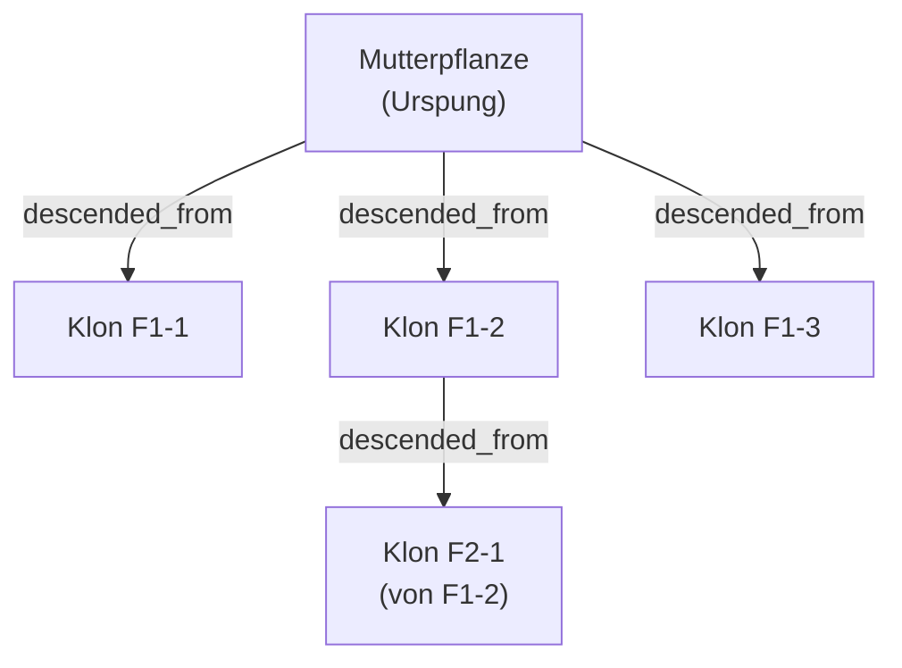

# Vermehrungsmanagement

Kamerplanter dokumentiert die genetische Abstammung deiner Pflanzen lueckenlos: Welche Mutterpflanze lieferte den Steckling? Welche zwei Elternpflanzen wurden gekreuzt? Ueber welche Unterlage wurde eine Sorte veredelt? Der **Abstammungsgraph** macht diese Beziehungen sichtbar und prueft automatisch Veredelungskompatibilitaet.

---

## Voraussetzungen

- Mindestens eine Pflanzinstanz (Mutterpflanze) ist angelegt
- Die Art und Sorte sind in den Stammdaten erfasst

---

## Vermehrungsmethoden im Ueberblick

| Methode | Beschreibung | Genetische Beziehung |
|---------|-------------|---------------------|
| **Steckling (Klon)** | Bewurzelter Trieb der Mutterpflanze | Genetisch identisch |
| **Samen-Kreuzung** | Samen aus kontrollierter Bestaeubung | 50% Genetik je Elternteil |
| **Veredelung** | Edelreis auf Unterlage aufgebracht | Edelreis bleibt genetisch unveraendert |
| **Teilung** | Pflanze in mehrere Teile geteilt | Genetisch identisch (wie Klon) |

---

## Stecklinge (Klone) nehmen

Stecklinge sind die haeufigste Vermehrungsmethode bei Zimmerpflanzen und im Growzelt. Das System verfolgt jede Klongeneration.

### Neuen Steckling anlegen

1. Navigiere zu **Pflanzen** > Mutterpflanze
2. Klicke auf **Vermehren** > **Steckling nehmen**
3. Fuelle das Formular aus:

    | Feld | Beschreibung | Beispiel |
    |------|-------------|---------|
    | **Anzahl Stecklinge** | Wie viele Stecklinge werden genommen | 4 |
    | **Datum** | Datum der Entnahme | 2026-03-28 |
    | **Standort** | Wo werden die Stecklinge bewurzelt | Anzuchtzelt |
    | **Substrat** | Bewurzelungssubstrat | Steinwolle-Plugs |
    | **Notizen** | Methode, Hormonpulver, etc. | Auxin-Pulver, 45°-Schnitt |

4. Klicke auf **Stecklinge anlegen**

Das System erstellt automatisch neue Pflanzinstanzen mit dem `descended_from`-Edge zur Mutterpflanze.

!!! tip "Klon-Generationen tracken"
    Wenn ein Steckling selbst wieder als Mutterpflanze genutzt wird, entsteht eine Klon-Kette: Mutter → F1-Klon → F2-Klon. Diese Kette ist in der Abstammungsansicht als Graph sichtbar.

### Bewurzelungsstatus verfolgen

1. Navigiere zu **Pflanzen** > gewuenschter Steckling
2. Tab **Wachstumsphasen** zeigt die aktuelle Phase (Keimung/Vermehrung)
3. Wenn die Wurzeln sichtbar sind: Phasenwechsel zu **Saemling** ausfuehren

---

## Samen-Kreuzungen dokumentieren

Fuer kontrollierte Bestaeubungen — z.B. zur Zucht neuer Sorten:

### Kreuzung anlegen

1. Navigiere zu **Stammdaten** > **Sorten** > **Neue Sorte**
2. Unter dem Abschnitt **Genetische Herkunft**:
    - **Mutterpflanze** (Samenpflanze) auswaehlen
    - **Vaterpflanze** (Pollenpflanze) auswaehlen
    - **Kreuzungsdatum** eintragen
3. Speichern

Das System legt `descended_from`-Edges zu beiden Elternpflanzen an und markiert die neue Sorte als F1-Hybride.

!!! example "Beispiel: Tomatenzuechtung"
    Du kreuzst "San Marzano" (Mutter) mit "Sungold" (Vater). Das System erstellt eine neue Sorte "San Marzano × Sungold (F1)" mit beiden Abstammungs-Kanten im Graph.

---

## Veredelung

Veredelung wird eingesetzt, um eine wertvolle Sorte (Edelreis) auf eine robuste Unterlage aufzubringen.

### Veredelung anlegen

1. Navigiere zu **Pflanzen** > Edelreis-Pflanze > **Vermehren** > **Veredelung**
2. Waehle die **Unterlage** (muss kompatibel sein)
3. Dokumentiere Methode (Kopulation, Okulation, etc.) und Datum

### Kompatibilitaetspruefung

Das System prueft automatisch die Gattungs- und Familienkompatibilitaet:

!!! warning "Kompatibilitaetsregeln"
    Kompatibilitaet wird auf Gattungs- und Familienebene geprueft. Tomaten auf Kartoffel-Unterlage (beide Solanum) sind kompatibel. Tomate auf Apfel-Unterlage (Solanaceae / Rosaceae) sind inkompatibel.

---

## Pflanzenteilung

Fuer Stauden, Zwiebelgewaechse und buschige Zimmerpflanzen:

1. Navigiere zu **Pflanzen** > gewuenschte Pflanze > **Vermehren** > **Teilen**
2. Lege fest, in wie viele Teile geteilt wird
3. Das System erstellt neue Pflanzinstanzen mit `descended_from`-Edge

---

## Der Abstammungsgraph

Die Abstammungsansicht zeigt alle Eltern-, Geschwister- und Nachkommenpflanzen in einer interaktiven Grafik.

### Graph oeffnen

1. Navigiere zu **Pflanzen** > gewuenschte Pflanze
2. Klicke auf den Tab **Abstammung**

Im Graph sind sichtbar:
- **Mutterpflanze** (Quelle des Stecklings)
- **Geschwister-Klone** (andere Stecklinge derselben Mutter)
- **Nachkommen** (Stecklinge dieses Klons)
- **Kreuzungspartner** bei Samen-Kreuzungen
- **Unterlage** bei Veredelungen

!!! tip "Klon-Linien im Growzelt"
    Im professionellen Anbau ist die Klon-Linie entscheidend: Ein Klon von Generation F3 kann schwaechere Eigenschaften zeigen als F1. Der Graph macht solche Linien transparent.

---

## Haeufige Fragen

??? question "Ich habe einen Steckling genommen, aber vergessen das in der App einzutragen — kann ich das nachtraeglich anlegen?"
    Ja. Du kannst beim Anlegen einer neuen Pflanzinstanz immer eine Mutterpflanze und ein historisches Entnahmedatum eintragen. Der Abstammungsgraph wird dann korrekt aufgebaut.

??? question "Kann eine Pflanze mehrere Mutterpflanzen haben?"
    Bei Samen-Kreuzungen ja — eine Pflanze hat genau zwei Elternpflanzen (Mutter + Vater). Bei Stecklingen und Teilungen hat sie genau eine. Veredelungen haben Edelreis + Unterlage, wobei die Genetik vom Edelreis stammt.

??? question "Wie erkenne ich, ob eine Sorte aus einem Steckling oder aus Samen stammt?"
    Im Profil der Pflanzinstanz unter dem Tab **Abstammung** siehst du die Vermehrungsmethode des `descended_from`-Edges (Steckling, Samen, Veredelung, Teilung).

??? question "Die Kompatibilitaetspruefung schlaegt fehl, obwohl ich weiss, dass es funktioniert."
    Das System prueft nach botanischer Familie/Gattung. Du kannst die Pruefung uebersteuern und manuell einen Kompatibilitaets-Vermerk hinzufuegen. Trage die beobachtete Kompatibilitaet als Notiz in die Pflanzinstanz ein.

---

## Siehe auch

- [Pflanzdurchlaeufe](planting-runs.md)
- [Stammdaten verwalten](plant-management.md)
- [Wachstumsphasen](growth-phases.md)
