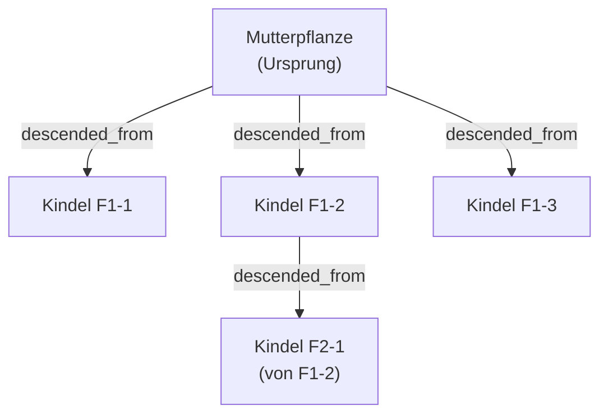
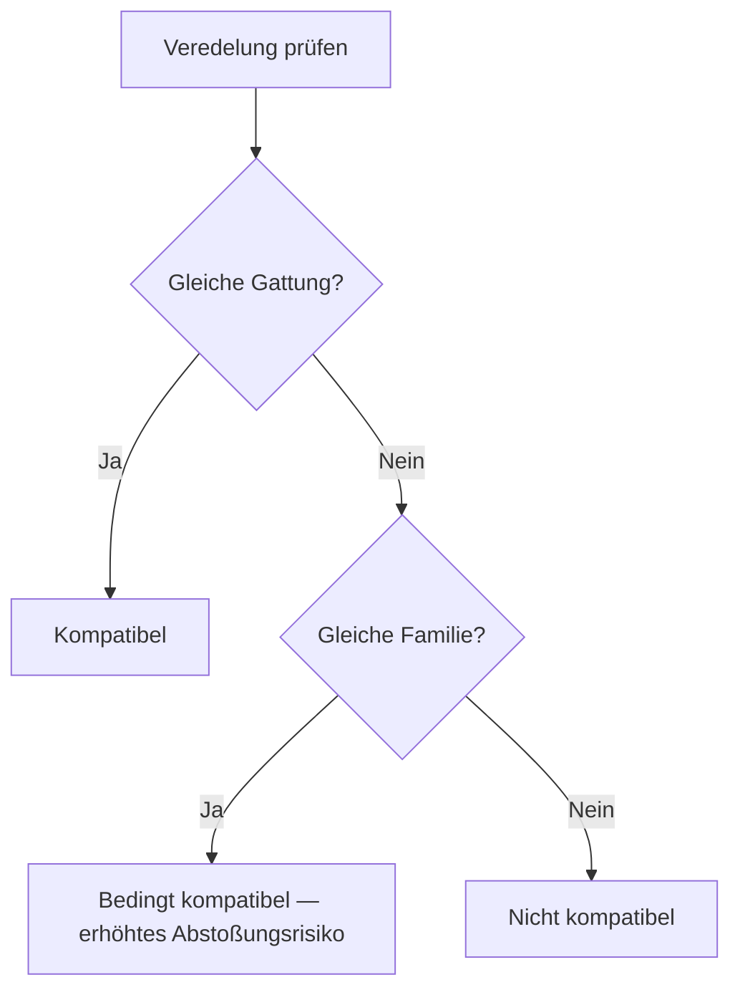

# Vermehrungsmanagement

Kamerplanter hilft dir, jede Vermehrungsaktion nachvollziehbar zu dokumentieren — vom einzelnen Steckling bis zur Veredelung — und macht sichtbar, welche Pflanze von welcher Mutterpflanze abstammt. Zusätzlich prüft das System automatisch, ob sich zwei Pflanzen taxonomisch für eine Veredelung eignen.

---

## Voraussetzungen

- Mindestens eine Pflanzeninstanz ist angelegt
- Die Pflanzenart ist in den Stammdaten erfasst
- Rolle „Gärtner" oder höher, um Vermehrungsereignisse anzulegen — zum Ansehen genügt die Rolle „Betrachter"

---

## Was ist Vermehrung? {#was-ist-vermehrung}

Vermehrung (Propagation) bezeichnet alle Methoden, mit denen du aus einer bestehenden Pflanze neue Pflanzen gewinnst — vom Steckling über die Aussaat bis zur Veredelung. Kamerplanter unterscheidet dabei acht Methoden:

| Methode | Beschreibung | Genetische Beziehung zur Ursprungspflanze |
|---------|-------------|------|
| **Aussaat** (seed) | Aus Samen gezogen | Neue genetische Kombination bei Kreuzungen, sonst sortenrein |
| **Steckling** (cutting) | Bewurzelter Trieb-, Blatt- oder Wurzelstückling der Mutterpflanze | Genetisch identisch (Klon) |
| **Klon** (clone) | Sammelbegriff für vegetative Vermehrung, u.a. die automatische Kindel-Fortführung (siehe unten) | Genetisch identisch |
| **Veredelung** (graft) | Ein Edelreis (Trieb einer Sorte) wird auf eine Unterlage (Wurzelsystem einer anderen Pflanze) aufgesetzt | Das Edelreis bleibt genetisch unverändert, die Unterlage liefert nur das Wurzelsystem |
| **Teilung** (division) | Pflanze bzw. Wurzelballen wird in mehrere eigenständige Teile getrennt | Genetisch identisch |
| **Absenker** (layering) | Ein Trieb wird, noch an der Mutterpflanze hängend, zum Bewurzeln gebracht und erst danach abgetrennt | Genetisch identisch |
| **Kindel** (offset) | Natürlicher Ableger, der sich von selbst von der Mutterpflanze löst | Genetisch identisch |
| **Sonstiges** (other) | Alle übrigen Vermehrungsarten, z.B. Gewebekultur | Abhängig von der Methode |

!!! note "Unterschied zu den „Vermehrungsarten" im Arten-Steckbrief"
    Im **Arten-Steckbrief** (Stammdaten > Arten) gibt es zusätzlich das Feld **Vermehrungsarten** (`propagation_methods`) — es dokumentiert, welche Methoden für eine Art *generell üblich* sind (z.B. Tomate: Aussaat + Steckling), unabhängig von einem konkreten Vermehrungsereignis. Details dazu: [Stammdaten verwalten — Vermehrungsarten](plant-management.md#vermehrungsarten-propagation_methods).

---

## Automatische Kindel-Fortführung bei monokarpischen Pflanzen {#automatische-kindel-fortfuehrung}

Für **monokarpische** Pflanzenarten — sie blühen genau einmal in ihrem Leben und sterben danach ab, z.B. viele Agaven, Bromelien und Guzmanien — läuft die Vermehrung anders als bei den unten beschriebenen, selbst dokumentierten Methoden: Sobald eine solche Mutterpflanze automatisch in ihre letzte Blühphase wechselt, legt Kamerplanter **automatisch** eine neue Pflanzeninstanz an — das **Kindel** (den klonalen Ableger) — und verknüpft es über einen `descended_from`-Abstammungseintrag mit der Mutterpflanze, zusätzlich zu einem hinterlegten Vermehrungsereignis vom Typ „Klon".

Das Kindel übernimmt Mandant, Pflanzenart, Sorte und Standort der Mutterpflanze, jedoch keinen festen Platz — die Mutterpflanze belegt ihren Platz weiter, während sie auswelkt. In der Detailansicht des Kindels erscheint dafür ein Abstammungs-Link **„Kindel von …"** zur Mutterpflanze.

Ausführliche Beschreibung: [Wachstumsphasen — Monokarpische Pflanzen](growth-phases.md#monokarpische-pflanzen). <!-- REQ-003 D10 / REQ-017 -->

!!! tip "Unterschied zur selbst dokumentierten Vermehrung"
    Diese automatische Fortführung ersetzt bei monokarpischen Arten die unten beschriebene Dokumentation über ein Vermehrungsereignis — du musst dafür nichts über die Seite **Vermehrung & Abstammung** auslösen. Für alle anderen Vermehrungsarten (Steckling, Aussaat, Teilung, Absenker, Veredelung, Kindel bei mehrfach blühenden/polykarpischen Pflanzen) hältst du die Aktion selbst über ein Vermehrungsereignis fest — siehe unten.

---

## Ein Vermehrungsereignis dokumentieren

### Schritt 1: Zur Vermehrungsseite navigieren

Klicke in der Navigation im Bereich **Pflanzen** auf **Vermehrung & Abstammung**.

### Schritt 2: Neues Ereignis anlegen

Klicke auf **Vermehrung dokumentieren**. Ein Dialog öffnet sich.

### Schritt 3: Was wurde vermehrt?

| Feld | Beschreibung | Beispiel |
|------|-------------|---------|
| Methode | Eine der acht Vermehrungsmethoden (siehe oben) | Steckling |
| Anzahl | Wie viele Pflanzen bzw. Versuche mit dieser Aktion gestartet wurden | 4 |
| Art (optional) | Für welche Pflanzenart die Erfolgsstatistik mitgeführt wird | Tomate |

### Schritt 4: Beteiligte Pflanzen (optional)

Trage die **Pflanzen-Schlüssel** der beteiligten Pflanzen ein — Schlüssel eingeben, dann Enter drücken, um ihn als Chip hinzuzufügen. Bei der Methode **Veredelung** beschriften sich die Felder passend um:

| Feld (Standard) | Bei Veredelung | Bedeutung |
|------|------|------|
| Quell-Pflanzen | Unterlage(n) | Die Pflanze(n), von der die Aktion ausgeht |
| Ergebnis-Pflanzen | Edelreis | Die dabei entstehende(n) bzw. verwendete(n) Pflanze(n) |

!!! tip "Wo finde ich den Pflanzen-Schlüssel?"
    Öffne die Detailseite der betreffenden Pflanze unter **Pflanzen > Pflanzeninstanzen** — der Schlüssel steht am Ende der Adresszeile deines Browsers (z.B. `.../plant-instances/abc123`).

### Schritt 5: Notizen ergänzen und speichern

Trage optional Notizen ein (z.B. Substrat, Bewurzelungshormon, Schnitttechnik) und klicke auf **Speichern**. Das Ereignis erscheint danach im Tab **Ereignisse** mit dem Status **„In Bearbeitung"**.

!!! tip "Klon-Generationen nachvollziehen"
    Trägst du beim nächsten Steckling die zuvor entstandene Pflanze als Quell-Pflanze ein, entsteht über mehrere Ereignisse hinweg eine nachvollziehbare Kette in der Ereignisliste — das ist allerdings noch keine automatische Verknüpfung im Abstammungsgraphen (siehe unten).

<!-- Quelle: src/frontend/src/pages/propagation/PropagationEventDialog.tsx, PropagationPage.tsx, src/backend/app/api/v1/propagation/tenant_router.py, src/backend/app/domain/services/propagation_service.py -->

---

## Die Ereignisliste — Status & Erfolgsquote

Der Tab **Ereignisse** listet alle dokumentierten Vermehrungsereignisse deines Mandanten:

| Spalte | Beschreibung |
|--------|-------------|
| Methode | Die gewählte Vermehrungsmethode |
| Status | „In Bearbeitung", „Bewurzelt", „Umgetopft", „Abgeschlossen" oder „Fehlgeschlagen" |
| Anzahl | Wie viele Pflanzen bzw. Versuche gestartet wurden |
| Überlebt | Anzahl der erfolgreich angewachsenen Pflanzen (falls erfasst) |
| Erfolgsrate | Überlebt ⁄ Anzahl in Prozent (falls erfasst) |
| Datum | Zeitpunkt der Aktion |

!!! info "Nur über API: Ergebnis & Fortschritt nachtragen"
    Ein neu angelegtes Ereignis startet immer im Status „In Bearbeitung", mit leeren Spalten „Überlebt" und „Erfolgsrate". Fortschritts-Meilensteine (Kallusbildung, sichtbare Wurzeln, umtopfbereit) und das Endergebnis (überlebte Anzahl, Fehlgründe) lassen sich bereits erfassen und schlagen sich in „Status"/„Erfolgsrate" nieder — dafür gibt es aber noch keine Schaltfläche in der Oberfläche. Diese Aktualisierung ist derzeit nur über die technische API möglich. <!-- REQ-017 -->

<!-- Endpunkte: PATCH /propagation/events/{event_key}/progress, PATCH /propagation/events/{event_key}/outcome -->

---

## Die Abstammung erkunden (Tab „Abstammung & Veredelung")

Im Tab **Abstammung & Veredelung** kannst du für eine beliebige Pflanze ihre Vorfahren und Nachkommen nachschlagen:

1. Trage den **Pflanzen-Schlüssel** der gewünschten Pflanze ein (siehe Tipp oben).
2. Klicke auf **Abstammung anzeigen**.
3. Kamerplanter zeigt dir zwei Listen: **Vorfahren** (von welcher Mutterpflanze — und deren Mutterpflanze usw. — die Pflanze abstammt) und **Nachkommen** (welche Pflanzen wiederum aus ihr entstanden sind).

<!-- diagram-source: user-described — plant lineage graph: mother plant with F1 clones and an F2 clone via descended_from edges -->

```mermaid
flowchart TB
    M["Mutterpflanze<br/>(Ursprung)"]
    K1["Kindel F1-1"]
    K2["Kindel F1-2"]
    K3["Kindel F1-3"]
    K2_1["Kindel F2-1<br/>(von F1-2)"]
    M -->|descended_from| K1
    M -->|descended_from| K2
    M -->|descended_from| K3
    K2 -->|descended_from| K2_1
```

!!! note "Teilweise verfügbar: Verknüpfung mit einem dokumentierten Vermehrungsereignis"
    Die Pflanzen-Schlüssel, die du bei einem Vermehrungsereignis unter „Beteiligte Pflanzen" einträgst, dienen aktuell nur deinem eigenen Vermehrungsprotokoll und der Erfolgsstatistik (siehe oben) — sie erzeugen noch **keine** automatische Verknüpfung in diesem Abstammungsgraphen. Vollständig automatisch verknüpft ist bislang ausschließlich die [Kindel-Fortführung bei monokarpischen Pflanzen](#automatische-kindel-fortfuehrung). Für alle anderen Methoden ist die Ereignisliste dein Vermehrungsprotokoll; eine direkte Verknüpfung im Abstammungsgraphen ist geplant. <!-- REQ-017 -->

---

## Veredelungs-Kompatibilität prüfen

Im selben Tab prüft die Karte **Veredelungs-Kompatibilität**, ob sich zwei Pflanzen taxonomisch für eine Veredelung eignen:

1. Trage den Pflanzen-Schlüssel des **Edelreises** (der Sorte, die du vermehren möchtest) ein.
2. Trage den Pflanzen-Schlüssel der **Unterlage** (der Wurzelbasis) ein.
3. Klicke auf **Kompatibilität prüfen**.

Kamerplanter vergleicht Gattung und Familie der beiden hinterlegten Pflanzenarten:

<!-- diagram-source: user-described — graft compatibility check decision tree (genus, then family) -->

```mermaid
flowchart TD
    A[Veredelung prüfen] --> B{Gleiche Gattung?}
    B -->|Ja| OK[Kompatibel]
    B -->|Nein| C{Gleiche Familie?}
    C -->|Ja| W[Bedingt kompatibel — erhöhtes Abstoßungsrisiko]
    C -->|Nein| E[Nicht kompatibel]
```

| Ergebnis | Bedeutung |
|----------|-----------|
| **Kompatibel** | Gleiche Gattung — Veredelung ist in der Regel erfolgreich |
| **Bedingt kompatibel** | Gleiche Familie, aber unterschiedliche Gattung — möglich, mit erhöhtem Abstoßungsrisiko |
| **Nicht kompatibel** | Unterschiedliche Familien — von der Veredelung wird abgeraten |

!!! example "Beispiel: Tomate auf Kartoffel-Unterlage"
    Tomate und Kartoffel gehören zur gleichen Gattung (*Solanum*) — eine Veredelung zwischen ihnen ist möglich (bekannt als „TomTato"). Eine Veredelung von Tomate auf eine Apfel-Unterlage wäre dagegen nicht kompatibel, da Nachtschattengewächse (Solanaceae) und Rosengewächse (Rosaceae) unterschiedliche Familien sind.

!!! warning "Taxonomische Heuristik, keine Garantie"
    Die Prüfung wertet ausschließlich Gattung und Familie aus den Stammdaten der beteiligten Pflanzenarten aus. Es gibt aktuell keine Möglichkeit, das Ergebnis manuell zu überschreiben — dokumentiere eine abweichende, in der Praxis gemachte Erfahrung stattdessen in den Notizen des zugehörigen Vermehrungsereignisses.

<!-- Quelle: src/backend/app/domain/engines/lineage_engine.py (check_graft_compatibility), src/frontend/src/pages/propagation/LineagePanel.tsx -->

---

## Batches, Bewurzelungsprotokolle & Mutterpflanzen (aktuell nur über die API) {#erweiterte-funktionen}

!!! info "Für technische Nutzer"
    Zusätzlich zu den oben beschriebenen Funktionen kennt Kamerplanter bereits weitere Bausteine rund um die Vermehrung, für die es aber noch keine Oberfläche gibt:

    - **Batches** fassen mehrere Vermehrungsereignisse zusammen, die gemeinsam gestartet wurden, und lassen sich am Ende in einen bestehenden [Pflanzdurchlauf](planting-runs.md) überführen.
    - **Bewurzelungsprotokolle** sind wiederverwendbare Vorlagen (Substrat, Hormon, erwartete Bewurzelungsdauer, Anleitung) mit eigener Erfolgsstatistik.
    - **Mutterpflanzen** lassen sich als solche kennzeichnen, inklusive Priorität, Gesundheitswert und Außerdienststellung.
    - **Phänotyp-Notizen** dokumentieren Zuchtbeobachtungen (Wuchsform, Aroma, Ertrag, Resistenz u.a.) je Pflanze.

    Diese Funktionen sind derzeit nur über die technische API verfügbar. <!-- REQ-017 -->

<!-- Quelle: src/backend/app/api/v1/propagation/tenant_router.py, src/backend/app/domain/services/propagation_service.py, src/backend/app/domain/models/propagation.py -->

---

## Häufige Fragen

??? question "Muss ich für jeden Steckling ein Vermehrungsereignis anlegen?"
    Nein. Vermehrungsereignisse sind ein optionales Protokoll- und Statistikwerkzeug — du kannst Pflanzen weiterhin ohne begleitendes Ereignis anlegen. Sinnvoll ist die Dokumentation, wenn du Erfolgsraten über die Zeit vergleichen möchtest (z.B. welches Substrat besser bewurzelt).

??? question "Verknüpft ein Vermehrungsereignis die beteiligten Pflanzen automatisch im Abstammungsgraphen?"
    Nein, noch nicht. Die im Ereignis eingetragenen Pflanzen-Schlüssel dienen aktuell nur deinem eigenen Protokoll. Automatisch verknüpft im Abstammungsgraphen wird bislang ausschließlich die Kindel-Fortführung bei monokarpischen Pflanzen. Details siehe [oben](#automatische-kindel-fortfuehrung).

??? question "Kann ich das Ergebnis (überlebt/verworfen) eines Ereignisses nachträglich eintragen?"
    Ja, das Datenmodell unterstützt das bereits — aktuell aber nur über die technische API, noch nicht über eine Schaltfläche in der Oberfläche.

??? question "Ist die automatische Kindel-Fortführung dasselbe wie ein manuell dokumentierter Steckling?"
    Nein. Die automatische Kindel-Fortführung bei monokarpischen Pflanzen läuft ohne dein Zutun, sobald die Mutterpflanze automatisch in ihre letzte Blühphase wechselt — inklusive automatischer Verknüpfung im Abstammungsgraphen. Bei allen anderen Vermehrungsmethoden dokumentierst du die Aktion selbst über **Vermehrung dokumentieren**.

??? question "Wie finde ich den Pflanzen-Schlüssel für die Abstammungssuche oder die Kompatibilitätsprüfung?"
    Öffne die Detailseite der Pflanze unter **Pflanzen > Pflanzeninstanzen** — der Schlüssel steht am Ende der Adresszeile deines Browsers.

---

## Siehe auch

- [Wachstumsphasen](growth-phases.md)
- [Stammdaten verwalten](plant-management.md)
- [Pflanzdurchläufe](planting-runs.md)
