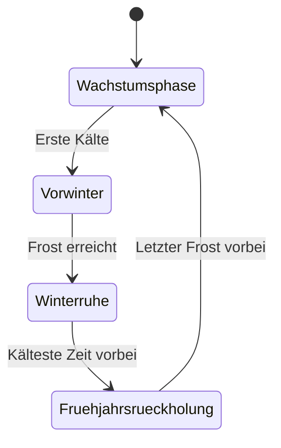

# Saison-Automatik: Wann kommt der Winter?

Für alle deine Freiland- und Gewächshaus-Standorte erkennt Kamerplanter selbstständig, wann sich der Winter ankündigt, wann die Winterruhe beginnt und wann es Zeit ist, deine Pflanzen im Frühling wieder zurückzuholen. Du musst dafür nichts einstellen — das System nutzt automatisch die beste verfügbare Datenquelle für deinen Standort. <!-- REQ-047 -->

---

## Voraussetzungen

- Mindestens ein Standort vom Typ **Außenbereich** (Freiland) oder **Gewächshaus** — für reine Innenraum-Standorte (Growzelt, Zimmer, Balkon) gibt es keine Saison-Automatik; dort gilt weiterhin die einfache, hemisphären-basierte Winter-Gießanpassung aus den [Pflegeerinnerungen](care-reminders.md#saisonale-anpassung).
- Keine weitere Einrichtung nötig — die Auswertung läuft täglich automatisch im Hintergrund.

---

## Die vier Jahreszeiten-Stufen

Jeder Freiland- oder Gewächshaus-Standort durchläuft pro Winter genau einen Zyklus aus vier Zuständen:

<!-- diagram-source: user-described — the four-phase season state machine (REQ-047 §2.2), one cycle per winter -->

| Zustand | Bedeutung |
|---------|-----------|
| **Wachstumsphase** | Alles läuft normal, keine Wintermaßnahmen nötig. |
| **Winter kündigt sich an** | Zeitfenster für Vorbereitungen: Schutz anbringen, Kübel einräumen, Knollen ausgraben. |
| **Winterruhe** | Deine Pflanzen ruhen geschützt — deutlich weniger gießen, kein Düngen. |
| **Frühjahrs-Rückholung** | Zeit zum Abhäufeln, Vorziehen und schrittweisen Abhärten, bevor es wieder ganz nach draußen geht. |

!!! tip "Kein Rückschritt mitten im Winter"
    Ein einzelner milder Tag im Januar holt eine Pflanze nicht aus der Winterruhe zurück — das System braucht mehrere aufeinanderfolgende milde Tage, bevor es in die nächste Stufe wechselt. So verhindert Kamerplanter, dass ein kurzer Wärmeeinbruch eine verfrühte Frühjahrsmaßnahme auslöst.

Du siehst den aktuellen Zustand jedes Standorts direkt im Dashboard-Widget **Winterschutz** (siehe [Dashboard personalisieren](dashboard-personalization.md)) sowie — für die einzelne Pflanze — im Abschnitt [Überwinterung](overwintering.md).

---

## Woher die Einschätzung kommt: die drei Datenquellen

Kamerplanter nutzt für jeden Standort automatisch die beste verfügbare Quelle. Diese Quelle wird dir als kleines Badge neben dem Saisonzustand angezeigt:

| Badge | Datenquelle | Wann aktiv |
|-------|-------------|-----------|
| **Live-Wetter** | Deine hinterlegte [Wetterquelle](weather-sources.md) (öffentlicher Dienst oder Home Assistant) liefert eine Frost-/Tiefsttemperatur-Vorhersage. | Sobald dein Standort eine funktionierende Wetterquelle hat. |
| **Klima-Schätzung** | Die am Standort hinterlegten durchschnittlichen Frost-Termine (letzter Frost im Frühjahr, erster Frost im Herbst). | Ohne Live-Wetterdaten, aber mit hinterlegten Frost-Terminen. |
| **Kalender** | Grober Richtwert nach Jahreszeit und Erdhalbkugel (Nord- oder Südhalbkugel deines Standorts). | Ohne Live-Wetterdaten und ohne hinterlegte Frost-Termine. |

!!! info "Die Quelle steht nie still"
    Richtest du nachträglich eine Wetterquelle für einen Standort ein, der bisher nur die Kalender-Schätzung genutzt hat, wechselt Kamerplanter ab dem nächsten Tag automatisch auf die genauere Live-Stufe — ohne dass du etwas umstellen musst.

Bei **Live-Wetter** zeigt dir Kamerplanter zusätzlich einen Frost-Countdown („Erster Frost in 4 Tagen"), sobald eine konkrete Frostvorhersage vorliegt. Ohne Live-Daten siehst du stattdessen den typischen Termin aus den Klimadaten deines Standorts („Erster Frost typisch um 25. Oktober").

!!! note "Frost-Termine für deinen Standort"
    Die durchschnittlichen Frost-Termine (letzter Frost im Frühjahr, erster Frost im Herbst) sind Teil der Standort-Daten. Ohne eigene Angabe verwendet Kamerplanter Standardwerte für Mitteleuropa. Details dazu im [Kalender](calendar.md).

---

## Was sich während der Winterruhe ändert

Sobald ein Standort in die Winterruhe wechselt, schaltet Kamerplanter für alle betroffenen Pflanzen automatisch einen eigenen Pflegeplan ein:

- **Gießen** folgt der Gießvorgabe aus dem [Überwinterungsplan](overwintering.md) der jeweiligen Pflanze — von „gar nicht" (trocken gelagerte Knollen) bis „normal" (Pflanzen im hellen, frostfreien Winterquartier).
- **Düngen** pausiert vollständig.
- Zwei neue Kontroll-Erinnerungen erscheinen bei Bedarf zusammen mit deinen übrigen [Aufgaben](tasks.md) (Quelle „Pflege"):

| Erinnerung | Wann sie erscheint |
|------------|---------------------|
| Winterquartier-Kontrolle | Regelmäßig während der Winterruhe — erinnert dich, nach Fäulnis, Schimmel oder Austrocknung zu schauen. |
| Winterquartier-Temperaturwarnung | Nur wenn dein Winterquartier über einen Sensor oder Home Assistant Live-Temperaturwerte liefert und die Temperatur außerhalb des empfohlenen Bereichs liegt. |

Verlässt der Standort die Winterruhe wieder (Übergang in die Frühjahrs-Rückholung), schaltet Kamerplanter den Winterruhe-Pflegeplan automatisch ab und kehrt zum normalen saisonalen Gießrhythmus zurück.

---

## Frühjahrs-Rückholung

Erreicht ein Standort die Stufe „Frühjahrs-Rückholung", erscheint für jede betroffene Pflanze — sobald der im [Überwinterungsplan](overwintering.md) hinterlegte Frühjahrsmonat erreicht ist — eine Erinnerung **„Winterschutz abnehmen"** zusammen mit deinen übrigen [Aufgaben](tasks.md) (Quelle „Pflege"). Welche konkrete Maßnahme für deine Pflanze ansteht, siehst du im Feld **Frühjahrsmaßnahme** ihres Überwinterungsplans:

- **Abdecken entfernen** — Winterschutz (Mulch, Vlies) abnehmen.
- **Vorziehen** — eingelagerte Knollen wieder zum Antreiben bringen.
- **Abhärten** — empfindliche Pflanzen langsam an Sonne, Wind und Kälte gewöhnen, bevor sie ganztägig draußen bleiben.
- **Nach draußen stellen / Auspflanzen** — die Pflanze endgültig an ihren Sommerplatz zurückbringen.
- **Rückschnitt** — abgestorbene oder erfrorene Triebe entfernen.

!!! example "Abhärten in drei Schritten"
    „Abhärten" bedeutet, eine überwinterte Pflanze nicht sofort wieder dauerhaft nach draußen zu stellen, sondern sie langsam zu gewöhnen:

    - Tag 1–3: 2–3 Stunden an einen halbschattigen, windgeschützten Platz.
    - Tag 4–6: Zeit im Freien täglich verlängern, langsam mehr Sonne zulassen.
    - Ab Tag 7: ganztags draußen — bei Spätfrostgefahr nachts noch hereinholen.

!!! note "Teilweise verfügbar: Spätfrost-Warnung"
    Eine automatische Warnung, die dich bei einer erneut vorhergesagten Spätfrostnacht davon abhält, empfindliche Pflanzen zu früh rauszustellen, ist als Funktion bereits angelegt, aber noch nicht über die Oberfläche erreichbar. Prüfe in der Übergangszeit vor dem endgültigen Rausstellen sicherheitshalber selbst die [Wettervorhersage](weather-sources.md#quelle-testen) deines Standorts.

---

## Häufige Fragen

??? question "Muss ich für jede Pflanze selbst einstellen, wann der Winter beginnt?"
    Nein. Die Saison-Automatik läuft pro Standort und wirkt automatisch auf alle Pflanzen an diesem Standort. Du musst nichts einrichten — Details zum pflanzenbezogenen Ergebnis findest du unter [Überwinterung](overwintering.md).

??? question "Was passiert, wenn meine Wetterquelle einmal ausfällt?"
    Kamerplanter fällt in diesem Fall automatisch auf die nächstbeste Quelle zurück — die hinterlegten Frost-Termine deines Standorts, oder notfalls die grobe Kalender-Schätzung. Die Saison-Automatik bleibt in jedem Fall funktionsfähig, auch ganz ohne Wetteranbindung.

??? question "Warum sehe ich für einen Standort die Kalender-Schätzung statt Live-Wetter?"
    Entweder hast du für diesen Standort noch keine [Wetterquelle](weather-sources.md) eingerichtet, oder es sind keine durchschnittlichen Frost-Termine hinterlegt. Richte eine Wetterquelle ein, um genauere, tagesaktuelle Einschätzungen zu bekommen.

??? question "Wirkt sich die Saison-Automatik auch auf winterharte Pflanzen aus?"
    Nein. Für Pflanzen, die an deinem Standort als winterhart gelten (grüne Ampel), erzeugt Kamerplanter bewusst keinen Überwinterungsplan und keine Winterschutz-Erinnerung — sie brauchen ja keinen Schutz. Details dazu unter [Überwinterung](overwintering.md).

---

## Siehe auch

- [Überwinterung](overwintering.md) — der automatisch erstellte Plan je Pflanze
- [Pflegeerinnerungen](care-reminders.md) — Gieß- und Pflegepläne allgemein
- [Wetterquellen](weather-sources.md) — Live-Wetterdaten je Standort einrichten
- [Klimazonen & Winterhärte](../guides/climate-zones.md) — wie die Winterhärte-Ampel entsteht
- [Kalender](calendar.md) — Frost-Termine und Aussaatkalender
