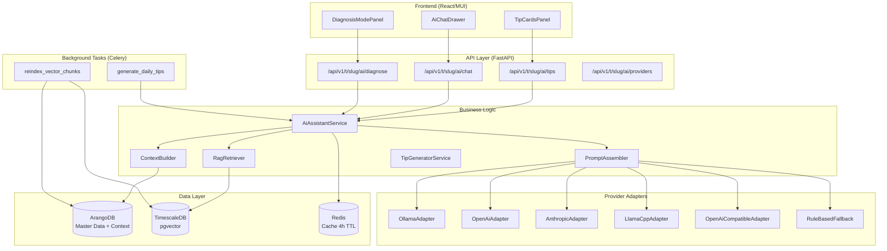
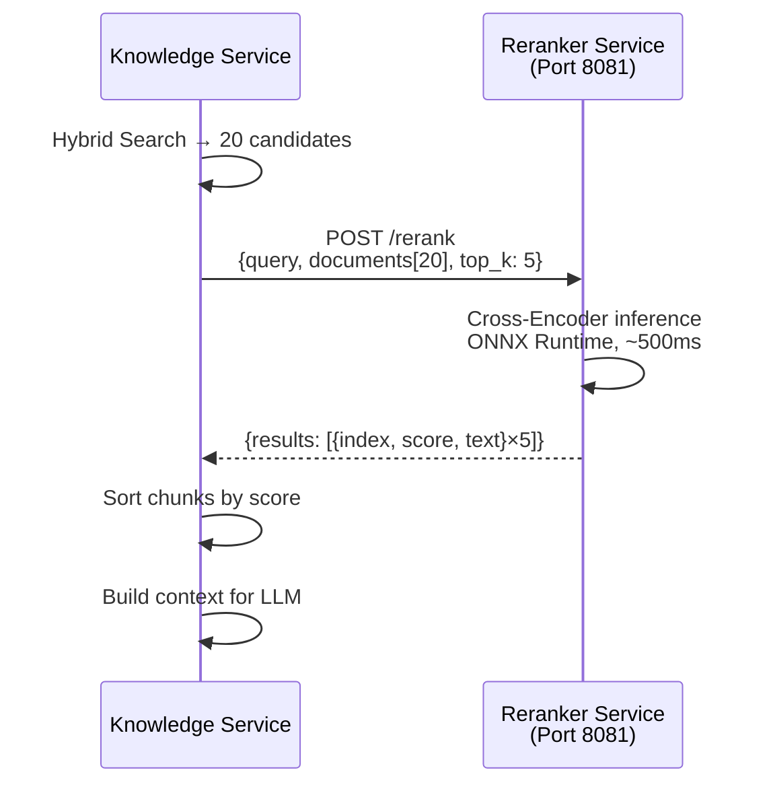

# AI Architecture

This page describes the technical architecture of the AI Assistant (REQ-031). The implementation follows the adapter pattern from REQ-011 and integrates into the existing 5-layer architecture.

---

## System Architecture



---

## IAiProvider — Adapter Interface

All AI providers implement the `IAiProvider` interface. New providers can be added without changing existing code (Open/Closed Principle, analogous to `ExternalSourceAdapter` in REQ-011).

```python
# app/domain/interfaces/ai_provider.py

class IAiProvider(ABC):
    """Abstract interface for AI provider adapters.

    Implementations: OllamaAdapter, OpenAiAdapter,
    AnthropicAdapter, LlamaCppAdapter, OpenAiCompatibleAdapter,
    RuleBasedFallback.
    """

    @abstractmethod
    async def chat(
        self,
        messages: list[ChatMessage],
        *,
        max_tokens: int = 1024,
        temperature: float = 0.3,
    ) -> AiResponse:
        """Full response (for tip cards)."""
        ...

    @abstractmethod
    async def chat_stream(
        self,
        messages: list[ChatMessage],
        *,
        max_tokens: int = 1024,
        temperature: float = 0.3,
    ) -> AsyncIterator[str]:
        """Token-by-token streaming (for chat, SSE)."""
        ...

    @abstractmethod
    async def health_check(self) -> bool:
        """Check reachability and functionality."""
        ...
```

### Provider Registry

Providers are resolved via a registry, analogous to the `AdapterRegistry` pattern in REQ-011:

```python
# app/data_access/ai_providers/registry.py

class AiProviderRegistry:
    _providers: dict[str, type[IAiProvider]] = {}

    @classmethod
    def register(cls, provider_type: str):
        """Decorator for provider registration."""
        def decorator(klass):
            cls._providers[provider_type] = klass
            return klass
        return decorator

    @classmethod
    def resolve(cls, config: AiProviderConfig) -> IAiProvider:
        """Returns an initialized provider instance."""
        klass = cls._providers.get(config.provider_type)
        if klass is None:
            raise ValueError(f"Unknown provider type: {config.provider_type}")
        return klass(config)
```

---

## RAG Pipeline

### Embedding Model

- **Model:** `sentence-transformers/all-MiniLM-L6-v2`
- **Dimensions:** 384
- **Model size:** ~23 MB
- **Operation:** Local, no API key, no external service

The embedding model runs as a Python process in the backend container. It generates vectors for:
- New or updated master data documents (Celery task `reindex_vector_chunks`)
- Incoming user queries for similarity search

### Vector Store (pgvector on TimescaleDB)

```sql
CREATE TABLE ai_vector_chunks (
    id UUID PRIMARY KEY DEFAULT gen_random_uuid(),
    source_type VARCHAR(64) NOT NULL,
    -- 'species' | 'cultivar' | 'growth_phase' | 'care_rule' | 'pest' | 'disease'
    source_key VARCHAR(128) NOT NULL,
    chunk_index INT NOT NULL DEFAULT 0,
    chunk_text TEXT NOT NULL,
    embedding vector(384) NOT NULL,
    metadata JSONB DEFAULT '{}',
    created_at TIMESTAMPTZ NOT NULL DEFAULT now(),
    updated_at TIMESTAMPTZ NOT NULL DEFAULT now()
);

-- IVFFlat index for cosine similarity search
CREATE INDEX idx_ai_vector_chunks_embedding
    ON ai_vector_chunks USING ivfflat (embedding vector_cosine_ops)
    WITH (lists = 100);
```

TimescaleDB was chosen as the vector store because it is already in the stack (no additional service like Qdrant or Chroma needed).

### Chunk Configuration

| Parameter | Value | Rationale |
|-----------|-------|-----------|
| Chunk size | 512 tokens | Optimal balance of precision and context |
| Chunk overlap | 64 tokens | Prevents information loss at boundaries |
| Top-K retrieval | 5 chunks | Balance of context and prompt length |
| Similarity threshold | 0.65 | Cosine distance; filters irrelevant chunks |

### Retrieval Strategy

```python
# app/domain/engines/rag_retriever.py

class RagRetriever:
    async def retrieve(
        self,
        query: str,
        *,
        top_k: int = 5,
        source_type_filter: list[str] | None = None,
        metadata_filter: dict | None = None,
    ) -> list[RagChunk]:
        """Cosine similarity search on ai_vector_chunks.

        Args:
            query: User query or context description.
            top_k: Number of chunks to return.
            source_type_filter: Optional restriction to specific
                source types (e.g. ['pest', 'disease'] for diagnosis).
            metadata_filter: Optional JSONB filter (e.g. phase).
        """
        query_embedding = self._embed(query)
        # pgvector cosine similarity: <=>
        # (1 - cosine_distance) >= similarity_threshold
        ...
```

---

## Re-Ranking Stage (Cross-Encoder)

!!! note "Optional component"
    Re-ranking is optional. Without a configured `RERANKER_URL`, the pipeline operates unchanged in hybrid-search-only mode. See [ADR-007](../adr/007-cross-encoder-reranking.md) for the rationale.

### Position in the pipeline

```
Query → Hybrid Search (top_k=20) → Cross-Encoder Re-Rank (top_k=5) → LLM
```

The re-ranker sits **between retrieval and LLM generation**. Hybrid Search deliberately retrieves more chunks than are ultimately passed to the LLM (over-retrieval strategy): 20 candidates are retrieved, re-ordered by semantic relevance using the cross-encoder, and only the best 5 reach the LLM context window.

### Why a cross-encoder?

The Bi-Encoder (E5-base) and BM25 rank independently. Keyword-rich chunks receive a high BM25 score even when they are semantically unrelated to the query. The cross-encoder evaluates each query–chunk pair jointly and produces more precise relevance scores. This reduces the dominant error class **GENERATION_MISS** (LLM hallucination caused by irrelevant context).

### Separate microservice (ONNX Runtime)

The re-ranker runs as a standalone `reranker-service` — analogous to the embedding service:

- **No PyTorch** in the container — only ONNX Runtime and the Hugging Face tokenizer
- **Multi-stage Dockerfile:** model download and ONNX export in a cached build stage; the runtime image remains lean
- **Port 8081**, FastAPI with two endpoints: `/rerank` (POST) and `/health` (GET)
- **Model:** `BAAI/bge-reranker-v2-m3` — multilingual (DE/EN), 568M parameters, Apache-2.0 licence



### Graceful degradation

When `RERANKER_URL` is empty or not set, `RerankerEngine.available` returns `False`. In that case the original chunk list is truncated to `top_k` entries and passed directly to the LLM context. A timeout or HTTP error from the reranker service also triggers this fallback — with a `WARNING` log entry (`reranker_fallback`).

### Resource requirements

| Scenario | RAM | CPU | Latency/query |
|----------|-----|-----|--------------|
| Reranker active (20→5) | 1.5–4 GB | 1–2 cores | +~500ms |
| Reranker disabled | 0 | 0 | 0ms |

!!! tip "First Docker build"
    The first build of the `reranker-service` image takes 10–15 minutes because `BAAI/bge-reranker-v2-m3` is downloaded and exported to ONNX via `optimum`. Subsequent builds use the cached layer and complete in seconds.

---

## Context Builder

The ContextBuilder fetches the current state of a plant or planting run from ArangoDB at runtime and formats it as structured text for the system prompt.

```python
# app/domain/engines/ai_context_builder.py

class AiContextBuilder:
    async def build_plant_context(
        self,
        tenant_key: str,
        context_key: str,
        context_type: str,
    ) -> PlantContext:
        """Fetches and formats plant context.

        Returns:
            PlantContext with: species, cultivar, current phase,
            phase day, EC/pH/VPD (latest measurement), active IPM events,
            last 3 feeding events, substrate type.
        """
        ...
```

**Fetched data (AQL traversal):**

- `planting_runs` → current `growth_phase` → target EC, pH, VPD
- `plant_instances` → `cultivar` → `species` → care profiles
- `observation_readings` (TimescaleDB) → latest measurements
- `ipm_inspections` → active infestations and ongoing treatments
- `feeding_events` → last 3 events with products and quantities

---

## Prompt Assembler

The PromptAssembler combines all information into a structured system prompt:

```
[System Role]
You are a plant advisory assistant for Kamerplanter. You respond
exclusively based on the provided context information.

[Current Plant Context]
Species: Cannabis sativa | Cultivar: Northern Lights
Phase: Flowering (Day 21/56) | Substrate: Coco
EC target: 1.4–1.8 mS/cm | EC actual: 1.2 mS/cm
pH target: 5.8–6.2 | pH actual: 5.8
VPD target: 0.8–1.2 kPa | VPD actual: 1.1 kPa

[Knowledge Base Chunks]
[Chunk 1 — species]: Cannabis sativa Flowering NPK profile...
[Chunk 2 — care_rule/diagnostics/nutrient-deficiency-symptoms#nitrogen-deficiency]:
  Nitrogen deficiency: lower leaves yellow...
[Chunk 3 — care_rule/phases/flowering-management]:
  N demand drops from week 3 of flowering...

[User Experience Level]
intermediate — Show technical details, no code examples.

[Chat History]
(last 5 messages)

[User Query]
My lower leaves are turning yellow — what could be the cause?
```

### Prompt Lengths by Feature

| Feature | Tokens Input | Tokens Output |
|---------|-------------|--------------|
| Tip cards (JSON) | ~800 | ~200 |
| Chat single query | ~1,500 | ~300 |
| Chat with 10 messages history | ~3,000 | ~400 |
| Diagnosis request | ~2,000 | ~500 |

---

## Caching Strategy

### Redis (Hot Cache)

Tip cards are cached in Redis with a 4-hour TTL. Cache key schema:

```
ai:tips:{tenant_key}:{context_type}:{context_key}
```

### Celery Batch Task

The daily Celery task `generate_daily_tips` (06:00 UTC) generates tip cards for all active planting runs in the background and writes them to Redis and ArangoDB (`ai_tip_cache` collection).

```python
# app/tasks/ai_tasks.py

@celery_app.task(name="generate_daily_tips")
def generate_daily_tips():
    """Generates tip cards for all active planting runs.

    Runs daily at 06:00 UTC. Processes runs sequentially
    for CPU-only inference (max_concurrent_tips=1, configurable).
    """
    ...
```

### Cache Invalidation

Tip cards are regenerated immediately when:
- Phase transition (`phase_transition` event)
- EC/pH outside tolerance band (±10% from target)
- New IPM event recorded

---

## Consent Middleware

Cloud providers (OpenAI, Anthropic) require explicit GDPR consent (REQ-025). The consent middleware checks for valid consent before every request.

```python
# app/common/dependencies.py

async def require_ai_consent(
    provider_config: AiProviderConfig,
    current_user: User,
    consent_service: ConsentService,
) -> None:
    """Checks GDPR consent for cloud AI providers.

    Raises:
        ConsentRequiredError: If provider.requires_consent == True
            and no valid consent exists.
    """
    if provider_config.requires_consent:
        consent = await consent_service.get_consent(
            user_key=current_user.key,
            purpose="ai_cloud_processing",
        )
        if not consent or not consent.is_valid:
            raise ConsentRequiredError(
                "Cloud AI provider requires GDPR consent.",
                consent_purpose="ai_cloud_processing",
            )
```

Local providers (`ollama`, `llamacpp`) have `requires_consent: false` and need no consent.

---

## Eval Framework

Response quality is evaluated automatically:

| Method | Description |
|--------|-------------|
| **Topic Match** | Are the RAG chunks semantically relevant to the query? (cosine score > 0.70) |
| **LLM-as-Judge** | A second model evaluates factual accuracy and actionability (1–5 points) |
| **Benchmark Suite** | 100 predefined questions with reference answers; regression test on model changes |
| **A/B Comparison** | For new models or guide versions: automatic comparison against baseline |

---

## Data Model Overview

### ArangoDB Collections

| Collection | Description | Retention |
|------------|-------------|-----------|
| `ai_provider_configs` | Provider configurations per tenant | Permanent |
| `ai_conversations` | Chat histories with message records | 90 days |
| `ai_tip_cache` | Cached tip cards | 7 days |

### TimescaleDB Tables

| Table | Description |
|-------|-------------|
| `ai_vector_chunks` | Vector index (384-dim, all-MiniLM-L6-v2) for RAG |

### Edge Collections (ArangoDB)

| Collection | From → To | Purpose |
|------------|----------|---------|
| `ai_tip_references_plant` | `ai_tip_cache` → `plant_instances` | Link tip to plant |
| `ai_tip_references_run` | `ai_tip_cache` → `planting_runs` | Link tip to run |
| `ai_conversation_about` | `ai_conversations` → `plant_instances / planting_runs` | Conversation context |

---

## Deployment Configuration (Helm)

```yaml
# helm/kamerplanter/values.yaml — AI configuration

ollama:
  enabled: true          # Ollama as sidecar or dedicated pod
  controllers:
    main:
      containers:
        main:
          env:
            OLLAMA_MODELS: /models
            OLLAMA_NUM_PARALLEL: "1"
            OLLAMA_MAX_LOADED_MODELS: "1"
          resources:
            requests:
              cpu: 500m
              memory: 2Gi
            limits:
              cpu: "4"
              memory: 6Gi   # For gemma3:4b Q4_K_M

backend:
  env:
    AI_DEFAULT_PROVIDER: ollama           # ollama | openai | anthropic | none
    AI_OLLAMA_BASE_URL: http://ollama:11434
    AI_OLLAMA_MODEL: gemma3:4b
    AI_TIP_CACHE_TTL_HOURS: "4"
    AI_MAX_CONCURRENT_TIPS: "5"           # 1 for CPU-only
    AI_EMBEDDING_MODEL: sentence-transformers/all-MiniLM-L6-v2
    AI_RAG_TOP_K: "5"
    AI_CONVERSATION_RETENTION_DAYS: "90"
```

---

## References

- REQ-031 — AI Assistant & Plant Advisory (`spec/req/REQ-031_KI-Assistent-Pflanzenberatung.md`)
- REQ-011 — External Master Data Enrichment (`spec/req/REQ-011_Externe-Stammdatenanreicherung.md`)
- REQ-025 — Privacy & GDPR (`spec/req/REQ-025_Datenschutz-Betroffenenrechte.md`)
- [ADR-006 — Embedding Model E5-base and Hybrid Search](../adr/006-embedding-model-e5-base-hybrid-search.md)
- [ADR-007 — Cross-Encoder Re-Ranking for RAG Pipeline](../adr/007-cross-encoder-reranking.md)
- [Understanding the RAG Knowledge Base](../guides/rag-knowledge-base.md)
- [AI Assistant](../user-guide/ai-assistant.md)
- [pgvector Documentation](https://github.com/pgvector/pgvector)
- [BAAI/bge-reranker-v2-m3](https://huggingface.co/BAAI/bge-reranker-v2-m3)
- [sentence-transformers/all-MiniLM-L6-v2](https://huggingface.co/sentence-transformers/all-MiniLM-L6-v2)
