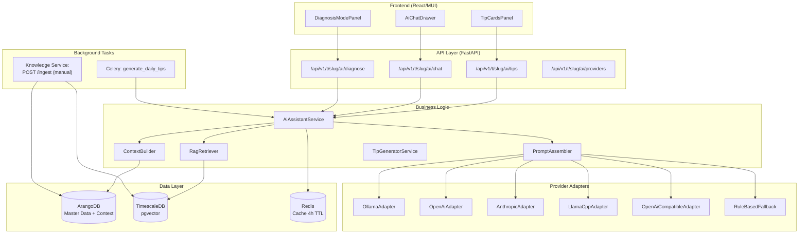
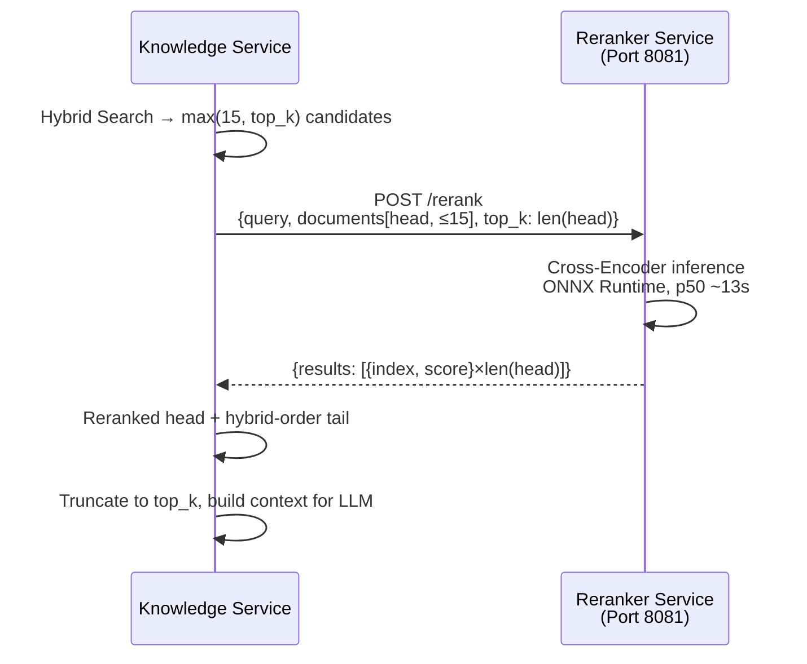
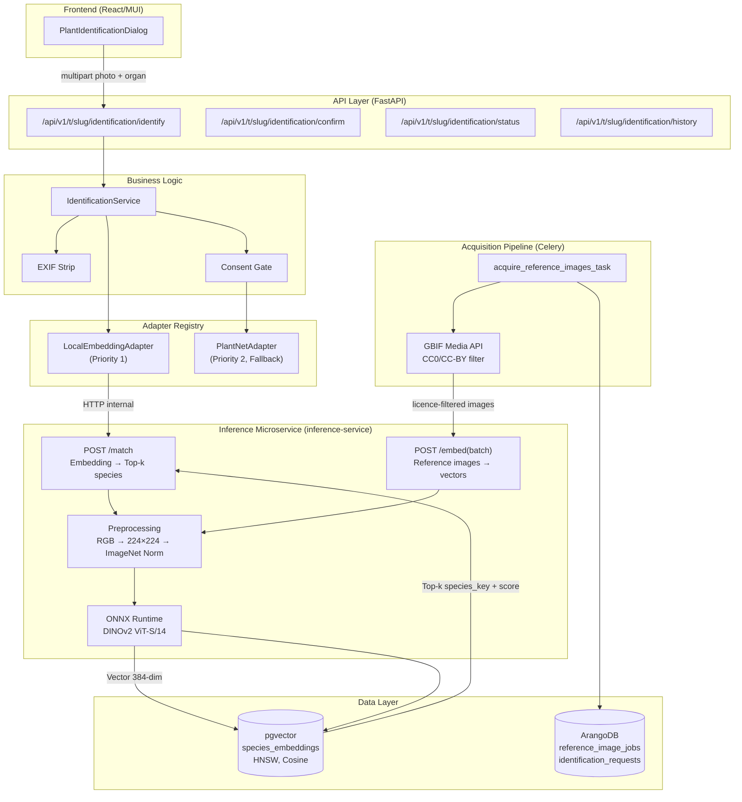

# AI Architecture

This page describes the technical architecture of the AI Assistant (REQ-031). The implementation uses Retrieval-Augmented Generation (RAG) to ground responses in plant-specific knowledge, follows the adapter pattern from REQ-011, and integrates into the existing 5-layer architecture.

---

## System Architecture

<!-- diagram-source: user-described — AI assistant system architecture across Frontend, API, Business Logic, Provider Adapters, Data Layer, and Celery background tasks -->

```mermaid
flowchart TB
    subgraph "Frontend (React/MUI)"
        TC[TipCardsPanel]
        CD[AiChatDrawer]
        DM[DiagnosisModePanel]
    end

    subgraph "API Layer (FastAPI)"
        AR["/api/v1/t/slug/ai/tips"]
        AC["/api/v1/t/slug/ai/chat"]
        AD["/api/v1/t/slug/ai/diagnose"]
        APC["/api/v1/t/slug/ai/providers"]
    end

    subgraph "Business Logic"
        AAS[AiAssistantService]
        CB[ContextBuilder]
        RR[RagRetriever]
        PA[PromptAssembler]
        TG[TipGeneratorService]
    end

    subgraph "Provider Adapters"
        OA[OllamaAdapter]
        OAI[OpenAiAdapter]
        ANT[AnthropicAdapter]
        LC[LlamaCppAdapter]
        OC[OpenAiCompatibleAdapter]
        FB[RuleBasedFallback]
    end

    subgraph "Data Layer"
        ARD[(ArangoDB<br/>Master Data + Context)]
        TS[(TimescaleDB<br/>pgvector)]
        RD[(Redis<br/>Cache 4h TTL)]
    end

    subgraph "Background Tasks"
        GDT[Celery: generate_daily_tips]
        RVC["Knowledge Service:<br/>POST /ingest (manual)"]
    end

    TC --> AR
    CD --> AC
    DM --> AD

    AR --> AAS
    AC --> AAS
    AD --> AAS

    AAS --> CB
    AAS --> RR
    AAS --> PA

    CB --> ARD
    RR --> TS
    PA --> OA
    PA --> OAI
    PA --> ANT
    PA --> LC
    PA --> OC
    PA --> FB

    AAS --> RD

    GDT --> AAS
    RVC --> TS
    RVC --> ARD
```

---

## IAiProvider — Adapter Interface

All AI providers implement the `IAiProvider` interface. New providers can be added without changing existing code (Open/Closed Principle, analogous to `ExternalSourceAdapter` in REQ-011).

```python
# app/domain/interfaces/ai_provider.py

class IAiProvider(ABC):
    """Abstract interface for AI provider adapters.

    Implementations: OllamaAdapter, OpenAiAdapter,
    AnthropicAdapter, LlamaCppAdapter, OpenAiCompatibleAdapter,
    RuleBasedFallback.
    """

    @abstractmethod
    async def chat(
        self,
        messages: list[ChatMessage],
        *,
        max_tokens: int = 1024,
        temperature: float = 0.3,
    ) -> AiResponse:
        """Full response (for tip cards)."""
        ...

    @abstractmethod
    async def chat_stream(
        self,
        messages: list[ChatMessage],
        *,
        max_tokens: int = 1024,
        temperature: float = 0.3,
    ) -> AsyncIterator[str]:
        """Token-by-token streaming (for chat, Server-Sent Events (SSE))."""
        ...

    @abstractmethod
    async def health_check(self) -> bool:
        """Check reachability and functionality."""
        ...
```

### Provider Registry

Providers are resolved via a registry, analogous to the `AdapterRegistry` pattern in REQ-011:

```python
# app/data_access/ai_providers/registry.py

class AiProviderRegistry:
    _providers: dict[str, type[IAiProvider]] = {}

    @classmethod
    def register(cls, provider_type: str):
        """Decorator for provider registration."""
        def decorator(klass):
            cls._providers[provider_type] = klass
            return klass
        return decorator

    @classmethod
    def resolve(cls, config: AiProviderConfig) -> IAiProvider:
        """Returns an initialized provider instance."""
        klass = cls._providers.get(config.provider_type)
        if klass is None:
            raise ValueError(f"Unknown provider type: {config.provider_type}")
        return klass(config)
```

---

## RAG Pipeline

### Embedding Model

- **Model:** `multilingual-e5-large` (see [ADR-006](../adr/006-embedding-modell-e5-base-hybrid-search.md))
- **Dimensions:** 1024
- **Operation:** Standalone `embedding-service` (ONNX Runtime), no API key, no external service

The embedding service runs as a standalone microservice that the Knowledge Service calls over HTTP. It generates vectors for:
- Knowledge YAML chunks during reindex (`POST /ingest` on the Knowledge Service)
- Incoming user queries for similarity search

!!! note "Model choice"
    ADR-006 originally introduced `multilingual-e5-base` (768 dimensions); the configuration has since been raised to the larger `multilingual-e5-large` variant (1024 dimensions). The prefix scheme (`"query: "`/`"passage: "`) from ADR-006 still applies unchanged.

!!! note "Model pinning and integrity verification (since 2026-09-24)"
    All four shippable models (`multilingual-e5-small`, `-base`, `-large`, and the MiniLM model) are pinned to a fixed commit revision at Docker build time; every kept file is additionally verified against a sha256 checksum before it ends up in the image. Measured against the previous, unpinned image: every file byte-identical, generated embeddings identical. The MiniLM model comes from a third-party export (`Xenova/paraphrase-multilingual-MiniLM-L12-v2`), not from the original repository of the model authors. At runtime the service runs with `HF_HUB_OFFLINE=1`, so it can never silently fetch a model. Also fixed as of this date: `--target e5-small` used to answer every `/embed` request with an error, because its ONNX graph declares an input field (`token_type_ids`) the tokenizer never produces — the feed is now built from the fields the graph itself declares.

### Request Limits and Threading (Embedding Service)

`POST /embed` bounds requests and answers an oversized one with HTTP 422 (validation error):

| Field | Limit |
|-------|-------|
| `texts` (count) | at most 64 |
| `texts[i]` (characters per text) | at most 16,384 |
| `prefix` (characters) | at most 64 |
| `model` (characters) | at most 128 |

An empty `texts` list is valid and returns HTTP 200 with an empty embedding list. The Knowledge Service itself sends embedding requests in slices of at most 16 texts, staying under the limit.

An ASGI middleware guards against oversized requests before validation: a body larger than 12,650,752 bytes (~12.7 MB, derived from the limits above) is refused with HTTP 413 before it is even parsed. A 422 validation error now carries only `loc`, `type` and `msg` per error — the offending input itself is no longer echoed back. Because every request shares one inference lock, a request waits at most 60 seconds for the lock (then HTTP 503 `{"status": "busy"}` with `Retry-After: 60`) and is aborted after at most 110 seconds overall (HTTP 503 `{"status": "timeout"}`). `/health` and `/ready` do not share the lock and stay reachable under load.

The number of inference threads (`intra_op_num_threads`) is sized from the container's CPU allotment (cgroup quota or CPU affinity), not from the host machine's core count — otherwise the ONNX Runtime would schedule more threads than the container is actually allowed to use, and the kernel would throttle them. The service processes one text at a time per request under a process-wide lock instead of running every text as one padded batch; measured: identical embeddings at lower memory usage.

### Vector Store (dedicated PostgreSQL + pgvector instance)

The vectors do **not** live in TimescaleDB — they are stored in a dedicated PostgreSQL instance with the `pgvector` extension (database `kamerplanter_vectors`, its own `vectordb` container/pod). This keeps vector search isolated from the sensor time-series load on TimescaleDB.

```sql
CREATE TABLE ai_vector_chunks (
    id UUID PRIMARY KEY DEFAULT gen_random_uuid(),
    source_type VARCHAR(64) NOT NULL,
    -- 'care_rule' (currently the only source type from the RAG guide YAMLs)
    source_key VARCHAR(128) NOT NULL,
    title TEXT NOT NULL,
    content TEXT NOT NULL,
    embedding vector(1024) NOT NULL,
    search_text tsvector,
    metadata JSONB DEFAULT '{}',
    created_at TIMESTAMPTZ NOT NULL DEFAULT now(),
    updated_at TIMESTAMPTZ NOT NULL DEFAULT now()
);

-- HNSW index for cosine similarity search (replaces IVFFlat, ADR-006)
CREATE INDEX idx_ai_chunks_embedding_hnsw
    ON ai_vector_chunks USING hnsw (embedding vector_cosine_ops)
    WITH (m = 16, ef_construction = 200);

-- GIN index for the full-text component of hybrid search
CREATE INDEX idx_ai_chunks_search_text
    ON ai_vector_chunks USING gin(search_text);
```

Search combines vector similarity and full-text search via Reciprocal Rank Fusion (Hybrid Search, see ADR-006) — pure cosine similarity alone is no longer used.

### Chunk Configuration

| Parameter | Value | Rationale |
|-----------|-------|-----------|
| Chunk size | 512 tokens | Optimal balance of precision and context |
| Chunk overlap | 64 tokens | Prevents information loss at boundaries |
| Top-K retrieval | 5 chunks | Balance of context and prompt length |
| Similarity threshold | 0.65 | Cosine distance; filters irrelevant chunks |

### Retrieval Strategy

```python
# src/knowledge-service/app/vectordb/repository.py (simplified)

class VectorChunkRepository:
    def hybrid_search(
        self,
        query: str,
        *,
        top_k: int = 5,
        source_type: str | None = None,
    ) -> list[dict]:
        """Hybrid search: vector similarity + full-text search, fused via RRF.

        Args:
            query: User query or context description (embedded with the
                E5 prefix "query: ").
            top_k: Number of chunks to return.
            source_type: Optional restriction to a single source type.
        """
        query_embedding = self._embedding.embed(query, prefix="query: ")
        # pgvector cosine distance (<=>) AND PostgreSQL full-text search
        # (tsvector/tsquery), ranking fusion via Reciprocal Rank Fusion
        ...
```

---

## Re-Ranking Stage (Cross-Encoder)

!!! note "Optional component"
    Re-ranking is optional. Without a configured `RERANKER_URL`, the pipeline operates unchanged in hybrid-search-only mode. See [ADR-007](../adr/007-cross-encoder-reranking.md) for the rationale.

### Position in the pipeline

```text
Query → Hybrid Search (max(RERANKER_INITIAL_K, top_k) candidates) → Cross-Encoder scores only the first RERANKER_INITIAL_K → rest appended in hybrid order → top top_k passed to LLM
```

The re-ranker sits **between retrieval and LLM generation**. Hybrid Search deliberately retrieves more candidates than are ultimately re-scored (over-retrieval strategy): it retrieves `max(RERANKER_INITIAL_K, top_k)` candidates. Of those, only the first `RERANKER_INITIAL_K` (default 15) are re-ordered by semantic relevance using the cross-encoder — the sidecar's time budget does not stretch further (see below). If a caller asks for more results than were scored — e.g. the MCP endpoint with up to 20, or `/search` with up to 50 — the remaining candidates are appended unchanged, in hybrid order. They keep their hybrid score (RRF, at most about 0.016). That score is not comparable to the cross-encoder scores (0 to 1) of the scored head, and it sits deliberately below any citation threshold such as the MCP tool's `min_score=0.6`. This scoring cap therefore **never** bounds how many results a caller gets, only how many candidates run through the cross-encoder. Each scored candidate is additionally truncated to `RERANKER_MAX_DOCUMENT_CHARS` characters for the cross-encoder call (default 500, applied to `title\ncontent`); the chunk that is subsequently passed to the LLM context keeps its full text — only the reranker input is shortened.

### Why a cross-encoder?

The Bi-Encoder (E5-base) and BM25 rank independently. Keyword-rich chunks receive a high BM25 score even when they are semantically unrelated to the query. The cross-encoder evaluates each query–chunk pair jointly and produces more precise relevance scores. This reduces the dominant error class **GENERATION_MISS** (LLM hallucination caused by irrelevant context).

### Separate microservice (ONNX Runtime)

The re-ranker runs as a standalone `reranker-service` — analogous to the embedding service:

- **No PyTorch** in the container — only ONNX Runtime and the `tokenizers` library
- **Multi-stage Dockerfile:** model download (already ONNX, pinned and sha256-verified) in a cached build stage; no ONNX export at build time any more (see the amendment in [ADR-007](../adr/007-cross-encoder-reranking.md)); the runtime image remains lean
- **Port 8081**, FastAPI with three endpoints: `/rerank` (POST), `/health` (GET) and `/ready` (GET)
- **Model:** `BAAI/bge-reranker-v2-m3` — multilingual (DE/EN), 568M parameters, Apache-2.0 licence

<!-- diagram-source: user-described — sequence of the cross-encoder re-ranking call between Knowledge Service and Reranker Service -->

```mermaid
sequenceDiagram
    participant KS as Knowledge Service
    participant RE as Reranker Service<br/>(Port 8081)

    KS->>KS: Hybrid Search → max(15, top_k) candidates
    KS->>RE: POST /rerank<br/>{query, documents[head, ≤15], top_k: len(head)}
    RE->>RE: Cross-Encoder inference<br/>ONNX Runtime, p50 ~13s
    RE-->>KS: {results: [{index, score}×len(head)]}
    KS->>KS: Reranked head + hybrid-order tail
    KS->>KS: Truncate to top_k, build context for LLM
```

### Graceful degradation

When `RERANKER_URL` is empty or not set, `RerankerEngine.available` returns `False`. In that case the original chunk list is truncated to `top_k` entries and passed directly to the LLM context. A timeout or HTTP error from the reranker service triggers the same fallback for the scored head: `RerankerEngine.rerank()` then returns the head unchanged, so the overall result of `KnowledgeService.search()` is entirely the un-reranked hybrid order — with exactly one `WARNING` log entry (`reranker_fallback`).

### Fallback Reasons and Time Budget {#fallback-reasons-and-time-budget}

Every fallback logs exactly one structured `reranker_fallback` warning with the fields `reason`, `status_code`, `documents`, `elapsed_s` and `error`. `reason` comes from a closed set of values:

| `reason` | Trigger |
|----------|---------|
| `deadline` | Sidecar answers HTTP 503 `{"status": "timeout"}` — the reranker service's server-side 25-second time limit has expired. |
| `busy` | Sidecar answers HTTP 503 `{"status": "busy"}` — the inference lock was not obtained within 10 seconds. |
| `loading` | Sidecar answers HTTP 503 while the model is still loading. |
| `http_status` | Any other non-2xx answer, including a 503 with an unknown or unparsable body. |
| `client_timeout` | The Knowledge Service client's own 30-second timeout expired. |
| `transport` | Connection, DNS or protocol error at the HTTP level. |
| `malformed_response` | A 2xx answer whose body has no usable `results` field. |

A successful rerank instead logs `reranker_complete` with `elapsed_s`. Operators can, for example, track the frequency of `reason=deadline` to see how often the deadline actually fires.

Background of the `deadline` case (measured on 2026-09-25): `bge-reranker-v2-m3` costs about 3 seconds per (query, document) pair of 512 tokens at the Helm chart's 2-CPU limit. Corpus chunks are a median of about 430 tokens. A real HTTP probe over all 100 benchmark questions confirms this for the original default (`RERANKER_INITIAL_K=20`, full-length documents up to 512 tokens): every request hit the server-side 25-second deadline (503 after about 27 seconds); the equivalent full-length cost works out to about 54 seconds — reranking never completed in practice, and every search waited about 27 seconds for nothing.

With the current defaults `RERANKER_INITIAL_K=15` and `RERANKER_MAX_DOCUMENT_CHARS=500` (pair median 166 tokens, max 222), the same test had all 100 requests succeed — p50 12.9 seconds, p90 15.0 seconds, max 16.0 seconds, within the 25-second budget. Together, the two defaults exactly meet the reranker service's character-budget constraint (`RERANKER_INITIAL_K × RERANKER_MAX_DOCUMENT_CHARS ≤ 7,500`, see [Environment Variables](../reference/environment-variables.md)); raising either value past that requires re-measuring latency first.

Context quality (share of the benchmark's expected topics found in the returned context, measured over 54 questions across 9 categories) depends on the requested `top_k`: at `top_k=5` — e.g. the AI terminology glossary — it rises from 0.927 without re-ranking to 0.974 with the new defaults (an unbounded rerank of every candidate would reach 0.982 but does not fit the deadline). At the chat default `top_k=10` the gain is much smaller: 0.978 without re-ranking versus 0.979 with the new defaults (unbounded: 0.995). The larger benefit of re-ranking is therefore for callers requesting few chunks (glossary `top_k=5`, diagnosis assistant `top_k=8`) — not for chat at `top_k=10`.

### Request Limits and Threading (Reranker Service)

`POST /rerank` bounds requests and answers an oversized one with HTTP 422 (validation error):

| Field | Limit |
|-------|-------|
| `query` (characters) | at most 4,096 |
| `documents` (count) | at most 100 |
| `documents[i]` (characters per document) | at most 16,384 |
| `top_k` | 1 to 50 (default 5, unchanged) |

An empty `documents` list is valid and returns HTTP 200 with an empty result list. The Knowledge Service sends at most `reranker_initial_k` (default 15) documents per request and truncates each document to `reranker_max_document_chars` characters beforehand (default 500) — both stay well under the server-side limits of 100 documents and 16,384 characters per document.

An ASGI middleware guards against oversized requests before validation: a body larger than 19,775,488 bytes (~19.8 MB, derived from the limits above) is refused with HTTP 413 before it is even parsed. A 422 validation error now carries only `loc`, `type` and `msg` per error — the offending input itself is no longer echoed back. Because every request shares one inference lock, a request waits at most 10 seconds for the lock (then HTTP 503 `{"status": "busy"}` with `Retry-After: 10`) and is aborted after at most 25 seconds overall (HTTP 503 `{"status": "timeout"}`). `/health` and `/ready` do not share the lock and stay reachable under load. The Knowledge Service treats a reranker HTTP 503 like any other error and falls back to the un-reranked chunk list (see "Graceful degradation" above).

As with the embedding service, the number of inference threads (`intra_op_num_threads`) is sized from the container's CPU allotment (cgroup quota or CPU affinity), not from the host machine's core count. The service processes one query–document pair at a time per request under a process-wide lock instead of running every pair as one padded batch; measured: identical ranking at lower memory usage.

### Resource requirements

| Scenario | RAM | CPU | Latency/query |
|----------|-----|-----|--------------|
| Reranker active (scoring ≤15 candidates, measured 2026-09-25) | 1.5–4 GB | up to 2 cores (chart limit) | p50 ~12.9s, p90 ~15s, max ~16s |
| Reranker disabled | 0 | 0 | 0ms |

!!! tip "First Docker build"
    The first build of the `reranker-service` image downloads the already ONNX-exported `BAAI/bge-reranker-v2-m3` model from Hugging Face, pinned to a fixed commit revision and verified against a sha256 checksum — no export via `optimum` happens any more (see [ADR-007](../adr/007-cross-encoder-reranking.md)). Build time now depends mainly on download speed; subsequent builds use the cached layer and complete in seconds.

!!! info "Container hardening (embedding-service and reranker-service)"
    Both ONNX sidecars run without a package manager in the runtime image: `pip` is removed from the base image at build time, and `uv` never reaches the runtime stage in the first place; application code, the Python environment and the model files are owned by `root` and readable only, not writable, by the service UID (1000). In the development chart (`values-dev-ki.yaml`) both containers run with `readOnlyRootFilesystem: true`, `allowPrivilegeEscalation: false`, all Linux capabilities dropped, and `seccompProfile: RuntimeDefault`; a memory-backed `/tmp` emptyDir is provided for any library that insists on a scratch file. `docker-compose.yml` starts the reranker service the same way — read-only, as UID 1000, without capabilities, with a `/tmp` tmpfs — and binds its (unauthenticated) port to `127.0.0.1` only, not to every network interface of the host.

---

## Context Builder

The ContextBuilder fetches the current state of a plant or planting run from ArangoDB at runtime and formats it as structured text for the system prompt.

```python
# app/domain/engines/ai_context_builder.py

class AiContextBuilder:
    async def build_plant_context(
        self,
        tenant_key: str,
        context_key: str,
        context_type: str,
    ) -> PlantContext:
        """Fetches and formats plant context.

        Returns:
            PlantContext with: species, cultivar, current phase,
            phase day, EC/pH/VPD (latest measurement), active IPM events,
            last 3 feeding events, substrate type.
        """
        ...
```

**Fetched data (AQL traversal):**

- `planting_runs` → current `growth_phase` → target EC, pH, VPD
- `plant_instances` → `cultivar` → `species` → care profiles
- `observation_readings` (TimescaleDB) → latest measurements
- `ipm_inspections` → active infestations and ongoing treatments
- `feeding_events` → last 3 events with products and quantities

---

## Prompt Assembler

The PromptAssembler combines all information into a structured system prompt:

```text
[System Role]
You are a plant advisory assistant for Kamerplanter. You respond
exclusively based on the provided context information.

[Current Plant Context]
Species: Cannabis sativa | Cultivar: Northern Lights
Phase: Flowering (Day 21/56) | Substrate: Coco
EC target: 1.4–1.8 mS/cm | EC actual: 1.2 mS/cm
pH target: 5.8–6.2 | pH actual: 5.8
VPD target: 0.8–1.2 kPa | VPD actual: 1.1 kPa

[Knowledge Base Chunks]
[Chunk 1 — species]: Cannabis sativa Flowering NPK profile...
[Chunk 2 — care_rule/diagnostics/nutrient-deficiency-symptoms#nitrogen-deficiency]:
  Nitrogen deficiency: lower leaves yellow...
[Chunk 3 — care_rule/phases/flowering-management]:
  N demand drops from week 3 of flowering...

[User Experience Level]
intermediate — Show technical details, no code examples.

[Chat History]
(last 5 messages)

[User Query]
My lower leaves are turning yellow — what could be the cause?
```

### Prompt Lengths by Feature

| Feature | Tokens Input | Tokens Output |
|---------|-------------|--------------|
| Tip cards (JSON) | ~800 | ~200 |
| Chat single query | ~1,500 | ~300 |
| Chat with 10 messages history | ~3,000 | ~400 |
| Diagnosis request | ~2,000 | ~500 |

---

## Caching Strategy

### Redis (Hot Cache)

Tip cards are cached in Redis with a 4-hour TTL. Cache key schema:

```text
ai:tips:{tenant_key}:{context_type}:{context_key}
```

### Celery Batch Task

The daily Celery task `generate_daily_tips` (06:00 UTC) generates tip cards for all active planting runs in the background and writes them to Redis and ArangoDB (`ai_tip_cache` collection).

```python
# app/tasks/ai_tasks.py

@celery_app.task(name="generate_daily_tips")
def generate_daily_tips():
    """Generates tip cards for all active planting runs.

    Runs daily at 06:00 UTC. Processes runs sequentially
    for CPU-only inference (max_concurrent_tips=1, configurable).
    """
    ...
```

### Cache Invalidation

Tip cards are regenerated immediately when:
- Phase transition (`phase_transition` event)
- EC/pH outside tolerance band (±10% from target)
- New IPM event recorded

---

## Consent Middleware

Cloud providers (OpenAI, Anthropic) require explicit GDPR consent (REQ-025). The consent middleware checks for valid consent before every request.

```python
# app/common/dependencies.py

async def require_ai_consent(
    provider_config: AiProviderConfig,
    current_user: User,
    consent_service: ConsentService,
) -> None:
    """Checks GDPR consent for cloud AI providers.

    Raises:
        ConsentRequiredError: If provider.requires_consent == True
            and no valid consent exists.
    """
    if provider_config.requires_consent:
        consent = await consent_service.get_consent(
            user_key=current_user.key,
            purpose="ai_cloud_processing",
        )
        if not consent or not consent.is_valid:
            raise ConsentRequiredError(
                "Cloud AI provider requires GDPR consent.",
                consent_purpose="ai_cloud_processing",
            )
```

Local providers (`ollama`, `llamacpp`) have `requires_consent: false` and need no consent.

---

## Eval Framework

Response quality is evaluated automatically:

| Method | Description |
|--------|-------------|
| **Topic Match** | Are the RAG chunks semantically relevant to the query? (cosine score > 0.70) |
| **LLM-as-Judge** | A second model evaluates factual accuracy and actionability (1–5 points) |
| **Benchmark Suite** | 100 predefined questions with reference answers; regression test on model changes |
| **A/B Comparison** | For new models or guide versions: automatic comparison against baseline |

---

## Data Model Overview

### ArangoDB Collections

| Collection | Description | Retention |
|------------|-------------|-----------|
| `ai_provider_configs` | Provider configurations per tenant | Permanent |
| `ai_conversations` | Chat histories with message records | 90 days |
| `ai_tip_cache` | Cached tip cards | 7 days |

### VectorDB Tables (dedicated PostgreSQL + pgvector instance)

| Table | Description |
|-------|-------------|
| `ai_vector_chunks` | Vector index (1024-dim, multilingual-e5-large) + `search_text` full-text index for RAG hybrid search |

### Edge Collections (ArangoDB)

| Collection | From → To | Purpose |
|------------|----------|---------|
| `ai_tip_references_plant` | `ai_tip_cache` → `plant_instances` | Link tip to plant |
| `ai_tip_references_run` | `ai_tip_cache` → `planting_runs` | Link tip to run |
| `ai_conversation_about` | `ai_conversations` → `plant_instances / planting_runs` | Conversation context |

---

## Deployment Configuration (Helm)

```yaml
# helm/kamerplanter/values.yaml — AI configuration

ollama:
  enabled: true          # Ollama as sidecar or dedicated pod
  controllers:
    main:
      containers:
        main:
          env:
            OLLAMA_MODELS: /models
            OLLAMA_NUM_PARALLEL: "1"
            OLLAMA_MAX_LOADED_MODELS: "1"
          resources:
            requests:
              cpu: 500m
              memory: 2Gi
            limits:
              cpu: "4"
              memory: 6Gi   # For gemma3:4b Q4_K_M

backend:
  env:
    AI_DEFAULT_PROVIDER: ollama           # ollama | openai | anthropic | none
    AI_OLLAMA_BASE_URL: http://ollama:11434
    AI_OLLAMA_MODEL: gemma3:4b
    AI_TIP_CACHE_TTL_HOURS: "4"
    AI_MAX_CONCURRENT_TIPS: "5"           # 1 for CPU-only
    EMBEDDING_MODEL: multilingual-e5-large   # Knowledge Service, 1024 dimensions
    AI_RAG_TOP_K: "5"
    AI_CONVERSATION_RETENTION_DAYS: "90"
```

---

## Image Recognition (DINOv2) {#image-recognition-dinov2}

This section describes the architecture of self-hosted plant identification (REQ-029-A). Plant identification is an optional, standalone component and does not affect the AI Assistant (RAG pipeline).

### Core Principle: Embedding Matching Instead of Classification

Recognition is not based on a traditional image classifier with fixed output classes. Instead:

1. The user photo is converted into an **embedding vector** (384 dimensions) by the DINOv2 model.
2. This vector is matched against a **reference index** (also DINOv2 embeddings from curated species photos) via cosine similarity search.
3. The most similar species are returned as a suggestion list.

This nearest-neighbor matching **supports few-shot addition of new species**: only a few reference images per species are needed, and new species can be added by providing reference images — no retraining required.

### System Architecture

<!-- diagram-source: user-described — plant identification flow from Frontend through API and Business Logic to local/PlantNet adapters, inference microservice, and the pgvector/ArangoDB data layer plus the GBIF acquisition pipeline -->

```mermaid
flowchart TB
    subgraph "Frontend (React/MUI)"
        PID[PlantIdentificationDialog]
    end

    subgraph "API Layer (FastAPI)"
        RI["/api/v1/t/slug/identification/identify"]
        RC["/api/v1/t/slug/identification/confirm"]
        RS["/api/v1/t/slug/identification/status"]
        RH["/api/v1/t/slug/identification/history"]
    end

    subgraph "Business Logic"
        IS[IdentificationService]
        EXIF[EXIF Strip]
        CGATE[Consent Gate]
    end

    subgraph "Adapter Registry"
        LEA["LocalEmbeddingAdapter<br/>(Priority 1)"]
        PNA["PlantNetAdapter<br/>(Priority 2, Fallback)"]
    end

    subgraph "Inference Microservice (inference-service)"
        ONNX["ONNX Runtime<br/>DINOv2 ViT-S/14"]
        PRE["Preprocessing<br/>RGB → 224×224 → ImageNet Norm"]
        MATCH["POST /match<br/>Embedding → Top-k species"]
        EMBED["POST /embed(batch)<br/>Reference images → vectors"]
    end

    subgraph "Data Layer"
        PGV[("pgvector<br/>species_embeddings<br/>HNSW, Cosine")]
        ARD[("ArangoDB<br/>reference_image_jobs<br/>identification_requests")]
    end

    subgraph "Acquisition Pipeline (Celery)"
        GBIF["GBIF Media API<br/>CC0/CC-BY filter"]
        ACQ["acquire_reference_images_task"]
    end

    PID -->|"multipart photo + organ"| RI
    RI --> IS
    IS --> EXIF
    IS --> CGATE
    IS --> LEA
    CGATE --> PNA

    LEA -->|"HTTP internal"| MATCH
    MATCH --> PRE
    PRE --> ONNX
    ONNX -->|"Vector 384-dim"| PGV
    PGV -->|"Top-k species_key + score"| MATCH

    ACQ --> GBIF
    GBIF -->|"licence-filtered images"| EMBED
    EMBED --> PRE
    ONNX --> PGV
    ACQ --> ARD
```

### Adapter Registry and Fallback Chain

The `IdentificationAdapterRegistry` follows the same pattern as the `ExternalSourceAdapterRegistry` from REQ-011:

| Priority | Adapter | Prerequisite | Privacy |
|:--------:|---------|-------------|---------|
| 1 | `LocalEmbeddingAdapter` | `INFERENCE_SERVICE_ENABLED=true`, index populated | Photo stays on the instance |
| 2 | `PlantNetAdapter` | Pl@ntNet key + user consent `plant_identification` | Photo sent to Pl@ntNet (France, EU) |

The fallback chain activates when the `LocalEmbeddingAdapter` returns a confidence below the `CONFIDENCE_AUTO_ACCEPT` threshold (default: 0.85) — or when `INFERENCE_SERVICE_ENABLED=false`.

```python
# Pseudocode — IdentificationService.identify()
result = await local_adapter.identify(image_bytes, organ=organ)

if result.top_confidence < settings.confidence_auto_accept:
    if plantnet_adapter.available and user_has_consent("plant_identification"):
        plantnet_result = await plantnet_adapter.identify(image_bytes, organ=organ)
        result = merge_results(result, plantnet_result)
```

### Preprocessing Contract

> **Critical:** Reference images and user photos must be preprocessed **identically**. Any deviation renders the matching unusable.

```python
# src/inference-service/app/preprocessing.py — binding for both index AND query
IMAGENET_MEAN = (0.485, 0.456, 0.406)
IMAGENET_STD  = (0.229, 0.224, 0.225)
INPUT_SIZE    = 224  # Multiple of DINOv2 patch size 14

# Steps (both paths):
# 1. EXIF strip + RGB conversion (apply orientation)
# 2. Resize: shorter edge to INPUT_SIZE, then center-crop INPUT_SIZE×INPUT_SIZE
# 3. /255.0, (x − MEAN) / STD
# 4. HWC → CHW, batch dim, float32
```

### Model Selection

| Variant | Parameters | Embedding dim | Footprint | Status |
|---------|:----------:|:-------------:|-----------|--------|
| DINOv2 ViT-S/14 | ~21 M | 384 | CPU, fast | **MVP default** |
| DINOv2 ViT-B/14 | ~86 M | 768 | CPU ok, more accurate | Upgrade path |
| DINOv2 ViT-L/14 | ~300 M | 1024 | GPU recommended | On demand |

**Requirement:** Only the Apache-2.0-licensed base backbone (`facebookresearch/dinov2`) is used. PlantCLEF fine-tuned weights (CC-BY-NC) are explicitly excluded.

### Reference Image Acquisition Pipeline

The pipeline runs as a Celery task (`acquire_reference_images_task`) and is idempotent:

```text
For each species (scientific_name) from REQ-001 master data:
  1. GBIF Occurrence/Media API → candidate images with licence metadata
  2. Licence filter: ONLY CC0 / CC-BY → discard CC-BY-NC, CC-BY-SA, unknown
  3. Quality curation: min. 224px, aspect ratio ≤ 3:1
  4. EXIF strip → preprocessing contract → inference-service /embed/batch
  5. Embedding + provenance → pgvector (species_embeddings)
  6. Coverage report → ArangoDB (reference_image_jobs)
  NO original image is stored.
```

### Confidence Calibration

Cosine similarity is not a probability. The conversion to displayed confidence scores (0–100 %) uses calibrated thresholds derived from internal evaluation against the ~210 species:

| Setting | Default | Meaning |
|---------|:-------:|---------|
| `CONFIDENCE_AUTO_ACCEPT` | 0.85 | Suggest species directly (high confidence) |
| `CONFIDENCE_SHOW_RESULTS` | 0.10 | Minimum to appear in the list |
| Below threshold | — | "Not identifiable" + offer fallback |

### Data Model (pgvector)

```sql
-- Table: species_embeddings (in the kamerplanter_vectors schema)
CREATE TABLE species_embeddings (
    id          UUID PRIMARY KEY DEFAULT gen_random_uuid(),
    species_key VARCHAR(128) NOT NULL,      -- Foreign key to ArangoDB species
    scientific_name VARCHAR(256) NOT NULL,
    organ       VARCHAR(64),               -- 'leaf' | 'flower' | 'fruit' | ...
    embedding   vector(384) NOT NULL,      -- DINOv2 ViT-S/14
    model       VARCHAR(64) NOT NULL,      -- 'dinov2_vits14'
    source      VARCHAR(64) NOT NULL,      -- 'gbif' | 'wikimedia'
    license     VARCHAR(64) NOT NULL,      -- 'CC0' | 'CC-BY'
    attribution TEXT,                      -- Attribution (required for CC-BY)
    source_url  TEXT,
    indexed_at  TIMESTAMPTZ NOT NULL DEFAULT now()
);

-- HNSW index for fast cosine similarity search
CREATE INDEX idx_species_embeddings_hnsw
    ON species_embeddings USING hnsw (embedding vector_cosine_ops);
```

### GDPR Compliance

| Aspect | Measure |
|--------|---------|
| User photo not stored | Image held in RAM only during embedding computation |
| EXIF strip | Applied before any processing (Pillow `getexif()`) |
| Primary path local | No third-country transfer, no data processing agreement needed |
| Fallback consent | Pl@ntNet use requires `plant_identification` consent (REQ-025) |
| Reference image provenance | Source/licence/attribution stored in `species_embeddings` |

---

## References

- REQ-031 — AI Assistant & Plant Advisory (`spec/req/REQ-031_KI-Assistent-Pflanzenberatung.md`)
- REQ-029-A — Self-Hosted Image Recognition (`spec/req/REQ-029-A_Self-Hosted-Bilderkennung-Referenzbild-Beschaffung.md`)
- REQ-011 — External Master Data Enrichment (`spec/req/REQ-011_Externe-Stammdatenanreicherung.md`)
- REQ-025 — Privacy & GDPR (`spec/req/REQ-025_Datenschutz-Betroffenenrechte.md`)
- [ADR-006 — Embedding Model E5-base and Hybrid Search](../adr/006-embedding-modell-e5-base-hybrid-search.md)
- [ADR-007 — Cross-Encoder Re-Ranking for RAG Pipeline](../adr/007-cross-encoder-reranking.md)
- [Understanding the RAG Knowledge Base](../guides/rag-knowledge-base.md)
- [AI Assistant](../user-guide/ai-assistant.md)
- [Plant Identification (User Guide)](../user-guide/plant-identification.md)
- [Setting Up Plant Identification (Deployment)](../deployment/inference-service.md)
- [pgvector Documentation](https://github.com/pgvector/pgvector)
- [BAAI/bge-reranker-v2-m3](https://huggingface.co/BAAI/bge-reranker-v2-m3)
- [intfloat/multilingual-e5-large](https://huggingface.co/intfloat/multilingual-e5-large)
- [facebookresearch/dinov2](https://github.com/facebookresearch/dinov2)
