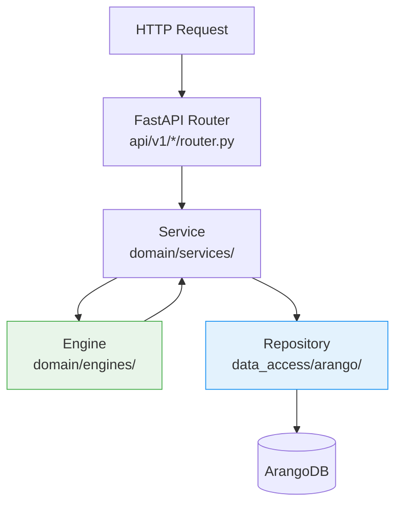

# Backend Architecture

The backend is implemented in Python 3.14+ with FastAPI. It follows a Domain-Driven Design structure with strict layer separation: API routers delegate to services, services orchestrate engines and repositories, and engines contain exclusively pure domain logic without any database access.

---

## Directory Structure

```
src/backend/app/
├── api/
│   └── v1/                  # FastAPI routers (one package per domain)
│       ├── router.py        # Root router, registers all sub-routers
│       ├── auth/            # Login, register, token refresh
│       ├── botanical_families/
│       ├── species/
│       ├── cultivars/
│       ├── sites/
│       ├── planting_runs/
│       ├── tanks/
│       ├── fertilizers/
│       ├── nutrient_plans/
│       ├── feeding_events/
│       ├── ipm/
│       ├── harvest/
│       ├── tasks/
│       ├── calendar/
│       ├── onboarding/
│       ├── tenants/
│       └── tenant_scoped/   # Tenant-isolated endpoints (/t/{slug}/...)
├── domain/
│   ├── models/              # Pydantic v2 data models
│   ├── services/            # Orchestration layer
│   ├── engines/             # Pure domain logic (no DB calls)
│   └── interfaces/          # Repository ABCs + adapter interfaces
├── data_access/
│   ├── arango/              # Repository implementations (python-arango)
│   └── external/            # External adapters (GBIF, Perenual)
├── common/
│   ├── auth.py              # FastAPI Depends for auth + tenant guard
│   ├── dependencies.py      # Dependency injection wiring
│   ├── exceptions.py        # Application-wide exception classes
│   └── error_handlers.py    # FastAPI exception handlers
├── config/
│   ├── settings.py          # Pydantic-Settings (env variables)
│   └── logging.py           # structlog configuration
├── migrations/              # Seed data (idempotent, run at startup)
└── tasks/                   # Celery background and beat tasks
```

## Layer Model



**Routers** receive HTTP requests, validate input via Pydantic, and immediately delegate to the service. No domain code in routers.

**Services** orchestrate: they call engines for calculations and validations, and repositories for database access. Services are aware of the application context (current user, tenant).

**Engines** implement pure domain logic — state machines, calculations, validation rules. They receive all data as parameters and have no database access. This makes them straightforward to test.

**Repositories** encapsulate all ArangoDB queries (AQL). They implement the repository interface (ABC from `domain/interfaces/`) and are interchangeable.

## Key Engines

| Engine | Role |
|--------|------|
| `phase_transition_engine` | Plant phase state machine — validates allowed transitions |
| `nutrient_engine` | EC calculation, mixing sequence (CalMag before sulfates) |
| `watering_schedule_engine` | Determines watering days based on weekday/interval mode |
| `safety_interval_engine` | Karenz gate: blocks harvest during active IPM treatments |
| `onboarding_engine` | Validates starter kit application, builds entity plan |
| `tank_engine` | Tank state management, EC/pH delta calculation |
| `care_reminder_engine` | 9 care style presets, seasonal multipliers, adaptive learning |
| `enrichment_engine` | Auto-fills empty fields from external sources |
| `companion_planting_engine` | Graph-based companion planting recommendation |
| `crop_rotation_validator` | 4-year crop rotation validation per plant family |

## Celery Background Tasks

Background tasks run in separate Celery worker processes. Valkey (Redis-compatible) serves as broker and result backend.

```
src/backend/app/tasks/
├── auth_tasks.py          # Token cleanup, session expiry
├── care_tasks.py          # Generate daily care reminders
├── dormancy_checks.py     # Dormancy detection for plants
├── enrichment_tasks.py    # Master data enrichment (GBIF, Perenual)
├── phase_transitions.py   # Automatic phase transitions (GDD-based)
├── tank_maintenance_tasks.py  # Tank maintenance schedule generation
├── tenant_tasks.py        # Invitation expiry, tenant cleanup
├── vernalization_updates.py   # Update vernalization hours
└── watering_tasks.py      # Daily watering tasks from watering schedule
```

### Beat Schedule (selection)

| Task | Interval | Role |
|------|----------|------|
| `generate_due_care_reminders` | daily 06:00 | Create care reminders |
| `watering-generate-tasks-daily` | daily 05:00 | Watering tasks from weekly plans |
| `auto-phase-transitions` | daily 04:00 | Check GDD-based phase transitions |
| `enrichment-sync` | weekly | Update master data from GBIF/Perenual |
| `cleanup-expired-tokens` | hourly | Delete expired refresh tokens |

## Authentication

The backend supports two auth providers, selected via `KAMERPLANTER_MODE`:

- **`FullAuthProvider`** (Full Mode): JWT Bearer token (HS256, 15 min expiry) + HttpOnly cookie for refresh token (30 days, rotating). Local accounts with bcrypt and federated login via OIDC (Authlib).
- **`LightAuthProvider`** (Light Mode): No login required. All requests are automatically assigned to the platform tenant.

JWT tokens are created and validated with `authlib.jose`. Rate limiting on login endpoints via `slowapi`.

## Error Handling

All domain exceptions inherit from `KamerplanterError` and are converted by a central exception handler into structured JSON responses:

```json
{
  "error_id": "550e8400-e29b-41d4-a716-446655440000",
  "error_code": "PLANT_NOT_FOUND",
  "message": "Plant instance 'xyz' not found.",
  "details": {}
}
```

HTTP status codes follow REST conventions: 404 for not found, 409 for conflicts (e.g. duplicate slugs), 422 for validation errors and karenz violations, 403 for missing permissions.

## Logging

Structured logging via `structlog` in JSON format (production) or colored console output (development). Every log entry contains at minimum `timestamp`, `level`, `event`, and relevant context fields such as `tenant_slug`, `user_key`, `request_id`.

## OpenAPI

FastAPI automatically generates an OpenAPI 3.1 specification at `/api/v1/docs` (Swagger UI) and `/api/v1/openapi.json`. All schemas, enums, and error types are fully documented.

## Seed Data

On startup, `main.py`'s `lifespan` function checks for existing base data and runs idempotent seed scripts:

- Botanical families, species, cultivars (YAML files under `migrations/seed_data/`)
- 9 starter kits for the onboarding wizard
- Location types (bed, greenhouse, pot, ...)
- Plant protection activities
- Demo user (`demo@kamerplanter.local`) when light mode is active

## Security Headers

The backend sets the following HTTP security headers on all responses:

| Header | Value |
|--------|-------|
| `X-Content-Type-Options` | `nosniff` |
| `X-Frame-Options` | `DENY` |
| `Referrer-Policy` | `strict-origin-when-cross-origin` |
| `Permissions-Policy` | `camera=(), microphone=(), geolocation=()` |
| `Strict-Transport-Security` | `max-age=63072000` (production only) |

## See Also

- [Database Architecture](database.md)
- [Infrastructure](infrastructure.md)
- [Architecture Overview](overview.md)
