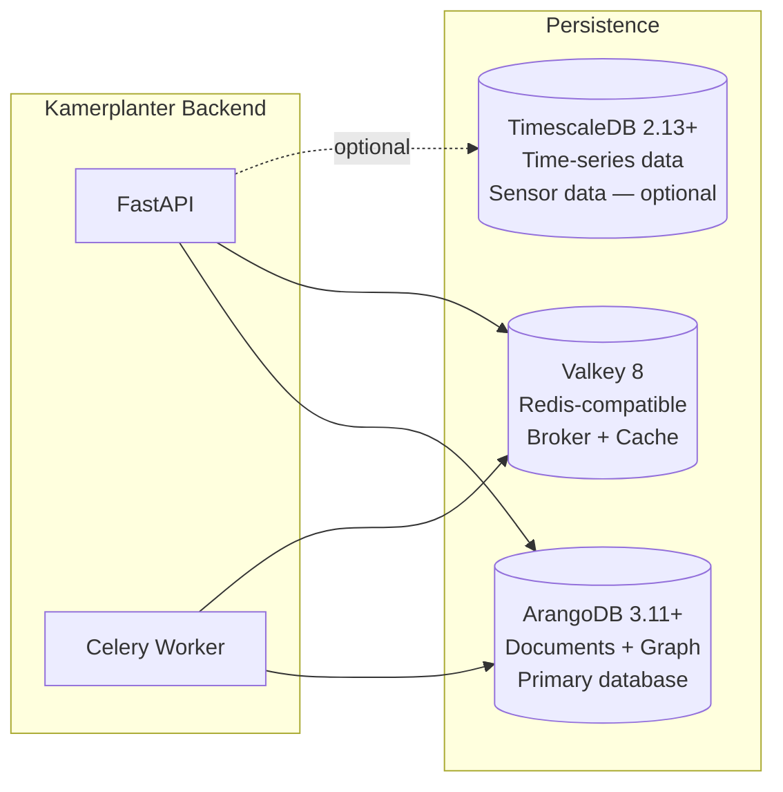
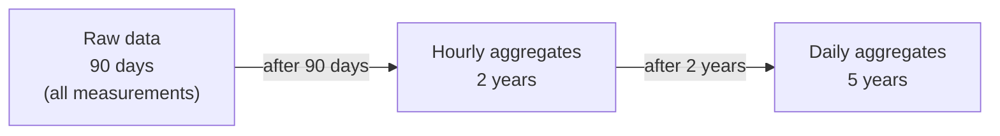

# Database Architecture

Kamerplanter uses polyglot persistence: three database types with clearly separated responsibilities. ArangoDB is the primary database handling both document and graph workloads. TimescaleDB is intended for time-series data (sensor data) and is **optionally** activatable. Valkey (Redis-compatible) serves as Celery broker and cache.

---

## Persistence Overview



| Database | Version | Usage |
|----------|---------|-------|
| ArangoDB | 3.11+ | Master data, plants, runs, auth, tenants, graph relationships |
| TimescaleDB | 2.13+ | Sensor data with automatic downsampling (optional) |
| Valkey | 8 | Celery task broker, session cache |

---

## ArangoDB — Primary Database

ArangoDB is a multi-model database: it can manage documents (like MongoDB) and graph edges (like Neo4j) in the same system and query them jointly with AQL (ArangoDB Query Language).

### Named Graph

The entire graph is called `kamerplanter_graph` and contains all edge collections.

### Document Collections

The database contains **54 document collections** and **75 edge collections**. Selected collections by domain:

**Master Data (REQ-001)**

| Collection | Content |
|-----------|---------|
| `botanical_families` | Plant families (Solanaceae, Cucurbitaceae, ...) |
| `species` | Species with growth parameters, frost sensitivity, sowing dates |
| `cultivars` | Varieties with cultivar-specific properties |
| `lifecycle_configs` | Lifecycle definitions per crop plant |
| `growth_phases` | Individual growth phases (germination, seedling, vegetative, flowering) |

**Locations & Infrastructure (REQ-002, REQ-014, REQ-019)**

| Collection | Content |
|-----------|---------|
| `sites` | Growing sites (greenhouse, garden bed, ...) with water source data |
| `locations` | Beds, rows, zones — recursive hierarchy |
| `slots` | Individual planting spots |
| `substrates` | Substrate definitions with pH/EC limits |
| `tanks` | Irrigation tanks |
| `tank_states` | Tank state snapshots |

**Plants & Runs (REQ-013)**

| Collection | Content |
|-----------|---------|
| `plant_instances` | Individual plants with phase state |
| `planting_runs` | Group management for multiple plants simultaneously |
| `planting_run_entries` | Individual plants within a run |
| `phase_histories` | Historical phase transitions with timestamps |

**Fertilization & Irrigation (REQ-004)**

| Collection | Content |
|-----------|---------|
| `fertilizers` | Fertilizers with nutrient profile (NPK, Ca, Mg, ...) |
| `nutrient_plans` | Nutrient plans with phase entries |
| `feeding_events` | Logged fertilization events |
| `watering_events` | Irrigation events |
| `watering_logs` | Unified watering log |

**IPM / Plant Protection (REQ-010)**

| Collection | Content |
|-----------|---------|
| `pests` | Pest database |
| `diseases` | Disease database |
| `treatments` | Treatment agents with pre-harvest intervals |
| `inspections` | Inspection records |
| `treatment_applications` | Completed treatments |

**Harvest (REQ-007)**

| Collection | Content |
|-----------|---------|
| `harvest_batches` | Harvest batches |
| `quality_assessments` | Quality assessments |
| `yield_metrics` | Yield data |

**Authentication & Tenants (REQ-023, REQ-024)**

| Collection | Content |
|-----------|---------|
| `users` | User accounts (local + federated) |
| `tenants` | Tenants (gardens, community gardens) |
| `memberships` | User-tenant associations with roles |
| `refresh_tokens` | Active refresh tokens |
| `api_keys` | Service account API keys |

### Edge Collections (Graph Relationships)

The graph contains **over 75 edge collections**. The most important ones by domain:

**Taxonomy & Genetics**

```
belongs_to_family    Species ──→ BotanicalFamily
has_cultivar         Species ──→ Cultivar
cloned_from          PlantInstance ──→ PlantInstance
```

**Companion Planting & Crop Rotation**

```
compatible_with      Species ──→ Species      (companion planting partners)
incompatible_with    Species ──→ Species      (incompatible combinations)
rotation_after       Species ──→ Species      (crop rotation)
adjacent_to          Location ──→ Location    (spatial proximity)
```

**Location Hierarchy**

```
contains             Location ──→ Location    (recursive: bed → row → slot)
has_slot             Location ──→ Slot
placed_in            PlantInstance ──→ Slot
grown_in             PlantingRun ──→ Location
```

**Phase State Machine**

```
current_phase        PlantInstance ──→ GrowthPhase
next_phase           GrowthPhase ──→ GrowthPhase
phase_history_edge   PhaseHistory ──→ PlantInstance
```

**Irrigation & Fertilization**

```
follows_plan         PlantingRun ──→ NutrientPlan
fed_by               PlantInstance ──→ FeedingEvent
watered_plant        WateringEvent ──→ PlantInstance
```

**Tenant Isolation**

```
belongs_to_tenant    <any resource> ──→ Tenant
has_membership       Tenant ──→ Membership
membership_in        Membership ──→ User
```

### Graph Query Examples

AQL makes it possible to combine document and graph queries:

```aql
-- All companion plants of a species
FOR partner IN 1..1 OUTBOUND 'species/tomato' compatible_with
  RETURN partner.name

-- Genetic ancestry of a plant (clone chain)
FOR ancestor IN 1..10 INBOUND 'plant_instances/plant-42' cloned_from
  RETURN ancestor

-- All plants in a location subtree
FOR slot IN 1..5 OUTBOUND 'locations/greenhouse-east' contains, has_slot
  FILTER slot._id LIKE 'slots/%'
  FOR plant IN 1..1 INBOUND slot._id placed_in
    RETURN plant
```

---

## TimescaleDB — Time-Series Data (optional)

TimescaleDB is a PostgreSQL extension that provides automatic partitioning and downsampling for time-series data. It is intended for REQ-005 (Hybrid Sensor Data) but not yet activated.

!!! note "PostgreSQL/TimescaleDB — two usage paths"
    PostgreSQL with the `pgvector` extension is **already active**: the Knowledge Service (AI Assistant, RAG pipeline) stores embedding vectors in the `ai_vector_chunks` table. This usage path is independent of the sensor data path. The sensor data hypertables (REQ-005) are optional and not yet activated.

### Planned Downsampling Schema

Sensor data is compressed in three stages to save storage space without losing long-term trends:



### Planned Hypertables

| Table | Granularity | Retention |
|-------|------------|-----------|
| `sensor_readings_raw` | Individual measurements | 90 days |
| `sensor_readings_hourly` | Hourly averages | 2 years |
| `sensor_readings_daily` | Daily averages | 5 years |

---

## Valkey — Cache & Message Broker

Valkey is a Redis-compatible key-value store (Apache 2.0 license). Kamerplanter uses it as:

**Celery Broker**: Tasks are enqueued as messages in Valkey. Workers pick up tasks and execute them. Celery Beat also writes the schedule to Valkey.

**Session Cache**: Short-lived data such as login throttling counters and OIDC state parameters are stored in Valkey with TTL.

### Connection Configuration

```
REDIS_URL=redis://kamerplanter-valkey:6379/0
```

In the Kubernetes environment, Valkey runs as its own deployment in the same namespace.

---

## Data Isolation (Multi-Tenancy)

All tenant-bound collections contain a `tenant_key` field. Queries always filter by `tenant_key`, so data from different tenants is never mixed:

```aql
FOR doc IN plant_instances
  FILTER doc.tenant_key == @tenant_key
  RETURN doc
```

Global collections (master data such as `species`, `botanical_families`, IPM databases) belong to no tenant and are readable by all.

---

## Backup & Operations

ArangoDB data is persisted via a Kubernetes `PersistentVolumeClaim` (PVC). The PVC survives pod restarts and deployments.

For production backups, `arangodump` via Kubernetes CronJob or an external backup tool at PVC level (Velero, Longhorn snapshots) is recommended.

## See Also

- [Backend Architecture](backend.md)
- [Architecture Overview](overview.md)
- [Infrastructure](infrastructure.md)
