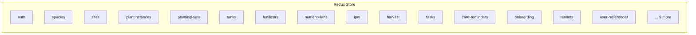

# Frontend Architecture

The frontend is a single-page application in React 19 with TypeScript 5.9 (strict mode). It communicates exclusively via REST API with the backend — no direct database connection. The user interface is bilingual (German/English) and supports light and dark themes.

---

## Tech Stack

| Technology | Version | Role |
|-----------|---------|------|
| React | 19 | UI framework |
| TypeScript | 5.9 (strict) | Type safety |
| MUI (Material UI) | 7 | Component library |
| Redux Toolkit | current | State management |
| react-router-dom | v7 | Client-side routing |
| react-i18next | current | Internationalization (DE/EN) |
| Vite | 6 | Build tool, dev server |
| Axios | current | HTTP client |
| Vitest | current | Unit tests |

## Directory Structure

```
src/frontend/src/
├── api/
│   ├── client.ts            # Axios instances (global + tenant-scoped)
│   ├── types.ts             # Shared API types
│   ├── errors.ts            # ApiError class
│   └── endpoints/           # One file per domain (sites.ts, species.ts, ...)
├── components/
│   ├── common/              # Reusable UI components
│   └── layout/              # PageTitle, Breadcrumbs, Sidebar
├── config/
│   └── fieldConfigs.ts      # Declarative field visibility (REQ-021)
├── hooks/                   # Custom React hooks
├── i18n/
│   └── locales/
│       ├── de/translation.json
│       └── en/translation.json
├── layouts/
│   └── Sidebar.tsx          # Navigation sidebar (tiered by expertise level)
├── pages/                   # Pages, organized by domain
│   ├── stammdaten/          # Botanical families, species, cultivars
│   ├── standorte/           # Sites, locations, slots, substrates, tanks
│   ├── pflanzen/            # Plant instances, growth phases
│   ├── durchlaeufe/         # Planting runs
│   ├── duengung/            # Fertilizers, nutrient plans, feeding events
│   ├── ernte/               # Harvest batches
│   ├── aufgaben/            # Tasks, workflows
│   ├── pflanzenschutz/      # IPM pests, treatments
│   ├── pflege/              # Care reminders
│   ├── kalender/            # Calendar view
│   ├── giessprotokoll/      # Watering log
│   ├── onboarding/          # Onboarding wizard (REQ-020)
│   ├── auth/                # Login, registration, account settings
│   ├── admin/               # Platform admin
│   └── tenants/             # Tenant management
├── routes/
│   ├── AppRoutes.tsx        # Route definitions
│   └── breadcrumbs.ts       # Breadcrumb mapping
├── store/
│   ├── store.ts             # Redux store configuration
│   ├── hooks.ts             # useAppDispatch, useAppSelector
│   └── slices/              # Redux slices (one per domain)
├── theme/                   # MUI theme (colors, typography)
└── validation/              # Zod validation schemas
```

## State Management (Redux Toolkit)

The Redux store contains 24 slices, one per domain area:



Each slice manages its own loading, error, and data state. Async operations use `createAsyncThunk` with `pending/fulfilled/rejected` states.

## API Clients

There are two Axios instances:

**`client`** — for global endpoints (`/api/v1/...`):
```
/api/v1/species/
/api/v1/botanical-families/
/api/v1/auth/login
```

**`tenantClient`** — for tenant-isolated endpoints: Automatically prepends `/t/{slug}` to the URL, where `slug` is read from `localStorage` (`kp_active_tenant_slug`):
```
/api/v1/t/my-garden/sites/
/api/v1/t/my-garden/planting-runs/
```

Both clients have a response interceptor that creates structured `ApiError` objects from backend error responses.

## Routing

react-router-dom v7 with nested routes. All routes are centralized in `AppRoutes.tsx`. Breadcrumbs are mapped from `breadcrumbs.ts`.

```
/                          → Dashboard
/stammdaten/               → Master data overview
/stammdaten/species/:key   → Species detail
/standorte/                → Locations
/standorte/sites/:key      → Site detail
/pflanzen/:key             → Plant instance detail
/durchlaeufe/:key          → Planting run detail
/duengung/                 → Fertilization overview
/ernte/                    → Harvest overview
/aufgaben/                 → Tasks
/onboarding                → Onboarding wizard
/settings/account          → Account settings (5 tabs)
/admin/                    → Platform admin (platform admins only)
/t/:slug/settings          → Tenant settings
```

## Expertise Levels (REQ-021)

The sidebar and forms adapt to the user's expertise level:

- **Beginner**: 5 navigation entries, simplified forms
- **Intermediate**: 8 navigation entries, extended fields visible
- **Expert**: Full navigation, all fields

Field visibility is controlled via `fieldConfigs.ts` — a declarative configuration that defines per field at which expertise level it appears. `ExpertiseFieldWrapper` and `ShowAllFieldsToggle` implement this in the UI. The setting is stored in `UserPreferences` and managed via `userPreferencesSlice`.

## Internationalization

All visible texts use i18n keys. German is the default language. Key schema:

| Context | Schema | Example |
|---------|--------|---------|
| Page texts | `pages.<section>.<key>` | `pages.stammdaten.title` |
| Enum values | `enums.<enum>.<value>` | `enums.plantPhase.flowering` |
| General | `common.<key>` | `common.save` |

## Theme & Branding

MUI 7 with a customized theme:

- **Primary color**: `#4CAF50` (Vibrant Green, UI-NFR-009)
- **Accent color**: `#8D6E63` (Earth tone/Terracotta)
- **Light/Dark mode**: Switchable, persisted in `localStorage`
- **Typography**: Roboto (text), Roboto Mono (code)

## Testing

Tests with Vitest and React Testing Library. 198 tests, ESLint clean, TypeScript strict clean.

Key conventions for tests:

- Test helpers in `src/test/helpers.tsx`
- Mock handlers (MSW) in `src/test/mocks/handlers.ts`
- Any component using `useExpertiseLevel` needs the `userPreferences` reducer in the test store
- Custom hooks returning objects/arrays MUST wrap the return value with `useMemo` to stabilize references

## Build & Dev Server

```bash
# Development (Vite dev server, port 5173)
npm run dev

# Production build
npm run build

# Tests
npm run test
```

The Vite dev server automatically proxies `/api` requests to `localhost:8000` (backend).

## See Also

- [Architecture Overview](overview.md)
- [Backend Architecture](backend.md)
