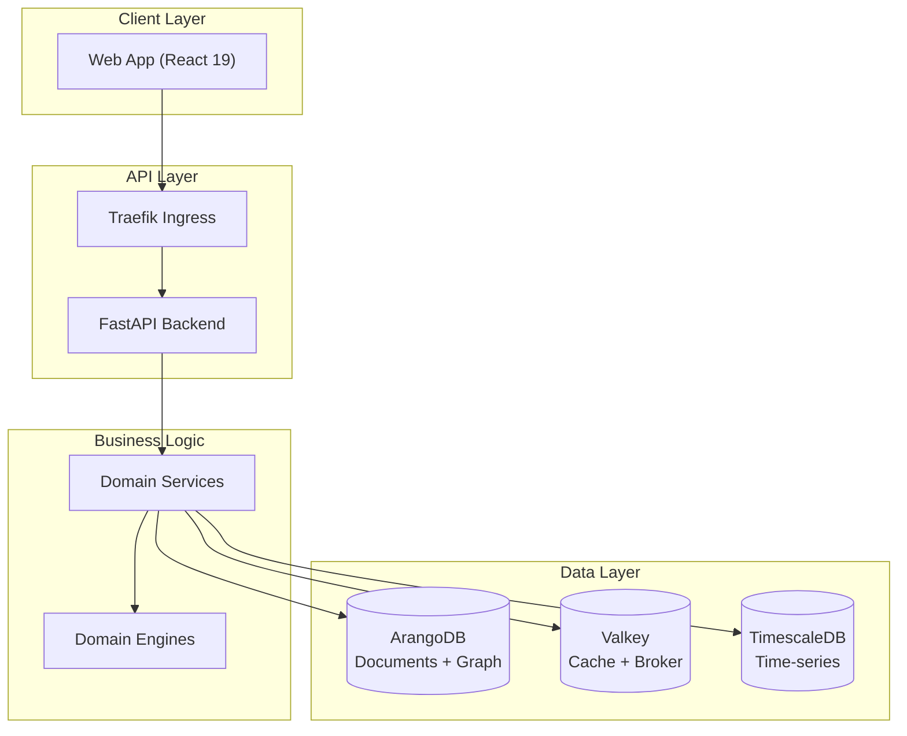

# Architecture

Kamerplanter follows a strict 5-layer architecture with polyglot persistence.

## Architecture overview

<!-- diagram-source: user-described — high-level 5-layer architecture: client -> API -> business logic -> polyglot persistence -->

## In This Section

- [Overview](overview.md) — Layer model and design principles
- [Backend](backend.md) — FastAPI, Celery, domain models
- [Frontend](frontend.md) — React, Redux, MUI
- [Database](database.md) — ArangoDB collections and graph schema
- [Infrastructure](infrastructure.md) — Kubernetes, Helm, networking
