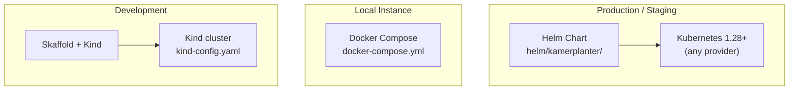
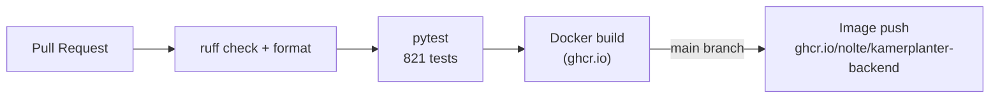
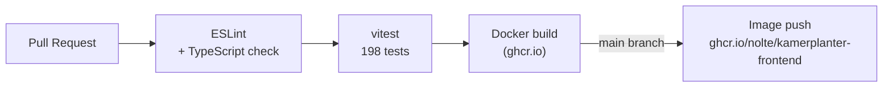
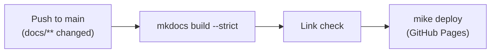

# Infrastructure

Kamerplanter runs on Kubernetes and can alternatively be operated with Docker Compose. For development, Skaffold with a local Kind cluster is the primary workflow. This document describes all operating variants and the CI/CD pipeline.

---

## Deployment Variants at a Glance



---

## Kubernetes (Production)

### Helm Chart

The Helm chart lives under `helm/kamerplanter/` and is based on the [bjw-s common library](https://bjw-s-helm-charts.pages.dev/docs/common-library/). This library standardizes deployment definitions and avoids boilerplate.

```
helm/kamerplanter/
├── Chart.yaml
├── Chart.lock
├── values.yaml          # Production defaults
├── values-dev.yaml      # Development overrides (Skaffold)
├── charts/              # Dependencies (bjw-s common, ArangoDB, Valkey)
└── templates/           # Helm templates (Ingress, ConfigMaps, ...)
```

### Container Images

| Component | Image |
|-----------|-------|
| Backend | `ghcr.io/nolte/kamerplanter-backend:latest` |
| Frontend | `ghcr.io/nolte/kamerplanter-frontend:latest` |

Images are built via GitHub Actions and published to the GitHub Container Registry (ghcr.io).

### Kubernetes Resources

Deployed per component:

**Backend (FastAPI)**
- `Deployment` with 2 replicas, RollingUpdate (1 surge, 0 unavailable)
- Liveness probe: `GET /api/v1/health/live`
- Readiness probe: `GET /api/v1/health/ready`
- Resources: 250m CPU / 256Mi memory (request), 1 CPU / 512Mi (limit)

**Frontend (nginx)**
- `Deployment` with 2 replicas, RollingUpdate
- Liveness probe: `GET /`
- Resources: 50m CPU / 64Mi memory (request), 200m / 128Mi (limit)

**ArangoDB**
- `StatefulSet` with `PersistentVolumeClaim` for data persistence
- Port 8529

**Valkey**
- `StatefulSet` with `PersistentVolumeClaim` (1Gi in dev)
- Port 6379

**Celery Worker + Beat**
- One `Deployment` each without replica scaling (Worker: 1, Beat: 1)
- Same image as backend, different start command (`celery ... worker` or `celery ... beat`)

### Ingress (Traefik)

Traefik handles TLS termination and routing:

```
https://kamerplanter.example.com        → Frontend (port 80)
https://kamerplanter.example.com/api/  → Backend (port 8000)
```

TLS certificates are provided via cert-manager or manually.

### Health Endpoints

| Endpoint | Purpose |
|---------|---------|
| `GET /api/v1/health/live` | Liveness: backend process is running |
| `GET /api/v1/health/ready` | Readiness: ArangoDB connected, data loaded |
| `GET /api/health` | Root-level health for M2M clients (Home Assistant) |

---

## Docker Compose (Quick Start)

For quick evaluations and local single installations without Kubernetes. All 6 services in one file:

```yaml
# Services in docker-compose.yml
arangodb        # Port 8529
valkey          # Port 6379
backend         # Port 8000 (FastAPI, KAMERPLANTER_MODE=light)
celery-worker   # Background tasks
celery-beat     # Scheduled tasks
frontend        # Port 8080 (nginx)
```

### Quick Start

```bash
cp .env.example .env     # Set passwords
docker-compose up -d     # Start all services
# Frontend accessible at http://localhost:8080
```

Credentials are read from `.env` — no hardcoded passwords in `docker-compose.yml`.

---

## Skaffold + Kind (Development)

### Prerequisites

- [Skaffold](https://skaffold.dev/) >= v2
- [Kind](https://kind.sigs.k8s.io/) (Kubernetes in Docker)
- Docker or Podman
- Node.js 25.1.0 (asdf `.tool-versions` in the frontend directory)

### Create Cluster

```bash
kind create cluster --config kind-config.yaml
```

### Development Workflow

```bash
# Start all components (backend + frontend)
skaffold dev

# Backend only
skaffold dev --profile=backend-only

# Frontend only
skaffold dev --profile=frontend-only

# Debug mode (debugpy enabled)
skaffold debug
```

Skaffold handles:
1. Building Docker images locally (`Dockerfile.dev`)
2. Loading images into the Kind cluster (no push to a registry needed)
3. Deploying the Helm chart (`helm/kamerplanter/values-dev.yaml`)
4. File sync: Changed `.py`, `.ts`, and `.tsx` files are copied directly into running containers — no full rebuild needed

### Port Forwarding

Skaffold sets up the following port forwardings:

| Service | Cluster Port | Local Port |
|---------|-------------|-----------|
| Backend | 8000 | 8000 |
| Frontend | 5173 | 3000 |
| ArangoDB | 8529 | 8529 |
| Home Assistant | 8123 | 8123 |

### Skaffold Profiles and Modules

The `skaffold.yaml` contains two configurations: the main configuration (backend + frontend) with profiles and a separate **KI module** for the Knowledge/AI stack.

| Profile / Module | Command | Components |
|-----------------|---------|------------|
| (default) | `skaffold dev` | Backend + Frontend |
| `backend-only` | `skaffold dev -p backend-only` | Backend only, no frontend image build |
| `frontend-only` | `skaffold dev -p frontend-only` | Frontend only, no backend image build |
| `debug` | `skaffold debug` | Backend with debugpy (remote debugging port 5678) |
| **`ki`** (module) | `skaffold dev -m ki` | Knowledge Service, Embedding Service, VectorDB (TimescaleDB + pgvector) |

#### KI Module

The KI module (`-m ki`) is a standalone Skaffold configuration in the same `skaffold.yaml`. It deploys the RAG/AI stack independently from the main application:

- **Knowledge Service** — RAG API with knowledge base ingestion (port `8090`)
- **Embedding Service** — Vector embedding via ONNX (port `8080`)
- **VectorDB** — TimescaleDB with pgvector extension (port `5433`)

```bash
# Main app + KI stack simultaneously
skaffold dev -m kamerplanter,ki --port-forward

# KI stack only (e.g. for RAG development)
skaffold dev -m ki --port-forward
```

| Service | Cluster Port | Local Port |
|---------|-------------|-----------|
| VectorDB (TimescaleDB) | 5432 | 5433 |
| Knowledge Service | 8000 | 8090 |
| Embedding Service | 8080 | 8080 |

!!! warning "Skaffold is the only development workflow"
    No manual `docker build`, `docker push`, or `kubectl apply`. Skaffold handles everything. Direct `kubectl` patching of deployments will be overwritten on the next `skaffold dev` run.

---

## Home Assistant Integration

The HA custom component lives under `src/ha-integration/custom_components/kamerplanter/`. It is **not** automatically deployed by Skaffold, as it must be copied into the HA pod:

```bash
# 1. Copy files into the pod
kubectl cp src/ha-integration/custom_components/kamerplanter/ \
  default/homeassistant-0:/config/custom_components/kamerplanter/

# 2. Delete Python cache (important! otherwise HA loads old bytecode)
kubectl exec -n default homeassistant-0 -- \
  rm -rf /config/custom_components/kamerplanter/__pycache__

# 3. Restart pod (PVC is preserved)
kubectl delete pod homeassistant-0 -n default
```

---

## CI/CD (GitHub Actions)

### Workflows

```
.github/workflows/
├── docs.yml      # Build and deploy documentation
├── backend.yml   # pytest, ruff, Docker image build
└── frontend.yml  # vitest, ESLint, Docker image build
```

### Backend Pipeline



### Frontend Pipeline



### Documentation Pipeline



---

## Environment Variables

All configuration is done via environment variables. The most important ones:

| Variable | Default | Description |
|---------|---------|-------------|
| `ARANGODB_HOST` | `localhost` | ArangoDB hostname |
| `ARANGODB_PORT` | `8529` | ArangoDB port |
| `ARANGODB_DATABASE` | `kamerplanter` | Database name |
| `REDIS_URL` | `redis://localhost:6379/0` | Valkey/Redis URL |
| `KAMERPLANTER_MODE` | `full` | `full` or `light` |
| `JWT_SECRET_KEY` | (no default!) | JWT signing key — set in production! |
| `CORS_ORIGINS` | `["http://localhost:3000"]` | Allowed CORS origins (JSON array) |
| `DEBUG` | `false` | Debug mode (no HSTS, colored logs) |
| `REQUIRE_EMAIL_VERIFICATION` | `false` | Enforce email verification |
| `PERENUAL_API_KEY` | `""` | API key for Perenual master data enrichment |

!!! danger "Set JWT_SECRET_KEY in production"
    The default value `change-me-in-production-use-openssl-rand-hex-32` must never be used in production environments. Generate a secure key:
    ```bash
    openssl rand -hex 32
    ```

---

## Renovate (Dependency Updates)

Dependency updates are automatically created as pull requests via [Renovate](https://github.com/renovatebot/renovate). The configuration lives in `renovate.json5`.

## See Also

- [Local Development](../development/local-setup.md)
- [Kubernetes Deployment](../deployment/kubernetes.md)
- [Architecture Overview](overview.md)
