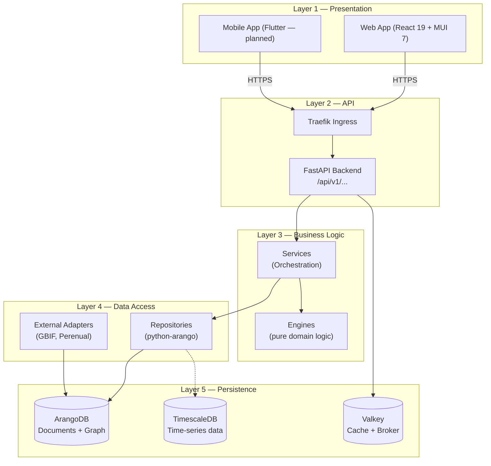
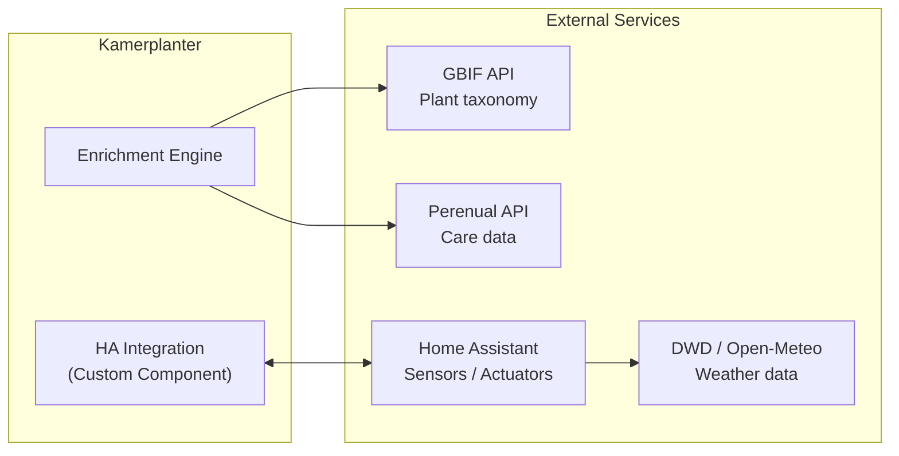

# Architecture Overview

Kamerplanter is an agro-tech platform for plant lifecycle management. The architecture is designed for extensibility, data security, and clear separation of concerns. This document provides the big picture — the detail pages cover each individual layer.

---

## 5-Layer Architecture (NFR-001)

The system follows a strict 5-layer architecture. Each layer only knows the layer directly below it — skipping layers is not allowed. The frontend **never** accesses the database directly.



## Runtime Components

| Component | Technology | Role |
|-----------|-----------|------|
| Web App | React 19, TypeScript 5.9, MUI 7 | User interface |
| Backend API | Python 3.14+, FastAPI >= 0.115 | REST endpoints, JWT auth, OpenAPI |
| Celery Worker | Celery >= 5.4 | Background tasks (enrichment, reminders) |
| Celery Beat | Celery Beat | Scheduled tasks (daily, hourly) |
| ArangoDB | ArangoDB 3.11+ | Primary database — documents and graph |
| TimescaleDB | TimescaleDB 2.13+ | Sensor data (time-series, future) |
| Valkey | Valkey 8 (Redis-compatible) | Celery broker + cache |
| Traefik | Traefik Ingress | TLS termination, routing |

## Deployment Variants

### Kubernetes (Production)

Container images from `ghcr.io/nolte/kamerplanter-{backend,frontend}`, deployed via Helm chart based on the [bjw-s common library](https://bjw-s-helm-charts.pages.dev/docs/common-library/). The chart lives under `helm/kamerplanter/`.

### Docker Compose (Quick Start)

For quick local instances without Kubernetes. All services in a single `docker-compose.yml` — ideal for demos and evaluation.

### Skaffold + Kind (Development)

The primary development workflow. Skaffold handles image building, hot-reload via file sync, and deployment into a local Kind cluster. No manual `kubectl apply` required.

## Authentication & Multi-Tenancy

Kamerplanter supports multiple operating modes:

- **Full Mode**: Complete auth with JWT tokens (15 min expiry), HttpOnly cookie for refresh token (30 days). Local accounts (bcrypt) and federated login (OIDC). Multi-tenant routing at `/api/v1/t/{tenant_slug}/`.
- **Light Mode** (REQ-027): For local single installations without auth overhead. A platform tenant is created automatically.

## Mode Switch

The mode is controlled via the `KAMERPLANTER_MODE` environment variable:

```
KAMERPLANTER_MODE=light   # Anonymous access, no login
KAMERPLANTER_MODE=full    # Full auth (default)
```

## External Integrations



## See Also

- [Backend Architecture](backend.md) — layered structure, engines, Celery
- [Frontend Architecture](frontend.md) — React, Redux, routing
- [Database Architecture](database.md) — ArangoDB graph, polyglot persistence
- [Infrastructure](infrastructure.md) — Kubernetes, Helm, Skaffold, CI/CD
