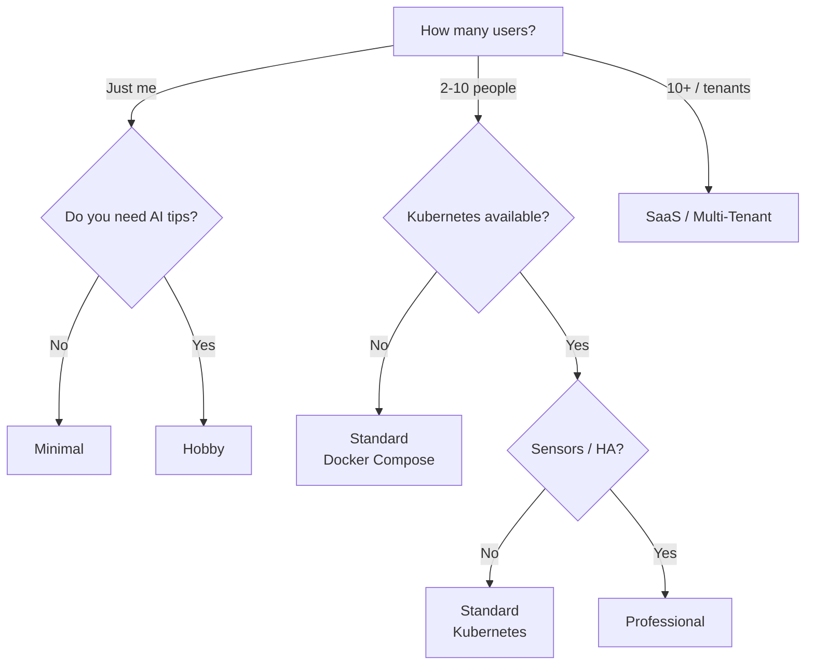

# Deployment Profiles

Kamerplanter is modular by design. You decide which components to run — from a lean setup on a Raspberry Pi to a full multi-tenant deployment on Kubernetes. This page helps you find the right **bundle** of components for your use case.

!!! tip "Complete feature-by-feature reference"
    This page shows five recommended bundles for typical use cases. For an exhaustive table of all ~40 features with the exact environment variable, mandatory secrets, and resource impact, see the [Configuration Matrix](konfigurationsmatrix.md).

---

## Component Overview

Every Kamerplanter installation consists of a **core** (always required) and **optional components** that you enable as needed.

### Core (always active)

| Component | Purpose |
|-----------|---------|
| **Backend** (FastAPI) | REST API, business logic, phase control, fertilization plans |
| **Frontend** (React) | Web interface |
| **ArangoDB** | Primary database (documents + graph queries) |
| **Valkey** (Redis-compatible) | Cache and Celery broker |
| **Celery Worker + Beat** | Background tasks (care reminders, data enrichment, AI tips) |

### Optional Components

| Component | Purpose | Resource requirements | Configuration |
|-----------|---------|----------------------|---------------|
| **Operating mode** | `light` = no login, single user; `full` = JWT auth, multi-tenant | — | `KAMERPLANTER_MODE` |
| **AI assistant** (backend side) | Unlocks the `/ai/*` endpoints, care tips, diagnostics, glossary | 128 MB – 2 GB RAM (backend, without the LLM) | `AI_FEATURES_ENABLED` + `KNOWLEDGE_SERVICE_ENABLED`/`KNOWLEDGE_SERVICE_URL` |
| **Ollama** | Local language model execution (no data leaves your network) | 4–16 GB RAM, optional GPU | Docker profile `ollama`; `LLM_PROVIDER=ollama` **on the Knowledge Service** |
| **Knowledge Service** | RAG pipeline: search knowledge base, connect the LLM provider, enrich context | 128 MB – 512 MB RAM | Dedicated Helm controller (`controllers.knowledge-service`), no pre-stubbed `enabled` flag in `values.yaml` — the operator supplies the full block |
| **VectorDB** (pgvector) | Vector store for RAG embeddings **and** for the plant/pest recognition reference index (REQ-029-A) | 128 MB – 512 MB RAM | `controllers.vectordb.enabled` (pre-defined in `values.yaml`, defaults to `false`) |
| **Embedding Service** | ONNX-based embedding computation (no PyTorch) | 1.5–4 GB RAM | Dedicated Helm controller (`controllers.embedding-service`), no pre-stubbed `enabled` flag |
| **Reranker Service** | Cross-encoder re-ranking for higher RAG precision (ADR-007) | 1.5–4 GB RAM | `RERANKER_URL` **on the Knowledge Service** (empty = disabled) |
| **TimescaleDB** | Time-series sensor data, automatic downsampling | 256–512 MB RAM | `TIMESCALEDB_ENABLED` |
| **Home Assistant** | Sensor and actuator integration (temperature, humidity, lights) | External | `HA_URL` + `HA_ACCESS_TOKEN` |
| **External enrichment** | Auto-enrich plant data from GBIF and Perenual | — | `PERENUAL_API_KEY` |

!!! info "AI assistant — operator switch and provider choice are separate"
    `AI_FEATURES_ENABLED` is a pure **backend switch** (stage 1 of the three-stage unlock mechanism, see [For Technical Users / Self-Hosters](../user-guide/ai-assistant.md#fuer-technische-nutzer-self-hoster)): `false` makes all `/ai/*` endpoints answer with HTTP 404. It does **not** decide which language model is used — that is `LLM_PROVIDER` (`ollama`, `anthropic`, `openai_compatible`) **on the standalone Knowledge Service** (`src/knowledge-service/`), not on the backend. There is no `AI_DEFAULT_PROVIDER`, no `AI_OLLAMA_URL`/`AI_OLLAMA_MODEL`, and no `AI_FALLBACK_PROVIDER` on the backend — these variables, documented here previously, do not exist in the code. Details: [AI Provider Setup](../user-guide/ai-providers.md), [Environment Variables — AI Assistant](../reference/environment-variables.md#ki-assistent).

---

## Profiles at a Glance

The following matrix shows five predefined profiles. Each profile is a recommendation — you can always add or remove individual components.

| | Minimal | Hobby | Standard | Professional | SaaS |
|---|:---:|:---:|:---:|:---:|:---:|
| **Infrastructure** | Docker Compose | Docker Compose | Docker Compose / K8s | Kubernetes | Kubernetes |
| **Operating mode** | Light | Light | Full | Full | Full |
| **AI assistant** | — | Ollama (local) | Ollama (local) | Ollama (local) | Cloud (OpenAI / Anthropic) |
| **Knowledge Service + Embedding Service + VectorDB** | — | Yes (required bundle for Ollama) | Yes (required bundle for Ollama) | Yes | Yes |
| **Reranker Service** | — | — | Optional | Optional | Yes |
| **TimescaleDB** | — | — | Optional | Yes | Yes |
| **Home Assistant** | — | Optional | Optional | Yes | Optional |
| **External enrichment** | — | Optional | Yes | Yes | Yes |
| **Celery Worker** | Yes | Yes | Yes | Yes | Yes |
| **Target audience** | Raspberry Pi, quick trial | Hobby grower, home server | Engaged hobbyists, small community gardens | Indoor growing, large community gardens | Managed hosting, multiple tenants |
| **Total RAM** | ~1 GB | ~3 GB | ~4 GB | ~6 GB | ~8 GB |

---

## Minimal

### Target audience

You want to try Kamerplanter quickly or only have a few houseplants. A Raspberry Pi 4/5 or an old laptop is sufficient. You need neither login nor AI.

### Requirements

- Docker + Docker Compose
- 1 GB free RAM, 2 GB disk space
- Raspberry Pi 4 (2 GB), Raspberry Pi 5, NUC, laptop

### Active components

- [x] Backend + Frontend
- [x] ArangoDB + Valkey
- [x] Celery Worker + Beat
- [ ] AI assistant
- [ ] TimescaleDB
- [ ] Home Assistant
- [ ] Knowledge Service / RAG

### Example configuration

```yaml title="docker-compose.yml (excerpt)"
services:
  arangodb:
    image: arangodb:3.11
    # ...

  valkey:
    image: valkey/valkey:8-alpine
    # ...

  backend:
    build: ./src/backend
    environment:
      KAMERPLANTER_MODE: light
      AI_FEATURES_ENABLED: "false"
      TIMESCALEDB_ENABLED: "false"
    depends_on: [arangodb, valkey]

  celery-worker:
    build: ./src/backend
    command: celery -A app.tasks worker --loglevel=info
    depends_on: [arangodb, valkey]

  celery-beat:
    build: ./src/backend
    command: celery -A app.tasks beat --loglevel=info
    depends_on: [arangodb, valkey]

  frontend:
    build: ./src/frontend
    environment:
      KAMERPLANTER_MODE: light
    depends_on: [backend]
```

### What you gain by upgrading

Without the AI assistant you get no automatic care tips or diagnostics. You can add Ollama at any time without losing data.

---

## Hobby

### Target audience

You have 10–50 plants and a home server (NAS, old desktop, NUC). You want AI-powered care tips, but your data should not leave your network. You do not need login — you are the only user.

### Requirements

- Docker + Docker Compose
- 6–8 GB free RAM for the AI stack (Ollama model + Knowledge/Embedding Service/VectorDB overhead — see [Configuration Matrix](konfigurationsmatrix.md#ki-assistent-req-031)), more with a 7B model, optional GPU
- Home server, NUC, desktop PC

### Active components

- [x] Backend + Frontend
- [x] ArangoDB + Valkey
- [x] Celery Worker + Beat
- [x] Ollama (local language model)
- [x] Knowledge Service + Embedding Service + VectorDB (required so the AI assistant can actually reach Ollama)
- [ ] TimescaleDB
- [ ] Home Assistant (optional)
- [ ] External enrichment (optional)

!!! note "Ollama alone is not enough"
    The backend **never** talks to Ollama directly. The provider connection (`LLM_PROVIDER`) lives on the **Knowledge Service** — it calls Ollama and returns the result to the backend via `KNOWLEDGE_SERVICE_URL`. Without a running Knowledge Service (+ Embedding Service for similarity search, + VectorDB as the vector store), the AI endpoints stay non-functional even if Ollama is running.

### Example configuration

```yaml title="docker-compose.yml (excerpt)"
services:
  # ... core as in Minimal ...

  backend:
    build: ./src/backend
    environment:
      KAMERPLANTER_MODE: light
      AI_FEATURES_ENABLED: "true"
      KNOWLEDGE_SERVICE_ENABLED: "true"
      KNOWLEDGE_SERVICE_URL: http://knowledge-service:8000
      INTERNAL_SERVICE_TOKEN: ${INTERNAL_SERVICE_TOKEN}  # openssl rand -hex 32
      TIMESCALEDB_ENABLED: "false"
    depends_on: [arangodb, valkey]

  knowledge-service:
    build: ./src/knowledge-service
    environment:
      LLM_PROVIDER: ollama
      LLM_API_URL: http://ollama:11434
      LLM_MODEL: gemma3:4b
      EMBEDDING_SERVICE_URL: http://embedding-service:8080
      VECTORDB_HOST: vectordb
      INTERNAL_SERVICE_TOKEN: ${INTERNAL_SERVICE_TOKEN}
    depends_on: [ollama, embedding-service, vectordb]

  embedding-service:
    build: ./docker/embedding-service

  vectordb:
    build: ./docker/vectordb

  ollama:
    image: ollama/ollama:latest
    volumes:
      - ollama_models:/models
    # GPU passthrough (optional):
    # deploy:
    #   resources:
    #     reservations:
    #       devices:
    #         - capabilities: [gpu]
```

!!! tip "Model selection"
    Start with `gemma3:4b` — it runs on most machines from 2020 onwards without a GPU. For details on model selection, see [AI Provider Setup](../user-guide/ai-providers.md#ollama-local-recommended).

### What you gain by upgrading

Without full mode you cannot invite additional users. Without TimescaleDB, sensor data is not stored long-term. Both can be enabled later.

---

## Standard

### Target audience

You are an engaged hobbyist or run a small community garden. Multiple people should have their own accounts. You want AI tips and optionally store sensor data long-term.

### Requirements

- Docker Compose or Kubernetes cluster
- 6–8 GB free RAM (AI stack as in the Hobby profile above)
- Server, NUC, or small K8s cluster

### Active components

- [x] Backend + Frontend
- [x] ArangoDB + Valkey
- [x] Celery Worker + Beat
- [x] Ollama + Knowledge Service + Embedding Service + VectorDB (AI stack as a bundle, see the Hobby profile)
- [x] External enrichment (GBIF + Perenual)
- [ ] Reranker Service (optional — higher RAG precision)
- [ ] TimescaleDB (optional)
- [ ] Home Assistant (optional)

### Example configuration

=== "Docker Compose"

    ```yaml title="docker-compose.yml (excerpt)"
    services:
      # ... core + Ollama + Knowledge Service + Embedding Service + VectorDB (see the Hobby profile) ...

      backend:
        build: ./src/backend
        environment:
          KAMERPLANTER_MODE: full
          AI_FEATURES_ENABLED: "true"
          KNOWLEDGE_SERVICE_ENABLED: "true"
          KNOWLEDGE_SERVICE_URL: http://knowledge-service:8000
          INTERNAL_SERVICE_TOKEN: ${INTERNAL_SERVICE_TOKEN}
          JWT_SECRET_KEY: ${JWT_SECRET_KEY}  # openssl rand -hex 32
          PERENUAL_API_KEY: ${PERENUAL_API_KEY}
          TIMESCALEDB_ENABLED: ${TIMESCALEDB_ENABLED:-false}
        depends_on: [arangodb, valkey]
    ```

=== "Helm Values"

    ```yaml title="values.yaml (excerpt)"
    controllers:
      backend:
        containers:
          main:
            env:
              KAMERPLANTER_MODE: full
              AI_FEATURES_ENABLED: "true"
              KNOWLEDGE_SERVICE_ENABLED: "true"
              KNOWLEDGE_SERVICE_URL: "http://kamerplanter-knowledge-service:8000"
              TIMESCALEDB_ENABLED: "false"
      knowledge-service:
        enabled: true
        containers:
          main:
            env:
              LLM_PROVIDER: ollama
              LLM_API_URL: "http://kamerplanter-ollama:11434"
              LLM_MODEL: gemma3:4b
    ```

!!! note "TimescaleDB only needed with sensors"
    If you do not plan to connect sensors or Home Assistant, you can skip TimescaleDB. Manual measurements (pH, EC) are stored in ArangoDB. TimescaleDB becomes useful only with automatic, high-frequency data collection.

### What you gain by upgrading

Without TimescaleDB there is no automatic downsampling of sensor data. Without Home Assistant there is no automatic sensor collection or actuator control. Without the Reranker Service, RAG answer quality is somewhat lower (plain hybrid search instead of cross-encoder re-ranking).

---

## Professional

### Target audience

You run professional indoor growing or a large community garden with role management. Sensors and actuators are connected via Home Assistant. You want seamless time-series storage and AI diagnostics with the full RAG context (re-ranking for higher hit quality).

!!! info "No automatic cloud fallback"
    The Knowledge Service uses **one** configured `LLM_PROVIDER` (`ollama`, `anthropic`, or `openai_compatible`) — there is no automatic runtime fallback from Ollama to a cloud provider if it becomes unreachable. Switching providers is a deliberate configuration change (a Knowledge Service redeploy). If Ollama is unreachable, the AI assistant reports an error — the rest of the application is unaffected.

### Requirements

- Kubernetes cluster (3+ nodes recommended)
- 6–8 GB RAM for Kamerplanter pods
- Home Assistant instance on the network
- Optional: GPU node for faster AI inference

### Active components

- [x] Backend + Frontend
- [x] ArangoDB + Valkey
- [x] Celery Worker + Beat
- [x] Ollama (local language model, `mistral:7b`)
- [x] Knowledge Service + VectorDB + Embedding Service
- [x] Reranker Service (cross-encoder re-ranking)
- [x] TimescaleDB
- [x] Home Assistant
- [x] External enrichment (GBIF + Perenual)

### Example configuration

```yaml title="values.yaml (excerpt)"
controllers:
  backend:
    containers:
      main:
        env:
          KAMERPLANTER_MODE: full
          AI_FEATURES_ENABLED: "true"
          KNOWLEDGE_SERVICE_ENABLED: "true"
          KNOWLEDGE_SERVICE_URL: "http://kamerplanter-knowledge-service:8000"
          TIMESCALEDB_ENABLED: "true"
          TIMESCALEDB_HOST: timescaledb
          HA_URL: http://homeassistant.home:8123
          HA_ACCESS_TOKEN:
            secretKeyRef:
              name: kamerplanter-secrets
              key: ha-access-token
          PERENUAL_API_KEY:
            secretKeyRef:
              name: kamerplanter-secrets
              key: perenual-api-key
        envFrom:
          - secret: kamerplanter-secrets  # carries INTERNAL_SERVICE_TOKEN (mandatory from here on), among others

  timescaledb:
    enabled: true

  knowledge-service:
    enabled: true
    containers:
      main:
        env:
          LLM_PROVIDER: ollama
          LLM_API_URL: "http://kamerplanter-ollama:11434"
          LLM_MODEL: mistral:7b
          RERANKER_URL: "http://kamerplanter-reranker-service:8081"
          RERANKER_INITIAL_K: "20"
          RERANKER_TOP_K: "5"

  reranker-service:
    enabled: true
    containers:
      main:
        env:
          RERANKER_MODEL: "bge-reranker-v2-m3"

  embedding-service:
    enabled: true

  vectordb:
    enabled: true
```

!!! warning "Keep secrets out of values.yaml"
    API keys and tokens belong in Kubernetes Secrets or an external secret manager (e.g., Sealed Secrets, External Secrets Operator). Use `secretKeyRef` in the Helm values.

### What you gain by upgrading

In the Professional profile you run a single instance for your organization with a local language model. The SaaS profile adds multi-tenant isolation, horizontal scaling, and a cloud language-model provider in place of Ollama.

---

## SaaS / Multi-Tenant

### Target audience

You operate Kamerplanter as a platform for multiple independent tenants (gardens, businesses, communities). Each tenant has its own data, roles, and settings. You need horizontal scaling and reliable cloud AI.

### Requirements

- Kubernetes cluster with autoscaling
- 8+ GB RAM for Kamerplanter pods
- Managed database services recommended (ArangoDB Oasis, managed PostgreSQL)
- Cloud AI provider account (OpenAI or Anthropic)

### Active components

- [x] Backend + Frontend (multiple replicas)
- [x] ArangoDB + Valkey
- [x] Celery Worker (multiple replicas) + Beat
- [x] Cloud language model (Anthropic or an OpenAI-compatible endpoint) instead of Ollama
- [x] Knowledge Service + VectorDB + Embedding Service
- [x] TimescaleDB
- [x] External enrichment (GBIF + Perenual)
- [ ] Home Assistant (optional, tenant-specific)

### Example configuration

```yaml title="values.yaml (excerpt)"
controllers:
  backend:
    replicas: 3
    containers:
      main:
        env:
          KAMERPLANTER_MODE: full
          AI_FEATURES_ENABLED: "true"
          KNOWLEDGE_SERVICE_ENABLED: "true"
          KNOWLEDGE_SERVICE_URL: "http://kamerplanter-knowledge-service:8000"
          TIMESCALEDB_ENABLED: "true"

  knowledge-service:
    enabled: true
    containers:
      main:
        env:
          LLM_PROVIDER: openai_compatible
          LLM_API_URL: "https://api.openai.com/v1"
          LLM_MODEL: gpt-4o-mini
          LLM_API_KEY:
            secretKeyRef:
              name: kamerplanter-secrets
              key: llm-api-key

  celery-worker:
    replicas: 2

  frontend:
    replicas: 2
```

!!! note "Anthropic as an alternative"
    For Anthropic directly (instead of an OpenAI-compatible endpoint), set `LLM_PROVIDER: anthropic` — `LLM_API_URL` is then not needed, `LLM_API_KEY` remains mandatory. `LLM_PROVIDER` only accepts `ollama`, `anthropic`, and `openai_compatible` — a bare `openai` is **not** a valid value.

!!! tip "Managed databases"
    In SaaS operation, consider using managed database services instead of self-hosted containers. This significantly reduces operational overhead for backups, updates, and high availability.

---

## Build Your Own Profile

The profiles above are recommendations. You can enable or disable any component individually by setting the corresponding environment variables:

| Decision | Variable | Values |
|----------|----------|--------|
| Login and multi-tenant? | `KAMERPLANTER_MODE` | `light` / `full` |
| Unlock the AI assistant instance-wide? (backend) | `AI_FEATURES_ENABLED` | `true` / `false` |
| Connect the AI assistant to the Knowledge Service? (backend) | `KNOWLEDGE_SERVICE_ENABLED` + `KNOWLEDGE_SERVICE_URL` | `true`/`false` + HTTP URL |
| Which language model? (Knowledge Service, **not** the backend) | `LLM_PROVIDER` | `ollama`, `anthropic`, `openai_compatible` |
| Sensor time-series? | `TIMESCALEDB_ENABLED` | `true` / `false` |
| Re-ranking (higher precision)? (Knowledge Service) | `RERANKER_URL` | HTTP URL of the reranker service (empty = disabled) |
| Home Assistant? | `HA_URL` + `HA_ACCESS_TOKEN` | URL + token (empty = disabled) |
| Plant data enrichment? | `PERENUAL_API_KEY` | API key (empty = GBIF only) |

!!! warning "`VECTORDB_ENABLED` is not a backend switch"
    `VECTORDB_ENABLED` appears in `.env.example` as a **pure Docker Compose profile flag** (`docker-compose --profile vectordb up`) — it is not an environment variable read by the Kamerplanter backend and controls nothing there. The backend enables the AI/RAG chain exclusively via `KNOWLEDGE_SERVICE_ENABLED` (AI assistant) and `INFERENCE_SERVICE_ENABLED` (plant/pest photo recognition, see [Setting Up Plant Identification](inference-service.md)).

In Docker Compose, enable optional services via profiles:

```bash
# Core only:
docker compose up -d

# With Ollama and TimescaleDB:
docker compose --profile ollama --profile timescaledb up -d

# With RAG (Knowledge Service + VectorDB + Reranker):
docker compose --profile ollama --profile timescaledb --profile vectordb up -d
```

!!! note "Reranker in the Docker Compose `vectordb` profile"
    The `reranker-service` is assigned to the `vectordb` Docker Compose profile and starts together with the Knowledge Service and VectorDB. The reranker is more resource-intensive than the embedding service and VectorDB — on low-powered hardware you can leave `RERANKER_URL` empty to use hybrid search without re-ranking.

For a complete list of all environment variables, see [Environment Variables](../reference/environment-variables.md).

---

## Decision Guide

The following flowchart helps you find a suitable profile:

<!-- diagram-source: user-described — decision tree selecting a deployment profile by user count and feature needs -->


---

## Frequently Asked Questions

### Can I upgrade to a larger profile later?

Yes. All profiles use the same database. You can add components at any time (e.g., enable Ollama, start TimescaleDB, switch from light to full mode) without losing data. When switching from light to full mode, you need to set a password for the existing system user once.

### Can I run Ollama on a Raspberry Pi?

Yes, starting with the Raspberry Pi 5 with 8 GB RAM. Use a small model like `llama3.2:3b`. Response times are 15–30 seconds per tip — acceptable but not fast. The Raspberry Pi 4 does not have sufficient performance for larger models.

### Do I need TimescaleDB without sensors?

No. Without automatic sensor data collection (IoT/MQTT or Home Assistant), TimescaleDB provides no benefit. Manual measurements (pH, EC) are stored in ArangoDB. You can enable TimescaleDB later when you connect sensors.

### What happens if I do not configure an AI provider?

Kamerplanter works fully without AI. The default `AI_FEATURES_ENABLED=false` makes all `/ai/*` endpoints answer with HTTP 404, as if they did not exist — the AI tip cards, the glossary, and the AI diagnosis then do not appear in the interface. All rule-based features (phase control, fertilization plans, care reminders) operate independently of this.

---

## See also

- [Configuration Matrix](konfigurationsmatrix.md) — Exhaustive reference of all features with their switch, mandatory secrets, and resource impact
- [Light Mode](../user-guide/light-mode.md) — Details on running without authentication
- [AI Provider Setup](../user-guide/ai-providers.md) — Configure Ollama, OpenAI, Anthropic, and other providers
- [Home Assistant Integration](../guides/home-assistant-integration.md) — Sensor and actuator integration
- [Environment Variables](../reference/environment-variables.md) — Complete variable reference
- [Kubernetes](kubernetes.md) — Cluster setup and deployment
- [Infrastructure — Skaffold Profiles](../architecture/infrastructure.md#skaffold-profiles-and-modules) — Skaffold modules (`-m ki`) for the AI stack
