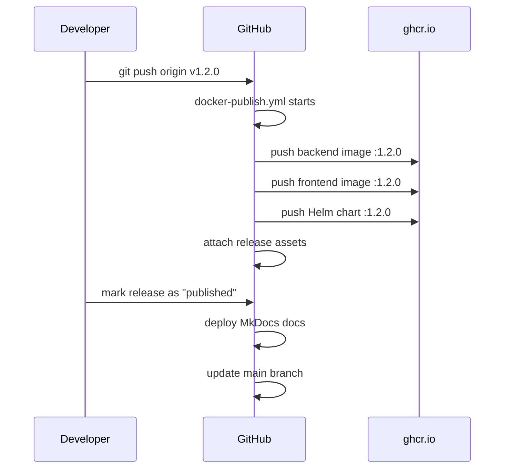

# CI/CD Pipeline

The Kamerplanter CI/CD pipeline runs entirely on **GitHub Actions**. It covers automated quality checks for backend and frontend, building and publishing container images, and automated Helm chart publication. Releases are triggered by Git tags and execute all steps in the correct order.

---

## Prerequisites

- Write access to the GitHub repository (`nolte/kamerplanter`)
- No manual secret configuration required — all workflows use the automatically available `GITHUB_TOKEN`
- Container images are pushed to the **GitHub Container Registry (GHCR)** under `ghcr.io/nolte/`

---

## Branch Strategy

```
feature/* ──► develop ──► (Release Tag v*) ──► main
```

| Branch | Purpose |
|--------|---------|
| `feature/*` | Development work; CI runs on pull requests targeting `develop` |
| `develop` | Integration branch; triggers CI and image builds |
| `main` | Represents the current stable release state; updated automatically after each release |

!!! note "Note"
    `main` is not used directly for development. Commits reach `main` through `develop` and Git tags. The `release-cd-refresh-master.yml` workflow handles this automatically after a published release.

---

## Workflow Overview

| File | Trigger | Purpose |
|------|---------|---------|
| `backend.yml` | Push/PR on `develop`, path `src/backend/**` | Lint + test backend |
| `frontend.yml` | Push/PR on `develop`, path `src/frontend/**` | Lint + test + build frontend |
| `docker-publish.yml` | Push on `develop` or `v*` tag | Build and publish container images + Helm chart |
| `skaffold-verify.yml` | PR on `develop`, path `skaffold.yaml`, `helm/**`, Dockerfiles | Helm lint + Skaffold diagnose |
| `release-drafter.yml` | Push on `develop` | Automatically update release notes draft |
| `release-cd-deliver-docs.yml` | Published release | Deploy MkDocs documentation to GitHub Pages |
| `release-cd-refresh-master.yml` | Published release | Update `main` branch to release state |

---

## Backend CI (`backend.yml`)

The backend CI workflow runs on every push to `develop` and on pull requests whenever files under `src/backend/` are changed.

### What is checked

1. **Ruff lint** — checks Python code for style and quality issues (`ruff check .`)
2. **Ruff format** — ensures the code is correctly formatted (`ruff format --check .`)
3. **Unit tests** — runs all tests under `tests/unit/` with pytest

```yaml title=".github/workflows/backend.yml (simplified)"
jobs:
  lint-test:
    runs-on: ubuntu-latest
    steps:
      - uses: actions/setup-python@v5
        with:
          python-version: '3.14'
          allow-prereleases: true

      - name: Install dependencies
        run: pip install -e ".[dev]"

      - name: Ruff lint
        run: ruff check .

      - name: Ruff format check
        run: ruff format --check .

      - name: Unit tests
        run: pytest tests/unit/ -v --tb=short
```

!!! tip "Local check before pushing"
    ```bash
    cd src/backend
    ruff check .
    ruff format --check .
    pytest tests/unit/ -v --tb=short
    ```

### Installing dependencies

Backend dependencies are installed from `pyproject.toml`. The `[dev]` extra includes pytest, ruff, and other development tools:

```bash
pip install -e ".[dev]"
```

---

## Frontend CI (`frontend.yml`)

The frontend CI workflow runs on every push to `develop` and on pull requests whenever files under `src/frontend/` are changed.

### What is checked

1. **TypeScript check** — strict type check without output (`tsc --noEmit`)
2. **ESLint** — quality check of the TypeScript/React code
3. **Vitest** — all unit and component tests
4. **Vite build** — ensures the production build compiles without errors

```yaml title=".github/workflows/frontend.yml (simplified)"
jobs:
  lint-test-build:
    runs-on: ubuntu-latest
    steps:
      - uses: actions/setup-node@v4
        with:
          node-version: 22
          cache: npm
          cache-dependency-path: src/frontend/package-lock.json

      - run: npm ci
      - run: npx tsc --noEmit
      - run: npm run lint
      - run: npm run test
      - run: npm run build
```

!!! tip "Local check before pushing"
    ```bash
    cd src/frontend
    npx tsc --noEmit
    npm run lint
    npm run test
    npm run build
    ```

### Build artifact

On a push to `develop` (not on PRs), the finished `dist/` directory is uploaded as a GitHub Actions artifact and retained for 7 days. This allows quick inspection of the build output without local compilation.

---

## Container Build and Publication (`docker-publish.yml`)

This workflow builds and publishes all container images and the Helm chart. It is triggered by:

- Push to `develop` (when backend, frontend, or Helm files are changed)
- Push of a `v*` tag (release) — all components are built regardless of path changes
- Manually via `workflow_dispatch`

### Path-based filtering

To avoid rebuilding all images on every change, a `changes` job first determines which components are affected:

```
src/backend/**  →  build-backend
src/frontend/** →  build-frontend
helm/**         →  publish-helm-charts
```

On a `v*` tag or manual trigger, the filtering is skipped — all components are always built.

### Backend image

The backend image is based on `python:3.14-slim` and is built as a single-stage build:

```dockerfile title="src/backend/Dockerfile"
FROM python:3.14-slim AS base
WORKDIR /app
COPY pyproject.toml .
RUN pip install --no-cache-dir .
COPY . .
EXPOSE 8000
CMD ["uvicorn", "app.main:app", "--host", "0.0.0.0", "--port", "8000"]
```

The image is pushed to `ghcr.io/nolte/kamerplanter-backend`.

### Frontend image

The frontend image uses a two-stage multi-stage build: first the React app is built with Node.js 22, then the static files are copied into a slim nginx image:

```dockerfile title="src/frontend/Dockerfile"
FROM node:22-alpine AS build
WORKDIR /app
COPY package.json package-lock.json ./
RUN npm ci
COPY . .
RUN npm run build

FROM nginx:1.27-alpine
COPY --from=build /app/dist /usr/share/nginx/html
COPY nginx.conf /etc/nginx/conf.d/default.conf
EXPOSE 80
```

The image is pushed to `ghcr.io/nolte/kamerplanter-frontend`.

### Image tags

Docker metadata is automatically generated via `docker/metadata-action`:

| Tag scheme | Example | When |
|-----------|---------|------|
| `latest` | `kamerplanter-backend:latest` | Push on `develop` |
| Commit SHA | `kamerplanter-backend:a3f7c2b` | Always |
| Branch name | `kamerplanter-backend:develop` | Push on branch |
| Semantic version | `kamerplanter-backend:1.2.0` | `v1.2.0` tag |
| Major.Minor | `kamerplanter-backend:1.2` | `v1.2.0` tag |

### Helm chart

The Helm chart for Kamerplanter lives under `helm/kamerplanter/` and is pushed as an OCI artifact:

```
oci://ghcr.io/nolte/charts/kamerplanter
```

On a release tag, the `version` and `appVersion` in `Chart.yaml` are automatically set to the release version before the chart is packaged. At the same time, image tags in `values.yaml` are updated from `latest` to the specific version.

```bash
# Pull the chart directly
helm pull oci://ghcr.io/nolte/charts/kamerplanter --version 1.2.0
```

### Layer caching

All image builds use the GitHub Actions cache (`type=gha`) for Docker layers. This significantly speeds up subsequent builds when only a few layers change.

---

## Skaffold Verify (`skaffold-verify.yml`)

This workflow runs on pull requests to `develop` when `skaffold.yaml`, Helm files, or Dockerfiles are changed. It ensures the local development environment remains functional.

### What is checked

1. **`helm dependency build`** — downloads chart dependencies (bjw-s common chart, valkey)
2. **`helm lint`** — checks the Helm chart for syntax errors using dev values
3. **`helm template`** — renders all Kubernetes manifests and validates the templating logic
4. **`skaffold diagnose`** — validates the Skaffold configuration
5. **`skaffold render`** — generates rendered manifests and uploads them as an artifact

!!! note "Skaffold is for local development only"
    Skaffold is used exclusively for the local development environment (Kind cluster). Production deployments do not go through Skaffold — they use the `docker-publish` workflow in combination with the Helm chart.

---

## Release Process

A full release consists of several automatic steps triggered by publishing a GitHub release.

### Step 1: Prepare release draft (automatic)

The `release-drafter` workflow automatically updates a release draft on every push to `develop` with the changes since the last tag.

### Step 2: Set release tag

```bash
git tag v1.2.0
git push origin v1.2.0
```

The tag triggers `docker-publish.yml` and builds all images and the Helm chart with the correct version number.

### Step 3: Publish the release

When the GitHub release is marked as "published", two additional workflows start:

**`release-cd-deliver-docs.yml`** — deploys the MkDocs documentation to GitHub Pages via a reusable workflow from `nolte/gh-plumbing`.

**`release-cd-refresh-master.yml`** — updates the `main` branch to the state of the new release tag. `main` therefore always points to the last published stable state.

### Step 4: Release assets (automatic)

The `update-release-assets` job in the `docker-publish` workflow attaches the following files to the release:

- `docker-compose-1.2.0.yml` — versioned Docker Compose file for self-hosting
- `.env.example-1.2.0` — environment variable template
- Container image references and Helm pull command in the release notes

### Release flow summary



---

## Pulling GHCR packages

All images are publicly readable. For local testing:

=== "Backend"

    ```bash
    docker pull ghcr.io/nolte/kamerplanter-backend:latest
    docker pull ghcr.io/nolte/kamerplanter-backend:1.2.0
    ```

=== "Frontend"

    ```bash
    docker pull ghcr.io/nolte/kamerplanter-frontend:latest
    docker pull ghcr.io/nolte/kamerplanter-frontend:1.2.0
    ```

=== "Helm chart"

    ```bash
    helm pull oci://ghcr.io/nolte/charts/kamerplanter --version 1.2.0
    helm install kamerplanter oci://ghcr.io/nolte/charts/kamerplanter --version 1.2.0
    ```

---

## Frequently Asked Questions

??? question "Why does the backend CI fail even though tests pass locally?"
    Make sure you are using Python 3.14 (`python --version`). The CI explicitly uses `python-version: '3.14'` with `allow-prereleases: true`. Differing Python versions can lead to different behavior. Also check that all dependencies are installed with `pip install -e ".[dev]"`.

??? question "Why is no new image built even though I pushed to develop?"
    Path filtering in `docker-publish.yml` ensures that only actually affected components are built. If you only changed a spec file, for example, no image will be built. On `v*` tags, filtering is bypassed.

??? question "How do I update the Helm chart manually?"
    You can trigger `docker-publish.yml` manually via `workflow_dispatch`. Navigate in GitHub to **Actions → Build & Publish Container Images → Run workflow**.

??? question "When is main updated?"
    `main` is updated exclusively and automatically by `release-cd-refresh-master.yml` after a published release. Direct pushes to `main` are not intended.

??? question "How do I see which image version is currently running?"
    The image digest labels (`org.opencontainers.image.*`) are embedded in every image. You can read them with `docker inspect <image>` or check the GHCR package tab on GitHub.

---

## See also

- [Kubernetes Deployment](kubernetes.md)
- [Helm Chart Configuration](helm.md)
- [Local Development Setup](../development/local-setup.md)
