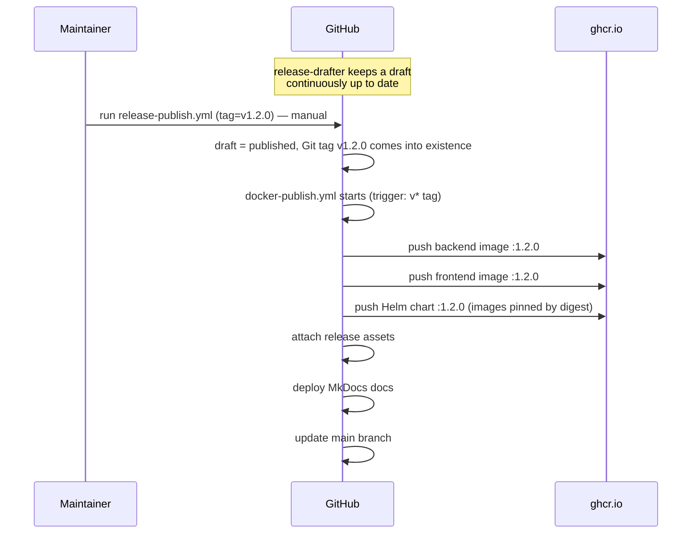
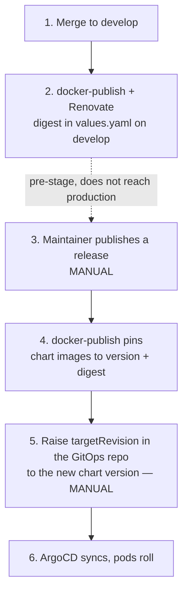

# CI/CD Pipeline

The Kamerplanter CI/CD pipeline runs entirely on **GitHub Actions**. It covers automated quality checks for backend and frontend, building and publishing container images, and automated Helm chart publication. A release is started by a maintainer by hand; everything after that runs automatically in the correct order.

---

## Prerequisites

- Write access to the GitHub repository (`nolte/kamerplanter`)
- No manual secret configuration required — all workflows use the automatically available `GITHUB_TOKEN`
- Container images are pushed to the **GitHub Container Registry (GHCR)** under `ghcr.io/nolte/`

---

## Branch Strategy

```
feature/* ──► develop ──► (Release Tag v*) ──► main
```

| Branch | Purpose |
|--------|---------|
| `feature/*` | Development work; CI runs on pull requests targeting `develop` |
| `develop` | Integration branch; triggers CI and image builds |
| `main` | Represents the current stable release state; updated automatically after each release |

!!! note "Note"
    `main` is not used directly for development. Commits reach `main` through `develop` and Git tags. The `release-cd-refresh-master.yml` workflow handles this automatically after a published release.

---

## Workflow Overview

| File | Trigger | Purpose |
|------|---------|---------|
| `backend.yml` | Push/PR on `develop`, path `src/backend/**` | Lint + test backend |
| `frontend.yml` | Push/PR on `develop`, path `src/frontend/**` | Lint + test + build frontend |
| `docker-publish.yml` | Push on `develop` or `v*` tag | Build and publish container images + Helm chart |
| `skaffold-verify.yml` | PR on `develop`, path `skaffold.yaml`, `helm/**`, Dockerfiles | Helm lint + Skaffold diagnose |
| `release-drafter.yml` | Push on `develop` | Automatically update release notes draft |
| `release-publish.yml` | **Manual only** (`workflow_dispatch`) | Publish a release draft — the only step that turns a draft into a release |
| `release-cd-deliver-docs.yml` | Published release | Deploy MkDocs documentation to GitHub Pages |
| `release-cd-refresh-master.yml` | Published release | Update `main` branch to release state |
| `chart-image-digest-freshness.yml` | Scheduled, daily at 06:00 UTC | Reports when the digests in `helm/kamerplanter/values.yaml` have gone stale |
| `release-lag.yml` | Scheduled, daily at 09:00 UTC (+ manual) | Reports when `develop` carries commits no **published** release contains |

---

## Backend CI (`backend.yml`)

The backend CI workflow runs on every push to `develop` and on pull requests whenever files under `src/backend/` are changed.

### What is checked

1. **Ruff lint** — checks Python code for style and quality issues (`ruff check .`)
2. **Ruff format** — ensures the code is correctly formatted (`ruff format --check .`)
3. **Unit tests** — runs all tests under `tests/unit/` with pytest

```yaml title=".github/workflows/backend.yml (simplified)"
jobs:
  lint-test:
    runs-on: ubuntu-latest
    steps:
      - uses: actions/setup-python@v5
        with:
          python-version: '3.14'
          allow-prereleases: true

      - name: Install dependencies
        run: pip install -e ".[dev]"

      - name: Ruff lint
        run: ruff check .

      - name: Ruff format check
        run: ruff format --check .

      - name: Unit tests
        run: pytest tests/unit/ -v --tb=short
```

!!! tip "Local check before pushing"
    ```bash
    cd src/backend
    ruff check .
    ruff format --check .
    pytest tests/unit/ -v --tb=short
    ```

### Installing dependencies

Backend dependencies are installed from `pyproject.toml`. The `[dev]` extra includes pytest, ruff, and other development tools:

```bash
pip install -e ".[dev]"
```

---

## Frontend CI (`frontend.yml`)

The frontend CI workflow runs on every push to `develop` and on pull requests whenever files under `src/frontend/` are changed.

### What is checked

1. **TypeScript check** — strict type check without output (`tsc --noEmit`)
2. **ESLint** — quality check of the TypeScript/React code
3. **Vitest** — all unit and component tests
4. **Vite build** — ensures the production build compiles without errors

```yaml title=".github/workflows/frontend.yml (simplified)"
jobs:
  lint-test-build:
    runs-on: ubuntu-latest
    steps:
      - uses: actions/setup-node@v4
        with:
          node-version: 22    # (1)!
          cache: npm
          cache-dependency-path: src/frontend/package-lock.json

      - run: npm ci
      - run: npx tsc --noEmit
      - run: npm run lint
      - run: npm run test
      - run: npm run build
```

1. Only the `lint-test-build` job uses Node 22. The `bundle-budget` and `lighthouse` jobs in the same workflow run on Node 24 — matching the frontend Dockerfile, which builds with `node:24-alpine` (see [Frontend image](#frontend-image) below).

!!! tip "Local check before pushing"
    ```bash
    cd src/frontend
    npx tsc --noEmit
    npm run lint
    npm run test
    npm run build
    ```

### Build artifact

On a push to `develop` (not on PRs), the finished `dist/` directory is uploaded as a GitHub Actions artifact and retained for 7 days. This allows quick inspection of the build output without local compilation.

### Performance budgets & CI gates (`bundle-budget`, `lighthouse`)

Besides `lint-test-build`, the same workflow runs two standalone jobs that watch frontend load performance (internal reference: UI-NFR-003). Neither touches the required `static` check — a violation surfaces visibly without blocking automerge.

**`bundle-budget` — hard gate.** The job builds the frontend, then runs `npm run bundle:check` (script `scripts/check-bundle-budget.mjs`) to check the initial JavaScript and CSS bundle plus the dedicated `/dashboard` route chunk against the budgets in `bundle-budget.json`:

| Check | Budget (gzip) | Measured actual |
|---|---|---|
| Initial JavaScript bundle | 490 KB | ~471.8 KB |
| Initial CSS bundle | 50 KB | under budget |
| `/dashboard` route chunk | 12 KB | under budget |

Exceeding a budget fails the job; the bundle analyzer report (treemap via `rollup-plugin-visualizer`) is uploaded as the `bundle-stats` artifact. This budget is achievable thanks to a `manualChunks` vendor strategy in `vite.config.ts`: React, MUI core, Redux Toolkit, and react-i18next are eagerly grouped into stable, long-lived vendor chunks, while heavy route-scoped libraries (`recharts`, `@mui/x-*`, `react-grid-layout`) stay lazy.

!!! note "300 KB target not yet reached"
    UI-NFR-003 sets a target of 300 KB gzip for the initial JavaScript bundle. The current 490 KB budget only locks in the measured baseline against further silent growth — it does not yet meet the target. The main driver is the eagerly-loaded i18n translation bundle (~160 KB gzip). Reaching the 300 KB target requires lazy-loading the translations and is tracked as an open follow-up. <!-- UI-NFR-003 R-013 -->

!!! tip "Local check before pushing"
    ```bash
    cd src/frontend
    npm run build
    npm run bundle:check
    ```

**`lighthouse` — report-only.** The job runs `npm run lhci` (Lighthouse CI, mobile emulation with throttled 4G network) against the built `dist/` folder and checks the Core Web Vitals thresholds from UI-NFR-003 (First Contentful Paint < 1.5 s, Largest Contentful Paint < 2.5 s, Time to Interactive < 3.5 s, Cumulative Layout Shift < 0.1, Total Blocking Time < 200 ms) plus the performance and accessibility scores (≥ 0.9). All assertions in `lighthouserc.json` are configured at `warn` level — the job does not block the build but surfaces regressions in the report. The full report is uploaded as the `lighthouse-report` artifact.

---

## Container Build and Publication (`docker-publish.yml`)

This workflow builds and publishes all container images and the Helm chart. It is triggered by:

- Push to `develop` (when backend, frontend, or Helm files are changed)
- Push of a `v*` tag (release) — all components are built regardless of path changes
- Manually via `workflow_dispatch`

### Path-based filtering

To avoid rebuilding all images on every change, a `changes` job first determines which components are affected:

```
src/backend/**  →  build-backend
src/frontend/** →  build-frontend
helm/**         →  publish-helm-charts
```

On a `v*` tag or manual trigger, the filtering is skipped — all components are always built.

### Backend image

The backend image is based on `python:3.14-slim` and uses a multi-stage Dockerfile with a shared `base` stage plus separate `dev` and `prod` targets (`docker build .` without `--target` builds `prod` by default, since it is the last stage). The `dev` stage runs as root for Skaffold hot-reload; the `prod` stage runs as a non-root user (UID 1000):

```dockerfile title="src/backend/Dockerfile (simplified, prod stage)"
FROM python:3.14-slim AS base
WORKDIR /app
COPY pyproject.toml requirements.txt requirements-dev.txt ./

FROM base AS prod
RUN pip install --no-cache-dir --require-hashes -r requirements.txt \
    && pip install --no-cache-dir --no-deps .
COPY . .
RUN groupadd -g 1000 app && useradd -u 1000 -g 1000 -d /app -s /usr/sbin/nologin app \
    && chown -R 1000:1000 /app
USER 1000
EXPOSE 8000
CMD ["uvicorn", "app.main:app", "--host", "0.0.0.0", "--port", "8000"]
```

The image is pushed to `ghcr.io/nolte/kamerplanter-backend`. Dependencies come exclusively from the hash-pinned `requirements*.txt` locks (NFR-009), not directly from `pyproject.toml`.

### Frontend image {#frontend-image}

The frontend image also uses a multi-stage Dockerfile: first the React app is built with Node.js 24, then the static files are copied into a slim, **unprivileged** nginx image (does not run as root, compatible with `runAsNonRoot`):

```dockerfile title="src/frontend/Dockerfile (simplified)"
FROM node:24-alpine AS build
WORKDIR /app
COPY package.json package-lock.json ./
RUN npm ci
COPY . .
RUN npm run build

FROM nginxinc/nginx-unprivileged:1.31-alpine AS prod
COPY --from=build /app/dist /usr/share/nginx/html
COPY nginx.conf /etc/nginx/conf.d/default.conf
EXPOSE 8080
```

The image is pushed to `ghcr.io/nolte/kamerplanter-frontend`. The internal port is `8080` (unprivileged nginx can't bind to port 80), mapped to the public port 8080 in Docker Compose, and to port 80 on the service in the Helm chart.

### Image tags

Docker metadata is automatically generated via `docker/metadata-action`:

| Tag scheme | Example | When |
|-----------|---------|------|
| `latest` | `kamerplanter-backend:latest` | Push on `develop` |
| Commit SHA | `kamerplanter-backend:a3f7c2b` | Always |
| Branch name | `kamerplanter-backend:develop` | Push on branch |
| Semantic version | `kamerplanter-backend:1.2.0` | `v1.2.0` tag |
| Major.Minor | `kamerplanter-backend:1.2` | `v1.2.0` tag |

!!! warning "`latest` is a moving reference"

    `latest` is overwritten on every push to `develop` and points at different
    bytes afterwards. For anything that has to be reproducible — deployments,
    rollbacks, incident analysis — you need a reference that stays put. Since
    #987 the Helm chart therefore no longer uses a moving tag but an immutable
    digest: [Deployment and rollback](#deployment-and-rollback).

    How expensive the alternative is has been measured, not asserted: with
    `pullPolicy: IfNotPresent` — exactly what the chart sets — a node keeps
    serving **the old image** after a `rollout restart`, even though the
    registry has long been serving different bytes under the same tag.
    Kubernetes only forces `Always` for a `:latest` reference while
    `imagePullPolicy` is *unset*; an explicitly set `IfNotPresent` wins. That is
    how the `inference-service` served an image without the `/pest/*` routes for
    weeks.

### What secures each artifact

Every artifact class this project ships needs a named stage that secures it —
otherwise a gap only becomes visible once it is exploited. The matrix below
answers the question "what exactly does what guarantee?" and is maintained
alongside pipeline changes.

| Artifact class | Securing stage | Guarantees |
|---|---|---|
| Container images (8) | `build-*` in `docker-publish.yml` | built-from-source, integrity (digest), provenance (signed) |
| Helm chart (OCI) | `publish-helm-charts` | built-from-source, integrity (digest), provenance (signed) |
| `openapi.json` (release asset) | `openapi-asset` in `release-publish.yml` | built-from-source, attachment verified after upload |
| `docker-compose-<version>.yml`, `.env.example-<version>` | `update-release-assets` | built-from-source |
| Python dependencies | `pip-audit`, `pip-licenses`, `lock-staleness` in `backend.yml` | policy-cleared (CVE, licence, lock integrity) |

**Known gaps** — deliberately open, not overlooked:

- The three release assets carry **no** provenance. GitHub-hosted release files
  have no verification path equivalent to the registry attestation.
- JavaScript dependencies have no dedicated policy stage yet; Trivy covers them
  only at `CRITICAL` severity.

#### Verifying provenance

Images and the chart carry platform-generated, signed build provenance
(`actions/attest-build-provenance`). Verify before deploying:

```bash
gh attestation verify \
  oci://ghcr.io/nolte/kamerplanter-backend:1.2.0 \
  --repo nolte/kamerplanter
```

What it says and what it does not: provenance establishes **origin** — which
commit, which workflow run, which pinned inputs. It is **not** a statement that
an artifact is secure. Security findings remain the concern of the supply-chain
stages.

### Helm chart

The Helm chart for Kamerplanter lives under `helm/kamerplanter/` and is pushed as an OCI artifact:

```
oci://ghcr.io/nolte/charts/kamerplanter
```

On a release tag, `version` and `appVersion` in `Chart.yaml` are automatically set to the release version before the chart is packaged. On any other ref that rewrite does **not** apply — whatever version the tree carries is what gets packaged, and `develop` has its own channel for that (see [Two channels](#two-channels)). At the same time `scripts/ci/pin_chart_image_digests.sh` pins every Kamerplanter image in `values.yaml` to `<version>@sha256:<digest>` — addressed by YAML path rather than by text-replacing the literal `tag: latest`. The same run then re-reads the file and aborts the release if any Kamerplanter image survived the substitution.

The digest is resolved from the registry rather than handed over from the build jobs. That also proves `<image>:<version>` exists at all — which is why `publish-helm-charts` has been ordered behind the image builds via `needs:` since #987. And it is the difference between "immutable" and "immutable by convention": a version tag can be re-pushed, a digest cannot.

!!! info "Why not just the version?"

    Until #987 this step pinned the bare version tag. That was better than the
    `:latest` the develop tree carried, but a tag remains a reference to a
    *name*: re-run the publish workflow for an existing tag and the same name
    points at different bytes, with no way for a consumer to notice.

#### Two channels: `develop` and release {#two-channels}

The same OCI address carries two kinds of tag, and they mean different things:

| Channel | Version in the tree | Published OCI tag | Lifetime |
|---------|---------------------|-------------------|----------|
| `develop` | a pre-release with the `-dev` suffix, currently `0.2.1-dev` | `charts/kamerplanter:0.2.1-dev` | overwritten by **every** `helm/` merge |
| Release | bare version, set from the tag | `charts/kamerplanter:0.1.0` | belongs to exactly one release and is never re-pushed — with one measured exception, see below |

<!-- Source: helm/kamerplanter/Chart.yaml, scripts/check_chart_develop_version.py, scripts/ci/determine_chart_version.sh -->

Two things the table does not say, and that are easy to read wrongly:

- **Only the `dev` identifier is enforced on the `-dev` value, not the number in
  front of it.** `0.2.1-dev` names the intended next release, but it is not a
  promise: once `v0.2.1` ships, `0.2.1-dev` sorts *below* the release, and no
  schedule bumps the value. Nor does it need to — the collision stays impossible
  for any `-dev` number, which is exactly why the check demands nothing stronger.
- **The example tag in the release row is `0.1.0`, not `0.2.0`.** `0.1.0` still
  carries its release timestamp in the manifest (`created` 2026-08-06 at
  13:38:04 UTC, 15 seconds after `v0.1.0` was published), whereas `0.2.0`
  carries that of a `develop` build. `0.2.0` is therefore the one release tag
  the "Lifetime" column does not hold for — the incident below, unrepaired and
  hence not an example of the rule.
  <!-- #1222 -->

The two channels are **disjoint**, and that is enforced at both ends — as a
check, not as a convention:

- `scripts/check_chart_develop_version.py` runs as a hook in the required
  `static` lane and rejects any chart version in the tree whose first
  pre-release identifier is not exactly `dev`. The `develop` tree therefore
  cannot carry a version a release would ever publish.
- `scripts/ci/determine_chart_version.sh` rejects the converse: a release tag
  carrying the `dev` pre-release identifier, before anything is packaged or
  pushed. `v0.3.0-dev` is not a valid release tag. `v0.3.0-rc1` and
  `v0.3.0-beta.1` stay legal — they cannot collide with the `develop` channel.

!!! danger "No deployment points at the `-dev` channel"

    The `-dev` tag is overwritten with different bytes by every `helm/` merge
    into `develop`. That is its purpose, not a defect. A `targetRevision`, a
    `--version` or an `image.tag` pointing at it is therefore not a fixed state:
    the deployed content changes without anything changing in the GitOps
    repository — and nobody sees a diff. Anchor only a bare release version or
    the manifest digest.

    Why this separation exists, measured: until 2026-08-18 the `develop` tree
    carried version `0.2.0` — the version of a *published* release. The chart
    tag `charts/kamerplanter:0.2.0` was published on 2026-08-13 with release
    `v0.2.0` and overwritten from `develop` five days later, with different
    content under the same version reference. No consumer could notice; it only
    became visible by comparing the `org.opencontainers.image.created` timestamp
    on the OCI manifest with the release publication date.
    <!-- #1222 -->

```bash
# Pull the chart directly — always a published version, never a -dev one
helm pull oci://ghcr.io/nolte/charts/kamerplanter --version 1.2.0
```

### Layer caching

All image builds use the GitHub Actions cache (`type=gha`) for Docker layers. This significantly speeds up subsequent builds when only a few layers change.

---

## Skaffold Verify (`skaffold-verify.yml`)

This workflow runs on pull requests to `develop` when `skaffold.yaml`, Helm files, or Dockerfiles are changed. It ensures the local development environment remains functional.

### What is checked

1. **`helm dependency build`** — downloads chart dependencies (bjw-s common chart, valkey)
2. **`helm lint`** — checks the Helm chart for syntax errors using dev values
3. **`helm template`** — renders all Kubernetes manifests and validates the templating logic
4. **`skaffold diagnose`** — validates the Skaffold configuration
5. **`skaffold render`** — generates rendered manifests and uploads them as an artifact

!!! note "Skaffold is for local development only"
    Skaffold is used exclusively for the local development environment (Kind cluster). Production deployments do not go through Skaffold — they use the `docker-publish` workflow in combination with the Helm chart.

---

## Release Process

A release is the step that turns a state on `develop` into a delivered version. It does **not** start on its own: a human triggers it, and everything after that is automatic.

!!! danger "A draft is not a delivery"

    `release-drafter.yml` runs on **every** push to `develop` and keeps a
    release draft current. `release-publish.yml`, by contrast, runs **only** via
    `workflow_dispatch`. The most visible release artifact in the repository is
    therefore permanently a *draft* — it carries a version number, lists the
    changes and reads like a finished release, but it has no Git tag, is not
    retrievable as a release through the API, and sits on no delivery path. As
    long as nobody publishes it, not a single commit is delivered.

    That exact situation has been measured: a draft `v0.2.1` had existed since
    2026-08-13; a fix was merged to `develop` on 08-14; on 08-16 the instance
    was still running the state from before it. The newest *published* release
    was `v0.2.0` the whole time. Since then this is observed by
    [`release-lag.yml`](#checks-delivery-chain).

    Was the draft held back on purpose? No — that question is now answered on
    the record. The alert `release-lag.yml` raises (#1229) fired on 2026-08-19;
    `v0.2.1` was published the same day, and #1229 auto-closed on 2026-08-20
    once the check went green again. That was an **omission in the process**,
    not a deliberate hold.
    <!-- #1210 -->

### Step 1: Prepare release draft (automatic)

The `release-drafter` workflow automatically updates a release draft on every push to `develop` with the changes since the last tag. It also proposes the next version number.

### Step 2: Publish the release (manual — the one hands-on step)

A maintainer starts `release-publish.yml` by hand: **Actions → Release Publish → Run workflow**, with the tag of the open draft. Sensibly with `dry_run: true` first — that validates without flipping the draft.

```bash
# Equivalent via the CLI
gh workflow run release-publish.yml -f tag=v1.2.0 -f dry_run=true
gh workflow run release-publish.yml -f tag=v1.2.0
```

Publishing is the moment the Git tag comes into existence in the first place — a draft has none.

### Step 3: What hangs off the published release (automatic)

The resulting `v*` tag triggers `docker-publish.yml`: all images and the Helm chart are built with the release version number, and `scripts/ci/pin_chart_image_digests.sh` pins every Kamerplanter image in the chart values to `<version>@sha256:<digest>`.

In parallel, the "release published" event starts two more workflows:

**`release-cd-deliver-docs.yml`** — deploys the MkDocs documentation to GitHub Pages via a reusable workflow from `nolte/gh-plumbing`.

**`release-cd-refresh-master.yml`** — updates the `main` branch to the state of the new release tag. `main` therefore always points to the last published stable state.

### Step 4: Release assets (automatic)

The `update-release-assets` job in the `docker-publish` workflow attaches the following files to the release:

- `docker-compose-1.2.0.yml` — versioned Docker Compose file for self-hosting
- `.env.example-1.2.0` — environment variable template
- Container image references and Helm pull command in the release notes

### Release flow summary

<!-- diagram-source: measured against .github/workflows/release-publish.yml (workflow_dispatch only), release-drafter.yml, docker-publish.yml (tags: v*), release-cd-*.yml -->

```mermaid
sequenceDiagram
    participant Dev as Maintainer
    participant GH as GitHub
    participant GHCR as ghcr.io

    Note over GH: release-drafter keeps a draft<br/>continuously up to date
    Dev->>GH: run release-publish.yml (tag=v1.2.0) — manual
    GH->>GH: draft = published, Git tag v1.2.0 comes into existence
    GH->>GH: docker-publish.yml starts (trigger: v* tag)
    GH->>GHCR: push backend image :1.2.0
    GH->>GHCR: push frontend image :1.2.0
    GH->>GHCR: push Helm chart :1.2.0 (images pinned by digest)
    GH->>GH: attach release assets
    GH->>GH: deploy MkDocs docs
    GH->>GH: update main branch
```

---

## Deployment and rollback

A cluster does **not** learn about a new version because a tag was moved. The chart references every Kamerplanter image by an immutable digest:

```yaml
image:
  repository: ghcr.io/nolte/kamerplanter-backend
  tag: latest@sha256:af9bec…   # (1)!
  pullPolicy: IfNotPresent      # (2)!
```

1. What matters is the part **after** the `@`. The digest is content-addressed and cannot move. The `latest` in front of it is not a moving reference here but a label recording which channel the digest came from — nothing resolves it. It sits on the same line because that is the notation Renovate maintains (see below). In the release chart the release version stands here instead of `latest`, because `pin_chart_image_digests.sh` writes it in at packaging time — the digest behind it remains the part that matters.
2. Deliberately stays `IfNotPresent`. A digest is content-addressed: an image already on the node **is** the requested one, so a re-pull could only confirm it. `Always` would make every pod start depend on GHCR being reachable and would gain nothing.

### How a new version reaches production {#how-a-new-version-reaches-production}

The production instance rolls out **release versions only**. That is an operating decision, not merely the accidental current state: the ArgoCD `Application` anchors the chart at a release tag, not at a branch.


```mermaid
graph TD
    A[1. Merge to develop] --> B[2. docker-publish + Renovate<br/>digest in values.yaml on develop]
    B -.pre-stage, does not reach production.-> C
    C[3. Maintainer publishes a release<br/>MANUAL] --> D[4. docker-publish pins<br/>chart images to version + digest]
    D --> E[5. Raise targetRevision in the GitOps repo<br/>to the new chart version — MANUAL]
    E --> F[6. ArgoCD syncs, pods roll]
```

Spelled out, that is six hops, each owned by a different actor:

1. **Merge to `develop`** — the commit that changes the code. A human.
2. **`docker-publish.yml`** builds the images and pushes them; **Renovate**
   writes the new digests into `helm/kamerplanter/values.yaml` on `develop` via
   the grouped `kamerplanter images` pull request. This is the **pre-stage**: it
   keeps the development state consistent but **does not reach production**.
3. **A maintainer cuts a release** — by hand, via `release-publish.yml`. **The
   first manual hop.** If it does not happen, nothing from steps 1 and 2 is
   delivered, no matter how long ago it was.
4. **`docker-publish.yml`** runs on the resulting `v*` tag and, via
   `scripts/ci/pin_chart_image_digests.sh`, pins every Kamerplanter image in the
   chart values to `<version>@sha256:<digest>`.
5. **`targetRevision` in the GitOps repository is raised to the new chart version** — also
   by hand, in `nolte/k8s-home-lab`, that is **outside this repository**. **The
   second manual hop**, and the only one no workflow in this repository can even
   see.
6. **ArgoCD** syncs the new state. The pods roll because the pod spec changed —
   not because someone triggered a restart.

!!! warning "Two of the six hops are done by a human"

    Hop 3 (publish the release) and hop 5 (raise `targetRevision`) are not
    automation. Both are a maintainer's hands-on steps, both can be forgotten,
    and from the outside both look like nothing — there is no red run, no open
    pull request, no missing artifact. A merged fix is therefore **not a
    delivered fix**.

    How far apart these can drift is measurable: from 2026-08-13 19:41 UTC to
    2026-08-16 15:33 UTC, the production `Application` anchored the chart at
    `v0.1.0` (published 08-06), while the newest published release was already
    `v0.2.0` (published 08-13).

The deploy itself is therefore a **commit** — in the GitOps repository — not an operation on the cluster. That the digests in the chart values are present and well-formed at all is enforced by `scripts/check_chart_image_digests.py` in the required `static` check; whether they are still *current* is answered only by the daily run of `chart-image-digest-freshness.yml` (see [Checks along the delivery chain](#checks-delivery-chain)).

### Rollback

A rollback is a commit in the **GitOps repository**: set `targetRevision` back to a previous chart version.

```yaml
- path: .
  repoURL: oci://ghcr.io/nolte/charts/kamerplanter
  targetRevision: 0.1.0   # instead of 0.2.1
```

!!! warning "Not every published version number is safe to roll back to"

    `0.2.0` looks like the obvious predecessor of `0.2.1` but is not — see
    [ArgoCD — Never point `targetRevision` at the `-dev` channel](argocd.md#basic-application)
    for the one release tag where that assumption failed. `0.1.0` is used
    above because it still carries its original release timestamp; when in
    doubt, pin the manifest digest instead of a bare version number.

ArgoCD pulls the older chart version — together with the digests that version pins — and the pods roll back. Verify the result **in the running pod**, not in the values file and not from a controller status:

```bash
kubectl get pod -n kamerplanter -l app.kubernetes.io/name=backend \
  -o jsonpath='{range .items[*]}{.metadata.name}{"  "}{.status.containerStatuses[0].imageID}{"\n"}{end}'
```

`imageID` names the digest the kubelet actually started. It has to match the one the chart values pin under the tag you rolled back to.

!!! danger "Do not edit the running cluster"

    `syncPolicy.automated.selfHeal: true` undoes any `kubectl edit` or
    `kubectl set image` within minutes. A rollback that is not in Git is not a
    rollback, it is a delay.

!!! warning "What a hotfix really costs"

    A hotfix is live only once both manual hops are done: publish the release
    **and** raise `targetRevision`. A merged pull request on its own moves
    nothing in production — not even when `develop` has long been green and the
    registry holds the new bytes. The previous route (`workflow_dispatch` +
    `kubectl rollout restart`) is no shortcut: as measured above, it never
    reliably pulled a new image in the first place.

### Production: the `Application` lives in the GitOps repository

The ArgoCD `Application` for the Talos cluster is **not** in this repository but in `k8s-home-lab` (`src/applications/kamerplanter/deploy/argocd/application.yaml`). It pulls the published chart from the registry:

```yaml
- path: .                                              # (1)!
  repoURL: oci://ghcr.io/nolte/charts/kamerplanter
  targetRevision: 0.2.1                                # (2)!
```

1. The OCI artifact, not a directory in the Git tree. `path: .` is the artifact's own root.
2. A **published chart version**, not a branch — the release version without the leading `v`, so release `v0.2.1` is chart `0.2.1`. Only a published release can stand here, and nobody raises this value automatically.

!!! info "Release versions only — deliberately"

    This instance rolls out **release versions only**. A commit on `develop`
    does not reach it, not even when it touches `helm/kamerplanter/**`: the
    anchor is a published chart version, and — since the checks introduced by
    #1222 closed the one way that assumption had failed — a published version
    does not move because someone merges. Before those checks existed, exactly
    that happened once: `charts/kamerplanter:0.2.0` was overwritten from
    `develop` under the same version reference (see [Two channels](#two-channels)).

    That is the intended state, not a snapshot. The price is latency: between
    "merged" and "running" sit the two manual hops from [How a new version
    reaches production](#how-a-new-version-reaches-production). Anyone expecting
    the new state in the cluster right after a merge is looking in the wrong
    place — what runs there is the release `targetRevision` points at, and that
    can be several releases behind.

#### What a release is for {#what-a-release-is-for}

A release is at once the delivery vehicle for this instance **and** the packaging for everyone else. What hangs off it:

| Outcome | For whom |
|---|---|
| The anchor `targetRevision` in the GitOps repository **can** be raised to | the production instance — the hop itself stays a hands-on step |
| Chart package `oci://ghcr.io/nolte/charts/kamerplanter:<version>`, images pinned to `<version>@sha256:<digest>` | self-hosters and other clusters — see [ArgoCD](argocd.md) |
| `docker-compose-<version>.yml`, `.env.example-<version>`, `openapi.json` as release assets | self-hosting without Kubernetes, API clients |
| MkDocs documentation on GitHub Pages (`release-cd-deliver-docs.yml`) | readers of this page |
| `main` moved to the release state (`release-cd-refresh-master.yml`) | anyone who needs a stable reference branch |

#### Invariant: no `image.tag` in the overlay {#invariant-no-image-tag}

**An overlay configuring this instance carries no per-controller `image.tag` overrides.** That is not a recommendation but the condition under which the digest pin holds at all.

The division of labour is: `targetRevision` picks the **chart version**, the chart picks the **bytes**. An `image.tag` in the overlay breaks the second half.

!!! danger "The invariant holds under a release tag too"

    The digest pin is not a property of the branch but of the chart:
    `scripts/ci/pin_chart_image_digests.sh` writes the digests **into** the
    chart values before the release chart is packaged. An `image.tag` override
    beats that default — regardless of whether `targetRevision` points at a
    branch, a release tag, or a published chart version. It replaces the digest with a moving reference,
    and `pullPolicy: IfNotPresent` then means: "keep whatever is already cached
    on the node". Delivery is back to depending on what one individual node
    happens to have pulled before — and raising `targetRevision` no longer
    achieves anything.

The consequence has been measured twice, not feared:

- In the first incident (tracked internally as ticket 1024) a `rollout restart`
  silently kept an old image; the `inference-service` served a state without the
  `/pest/*` routes for weeks. <!-- #1024 -->
- In the second (tracked internally as ticket 1210) the overlay anchored
  `targetRevision: v0.1.0` with six per-controller `image.tag` overrides set to
  `0.1.0` — images from release `v0.1.0`, published 2026-08-06. The fix from
  #1163 merged into `develop` on 2026-08-14 and could not be part of that
  release. It was fixed on 2026-08-16 at 15:33 UTC by `3e53606c8`, which
  switched `targetRevision` to `develop` and removed every override.
  <!-- #1210 -->

Both times it looked healthy from the outside: registry, chart and controller
status all agreed. Only the running container did not. That is why the proof is
always the look **into the pod**, never into the values file.

The invariant is written out next to the digests it protects — in
[`helm/kamerplanter/values.yaml`](https://github.com/nolte/kamerplanter/blob/develop/helm/kamerplanter/values.yaml)
and in the overlay itself. Change it there, not here.

### Checks along the delivery chain {#checks-delivery-chain}

The six hops fail **independently of one another**. A check over one transition
therefore says nothing about the others:

| Transition | Question | Check |
|---|---|---|
| GHCR → chart pin on `develop` | Is the digest in `values.yaml` still the current one? | `chart-image-digest-freshness.yml`, daily at 06:00 UTC |
| `develop` → published release | Does `develop` carry commits no published release contains — and for how long? | `release-lag.yml`, daily at 09:00 UTC |
| Release → `targetRevision` in the GitOps repo | Does the instance point at the new release? | **none** — the value lives in another repository |
| Chart pin → running pod | Does the pod run the bytes the chart names? | **no automation** — by hand, see [Frequently Asked Questions](#frequently-asked-questions) |

!!! danger "One green check does not imply the next"

    When the second incident surfaced, `chart-image-digest-freshness` was green
    — entirely correctly: the chart pin *was* current. That is exactly what made
    the divergence invisible, because the only check that existed measured the
    hop that worked. <!-- #1210 -->

#### What `release-lag.yml` does — and what it does not

The job compares the state of `develop` against the newest **published** release daily at 09:00 UTC. A draft explicitly does not count; it is even named in the alert, because a draft is precisely what creates the impression that something has been delivered. Reporting goes into a single, deduplicated issue labelled `release-lag`. The measurement report `release-lag-report.json` exists only in the runner's workspace and is not uploaded as an artifact — it gates the issue step: if it is missing, the measurement was undetermined, the run goes red, and no issue is opened.

| Setting | Default | Meaning |
|---|---|---|
| `RELEASE_LAG_THRESHOLD_DAYS` | `3` | Grace window. An alert is raised only once the **oldest** un-released commit is at least this old. |
| `RELEASE_LAG_BASE_BRANCH` | `develop` | The branch whose lag is measured. |

**`RELEASE_LAG_THRESHOLD_DAYS` is a cadence policy, not an unexplained grace
window.** The expectation for this repository is: a merged fix should be
delivered within **3 days** at the latest — published and with the production
instance's `targetRevision` raised. The setting enforces exactly that cadence:
it only reports once the oldest un-released commit has exceeded the 3 days.
<!-- #1210 -->

It is a scheduled job and not a pull-request gate because the lag grows **with no commit at all**: it increases with every hour nobody publishes, and it shrinks the moment somebody does. Neither of those events is a push.

!!! warning "With the shipped default the job would not have reported the incident in time"

    That is calculated, not estimated. The oldest un-released commit had been
    created on 2026-08-13 at 21:26 UTC; when somebody hit the same bug again on
    08-16 at 12:00 UTC it was 2.6 days old — below the 3-day threshold. The
    first run that would have raised an alert was the one on 08-17 at 09:00 UTC,
    a good day after the incident.

    The threshold is a deliberate compromise: a tighter window reports ordinary
    weekend development as lag. It can be measured without a code change — via
    the `threshold_days` input when starting the workflow manually. <!-- #1210 -->

!!! danger "A release does not prove the cluster took it"

    `release-lag.yml` measures the repository side only. It sees that a release
    *exists* — not that `targetRevision` was raised to it, and certainly not
    which bytes a pod is running. Hop 5 lives in `nolte/k8s-home-lab` and is out
    of reach for every workflow in this repository. That gap is open and must
    not be read as closed.

---

## Pulling GHCR packages

All images are publicly readable. For local testing:

=== "Backend"

    ```bash
    docker pull ghcr.io/nolte/kamerplanter-backend:latest
    docker pull ghcr.io/nolte/kamerplanter-backend:1.2.0
    ```

=== "Frontend"

    ```bash
    docker pull ghcr.io/nolte/kamerplanter-frontend:latest
    docker pull ghcr.io/nolte/kamerplanter-frontend:1.2.0
    ```

=== "Helm chart"

    ```bash
    helm pull oci://ghcr.io/nolte/charts/kamerplanter --version 1.2.0
    helm install kamerplanter oci://ghcr.io/nolte/charts/kamerplanter --version 1.2.0
    ```

---

## Frequently Asked Questions

??? question "Why does the backend CI fail even though tests pass locally?"
    Make sure you are using Python 3.14 (`python --version`). The CI explicitly uses `python-version: '3.14'` with `allow-prereleases: true`. Differing Python versions can lead to different behavior. Also check that all dependencies are installed with `pip install -e ".[dev]"`.

??? question "Why is no new image built even though I pushed to develop?"
    Path filtering in `docker-publish.yml` ensures that only actually affected components are built. If you only changed a spec file, for example, no image will be built. On `v*` tags, filtering is bypassed.

??? question "How do I update the Helm chart manually?"
    You can trigger `docker-publish.yml` manually via `workflow_dispatch`. Navigate in GitHub to **Actions → Build & Publish Container Images → Run workflow**.

??? question "When is main updated?"
    `main` is updated exclusively and automatically by `release-cd-refresh-master.yml` after a published release. Direct pushes to `main` are not intended.

??? question "How do I see which image version is currently running?"

    Ask the instance itself:

    ```bash
    curl -s https://your-instance.example.com/api/health
    ```

    ```json
    {
      "status": "healthy",
      "version": "1.0.0",
      "mode": "light",
      "supported_majors": [1],
      "build_revision": "37cbc06fcf0c7d69c07f7abbd3d485cb241070da"
    }
    ```

    `build_revision` is the full 40-character Git commit of the running build —
    the identifier you hold against `git log` to see whether a particular fix is
    in there.

    !!! info "Operator configuration only: `build_revision`"

        The field is **off by default** and appears only when the instance runs
        with `HEALTH_EXPOSE_BUILD_REVISION=true`. The reason: `/api/health` is
        unauthenticated. What is sensitive is not the commit hash — the
        repository is public anyway — but the mapping *this host runs that
        commit*, because it yields the exact lag behind `develop` and with it
        the list of fixes this instance is missing. Details under [Environment
        Variables — Health endpoint](../reference/environment-variables.md#health-endpoint).

        For a production instance whose delivery state needs to be auditable
        from outside, `HEALTH_EXPOSE_BUILD_REVISION=true` is therefore the
        **recommended** setting — the trade-off above still stands, it just
        tips towards auditability once an incident like #1210 shows what the
        alternative costs: without the field, "is the fix live yet?" can only
        be answered with `kubectl` access to the cluster. The variable would
        need to be set in the GitOps overlay in `nolte/k8s-home-lab`, not in
        this repository — and, as of this writing, it is not set there
        either, which is why the instance still does not answer this way.
        <!-- #1210 -->

    The answer has **three distinguishable states**, and the distinction
    carries:

    | Response | Meaning |
    |---|---|
    | The key is **absent** entirely | The instance was deliberately configured this way. Nothing is broken — it simply does not answer. |
    | `"unknown"` | The instance *is willing* to answer, but no revision was baked in (development image, unstamped build). |
    | A 40-character hexadecimal value | The real answer. |

    Before it is reported, the value is checked against the pattern
    `^[0-9a-f]{7,40}$` (after stripping whitespace, so a YAML-folded or
    shell-quoted value survives). Anything that does not match becomes
    `"unknown"` — never a fabricated or derived value.

    !!! warning "`build_revision` is an operational signal, not an attestation"

        Whoever compromised the deployment can make the instance report any hash
        they like. The load-bearing proof remains `gh attestation verify`
        together with the digest the pod actually runs:

        ```bash
        kubectl get pod -n kamerplanter -l app.kubernetes.io/name=backend \
          -o jsonpath='{range .items[*]}{.status.containerStatuses[0].imageID}{"\n"}{end}'
        ```

        `imageID` names the digest the kubelet started — the one statement that
        depends on neither the values file nor a controller status.

    !!! note "`version` is not the build identifier"

        `version` is the application and API version (the same one that appears
        under `info.version` in the OpenAPI description). It stays the same
        across many builds and does not answer the question "which bytes are
        running here?".

    **For an image that is not currently running.** The
    `org.opencontainers.image.*` labels are embedded in every image; `docker
    inspect <image>` reads them, and the GHCR package tab on GitHub shows them
    too. That tells you what is *inside* an artifact — not which artifact your
    cluster is running.

??? question "Does calling /api/health count against a rate limit?"

    Yes. `/api/health` is unauthenticated and does real work — depending on the
    configuration, synchronous calls into TimescaleDB and the knowledge service
    — which made it a cheap amplification point into internal services. The
    endpoint is therefore limited per client IP, configurable via
    `RATE_LIMIT_HEALTH` (default `60/minute`).

    The Kubernetes probes are **not** affected: they point at
    `/api/v1/health/live` and `/api/v1/health/ready` and stay unlimited.
    <!-- #1210 -->

??? question "Has my merged fix been delivered yet?"

    Three questions — but they are **not equally weighted**, and they
    sometimes disagree:

    1. **Is there a published release containing the commit?** `gh release list`
       shows drafts as `Draft` — a draft does not count. This is observed
       continuously by `release-lag.yml`.
    2. **Does `targetRevision` in the GitOps repository point at that release?**
       The value lives in `nolte/k8s-home-lab` and is raised by hand.
    3. **Does the pod run the matching bytes?** Via `imageID` and, where
       enabled, `build_revision` — see the question above.

    !!! danger "An `image.tag` override is what makes step 2 unreliable"

        Step 2 is **not** a reliable substitute for step 3. The reason is not
        hypothetical: it is the same override mechanism described under
        [Invariant: no `image.tag` in the overlay](#invariant-no-image-tag).
        Once an overlay carries a per-controller `image.tag` override, the
        running image is decoupled from `targetRevision` — raising the anchor
        no longer guarantees a change in the running bytes, because the
        override, not the chart's own digest pin, decides what gets pulled.

        Both cases documented under [that invariant](#invariant-no-image-tag)
        are instances of exactly this: the stale `rollout restart` (#1024),
        and the six per-controller overrides that anchored the production
        instance on the `v0.1.0` chart and its `0.1.0`-tagged images from
        2026-08-13 19:41 UTC to 2026-08-16 15:33 UTC (#1210) — a state that was
        undone only when a single commit both changed `targetRevision` and
        removed every override, because either change alone would not have
        been enough.

        When step 2 and step 3 disagree, the observation at the pod itself
        **always** wins — `imageID`, `build_revision`, or failing that any
        other field whose introducing commit you know — **never** the
        manifest alone. <!-- #1210 -->

    The order above is not an AND across three checkboxes that all have to
    hold before the fix counts as delivered — it is an escalation ladder:
    step 3 beats step 2 whenever both are available. The full chain is under
    [How a new version reaches production](#how-a-new-version-reaches-production).

??? question "Does commit Y sit inside image X — with no `build_revision` and no cluster access at all?"

    Yes. That is not the same question as "what is running right now?" (see
    above), but it can be answered without setting the flag and without any
    cluster access whatsoever — the registry itself knows the provenance of
    every tag, publicly and without login, because the package is publicly
    readable.

    ```bash
    # 1. Get an anonymous pull token (the package is public, no login needed)
    TOKEN=$(curl -s "https://ghcr.io/token?scope=repository:nolte/kamerplanter-backend:pull&service=ghcr.io" \
      | jq -r '.token')

    # 2. Fetch the tag's manifest and read the OCI revision annotation.
    #    The index media type must stay in the Accept header: these tags are
    #    multi-arch, the annotation sits on the index, and asking for the image
    #    manifest alone returns a body in which it is null.
    curl -s -H "Authorization: Bearer ${TOKEN}" \
         -H "Accept: application/vnd.oci.image.index.v1+json,application/vnd.oci.image.manifest.v1+json" \
         "https://ghcr.io/v2/nolte/kamerplanter-backend/manifests/0.0.23" \
      | jq -r '.annotations."org.opencontainers.image.revision"'
    # b40b3ccd8393a612876bdf8c48ad0144f81e32c3

    # 3a. Check whether a specific fix commit is contained in that revision.
    #     Guard first: `--is-ancestor` exits 128 when the revision is unknown
    #     locally (shallow clone, missing tag, stale fetch) — folding that
    #     into the `||` branch reports a confident "not contained" for a
    #     question that was never actually answered.
    if ! git cat-file -e b40b3ccd8393a612876bdf8c48ad0144f81e32c3^{commit} 2>/dev/null; then
      echo "revision not known locally — fetch it before concluding anything"
    elif git merge-base --is-ancestor <fix-commit> b40b3ccd8393a612876bdf8c48ad0144f81e32c3; then
      echo "contained"
    else
      echo "not contained"
    fi

    # 3b. Alternative: list every tag carrying the fix commit
    git tag --contains <fix-commit>
    ```

    Replace `0.0.23` with the tag you want to check and `<fix-commit>` with the
    fix's commit hash. Both `git` commands run locally against your checkout of
    the repository; if the revision is missing, `git fetch origin
    <revision>` before re-running the check.

    !!! warning "This answers a different question than step 3 of the previous question"

        This chain identifies an **artefact** — it tells you what is inside an
        image sitting somewhere in a registry. It does **not** tell you which
        artefact your cluster is currently running, and it does not replace
        step 3 of "Has my merged fix been delivered yet?". It answers a
        different question: "does commit Y sit inside image X?" rather than
        "is image X currently running?". For the latter, looking into the
        running pod (`imageID`, `build_revision`) remains the only load-bearing
        path. <!-- #1210 -->

---

## See also

- [Kubernetes Deployment](kubernetes.md)
- [Helm Chart Configuration](helm.md)
- [Local Development Setup](../development/local-setup.md)
