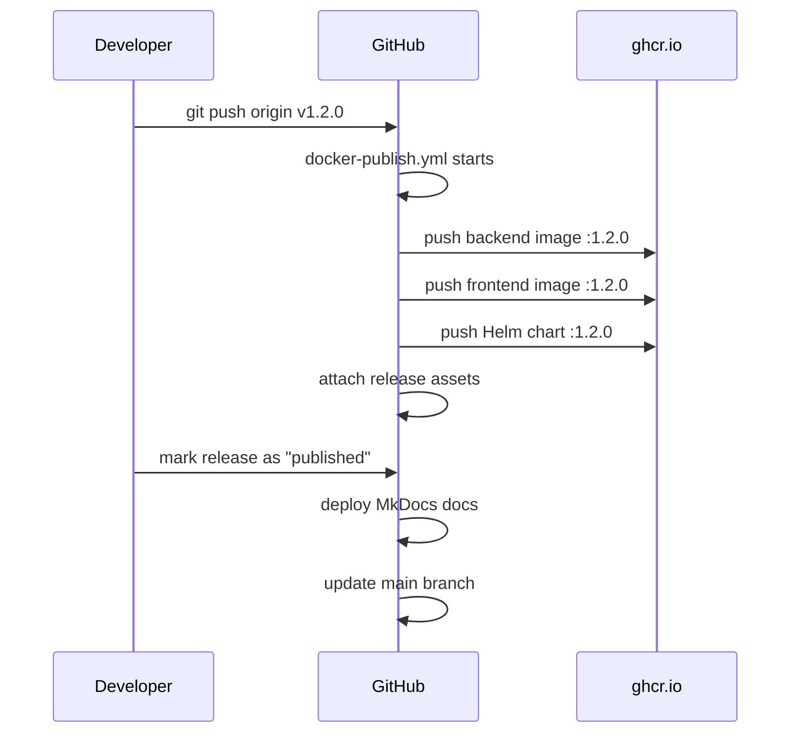
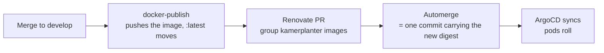

# CI/CD Pipeline

The Kamerplanter CI/CD pipeline runs entirely on **GitHub Actions**. It covers automated quality checks for backend and frontend, building and publishing container images, and automated Helm chart publication. Releases are triggered by Git tags and execute all steps in the correct order.

---

## Prerequisites

- Write access to the GitHub repository (`nolte/kamerplanter`)
- No manual secret configuration required — all workflows use the automatically available `GITHUB_TOKEN`
- Container images are pushed to the **GitHub Container Registry (GHCR)** under `ghcr.io/nolte/`

---

## Branch Strategy

```
feature/* ──► develop ──► (Release Tag v*) ──► main
```

| Branch | Purpose |
|--------|---------|
| `feature/*` | Development work; CI runs on pull requests targeting `develop` |
| `develop` | Integration branch; triggers CI and image builds |
| `main` | Represents the current stable release state; updated automatically after each release |

!!! note "Note"
    `main` is not used directly for development. Commits reach `main` through `develop` and Git tags. The `release-cd-refresh-master.yml` workflow handles this automatically after a published release.

---

## Workflow Overview

| File | Trigger | Purpose |
|------|---------|---------|
| `backend.yml` | Push/PR on `develop`, path `src/backend/**` | Lint + test backend |
| `frontend.yml` | Push/PR on `develop`, path `src/frontend/**` | Lint + test + build frontend |
| `docker-publish.yml` | Push on `develop` or `v*` tag | Build and publish container images + Helm chart |
| `skaffold-verify.yml` | PR on `develop`, path `skaffold.yaml`, `helm/**`, Dockerfiles | Helm lint + Skaffold diagnose |
| `release-drafter.yml` | Push on `develop` | Automatically update release notes draft |
| `release-cd-deliver-docs.yml` | Published release | Deploy MkDocs documentation to GitHub Pages |
| `release-cd-refresh-master.yml` | Published release | Update `main` branch to release state |

---

## Backend CI (`backend.yml`)

The backend CI workflow runs on every push to `develop` and on pull requests whenever files under `src/backend/` are changed.

### What is checked

1. **Ruff lint** — checks Python code for style and quality issues (`ruff check .`)
2. **Ruff format** — ensures the code is correctly formatted (`ruff format --check .`)
3. **Unit tests** — runs all tests under `tests/unit/` with pytest

```yaml title=".github/workflows/backend.yml (simplified)"
jobs:
  lint-test:
    runs-on: ubuntu-latest
    steps:
      - uses: actions/setup-python@v5
        with:
          python-version: '3.14'
          allow-prereleases: true

      - name: Install dependencies
        run: pip install -e ".[dev]"

      - name: Ruff lint
        run: ruff check .

      - name: Ruff format check
        run: ruff format --check .

      - name: Unit tests
        run: pytest tests/unit/ -v --tb=short
```

!!! tip "Local check before pushing"
    ```bash
    cd src/backend
    ruff check .
    ruff format --check .
    pytest tests/unit/ -v --tb=short
    ```

### Installing dependencies

Backend dependencies are installed from `pyproject.toml`. The `[dev]` extra includes pytest, ruff, and other development tools:

```bash
pip install -e ".[dev]"
```

---

## Frontend CI (`frontend.yml`)

The frontend CI workflow runs on every push to `develop` and on pull requests whenever files under `src/frontend/` are changed.

### What is checked

1. **TypeScript check** — strict type check without output (`tsc --noEmit`)
2. **ESLint** — quality check of the TypeScript/React code
3. **Vitest** — all unit and component tests
4. **Vite build** — ensures the production build compiles without errors

```yaml title=".github/workflows/frontend.yml (simplified)"
jobs:
  lint-test-build:
    runs-on: ubuntu-latest
    steps:
      - uses: actions/setup-node@v4
        with:
          node-version: 22    # (1)!
          cache: npm
          cache-dependency-path: src/frontend/package-lock.json

      - run: npm ci
      - run: npx tsc --noEmit
      - run: npm run lint
      - run: npm run test
      - run: npm run build
```

1. Only the `lint-test-build` job uses Node 22. The `bundle-budget` and `lighthouse` jobs in the same workflow run on Node 24 — matching the frontend Dockerfile, which builds with `node:24-alpine` (see [Frontend image](#frontend-image) below).

!!! tip "Local check before pushing"
    ```bash
    cd src/frontend
    npx tsc --noEmit
    npm run lint
    npm run test
    npm run build
    ```

### Build artifact

On a push to `develop` (not on PRs), the finished `dist/` directory is uploaded as a GitHub Actions artifact and retained for 7 days. This allows quick inspection of the build output without local compilation.

### Performance budgets & CI gates (`bundle-budget`, `lighthouse`)

Besides `lint-test-build`, the same workflow runs two standalone jobs that watch frontend load performance (internal reference: UI-NFR-003). Neither touches the required `static` check — a violation surfaces visibly without blocking automerge.

**`bundle-budget` — hard gate.** The job builds the frontend, then runs `npm run bundle:check` (script `scripts/check-bundle-budget.mjs`) to check the initial JavaScript and CSS bundle plus the dedicated `/dashboard` route chunk against the budgets in `bundle-budget.json`:

| Check | Budget (gzip) | Measured actual |
|---|---|---|
| Initial JavaScript bundle | 490 KB | ~471.8 KB |
| Initial CSS bundle | 50 KB | under budget |
| `/dashboard` route chunk | 12 KB | under budget |

Exceeding a budget fails the job; the bundle analyzer report (treemap via `rollup-plugin-visualizer`) is uploaded as the `bundle-stats` artifact. This budget is achievable thanks to a `manualChunks` vendor strategy in `vite.config.ts`: React, MUI core, Redux Toolkit, and react-i18next are eagerly grouped into stable, long-lived vendor chunks, while heavy route-scoped libraries (`recharts`, `@mui/x-*`, `react-grid-layout`) stay lazy.

!!! note "300 KB target not yet reached"
    UI-NFR-003 sets a target of 300 KB gzip for the initial JavaScript bundle. The current 490 KB budget only locks in the measured baseline against further silent growth — it does not yet meet the target. The main driver is the eagerly-loaded i18n translation bundle (~160 KB gzip). Reaching the 300 KB target requires lazy-loading the translations and is tracked as an open follow-up. <!-- UI-NFR-003 R-013 -->

!!! tip "Local check before pushing"
    ```bash
    cd src/frontend
    npm run build
    npm run bundle:check
    ```

**`lighthouse` — report-only.** The job runs `npm run lhci` (Lighthouse CI, mobile emulation with throttled 4G network) against the built `dist/` folder and checks the Core Web Vitals thresholds from UI-NFR-003 (First Contentful Paint < 1.5 s, Largest Contentful Paint < 2.5 s, Time to Interactive < 3.5 s, Cumulative Layout Shift < 0.1, Total Blocking Time < 200 ms) plus the performance and accessibility scores (≥ 0.9). All assertions in `lighthouserc.json` are configured at `warn` level — the job does not block the build but surfaces regressions in the report. The full report is uploaded as the `lighthouse-report` artifact.

---

## Container Build and Publication (`docker-publish.yml`)

This workflow builds and publishes all container images and the Helm chart. It is triggered by:

- Push to `develop` (when backend, frontend, or Helm files are changed)
- Push of a `v*` tag (release) — all components are built regardless of path changes
- Manually via `workflow_dispatch`

### Path-based filtering

To avoid rebuilding all images on every change, a `changes` job first determines which components are affected:

```
src/backend/**  →  build-backend
src/frontend/** →  build-frontend
helm/**         →  publish-helm-charts
```

On a `v*` tag or manual trigger, the filtering is skipped — all components are always built.

### Backend image

The backend image is based on `python:3.14-slim` and uses a multi-stage Dockerfile with a shared `base` stage plus separate `dev` and `prod` targets (`docker build .` without `--target` builds `prod` by default, since it is the last stage). The `dev` stage runs as root for Skaffold hot-reload; the `prod` stage runs as a non-root user (UID 1000):

```dockerfile title="src/backend/Dockerfile (simplified, prod stage)"
FROM python:3.14-slim AS base
WORKDIR /app
COPY pyproject.toml requirements.txt requirements-dev.txt ./

FROM base AS prod
RUN pip install --no-cache-dir --require-hashes -r requirements.txt \
    && pip install --no-cache-dir --no-deps .
COPY . .
RUN groupadd -g 1000 app && useradd -u 1000 -g 1000 -d /app -s /usr/sbin/nologin app \
    && chown -R 1000:1000 /app
USER 1000
EXPOSE 8000
CMD ["uvicorn", "app.main:app", "--host", "0.0.0.0", "--port", "8000"]
```

The image is pushed to `ghcr.io/nolte/kamerplanter-backend`. Dependencies come exclusively from the hash-pinned `requirements*.txt` locks (NFR-009), not directly from `pyproject.toml`.

### Frontend image {#frontend-image}

The frontend image also uses a multi-stage Dockerfile: first the React app is built with Node.js 24, then the static files are copied into a slim, **unprivileged** nginx image (does not run as root, compatible with `runAsNonRoot`):

```dockerfile title="src/frontend/Dockerfile (simplified)"
FROM node:24-alpine AS build
WORKDIR /app
COPY package.json package-lock.json ./
RUN npm ci
COPY . .
RUN npm run build

FROM nginxinc/nginx-unprivileged:1.31-alpine AS prod
COPY --from=build /app/dist /usr/share/nginx/html
COPY nginx.conf /etc/nginx/conf.d/default.conf
EXPOSE 8080
```

The image is pushed to `ghcr.io/nolte/kamerplanter-frontend`. The internal port is `8080` (unprivileged nginx can't bind to port 80), mapped to the public port 8080 in Docker Compose, and to port 80 on the service in the Helm chart.

### Image tags

Docker metadata is automatically generated via `docker/metadata-action`:

| Tag scheme | Example | When |
|-----------|---------|------|
| `latest` | `kamerplanter-backend:latest` | Push on `develop` |
| Commit SHA | `kamerplanter-backend:a3f7c2b` | Always |
| Branch name | `kamerplanter-backend:develop` | Push on branch |
| Semantic version | `kamerplanter-backend:1.2.0` | `v1.2.0` tag |
| Major.Minor | `kamerplanter-backend:1.2` | `v1.2.0` tag |

!!! warning "`latest` is a moving reference"

    `latest` is overwritten on every push to `develop` and points at different
    bytes afterwards. For anything that has to be reproducible — deployments,
    rollbacks, incident analysis — you need a reference that stays put. Since
    #987 the Helm chart therefore no longer uses a moving tag but an immutable
    digest: [Deployment and rollback](#deployment-and-rollback).

    How expensive the alternative is has been measured, not asserted: with
    `pullPolicy: IfNotPresent` — exactly what the chart sets — a node keeps
    serving **the old image** after a `rollout restart`, even though the
    registry has long been serving different bytes under the same tag.
    Kubernetes only forces `Always` for a `:latest` reference while
    `imagePullPolicy` is *unset*; an explicitly set `IfNotPresent` wins. That is
    how the `inference-service` served an image without the `/pest/*` routes for
    weeks.

### What secures each artifact

Every artifact class this project ships needs a named stage that secures it —
otherwise a gap only becomes visible once it is exploited. The matrix below
answers the question "what exactly does what guarantee?" and is maintained
alongside pipeline changes.

| Artifact class | Securing stage | Guarantees |
|---|---|---|
| Container images (8) | `build-*` in `docker-publish.yml` | built-from-source, integrity (digest), provenance (signed) |
| Helm chart (OCI) | `publish-helm-charts` | built-from-source, integrity (digest), provenance (signed) |
| `openapi.json` (release asset) | `openapi-asset` in `release-publish.yml` | built-from-source, attachment verified after upload |
| `docker-compose-<version>.yml`, `.env.example-<version>` | `update-release-assets` | built-from-source |
| Python dependencies | `pip-audit`, `pip-licenses`, `lock-staleness` in `backend.yml` | policy-cleared (CVE, licence, lock integrity) |

**Known gaps** — deliberately open, not overlooked:

- The three release assets carry **no** provenance. GitHub-hosted release files
  have no verification path equivalent to the registry attestation.
- JavaScript dependencies have no dedicated policy stage yet; Trivy covers them
  only at `CRITICAL` severity.

#### Verifying provenance

Images and the chart carry platform-generated, signed build provenance
(`actions/attest-build-provenance`). Verify before deploying:

```bash
gh attestation verify \
  oci://ghcr.io/nolte/kamerplanter-backend:1.2.0 \
  --repo nolte/kamerplanter
```

What it says and what it does not: provenance establishes **origin** — which
commit, which workflow run, which pinned inputs. It is **not** a statement that
an artifact is secure. Security findings remain the concern of the supply-chain
stages.

### Helm chart

The Helm chart for Kamerplanter lives under `helm/kamerplanter/` and is pushed as an OCI artifact:

```
oci://ghcr.io/nolte/charts/kamerplanter
```

On a release tag, `version` and `appVersion` in `Chart.yaml` are automatically set to the release version before the chart is packaged. At the same time `scripts/ci/pin_chart_image_digests.sh` pins every Kamerplanter image in `values.yaml` to `<version>@sha256:<digest>` — addressed by YAML path rather than by text-replacing the literal `tag: latest`. The same run then re-reads the file and aborts the release if any Kamerplanter image survived the substitution.

The digest is resolved from the registry rather than handed over from the build jobs. That also proves `<image>:<version>` exists at all — which is why `publish-helm-charts` has been ordered behind the image builds via `needs:` since #987. And it is the difference between "immutable" and "immutable by convention": a version tag can be re-pushed, a digest cannot.

!!! info "Why not just the version?"

    Until #987 this step pinned the bare version tag. That was better than the
    `:latest` the develop tree carried, but a tag remains a reference to a
    *name*: re-run the publish workflow for an existing tag and the same name
    points at different bytes, with no way for a consumer to notice.

```bash
# Pull the chart directly
helm pull oci://ghcr.io/nolte/charts/kamerplanter --version 1.2.0
```

### Layer caching

All image builds use the GitHub Actions cache (`type=gha`) for Docker layers. This significantly speeds up subsequent builds when only a few layers change.

---

## Skaffold Verify (`skaffold-verify.yml`)

This workflow runs on pull requests to `develop` when `skaffold.yaml`, Helm files, or Dockerfiles are changed. It ensures the local development environment remains functional.

### What is checked

1. **`helm dependency build`** — downloads chart dependencies (bjw-s common chart, valkey)
2. **`helm lint`** — checks the Helm chart for syntax errors using dev values
3. **`helm template`** — renders all Kubernetes manifests and validates the templating logic
4. **`skaffold diagnose`** — validates the Skaffold configuration
5. **`skaffold render`** — generates rendered manifests and uploads them as an artifact

!!! note "Skaffold is for local development only"
    Skaffold is used exclusively for the local development environment (Kind cluster). Production deployments do not go through Skaffold — they use the `docker-publish` workflow in combination with the Helm chart.

---

## Release Process

A full release consists of several automatic steps triggered by publishing a GitHub release.

### Step 1: Prepare release draft (automatic)

The `release-drafter` workflow automatically updates a release draft on every push to `develop` with the changes since the last tag.

### Step 2: Set release tag

```bash
git tag v1.2.0
git push origin v1.2.0
```

The tag triggers `docker-publish.yml` and builds all images and the Helm chart with the correct version number.

### Step 3: Publish the release

When the GitHub release is marked as "published", two additional workflows start:

**`release-cd-deliver-docs.yml`** — deploys the MkDocs documentation to GitHub Pages via a reusable workflow from `nolte/gh-plumbing`.

**`release-cd-refresh-master.yml`** — updates the `main` branch to the state of the new release tag. `main` therefore always points to the last published stable state.

### Step 4: Release assets (automatic)

The `update-release-assets` job in the `docker-publish` workflow attaches the following files to the release:

- `docker-compose-1.2.0.yml` — versioned Docker Compose file for self-hosting
- `.env.example-1.2.0` — environment variable template
- Container image references and Helm pull command in the release notes

### Release flow summary

<!-- diagram-source: user-described — release publish sequence from git tag push to docs deploy and main branch update -->

```mermaid
sequenceDiagram
    participant Dev as Developer
    participant GH as GitHub
    participant GHCR as ghcr.io

    Dev->>GH: git push origin v1.2.0
    GH->>GH: docker-publish.yml starts
    GH->>GHCR: push backend image :1.2.0
    GH->>GHCR: push frontend image :1.2.0
    GH->>GHCR: push Helm chart :1.2.0
    GH->>GH: attach release assets
    Dev->>GH: mark release as "published"
    GH->>GH: deploy MkDocs docs
    GH->>GH: update main branch
```

---

## Deployment and rollback

A cluster does **not** learn about a new version because a tag was moved. The chart references every Kamerplanter image by an immutable digest:

```yaml
image:
  repository: ghcr.io/nolte/kamerplanter-backend
  tag: latest@sha256:af9bec…   # (1)!
  pullPolicy: IfNotPresent      # (2)!
```

1. What matters is the part **after** the `@`. The digest is content-addressed and cannot move. The `latest` in front of it is not a moving reference here but a label recording which channel the digest came from — nothing resolves it. It sits on the same line because that is the notation Renovate maintains (see below).
2. Deliberately stays `IfNotPresent`. A digest is content-addressed: an image already on the node **is** the requested one, so a re-pull could only confirm it. `Always` would make every pod start depend on GHCR being reachable and would gain nothing.

### How a new version reaches the cluster


```mermaid
graph LR
    A[Merge to develop] --> B[docker-publish<br/>pushes the image, :latest moves]
    B --> C[Renovate PR<br/>group kamerplanter images]
    C --> D[Automerge<br/>= one commit carrying the new digest]
    D --> E[ArgoCD syncs<br/>pods roll]
```

A deploy is therefore a **commit**, not an operation on the cluster. Renovate keeps the digests current (`renovate.json5`, rule `kamerplanter images`); that they are present at all is enforced by `scripts/check_chart_image_digests.py` in the required `static` check.

### Rollback

```bash
# 1. Find the commit that set the digest
git log --oneline -- helm/kamerplanter/values.yaml

# 2. Revert it — that is the entire rollback
git revert <commit>
```

ArgoCD syncs the previous digest and the pods roll back. Verify the result **in the running pod**, not in the values file and not from a controller status:

```bash
kubectl get pod -n kamerplanter -l app.kubernetes.io/name=backend \
  -o jsonpath='{range .items[*]}{.metadata.name}{"  "}{.status.containerStatuses[0].imageID}{"\n"}{end}'
```

`imageID` names the digest the kubelet actually started. It has to match the one that is in `values.yaml` after the revert.

!!! danger "Do not edit the running cluster"

    `syncPolicy.automated.selfHeal: true` undoes any `kubectl edit` or
    `kubectl set image` within minutes. A rollback that is not in Git is not a
    rollback, it is a delay.

!!! warning "What now makes a deploy slower"

    A publish is live only once the Renovate PR has merged. Renovate runs on a
    schedule, not on demand — for a hotfix, tick the refresh checkbox in the
    Dependency Dashboard issue instead of waiting. The previous route
    (`workflow_dispatch` + `kubectl rollout restart`) is no route at all: as
    measured above, it never reliably pulled a new image in the first place.

### Production: the pin also lives in the GitOps repository

The ArgoCD `Application` for the Talos cluster is **not** in this repository but in `k8s-home-lab` (`src/applications/kamerplanter/deploy/argocd/application.yaml`). It pulls the chart at a release tag (`targetRevision: vX.Y.Z`) and overrides `image.tag` per controller.

!!! warning "A `tag` override in the Application manifest erases the digest"

    The override beats the chart default. If it says `tag: "0.1.0"`, production
    runs on a moving reference regardless. Now that the chart brings its own
    digests, those overrides are redundant: `targetRevision` selects the
    version, the chart selects the bytes. A rollback is then the revert of the
    GitOps commit that raised `targetRevision`.

---

## Pulling GHCR packages

All images are publicly readable. For local testing:

=== "Backend"

    ```bash
    docker pull ghcr.io/nolte/kamerplanter-backend:latest
    docker pull ghcr.io/nolte/kamerplanter-backend:1.2.0
    ```

=== "Frontend"

    ```bash
    docker pull ghcr.io/nolte/kamerplanter-frontend:latest
    docker pull ghcr.io/nolte/kamerplanter-frontend:1.2.0
    ```

=== "Helm chart"

    ```bash
    helm pull oci://ghcr.io/nolte/charts/kamerplanter --version 1.2.0
    helm install kamerplanter oci://ghcr.io/nolte/charts/kamerplanter --version 1.2.0
    ```

---

## Frequently Asked Questions

??? question "Why does the backend CI fail even though tests pass locally?"
    Make sure you are using Python 3.14 (`python --version`). The CI explicitly uses `python-version: '3.14'` with `allow-prereleases: true`. Differing Python versions can lead to different behavior. Also check that all dependencies are installed with `pip install -e ".[dev]"`.

??? question "Why is no new image built even though I pushed to develop?"
    Path filtering in `docker-publish.yml` ensures that only actually affected components are built. If you only changed a spec file, for example, no image will be built. On `v*` tags, filtering is bypassed.

??? question "How do I update the Helm chart manually?"
    You can trigger `docker-publish.yml` manually via `workflow_dispatch`. Navigate in GitHub to **Actions → Build & Publish Container Images → Run workflow**.

??? question "When is main updated?"
    `main` is updated exclusively and automatically by `release-cd-refresh-master.yml` after a published release. Direct pushes to `main` are not intended.

??? question "How do I see which image version is currently running?"
    The image digest labels (`org.opencontainers.image.*`) are embedded in every image. You can read them with `docker inspect <image>` or check the GHCR package tab on GitHub.

---

## See also

- [Kubernetes Deployment](kubernetes.md)
- [Helm Chart Configuration](helm.md)
- [Local Development Setup](../development/local-setup.md)
