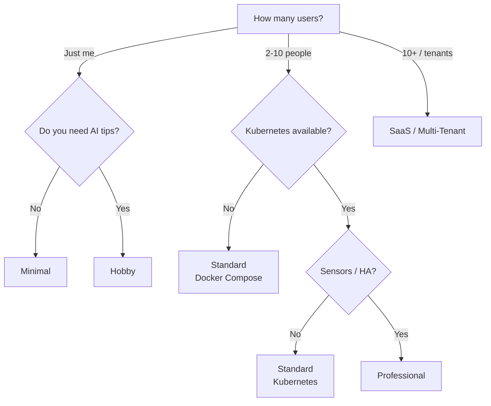

# Deployment Profiles

Kamerplanter is modular by design. You decide which components to run — from a lean setup on a Raspberry Pi to a full multi-tenant deployment on Kubernetes. This page helps you find the right profile for your use case.

---

## Component Overview

Every Kamerplanter installation consists of a **core** (always required) and **optional components** that you enable as needed.

### Core (always active)

| Component | Purpose |
|-----------|---------|
| **Backend** (FastAPI) | REST API, business logic, phase control, fertilization plans |
| **Frontend** (React) | Web interface |
| **ArangoDB** | Primary database (documents + graph queries) |
| **Valkey** (Redis-compatible) | Cache and Celery broker |
| **Celery Worker + Beat** | Background tasks (care reminders, data enrichment, AI tips) |

### Optional Components

| Component | Purpose | Resource requirements | Configuration |
|-----------|---------|----------------------|---------------|
| **Operating mode** | `light` = no login, single user; `full` = JWT auth, multi-tenant | — | `KAMERPLANTER_MODE` |
| **AI assistant** | Care tips, diagnostics, recommendations via language model | 2--8 GB RAM (local) | `AI_DEFAULT_PROVIDER` |
| **Ollama** | Local language model execution (no data leaves your network) | 4--16 GB RAM, optional GPU | Docker profile `ollama` |
| **Knowledge Service** | RAG pipeline: search knowledge base, enrich context | 512 MB RAM | Separate deployment |
| **VectorDB** (pgvector) | Vector store for RAG embeddings | 256 MB RAM | `VECTORDB_ENABLED` |
| **Embedding Service** | ONNX-based embedding computation (no PyTorch) | 512 MB RAM | Separate deployment |
| **TimescaleDB** | Time-series sensor data, automatic downsampling | 256--512 MB RAM | `TIMESCALEDB_ENABLED` |
| **Home Assistant** | Sensor and actuator integration (temperature, humidity, lights) | External | `HA_URL` + `HA_ACCESS_TOKEN` |
| **External enrichment** | Auto-enrich plant data from GBIF and Perenual | — | `PERENUAL_API_KEY` |

---

## Profiles at a Glance

The following matrix shows five predefined profiles. Each profile is a recommendation — you can always add or remove individual components.

| | Minimal | Hobby | Standard | Professional | SaaS |
|---|:---:|:---:|:---:|:---:|:---:|
| **Infrastructure** | Docker Compose | Docker Compose | Docker Compose / K8s | Kubernetes | Kubernetes |
| **Operating mode** | Light | Light | Full | Full | Full |
| **AI assistant** | — | Ollama (local) | Ollama (local) | Ollama + cloud fallback | Cloud (OpenAI / Anthropic) |
| **Knowledge Service + RAG** | — | — | Optional | Yes | Yes |
| **TimescaleDB** | — | — | Optional | Yes | Yes |
| **Home Assistant** | — | Optional | Optional | Yes | Optional |
| **External enrichment** | — | Optional | Yes | Yes | Yes |
| **Celery Worker** | Yes | Yes | Yes | Yes | Yes |
| **Target audience** | Raspberry Pi, quick trial | Hobby grower, home server | Engaged hobbyists, small community gardens | Indoor growing, large community gardens | Managed hosting, multiple tenants |
| **Total RAM** | ~1 GB | ~3 GB | ~4 GB | ~6 GB | ~8 GB |

---

## Minimal

### Target audience

You want to try Kamerplanter quickly or only have a few houseplants. A Raspberry Pi 4/5 or an old laptop is sufficient. You need neither login nor AI.

### Requirements

- Docker + Docker Compose
- 1 GB free RAM, 2 GB disk space
- Raspberry Pi 4 (2 GB), Raspberry Pi 5, NUC, laptop

### Active components

- [x] Backend + Frontend
- [x] ArangoDB + Valkey
- [x] Celery Worker + Beat
- [ ] AI assistant
- [ ] TimescaleDB
- [ ] Home Assistant
- [ ] Knowledge Service / RAG

### Example configuration

```yaml title="docker-compose.yml (excerpt)"
services:
  arangodb:
    image: arangodb:3.11
    # ...

  valkey:
    image: valkey/valkey:8-alpine
    # ...

  backend:
    build: ./src/backend
    environment:
      KAMERPLANTER_MODE: light
      AI_DEFAULT_PROVIDER: none
      TIMESCALEDB_ENABLED: "false"
      VECTORDB_ENABLED: "false"
    depends_on: [arangodb, valkey]

  celery-worker:
    build: ./src/backend
    command: celery -A app.tasks worker --loglevel=info
    depends_on: [arangodb, valkey]

  celery-beat:
    build: ./src/backend
    command: celery -A app.tasks beat --loglevel=info
    depends_on: [arangodb, valkey]

  frontend:
    build: ./src/frontend
    environment:
      KAMERPLANTER_MODE: light
    depends_on: [backend]
```

### What you gain by upgrading

Without the AI assistant you get no automatic care tips or diagnostics. You can add Ollama at any time without losing data.

---

## Hobby

### Target audience

You have 10--50 plants and a home server (NAS, old desktop, NUC). You want AI-powered care tips, but your data should not leave your network. You do not need login — you are the only user.

### Requirements

- Docker + Docker Compose
- 4 GB free RAM (8 GB with 7B model), optional GPU
- Home server, NUC, desktop PC

### Active components

- [x] Backend + Frontend
- [x] ArangoDB + Valkey
- [x] Celery Worker + Beat
- [x] Ollama (local language model)
- [ ] Knowledge Service / RAG (optionally enabled)
- [ ] TimescaleDB
- [ ] Home Assistant (optional)
- [ ] External enrichment (optional)

### Example configuration

```yaml title="docker-compose.yml (excerpt)"
services:
  # ... core as in Minimal ...

  backend:
    build: ./src/backend
    environment:
      KAMERPLANTER_MODE: light
      AI_DEFAULT_PROVIDER: ollama
      AI_OLLAMA_URL: http://ollama:11434
      AI_OLLAMA_MODEL: gemma3:4b
      TIMESCALEDB_ENABLED: "false"
    depends_on: [arangodb, valkey]

  ollama:
    image: ollama/ollama:latest
    volumes:
      - ollama_models:/models
    # GPU passthrough (optional):
    # deploy:
    #   resources:
    #     reservations:
    #       devices:
    #         - capabilities: [gpu]
```

!!! tip "Model selection"
    Start with `gemma3:4b` — it runs on most machines from 2020 onwards without a GPU. For details on model selection, see [AI Provider Setup](../user-guide/ai-providers.md#ollama-lokal-empfohlen).

### What you gain by upgrading

Without full mode you cannot invite additional users. Without TimescaleDB, sensor data is not stored long-term. Both can be enabled later.

---

## Standard

### Target audience

You are an engaged hobbyist or run a small community garden. Multiple people should have their own accounts. You want AI tips and optionally store sensor data long-term.

### Requirements

- Docker Compose or Kubernetes cluster
- 4--6 GB free RAM
- Server, NUC, or small K8s cluster

### Active components

- [x] Backend + Frontend
- [x] ArangoDB + Valkey
- [x] Celery Worker + Beat
- [x] Ollama (local language model)
- [x] External enrichment (GBIF + Perenual)
- [ ] Knowledge Service / RAG (optional)
- [ ] TimescaleDB (optional)
- [ ] Home Assistant (optional)

### Example configuration

=== "Docker Compose"

    ```yaml title="docker-compose.yml (excerpt)"
    services:
      # ... core + Ollama ...

      backend:
        build: ./src/backend
        environment:
          KAMERPLANTER_MODE: full
          AI_DEFAULT_PROVIDER: ollama
          AI_OLLAMA_URL: http://ollama:11434
          AI_OLLAMA_MODEL: gemma3:4b
          JWT_SECRET_KEY: ${JWT_SECRET_KEY}  # openssl rand -hex 32
          PERENUAL_API_KEY: ${PERENUAL_API_KEY}
          TIMESCALEDB_ENABLED: ${TIMESCALEDB_ENABLED:-false}
        depends_on: [arangodb, valkey]
    ```

=== "Helm Values"

    ```yaml title="values.yaml (excerpt)"
    controllers:
      backend:
        containers:
          main:
            env:
              KAMERPLANTER_MODE: full
              AI_DEFAULT_PROVIDER: ollama
              AI_OLLAMA_URL: http://ollama:11434
              AI_OLLAMA_MODEL: gemma3:4b
              TIMESCALEDB_ENABLED: "false"
    ```

!!! note "TimescaleDB only needed with sensors"
    If you do not plan to connect sensors or Home Assistant, you can skip TimescaleDB. Manual measurements (pH, EC) are stored in ArangoDB. TimescaleDB becomes useful only with automatic, high-frequency data collection.

### What you gain by upgrading

Without TimescaleDB there is no automatic downsampling of sensor data. Without Home Assistant there is no automatic sensor collection or actuator control. Without the Knowledge Service / RAG there are no context-enriched AI responses from the knowledge base.

---

## Professional

### Target audience

You run professional indoor growing or a large community garden with role management. Sensors and actuators are connected via Home Assistant. You want seamless time-series storage, AI diagnostics with RAG context, and cloud fallback for the language model.

### Requirements

- Kubernetes cluster (3+ nodes recommended)
- 6--8 GB RAM for Kamerplanter pods
- Home Assistant instance on the network
- Optional: GPU node for faster AI inference

### Active components

- [x] Backend + Frontend
- [x] ArangoDB + Valkey
- [x] Celery Worker + Beat
- [x] Ollama + cloud fallback (OpenAI or Anthropic)
- [x] Knowledge Service + VectorDB + Embedding Service
- [x] TimescaleDB
- [x] Home Assistant
- [x] External enrichment (GBIF + Perenual)

### Example configuration

```yaml title="values.yaml (excerpt)"
controllers:
  backend:
    containers:
      main:
        env:
          KAMERPLANTER_MODE: full
          AI_DEFAULT_PROVIDER: ollama
          AI_OLLAMA_URL: http://ollama:11434
          AI_OLLAMA_MODEL: mistral:7b
          AI_FALLBACK_PROVIDER: openai
          AI_OPENAI_API_KEY:
            secretKeyRef:
              name: kamerplanter-secrets
              key: openai-api-key
          TIMESCALEDB_ENABLED: "true"
          TIMESCALEDB_HOST: timescaledb
          HA_URL: http://homeassistant.home:8123
          HA_ACCESS_TOKEN:
            secretKeyRef:
              name: kamerplanter-secrets
              key: ha-access-token
          PERENUAL_API_KEY:
            secretKeyRef:
              name: kamerplanter-secrets
              key: perenual-api-key

  timescaledb:
    enabled: true

  knowledge-service:
    enabled: true

  embedding-service:
    enabled: true

  vectordb:
    enabled: true
```

!!! warning "Keep secrets out of values.yaml"
    API keys and tokens belong in Kubernetes Secrets or an external secret manager (e.g., Sealed Secrets, External Secrets Operator). Use `secretKeyRef` in the Helm values.

### What you gain by upgrading

In the Professional profile you run a single instance for your organization. The SaaS profile adds multi-tenant isolation, horizontal scaling, and cloud AI as the primary provider.

---

## SaaS / Multi-Tenant

### Target audience

You operate Kamerplanter as a platform for multiple independent tenants (gardens, businesses, communities). Each tenant has its own data, roles, and settings. You need horizontal scaling and reliable cloud AI.

### Requirements

- Kubernetes cluster with autoscaling
- 8+ GB RAM for Kamerplanter pods
- Managed database services recommended (ArangoDB Oasis, managed PostgreSQL)
- Cloud AI provider account (OpenAI or Anthropic)

### Active components

- [x] Backend + Frontend (multiple replicas)
- [x] ArangoDB + Valkey
- [x] Celery Worker (multiple replicas) + Beat
- [x] Cloud AI (OpenAI / Anthropic)
- [x] Knowledge Service + VectorDB + Embedding Service
- [x] TimescaleDB
- [x] External enrichment (GBIF + Perenual)
- [ ] Home Assistant (optional, tenant-specific)

### Example configuration

```yaml title="values.yaml (excerpt)"
controllers:
  backend:
    replicas: 3
    containers:
      main:
        env:
          KAMERPLANTER_MODE: full
          AI_DEFAULT_PROVIDER: openai
          AI_OPENAI_MODEL: gpt-4o-mini
          TIMESCALEDB_ENABLED: "true"

  celery-worker:
    replicas: 2

  frontend:
    replicas: 2
```

!!! tip "Managed databases"
    In SaaS operation, consider using managed database services instead of self-hosted containers. This significantly reduces operational overhead for backups, updates, and high availability.

---

## Build Your Own Profile

The profiles above are recommendations. You can enable or disable any component individually by setting the corresponding environment variables:

| Decision | Variable | Values |
|----------|----------|--------|
| Login and multi-tenant? | `KAMERPLANTER_MODE` | `light` / `full` |
| AI care tips? | `AI_DEFAULT_PROVIDER` | `ollama`, `llamacpp`, `openai`, `anthropic`, `openai-compatible`, `none` |
| Sensor time-series? | `TIMESCALEDB_ENABLED` | `true` / `false` |
| RAG knowledge base? | `VECTORDB_ENABLED` | `true` / `false` |
| Home Assistant? | `HA_URL` + `HA_ACCESS_TOKEN` | URL + token (empty = disabled) |
| Plant data enrichment? | `PERENUAL_API_KEY` | API key (empty = GBIF only) |

In Docker Compose, enable optional services via profiles:

```bash
# Core only:
docker compose up -d

# With Ollama and TimescaleDB:
docker compose --profile ollama --profile timescaledb up -d

# With everything:
docker compose --profile ollama --profile timescaledb --profile vectordb up -d
```

For a complete list of all environment variables, see [Environment Variables](../reference/environment-variables.md).

---

## Decision Guide

The following flowchart helps you find a suitable profile:



---

## Frequently Asked Questions

### Can I upgrade to a larger profile later?

Yes. All profiles use the same database. You can add components at any time (e.g., enable Ollama, start TimescaleDB, switch from light to full mode) without losing data. When switching from light to full mode, you need to set a password for the existing system user once.

### Can I run Ollama on a Raspberry Pi?

Yes, starting with the Raspberry Pi 5 with 8 GB RAM. Use a small model like `llama3.2:3b`. Response times are 15--30 seconds per tip — acceptable but not fast. The Raspberry Pi 4 does not have sufficient performance for larger models.

### Do I need TimescaleDB without sensors?

No. Without automatic sensor data collection (IoT/MQTT or Home Assistant), TimescaleDB provides no benefit. Manual measurements (pH, EC) are stored in ArangoDB. You can enable TimescaleDB later when you connect sensors.

### What happens if I do not configure an AI provider?

Kamerplanter works fully without AI. When `AI_DEFAULT_PROVIDER=none` is set (or no provider is configured), the AI tip cards are not shown in the interface. All rule-based features (phase control, fertilization plans, care reminders) operate independently of the AI provider.

---

## See also

- [Light Mode](../user-guide/light-mode.md) — Details on running without authentication
- [AI Provider Setup](../user-guide/ai-providers.md) — Configure Ollama, OpenAI, Anthropic, and other providers
- [Home Assistant Integration](../guides/home-assistant-integration.md) — Sensor and actuator integration
- [Environment Variables](../reference/environment-variables.md) — Complete variable reference
- [Kubernetes](kubernetes.md) — Cluster setup and deployment
- [Infrastructure — Skaffold Profiles](../architecture/infrastructure.md#skaffold-profiles-and-modules) — Skaffold modules (`-m ki`) for the AI stack
