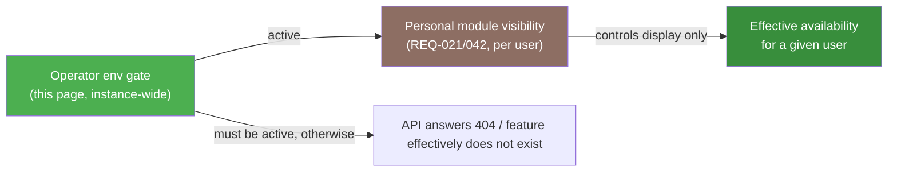

# Configuration Matrix

This page is the exhaustive operator reference: for practically every Kamerplanter feature, it shows which services must run for it, the exact environment variable or Helm switch that turns it on or off, which secrets are mandatory, how much CPU/RAM/storage it adds, and whether a missing prerequisite blocks startup.

!!! tip "Start with bundles"
    If you do not want to assemble every feature individually, start with the five ready-made bundles under [Deployment Profiles](betriebsprofile.md). This page is the exhaustive per-feature reference behind them.

---

## How to read this matrix

Every table below follows the same column layout:

| Column | Meaning |
|---|---|
| **Feature** | The feature or sub-feature, named in plain language. |
| **Required services/components** | Which pods/containers must run for it — referring to `helm/kamerplanter/values.yaml` controller names or external services. |
| **Activation/deactivation** | The exact environment variable from `src/backend/app/config/settings.py` (or `src/knowledge-service/app/config.py` / `src/inference-service/app/config.py`) or the Helm toggle path. |
| **Mandatory secrets/prerequisites** | Values that must be set for the feature to actually work (not just "not crash"). |
| **Resource impact** | CPU/RAM/storage delta over the core, from `resources.requests`/`resources.limits` in `values.yaml` (or `values-dev-ki.yaml`, where no chart defaults exist for production — see the note there). |
| **Startup gate?** | Does `insecure_default_secrets()` (`src/backend/app/main.py`) or the respective microservice's `check_insecure_config()` refuse to start when a prerequisite is missing? |

<!-- Source: src/backend/app/config/settings.py, helm/kamerplanter/values.yaml, src/backend/app/main.py (insecure_default_secrets), src/knowledge-service/app/auth.py, src/inference-service/app/auth.py -->

---

## Two separate on/off layers — do not confuse them {#zwei-ebenen}

Kamerplanter has two independent visibility/activation layers that are frequently confused in support conversations:

| Layer | Who sets it? | Effect | Example |
|---|---|---|---|
| **Operator env gate** (this page) | The instance operator, via environment variable/Helm value, applies **instance-wide** | Fully disables a backend endpoint (HTTP 404) or prevents a pod from starting at all. No user can bypass it. | `AI_FEATURES_ENABLED=false` makes `/ai/*` answer with HTTP 404 instance-wide. |
| **Personal module visibility** (REQ-021/042) | Every user for themselves, in Account Settings under "Modules & Features" | Pure **display preference** — hides a navigation area in the UI, changes nothing about data or API availability. | A user hides "Tank Management" even though the feature is active instance-wide. |

A feature disabled via the operator env gate can **not** be re-enabled by any user through module visibility — the two layers work in series, not in parallel. Details on the user-level layer: [Modules & Features](../user-guide/module-visibility.md).

---

## Mandatory secrets per enabled feature {#pflicht-secrets-je-aktivierter-funktion}

<!-- Source: src/backend/app/main.py (insecure_default_secrets), src/knowledge-service/app/auth.py (check_insecure_config), src/inference-service/app/auth.py (check_insecure_config) -->

This overview bundles the boot blockers across all three processes — backend, Knowledge Service, Inference Service. All three check their own secrets at startup and abort with `SystemExit` when they are missing (effective only when `DEBUG=false`, see [Environment Variables — Operating Mode](../reference/environment-variables.md#betriebsmodus)).

| Secret | Process | When mandatory? | Check |
|---|---|---|---|
| `JWT_SECRET_KEY` | Backend | **Always**, regardless of enabled features | Value must no longer be `change-me-in-production-use-openssl-rand-hex-32` |
| `ARANGODB_PASSWORD` | Backend | **Always** | Value must no longer be `rootpassword` |
| `FERNET_KEY` | Backend | **Always** — regardless of whether OIDC providers are used | Must not be empty; must be a valid Fernet key (32 bytes, url-safe base64, 44 characters) |
| `ERASURE_TOMBSTONE_SALT` | Backend | **Always** — regardless of whether GDPR erasure requests are actively used | Must be at least 32 characters long |
| `TIMESCALEDB_PASSWORD` | Backend | Only when `TIMESCALEDB_ENABLED=true` | Value must no longer be `changeme` |
| `INTERNAL_SERVICE_TOKEN` | Backend | Only when `KNOWLEDGE_SERVICE_ENABLED=true` **or** `INFERENCE_SERVICE_ENABLED=true` | Must not be empty |
| `INTERNAL_SERVICE_TOKEN` | Knowledge Service | Always, whenever the process runs at all (its own gate, independent of the backend gate) | Must not be empty |
| `VECTORDB_PASSWORD` | Knowledge Service | Always, whenever the process runs at all | Value must no longer be `changeme` |
| `INTERNAL_SERVICE_TOKEN` | Inference Service | Always, whenever the process runs at all | Must not be empty |
| `VECTORDB_PASSWORD` | Inference Service | Always, whenever the process runs at all | Value must no longer be `changeme` |

!!! danger "The first four rows affect EVERY production instance"
    `JWT_SECRET_KEY`, `ARANGODB_PASSWORD`, `FERNET_KEY`, and `ERASURE_TOMBSTONE_SALT` are **not feature flags** — they are checked regardless of which of the optional features listed below are active. A fresh production instance without these four values simply refuses to start (`SystemExit`) once `DEBUG=false` is set.

!!! note "`INTERNAL_SERVICE_TOKEN` must be identical everywhere"
    The backend, Celery worker/beat, Knowledge Service, and Inference Service must all receive the **same** `INTERNAL_SERVICE_TOKEN` value (one Kubernetes secret, injected into all four controllers via `envFrom`/`secretKeyRef`) — it is a shared M2M secret, not a per-service token.

---

## Plant Identification <!-- REQ-029 / REQ-029-A / REQ-048 --> {#pflanzenidentifikation-req-029}

| Feature | Required services | Activation/deactivation | Mandatory secrets/prerequisites | Resource impact | Startup gate? |
|---|---|---|---|---|---|
| Pl@ntNet (cloud, free tier ≤ 500/day) <!-- REQ-029 --> | Backend (external HTTP call) | `PLANTNET_API_KEY` set **and** `PLANTNET_ENABLED=true` (default) | `PLANTNET_API_KEY` | no additional pods | No |
| Plant.id / Kindwise (cloud, operator opt-in) <!-- REQ-029 --> | Backend (external HTTP call) | `PLANT_ID_API_KEY` set | `PLANT_ID_API_KEY` | no additional pods | No |
| Self-hosted DINOv2 recognition <!-- REQ-029-A --> | `inference-service` + `vectordb` (dedicated Helm controllers) | `INFERENCE_SERVICE_ENABLED=true` **and** `controllers.vectordb.enabled=true` **and** `controllers.inference-service.enabled=true` | `INTERNAL_SERVICE_TOKEN`, `POSTGRES_PASSWORD` (one secret key, shared by `vectordb` and `inference-service`) | `inference-service`: 250m/2 CPU, 512Mi/2Gi RAM; `vectordb`: 50m/500m CPU, 128Mi/512Mi RAM + 5Gi PVC | Yes — `internal_service_token` (backend gate) + the `inference-service`/`vectordb` process's own gate |
| Allow the external recognition path in Light Mode <!-- REQ-034 §4a.3 --> | Backend | `IDENTIFICATION_EXTERNAL_IN_LIGHT_MODE=true` (default `false`) | — | — | No |
| Species identity resolution/deduplication <!-- REQ-048 --> | Backend (part of the adapters above) | No dedicated switch — always runs once an identification adapter is active | — | — | No |

Full setup (activation order, populating the reference index): [Setting Up Plant Identification](inference-service.md).

---

## Pest Detection <!-- REQ-044 --> {#schaedlingserkennung-req-044}

| Feature | Required services | Activation/deactivation | Mandatory secrets/prerequisites | Resource impact | Startup gate? |
|---|---|---|---|---|---|
| Master switch | — | `PEST_DETECTION_ENABLED=true` (default `false`) | — | — | No |
| Symptom-pattern recognition (mode 2, default adapter) | `inference-service` (shared with plant identification) | `PEST_DETECTION_SYMPTOM_ENABLED=true` (default) — only effective when `PEST_DETECTION_ENABLED=true` | Same as the inference service above | shares the `inference-service` pod, no extra requirement | Yes (via the shared inference service gate) |
| Direct detector (mode 1, phase 2, D-FINE/RF-DETR ONNX) | `inference-service` | `PEST_DETECTION_DETECTOR_ENABLED=true` (default `false`) | Trained ONNX detector baked into the service image | shares the `inference-service` pod | Yes (via the shared inference service gate) |
| Demo adapter (placeholder findings, no real model) | none | `PEST_DETECTION_DEMO_ENABLED=true` (default `false`) — **not** for real decisions | — | none | No |
| Cloud adapter (Kindwise `plant.health`) | Backend (external HTTP call) | `PEST_DETECTION_CLOUD_ENABLED=true` **and** `PEST_DETECTION_CLOUD_API_KEY` set | `PEST_DETECTION_CLOUD_API_KEY` | no additional pods | No |

---

## CV Disease Diagnosis <!-- REQ-038 --> {#cv-krankheitsdiagnose-req-038}

| Feature | Required services | Activation/deactivation | Mandatory secrets/prerequisites | Resource impact | Startup gate? |
|---|---|---|---|---|---|
| Self-hosted CV diagnosis (ONNX PlantDoc classifier) | `inference-service` (shared) | `CV_DIAGNOSIS_ENABLED=true` (default `false`) | Same as the inference service above — reuses the existing `INFERENCE_SERVICE_URL`/`INTERNAL_SERVICE_TOKEN` connection, no dedicated connection variables | shares the `inference-service` pod | Yes (via the shared inference service gate) |
| PlantCV phenotype panel (leaf area, greenness index) | `inference-service` (shared) | `CV_PHENOTYPE_ENABLED=true` (default) — only effective when the inference service has PlantCV installed | — | shares the `inference-service` pod | No |

As of this version there is **no** cloud adapter for CV disease diagnosis — distinct from pest detection above.

---

## AI Assistant, Knowledge Service, and Language-Model Providers <!-- REQ-031 / REQ-035 / REQ-036 --> {#ki-assistent-req-031}

| Feature | Required services | Activation/deactivation | Mandatory secrets/prerequisites | Resource impact | Startup gate? |
|---|---|---|---|---|---|
| Unlock the AI API instance-wide (stage 1) | Backend | `AI_FEATURES_ENABLED=true` (default `false`) — `false` makes `/ai/*` answer with HTTP 404 | — | ~no extra requirement on the backend itself | No |
| Connect to the Knowledge Service | Backend + Knowledge Service (`controllers.knowledge-service`) | `KNOWLEDGE_SERVICE_ENABLED=true` + `KNOWLEDGE_SERVICE_URL` | `INTERNAL_SERVICE_TOKEN` | `knowledge-service`: ~100m/1 CPU, 128Mi/512Mi RAM (orientation value from `values-dev-ki.yaml` — no chart default exists for production, see the note below) | Yes — backend gate + the Knowledge Service process's own gate |
| Language model: Ollama (self-hosted) | Ollama subchart + Embedding Service + VectorDB | `LLM_PROVIDER=ollama` + `LLM_API_URL` + `LLM_MODEL` **on the Knowledge Service**, not the backend | — | Ollama 4–16Gi RAM (model-dependent); `embedding-service` ~100m/2 CPU, 1.5–4Gi RAM (dev orientation); `vectordb` 50m/500m CPU, 128Mi/512Mi RAM + 5Gi PVC | No (Ollama itself has no Kamerplanter startup gate) |
| Language model: Anthropic (cloud) | Knowledge Service | `LLM_PROVIDER=anthropic` + `LLM_API_KEY` **on the Knowledge Service** | `LLM_API_KEY` | no additional pods | No |
| Language model: OpenAI-compatible (cloud, e.g. OpenAI) | Knowledge Service | `LLM_PROVIDER=openai_compatible` + `LLM_API_URL` + `LLM_API_KEY` **on the Knowledge Service** | `LLM_API_KEY` | no additional pods | No |
| Re-ranking (higher RAG precision, ADR-007) | Reranker Service (`controllers.reranker-service`) | `RERANKER_URL` set **on the Knowledge Service** (empty = disabled) | — | `reranker-service` ~100m/2 CPU, 1.5–4Gi RAM (dev orientation) | No |
| AI terminology glossary | shares the AI assistant stack | No dedicated switch — follows `AI_FEATURES_ENABLED` | — | — | No |
| Structured AI diagnosis assistant (symptom catalogue) | shares the AI assistant stack | No dedicated switch — follows `AI_FEATURES_ENABLED`; only available in Full mode | — | — | No |

!!! warning "No automatic cloud fallback"
    There is **no** runtime fallback between Ollama and a cloud provider. `LLM_PROVIDER` is a single configured value (`ollama`, `anthropic`, or `openai_compatible`) — switching it is a Knowledge Service redeploy, not an automatic failover on unreachability.

!!! note "No pre-stubbed `enabled` blocks for the Knowledge/Embedding/Reranker Service"
    Unlike `vectordb` and `inference-service`, `helm/kamerplanter/values.yaml` contains **no** commented-out or disabled controller blocks for `knowledge-service`, `embedding-service`, and `reranker-service`. The resource figures shown here come from the Skaffold dev overlay `values-dev-ki.yaml` — operators must supply the full controller block (image, resources, probes) themselves in the ArgoCD `valuesObject`. An example is shown in [Deployment Profiles → Professional](betriebsprofile.md#profi).

Unlocking the instance (`AI_FEATURES_ENABLED=true`) is not sufficient on its own: a given tenant also needs `tenant.settings.ai_features_enabled` (stage 2), and the user needs to grant consent (stage 3). Details: [AI Assistant — For Technical Users / Self-Hosters](../user-guide/ai-assistant.md#fuer-technische-nutzer-self-hoster).

---

## MCP Server <!-- REQ-033 --> {#mcp-server-req-033}

| Feature | Required services | Activation/deactivation | Mandatory secrets/prerequisites | Resource impact | Startup gate? |
|---|---|---|---|---|---|
| MCP tool interface for external LLM clients | Backend (runs in the existing process) | `MCP_SERVER_ENABLED=true` (default `false`) — `false` makes `/mcp/*` answer with HTTP 404 | Service-account API keys (per client, via user management — not a global env secret) | no additional pods, no separate process | No |

---

## Weather, Frost Early-Warning, Climate Normals, and Irrigation Demand <!-- REQ-046 / REQ-041 / REQ-039 / REQ-037 --> {#wetter-frost-klima-req-046}

| Feature | Required services | Activation/deactivation | Mandatory secrets/prerequisites | Resource impact | Startup gate? |
|---|---|---|---|---|---|
| Weather source fetching (master switch) <!-- REQ-046 --> | Backend + Celery Beat | `WEATHER_ENABLED=true` (default `false`) | — | additional Celery Beat tasks, no extra pod | No |
| Public source: Open-Meteo | Backend | `OPEN_METEO_ENABLED=true` (default) — instance default, overridable per location by the platform admin | — | — | No |
| Public source: DWD/Bright Sky | Backend | `DWD_ENABLED=true` (default) — instance default | — | — | No |
| Public source: OpenWeatherMap | Backend | `OPENWEATHERMAP_ENABLED=true` (default) — instance default | — | — | No |
| Proactive frost early-warning (forecast-based) | Celery Beat | Requires `WEATHER_ENABLED=true`; thresholds via `FROST_FORECAST_THRESHOLD_CELSIUS`/`FROST_FORECAST_HORIZON_DAYS` | — | — | No |
| Reactive frost warning (current reading) | Backend | Always active, no switch — only `FROST_WARNING_THRESHOLD_CELSIUS` is configurable | — | — | No |
| Climate normals (NASA POWER) <!-- REQ-041 --> | Celery Beat | Requires `WEATHER_ENABLED=true` **and** `NASA_POWER_CLIMATE_ENABLED=true` (default) | — | monthly Celery task | No |
| Hardiness zone refresh (USDA) <!-- REQ-039 --> | Celery Beat | Requires climate normals (see above) **and** `HARDINESS_ZONE_REFRESH_ENABLED=true` (default) | — | quarterly Celery task | No |
| Irrigation demand (ET₀, FAO-56) <!-- REQ-037 --> | Celery Beat | Requires `WEATHER_ENABLED=true` **and** `IRRIGATION_DEMAND_ENABLED=true` (default) | — | daily Celery task | No |
| Season & overwintering automation <!-- REQ-047 --> | Celery Beat | `SEASON_STATE_EVAL_ENABLED=true` (default) — additionally uses the live frost forecast when `WEATHER_ENABLED=true` is set | — | daily Celery task | No |

---

## Sensors and Time-Series Data <!-- REQ-005 --> {#sensorik-req-005}

| Feature | Required services | Activation/deactivation | Mandatory secrets/prerequisites | Resource impact | Startup gate? |
|---|---|---|---|---|---|
| Manual readings | Backend + ArangoDB | Always active, no switch | — | — | No |
| Home Assistant connection (semi-automatic, live) | Backend | `HA_URL` + `HA_ACCESS_TOKEN` set | `HA_ACCESS_TOKEN` | — | No |
| Time-series storage with downsampling | `timescaledb` controller (commented out in `values.yaml`) | `TIMESCALEDB_ENABLED=true` **and** the controller manually added (see note) | `TIMESCALEDB_PASSWORD` | ~250m/1 CPU, 512Mi/1Gi RAM (chart-default comment) + 10Gi PVC | Yes — `timescaledb_password` default check (only when `TIMESCALEDB_ENABLED=true`) |

!!! note "TimescaleDB controller is commented out in the chart"
    `helm/kamerplanter/values.yaml` only contains the `timescaledb` controller as a **commented-out** block (Docker Compose, by contrast, has its own `timescaledb` profile: `docker-compose --profile timescaledb up`). In Kubernetes, the operator must enable the block via `valuesObject`.

---

## Environment Control & Actuators <!-- REQ-018 --> {#umgebungssteuerung-aktorik-req-018}

| Feature | Required services | Activation/deactivation | Mandatory secrets/prerequisites | Resource impact | Startup gate? |
|---|---|---|---|---|---|
| Automatic rule/schedule loop | Celery Beat | `ACTUATOR_CONTROL_LOOP_ENABLED=true` (default `false`) | — | three additional periodic tasks (30s/hourly/5min) | No |
| Manual actuator control via the API | Backend | Always available — independent of the rule loop | — | — | No |
| Talking to Home Assistant actuators | Backend | `HA_URL` + `HA_ACCESS_TOKEN` set; optionally `HA_ALLOW_PRIVATE_ENDPOINT=true` for LAN addresses | `HA_ACCESS_TOKEN` | — | No |

---

## Notification System <!-- REQ-030 --> {#benachrichtigungssystem-req-030}

| Feature | Required services | Activation/deactivation | Mandatory secrets/prerequisites | Resource impact | Startup gate? |
|---|---|---|---|---|---|
| Email channel (console, development) | Backend | `EMAIL_ADAPTER=console` (default) | — | — | No |
| Email channel (SMTP) | Backend + external SMTP server | `EMAIL_ADAPTER=smtp` + `SMTP_HOST`/`SMTP_USERNAME`/`SMTP_PASSWORD` | `SMTP_PASSWORD` | — | No |
| Email channel (Resend) | Backend | `EMAIL_ADAPTER=resend` | API key via REST configuration | — | No |
| Browser push (Web Push / VAPID) | Backend | `VAPID_PUBLIC_KEY` + `VAPID_PRIVATE_KEY` + `VAPID_CONTACT_EMAIL` all three set | `VAPID_PRIVATE_KEY` | — | No |
| Home Assistant channel (persistent notifications, mobile push, TTS) | Backend | `HA_URL` + `HA_ACCESS_TOKEN` set | `HA_ACCESS_TOKEN` | — | No |
| Apprise channel (multi-backend push) | Backend image | Always active as long as the optional `apprise` Python package is installed in the image (no env switch) | — | larger backend image | No |

---

## InvenTree Integration <!-- REQ-016 --> {#inventree-integration-req-016}

| Feature | Required services | Activation/deactivation | Mandatory secrets/prerequisites | Resource impact | Startup gate? |
|---|---|---|---|---|---|
| Equipment/inventory connection | Backend + external InvenTree instance | `INVENTREE_ENABLED=true` (default `false`) | InvenTree API token (configured via the REST API, not an env secret) | no additional pods | No |
| InvenTree with a private/LAN address | Backend | Additionally `INVENTREE_ALLOW_PRIVATE_ENDPOINT=true` | — | — | No |

---

## Object Storage (Photos, Imports, Exports) <!-- NFR-013 / REQ-034 --> {#object-storage-nfr-013}

| Feature | Required services | Activation/deactivation | Mandatory secrets/prerequisites | Resource impact | Startup gate? |
|---|---|---|---|---|---|
| Local filesystem (default) | Backend + Celery Worker + `backend-attachments` PVC | `STORAGE_BACKEND=local-fs` (default) | `STORAGE_LOCALFS_SIGNING_SECRET` — mandatory with more than one backend replica | 20Gi PVC (chart default, `helm.sh/resource-policy: keep`) | No (no backend boot gate; without the signing secret, downloads fail on multi-replica) |
| S3-compatible storage | Backend + Celery Worker + external S3 endpoint | `STORAGE_BACKEND=s3` + `STORAGE_S3_ENDPOINT_URL`/`STORAGE_S3_REGION`/`STORAGE_S3_BUCKET` | `STORAGE_S3_ACCESS_KEY_ID`, `STORAGE_S3_SECRET_ACCESS_KEY` (from the External Secrets Operator) | no PVC needed | No |
| Virus scanning (ClamAV REST wrapper) | External ClamAV service | `STORAGE_VIRUS_SCAN_ENABLED=true` + `STORAGE_VIRUS_SCAN_ENDPOINT` | — | external, not part of the chart | No |
| Plant photo gallery <!-- REQ-034 --> | shares the object storage stack | No dedicated switch — `STORAGE_MAX_PHOTOS_PER_INSTANCE` caps the count | — | — | No |

Details: [Configure Storage](../user-guide/object-storage.md), [Helm Charts — Storage Configuration](helm.md#storage-konfiguration-nfr-013).

---

## Privacy, Multi-Tenancy, and Operating Mode <!-- REQ-023 / REQ-024 / REQ-025 / REQ-027 --> {#datenschutz-multi-tenancy-req-023}

| Feature | Required services | Activation/deactivation | Mandatory secrets/prerequisites | Resource impact | Startup gate? |
|---|---|---|---|---|---|
| Light Mode (no login, single-user) <!-- REQ-027 --> | Backend + Frontend | `KAMERPLANTER_MODE=light` (backend) **and** `KAMERPLANTER_MODE=light` (frontend init container) | — | — | No |
| Full mode (auth + multi-tenant) <!-- REQ-023 / REQ-024 --> | Backend + Frontend | `KAMERPLANTER_MODE=full` (default) | `JWT_SECRET_KEY`, `FERNET_KEY` (both already mandatory regardless, see above) | — | Yes (via the general backend secrets) |
| GDPR erasure/anonymization <!-- REQ-025 --> | Backend + Celery Beat | Always active, cannot be disabled | `ERASURE_TOMBSTONE_SALT` | one daily Celery task | Yes (`erasure_tombstone_salt`, always checked) |
| Email verification at registration | Backend | `REQUIRE_EMAIL_VERIFICATION=true` (default `false`) | Email channel configured (see notification system) | — | No |
| "Have I Been Pwned" check | Backend | `HIBP_ENABLED=true` (default `false`) | — | outbound HTTPS requests on password change | No |

---

## External Data Enrichment <!-- REQ-011 --> {#externe-stammdatenanreicherung-req-011}

| Feature | Required services | Activation/deactivation | Mandatory secrets/prerequisites | Resource impact | Startup gate? |
|---|---|---|---|---|---|
| GBIF (taxonomic data) | Backend | Always active, keyless public API | — | — | No |
| Perenual | Backend | `PERENUAL_API_KEY` set | `PERENUAL_API_KEY` | — | No |
| Tréflé | Backend | `TREFLE_API_KEY` set | `TREFLE_API_KEY` | — | No |

---

## mDNS / Zeroconf Discovery {#mdns-zeroconf-discovery}

| Feature | Required services | Activation/deactivation | Mandatory secrets/prerequisites | Resource impact | Startup gate? |
|---|---|---|---|---|---|
| LAN auto-discovery for Home Assistant | Backend | `MDNS_ENABLED=true` (default `false`) — ineffective in standard Kubernetes clusters, see [Environment Variables — mDNS and Kubernetes](../reference/environment-variables.md#mdns-und-kubernetes) | — | — | No |

---

## Core Features Without a Dedicated Operator Switch

The following features are part of the core application (backend + frontend + ArangoDB + Valkey + Celery worker/beat, see [Deployment Profiles — Core](betriebsprofile.md#komponentenubersicht)) and have **no** dedicated activation/deactivation switch — they always run once the instance is up. Personal show/hide happens exclusively through [module visibility](../user-guide/module-visibility.md) per user, not through this page.

<!-- Source: spec/req/README.md, src/backend/app/config/settings.py (absence of a feature flag for these REQs) -->

| Feature | Note |
|---|---|
| Plant master data <!-- REQ-001 --> | — |
| Location management <!-- REQ-002 --> | GPS detection uses the browser Geolocation API (client-side, no backend switch). |
| Phase control <!-- REQ-003 --> | — |
| Fertilization logic <!-- REQ-004 / REQ-004-A --> | — |
| Task planning <!-- REQ-006 --> | — |
| Harvest management <!-- REQ-007 --> | — |
| Post-harvest <!-- REQ-008 --> | — |
| Dashboard <!-- REQ-009 / REQ-045 --> | Personalization is a pure frontend/user setting. |
| IPM system (rule-based) <!-- REQ-010 --> | Distinct from photo-based [pest detection](#schaedlingserkennung-req-044), which has its own switch. |
| Master data import <!-- REQ-012 --> | — |
| Planting run <!-- REQ-013 --> | — |
| Tank management <!-- REQ-014 --> | — |
| Calendar view <!-- REQ-015 / REQ-015-A --> | — |
| Propagation management <!-- REQ-017 --> | — |
| Substrate management <!-- REQ-019 --> | — |
| Onboarding wizard <!-- REQ-020 --> | — |
| UI experience levels <!-- REQ-021 --> | Controls the defaults for [module visibility](../user-guide/module-visibility.md) — itself a user setting, not an operator switch. |
| Care reminders <!-- REQ-022 --> | — |
| Aquaponics management <!-- REQ-026 --> | — |
| Companion planting <!-- REQ-028 --> | — |
| Print views & export <!-- REQ-032 --> | Needs a correctly set `APP_BASE_URL` for QR codes on labels, see [Environment Variables — Operating Mode](../reference/environment-variables.md#betriebsmodus). |
| Modular feature visibility <!-- REQ-042 --> | The user-level layer itself — see ["Two separate on/off layers"](#zwei-ebenen) above. |

---

## Not Yet Implemented Features (no operator switch exists)

!!! warning "Not yet implemented"
    The following specified features are still at the draft stage and have **no** implementation in the code — there is (as yet) no environment variable or Helm configuration to document for them.

    - Knowledge-base enrichment via OpenFarm/Growstuff <!-- REQ-040 -->
    - Holistic, photo-based plant health assessment <!-- REQ-043 -->

---

## Open Architecture Documentation (a gap, not closed by this remediation)

!!! note "No ADR for the deployment-profile / light-full architecture"
    Although five deployment profiles and a light/full operating mode are documented, there is currently **no** Architecture Decision Record justifying this decision (separate operating modes instead of a single configuration dimension, a bundle approach with five profiles) — see the [ADR overview](../adr/index.md). This gap is recorded here but not closed as part of this configuration-matrix remediation; a dedicated ADR is planned as follow-up work.

---

## See Also

- [Deployment Profiles](betriebsprofile.md) — Five recommended bundles for typical use cases
- [Environment Variables](../reference/environment-variables.md) — Complete alphabetical variable reference with defaults
- [Setting Up Plant Identification](inference-service.md) — Detailed setup of self-hosted DINOv2 recognition
- [Helm Charts](helm.md) — Chart structure, storage configuration, security context
- [Modules & Features](../user-guide/module-visibility.md) — The personal per-user visibility layer
- [Data Retention](../guides/data-retention.md) — Retention periods and downsampling stages (NFR-011)
