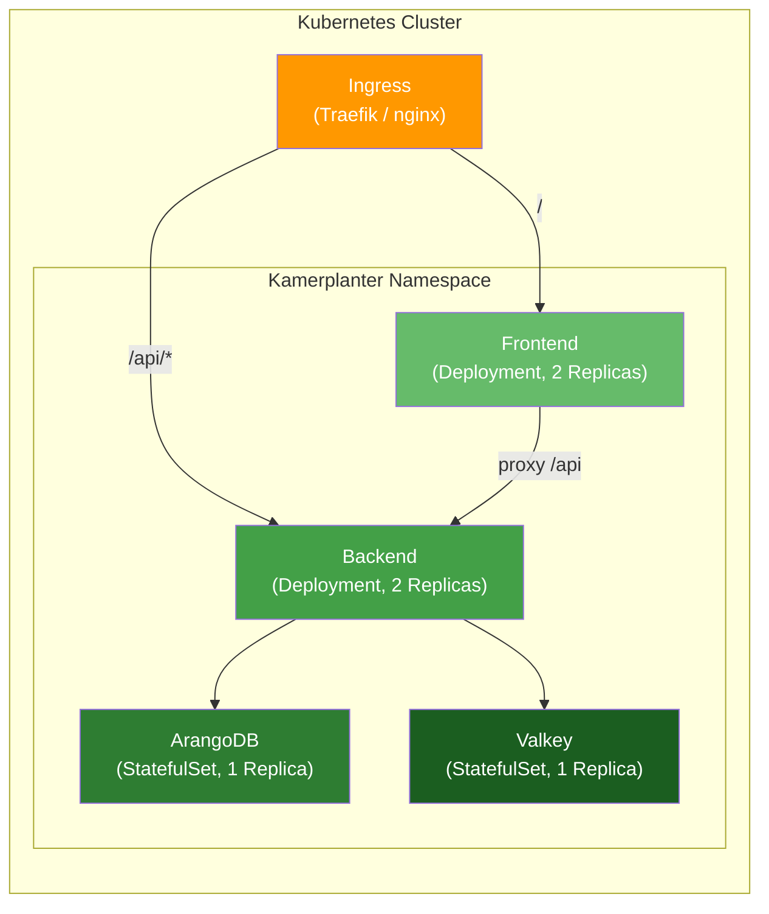

# Kubernetes Deployment

Kamerplanter is deployed via a single Helm chart that includes all components: backend, frontend, ArangoDB, and Valkey. The container images and the Helm chart are hosted on the GitHub Container Registry (ghcr.io).

---

## Prerequisites

| What | Minimum |
|------|---------|
| Kubernetes cluster | Version 1.28+ |
| Helm | Version 3.12+ |
| kubectl | Configured and connected to the cluster |
| Ingress controller | Traefik, nginx-ingress, or similar |
| Storage | StorageClass with `ReadWriteOnce` support (for ArangoDB + Valkey) |

---

## Overview: What gets deployed?



| Component | Type | Replicas | Description |
|-----------|------|:--------:|-------------|
| Backend | Deployment | 2 | FastAPI application (API + Celery worker) |
| Frontend | Deployment | 2 | React app behind nginx, proxies `/api` to the backend |
| ArangoDB | StatefulSet | 1 | Document/graph database with Persistent Volume (5 Gi) |
| Valkey | StatefulSet | 1 | Redis-compatible cache + Celery broker (1 Gi) |

---

## Installation

### 1. Add the Helm repository

The Kamerplanter Helm chart is published as an OCI artifact on the GitHub Container Registry:

```bash
# OCI registries don't need helm repo add —
# pulling works directly via the OCI URL
helm pull oci://ghcr.io/nolte/kamerplanter-helm/kamerplanter --version 0.2.0
```

??? note "Authentication to the GitHub registry"
    If the registry is private, you need to log in first:

    ```bash
    echo $GITHUB_TOKEN | helm registry login ghcr.io --username $GITHUB_USER --password-stdin
    ```

### 2. Create a values file

Create a `values-production.yaml` with your customizations:

```yaml title="values-production.yaml"
controllers:
  backend:
    replicas: 2     # (1)!
    containers:
      main:
        env:
          ARANGODB_HOST: kamerplanter-arangodb
          ARANGODB_PORT: "8529"
          ARANGODB_DATABASE: kamerplanter
          ARANGODB_USERNAME: root
          ARANGODB_PASSWORD: "your-secure-password"   # (2)!
          REDIS_URL: redis://kamerplanter-valkey:6379/0
          CORS_ORIGINS: '["https://plants.example.com"]'
          DEBUG: "false"
          KAMERPLANTER_MODE: light    # (3)!

  frontend:
    replicas: 2

  arangodb:
    containers:
      main:
        env:
          ARANGO_ROOT_PASSWORD: "your-secure-password"  # (4)!
    statefulset:
      volumeClaimTemplates:
        - name: data
          accessMode: ReadWriteOnce
          size: 10Gi    # (5)!
          globalMounts:
            - path: /var/lib/arangodb3

ingress:
  main:
    enabled: true
    hosts:
      - host: plants.example.com    # (6)!
        paths:
          - path: /api
            pathType: Prefix
            service:
              identifier: backend
          - path: /
            pathType: Prefix
            service:
              identifier: frontend
```

1. Two replicas for rolling updates without downtime.
2. Use a secure password. In production: prefer referencing a Kubernetes Secret.
3. `light` = without login/tenant system. For multi-user operation, set to `standard`.
4. Must be identical to `ARANGODB_PASSWORD`.
5. Adjust the size to your needs. 5 Gi is enough for most home users.
6. Your desired hostname. The Ingress controller must be configured for it.

!!! warning "Passwords in values files"
    For production use, you should **not** store passwords in plain text in values files. Instead, use Kubernetes Secrets and reference them via `envFrom` or a secret management tool like Sealed Secrets or External Secrets Operator.

### 3. Install the Helm chart

```bash
helm install kamerplanter \
  oci://ghcr.io/nolte/kamerplanter-helm/kamerplanter \
  --version 0.2.0 \
  --namespace kamerplanter \
  --create-namespace \
  --values values-production.yaml
```

### 4. Verify the deployment

```bash
# Check pod status
kubectl get pods -n kamerplanter

# Wait for healthy pods
kubectl wait --for=condition=ready pod \
  --all -n kamerplanter --timeout=120s
```

Expected output:

```
NAME                                      READY   STATUS    RESTARTS   AGE
kamerplanter-backend-7d8f9b6c4d-abc12     1/1     Running   0          45s
kamerplanter-backend-7d8f9b6c4d-def34     1/1     Running   0          45s
kamerplanter-frontend-5c4d8e7f3b-ghi56    1/1     Running   0          45s
kamerplanter-frontend-5c4d8e7f3b-jkl78    1/1     Running   0          45s
kamerplanter-arangodb-0                   1/1     Running   0          45s
kamerplanter-valkey-0                     1/1     Running   0          45s
```

---

## Performing updates

```bash
# Upgrade to a new version
helm upgrade kamerplanter \
  oci://ghcr.io/nolte/kamerplanter-helm/kamerplanter \
  --version 0.3.0 \
  --namespace kamerplanter \
  --values values-production.yaml
```

The backend and frontend deployments perform a **rolling update** — there is no downtime, as old pods are only terminated once the new ones are ready.

---

## Uninstallation

```bash
helm uninstall kamerplanter --namespace kamerplanter
```

!!! warning "Persistent Volumes"
    `helm uninstall` removes deployments and services but **not** the Persistent Volume Claims (PVCs) for ArangoDB and Valkey. Your data is preserved. To also delete the data:

    ```bash
    kubectl delete pvc --all -n kamerplanter
    ```

---

## Monitoring

### Check logs

```bash
# Backend logs
kubectl logs -l app.kubernetes.io/component=backend -n kamerplanter --tail=50

# Frontend logs
kubectl logs -l app.kubernetes.io/component=frontend -n kamerplanter --tail=50

# ArangoDB logs
kubectl logs -l app.kubernetes.io/component=arangodb -n kamerplanter --tail=50
```

### Health checks

The backend provides two health endpoints:

| Endpoint | Checks | Used by |
|----------|--------|---------|
| `/api/v1/health/live` | Backend process is running | Kubernetes liveness probe |
| `/api/v1/health/ready` | Backend + database reachable | Kubernetes readiness probe |

```bash
# Test manually (via port-forward)
kubectl port-forward svc/kamerplanter-backend 8000:8000 -n kamerplanter
curl http://localhost:8000/api/v1/health/ready
```

---

## Troubleshooting

??? question "Pods stay in 'Pending' state"
    The cluster doesn't have enough resources. Check available capacity with `kubectl describe nodes` and compare with the resource requests in the values file. For smaller clusters, you can reduce the requests.

??? question "ArangoDB won't start (CrashLoopBackOff)"
    Most common cause: not enough memory. ArangoDB needs at least 512 Mi. Check the logs: `kubectl logs kamerplanter-arangodb-0 -n kamerplanter`.

??? question "Frontend shows 502 Bad Gateway"
    The backend isn't ready yet. Wait until the backend's readiness probe succeeds: `kubectl get pods -n kamerplanter -w`. If the error persists: do the service names in the nginx configuration match?

??? question "Ingress works but the page won't load"
    Check: (1) Is an Ingress controller installed? (2) Does the DNS entry point to the cluster? (3) Does the hostname in the values file match the DNS?

---

## See also

- [Helm Charts](helm.md) — Detailed description of the chart structure and all configuration options
- [Docker Compose Quick Start](docker-quickstart.md) — Simpler alternative with Docker Compose
- [Docker Compose Permanent Operation](docker-dauerbetrieb.md) — Docker Compose based permanent operation
