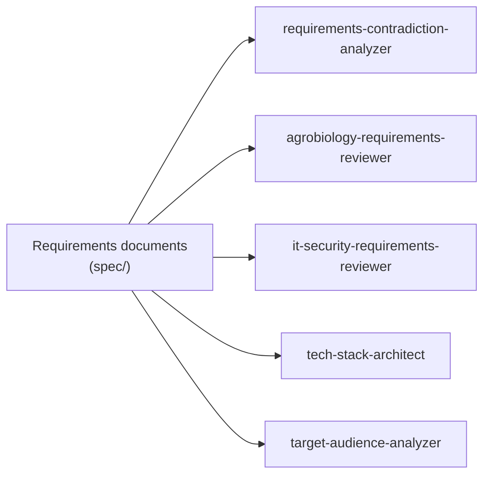
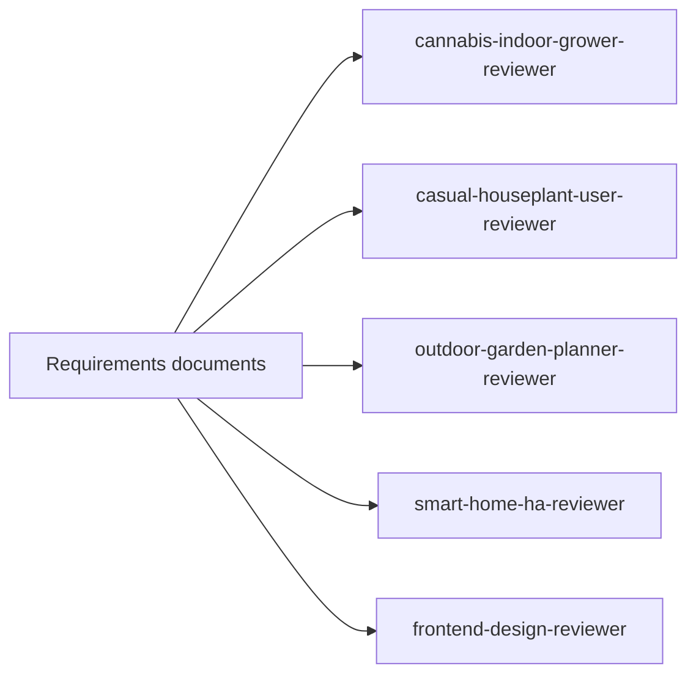
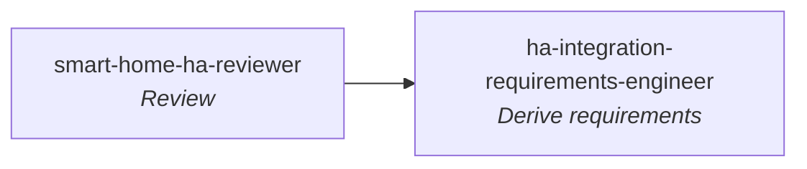
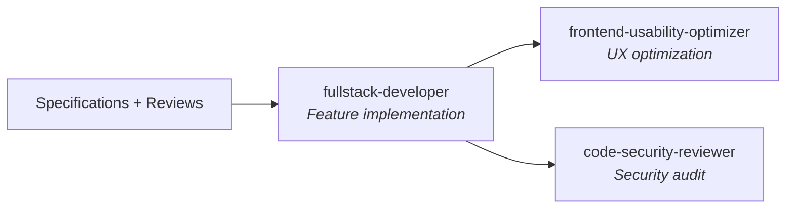
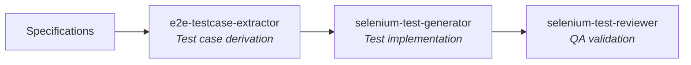
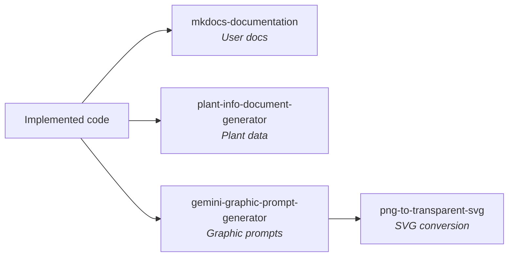

# Agent Catalog

Overview of all available Claude Code agents in the Kamerplanter project.
Each agent is a specialized AI assistant with a clearly defined role, its own workflow, and specific tools.

!!! info "As of: 17.03.2026 — 22 agents registered"
    This catalog is automatically generated by the `agent-catalog-generator` agent.
    To update: `/agent agent-catalog-generator`

---

## Quick Reference

| Agent | Model | Task | Output |
|-------|:------:|------|--------|
| `agrobiology-requirements-reviewer` | sonnet | Checks botanical correctness | Agro-Review |
| `cannabis-indoor-grower-reviewer` | sonnet | Checks grow tent practicality | Grower-Review |
| `casual-houseplant-user-reviewer` | sonnet | Checks casual-user suitability | Casual-User-Review |
| `code-security-reviewer` | sonnet | Checks code for security vulnerabilities | Security-Findings + Fixes |
| `e2e-testcase-extractor` | opus | Extracts E2E test cases from specs | Test-case documents |
| `frontend-design-reviewer` | sonnet | Evaluates UI/UX & responsive design | Design-Review |
| `frontend-usability-optimizer` | sonnet | Optimizes existing UI components | Improved React/MUI pages |
| `fullstack-developer` | opus | Implements features (Backend + Frontend) | Production code |
| `gemini-graphic-prompt-generator` | sonnet | Creates image generation prompts | Prompt documents |
| `ha-integration-requirements-engineer` | sonnet | Derives HA integration requirements | HA-REQ documents |
| `it-security-requirements-reviewer` | sonnet | Checks requirements for security/GDPR | Security-Review |
| `mkdocs-documentation` | opus | Creates multilingual MkDocs documentation | Documentation pages |
| `outdoor-garden-planner-reviewer` | sonnet | Checks outdoor/garden suitability | Garden-Review |
| `plant-info-document-generator` | sonnet | Generates plant profile documents | Import documents |
| `png-to-transparent-svg` | — | Converts PNG to transparent SVG | SVG files |
| `requirements-contradiction-analyzer` | sonnet | Checks requirements for contradictions | Contradiction report |
| `selenium-test-generator` | sonnet | Generates NFR-008-compliant Selenium tests | Python test code |
| `selenium-test-reviewer` | sonnet | Reviews E2E tests for NFR-008 compliance | Compliance report |
| `smart-home-ha-reviewer` | sonnet | Reviews HA integration architecture | HA-Review |
| `target-audience-analyzer` | sonnet | Analyzes target audiences & market potential | Target-audience report |
| `tech-stack-architect` | sonnet | Validates tech stack against requirements | Stack-Review |
| `agent-catalog-generator` | haiku | Generates overview of all agents | Catalog Markdown |

---

## Agents by Category

=== "Persona Reviews"

    Specialized target-audience perspectives that review requirements from the point of view of a specific user type.

    | Agent | Persona | Focus |
    |-------|---------|-------|
    | [`cannabis-indoor-grower-reviewer`](#cannabis-indoor-grower-reviewer) | Professional indoor grower | Grow tent workflow, yield/quality optimization |
    | [`casual-houseplant-user-reviewer`](#casual-houseplant-user-reviewer) | Casual houseplant owner | Minimal effort, comprehensibility, reminders |
    | [`outdoor-garden-planner-reviewer`](#outdoor-garden-planner-reviewer) | Ambitious garden owner | Bed planning, crop rotation, overwintering |
    | [`smart-home-ha-reviewer`](#smart-home-ha-reviewer) | Smart-home enthusiast | HA integration, MQTT, sensors, actuators |
    | [`frontend-design-reviewer`](#frontend-design-reviewer) | Frontend designer | Responsive design, kiosk mode, accessibility |

=== "Expert Reviews"

    Expert reviews for specific technical disciplines.

    | Agent | Focus |
    |-------|-------|
    | [`agrobiology-requirements-reviewer`](#agrobiology-requirements-reviewer) | Botanical & agronomic correctness |
    | [`it-security-requirements-reviewer`](#it-security-requirements-reviewer) | Data minimization, auth, GDPR, secure architecture |
    | [`requirements-contradiction-analyzer`](#requirements-contradiction-analyzer) | Contradictions in requirements |
    | [`tech-stack-architect`](#tech-stack-architect) | Technology stack validation |
    | [`target-audience-analyzer`](#target-audience-analyzer) | Target audiences & market potential |

=== "Development"

    Agents that write production code or improve existing code.

    | Agent | Focus |
    |-------|-------|
    | [`fullstack-developer`](#fullstack-developer) | Backend + Frontend feature implementation |
    | [`frontend-usability-optimizer`](#frontend-usability-optimizer) | Usability optimization of existing UI components |
    | [`code-security-reviewer`](#code-security-reviewer) | Security audit and fixes in code |

=== "Testing & QA"

    Test case derivation, test generation, and test review.

    | Agent | Focus |
    |-------|-------|
    | [`e2e-testcase-extractor`](#e2e-testcase-extractor) | E2E test case derivation from specs |
    | [`selenium-test-generator`](#selenium-test-generator) | Selenium test code generation |
    | [`selenium-test-reviewer`](#selenium-test-reviewer) | NFR-008 compliance checking |

=== "Requirements Engineering"

    Derivation and specification of requirements.

    | Agent | Focus |
    |-------|-------|
    | [`ha-integration-requirements-engineer`](#ha-integration-requirements-engineer) | Deriving HA integration requirements from REQs |

=== "Documentation & Content"

    Documentation, plant profiles, and catalog maintenance.

    | Agent | Focus |
    |-------|-------|
    | [`mkdocs-documentation`](#mkdocs-documentation) | End-user & developer documentation |
    | [`plant-info-document-generator`](#plant-info-document-generator) | Plant information documents |
    | [`agent-catalog-generator`](#agent-catalog-generator) | Agent catalog generation |

=== "Graphics & Assets"

    Create and convert visual assets.

    | Agent | Focus |
    |-------|-------|
    | [`gemini-graphic-prompt-generator`](#gemini-graphic-prompt-generator) | Gemini image generation prompts |
    | [`png-to-transparent-svg`](#png-to-transparent-svg) | PNG-to-SVG conversion with transparency |

---

## Agent Details

### `agrobiology-requirements-reviewer`

| | |
|---|---|
| **Model** | sonnet |
| **Tools** | Read, Write, Glob, Grep |
| **Output** | `spec/requirements-analysis/agrobiology-review.md` |

**Role:** Agrobiology expert with 20+ years of indoor cultivation experience (houseplants, hydroponics, CEA), who reviews requirements for botanical and agronomic correctness.

??? example "When to use?"
    - Check requirements for biological correctness
    - Validate light parameters (PPFD vs. Lux)
    - Review VPD, EC, pH specifications
    - Evaluate plant protection (IPM) and toxicity
    - Validate data sources for botanical content

**Workflow:**

1. Reads all requirements documents
2. Classifies by cultivation context (indoor, greenhouse, outdoor, hydroponics)
3. Checks taxonomy/nomenclature (scientific correctness)
4. Validates light parameters (PPFD instead of Lux, DLI, photoperiodism)
5. Checks climate specifications (VPD, temperature DIF, humidity)
6. Reviews substrates, irrigation, EC/pH
7. Evaluates plant protection requirements (IPM, pests, diseases)
8. Creates report with technical errors, incompleteness, measurability

---

### `cannabis-indoor-grower-reviewer`

| | |
|---|---|
| **Model** | sonnet |
| **Tools** | Read, Write, Glob, Grep |
| **Output** | `spec/requirements-analysis/cannabis-indoor-grower-review.md` |

**Role:** Professional indoor cannabis grower with 10+ years of grow tent experience, who reviews requirements for practicality across the complete grow cycle (germination to cure).

??? example "When to use?"
    - Check whether the complete cannabis lifecycle is representable
    - Evaluate post-harvest (drying, curing) specifications
    - Check nutrient mixing workflow for practicality
    - Evaluate training methods (topping, LST, SCROG) as plannable actions
    - Validate yield metrics (g/watt, g/m2) and run comparison
    - Check CanG compliance (plant count limits)

**Workflow:**

1. Reads all requirements documents
2. Maps requirements to 10 grower workflows (germination, veg, flower, harvest, cure, nutrients, environment, IPM, genetics, tracking)
3. Checks grow lifecycle coverage (germination to cure complete?)
4. Evaluates nutrient workflow (mixing, runoff, feeding charts)
5. Validates environment control (VPD-centric, LED-specific)
6. Reviews genetics/pheno-hunting workflow and run comparison
7. Creates report with workflow coverage matrix and yield relevance matrix

---

### `casual-houseplant-user-reviewer`

| | |
|---|---|
| **Model** | sonnet |
| **Tools** | Read, Write, Glob, Grep |
| **Output** | `spec/requirements-analysis/casual-houseplant-user-review.md` |

**Role:** Casual houseplant owner without a green thumb, who only uses the app to keep their 3 plants alive. Reviews whether the app is practical, comprehensible, and motivating for the general public.

??? example "When to use?"
    - Identify onboarding hurdles for casual users
    - Check technical terms for comprehensibility
    - Evaluate effort-to-benefit ratio (>5 min/week = too much)
    - Validate watering reminders and 1-tap confirmations
    - Evaluate overkill factor (how many REQs are irrelevant for 3 houseplants?)
    - Comparison with competition (Planta, Greg)

**Workflow:**

1. Reads all requirements documents
2. Evaluates each requirement: "Do I understand this? Do I need this? Can I operate it?"
3. Checks onboarding (<2 min until first plant), watering (push + 1-tap), location (no PPFD values)
4. Creates technical term audit (EC, VPD, substrate, cultivar, etc.)
5. Evaluates feature relevance for casual houseplant users (14 of 25 REQs expected as irrelevant)
6. Creates report with effort analysis, dealbreakers, and competition comparison

---

### `code-security-reviewer`

| | |
|---|---|
| **Model** | sonnet |
| **Tools** | Read, Edit, Bash, Glob, Grep |
| **Output** | `spec/requirements-analysis/code-security-review.md` + Fixes in code |

**Role:** Application security engineer who reviews implemented backend and frontend code for OWASP Top 10, injection, auth bypass, tenant isolation, secret leaks, and insecure cryptography, and directly fixes vulnerabilities.

??? example "When to use?"
    - Review implemented code for security issues (after feature development)
    - Find AQL injection risks in repository queries
    - Identify tenant isolation violations
    - Validate JWT/password handling
    - Check CORS, security headers, error responses
    - Review frontend for XSS, token handling, auth guards

**Workflow:**

1. Reads reference specs (REQ-023, REQ-024, NFR-001, NFR-006)
2. Scans backend: API routers, auth, tenant guard, repositories, services
3. Scans frontend: API client, Redux state, routing, components
4. Checks 9 categories: injection, auth, access control, misconfiguration, crypto, input validation, rate limiting, logging, frontend security
5. Directly fixes P0/P1 vulnerabilities in the code
6. Creates report with tenant isolation matrix and prioritized findings

---

### `e2e-testcase-extractor`

| | |
|---|---|
| **Model** | opus |
| **Tools** | All |
| **Output** | `spec/test-cases/TC-{REQ-ID}.md` |

**Role:** QA architect who systematically analyzes requirements documents for testable scenarios and derives E2E test case documents from the user perspective.

??? example "When to use?"
    - Extract test cases from REQ documents
    - Identify test coverage gaps
    - Establish traceability between requirements and tests
    - Create RAG-optimized test case documentation

**Workflow:**

1. Reads requirements documents (REQ-\*/NFR-\*)
2. Breaks requirements down into testable scenarios (happy path, edge cases, errors)
3. Derives from the user perspective: what does the user see/click/expect in the browser?
4. Structures test cases by TC ID, priority, category
5. Optimizes for RAG retrieval through semantics, tags, cross-references

---

### `frontend-design-reviewer`

| | |
|---|---|
| **Model** | sonnet |
| **Tools** | Read, Write, Glob, Grep |
| **Output** | `spec/requirements-analysis/frontend-design-review.md` |

**Role:** Frontend designer with 15+ years of responsive design and touch expertise for demanding working environments (greenhouse, grow room).

??? example "When to use?"
    - Review UI/UX requirements for responsive design (mobile/tablet/desktop)
    - Evaluate kiosk mode suitability (dirty hands, gloves, nose)
    - Check accessibility (WCAG 2.1 AA)
    - Validate touch target dimensions
    - Check design system conformance

**Workflow:**

1. Reads all requirements documents and frontend code
2. Classifies by operating context (desktop/mobile/tablet/kiosk)
3. Checks responsive design (breakpoints, layout adaptation, typography)
4. Evaluates kiosk mode: touch targets (min. 64x64px), simplified interaction
5. Validates accessibility (keyboard, ARIA, contrast)
6. Creates design review report with touch target audit

---

### `frontend-usability-optimizer`

| | |
|---|---|
| **Model** | sonnet |
| **Tools** | Read, Write, Edit, Bash, Glob, Grep |
| **Output** | Optimized React/MUI code + compliance report |

**Role:** UX engineer and frontend specialist who optimizes existing React/MUI forms, dialogs, detail pages, and list views for maximum usability. Works ONLY on already implemented code.

??? example "When to use?"
    - Improve field ordering, grouping, and labels in forms
    - Add help texts, units, and validation feedback
    - Implement empty states and loading states
    - Optimize responsive layout and tab order
    - Ensure UI-NFR compliance (after fullstack-developer)

**Workflow:**

1. Reads existing code and related UI-NFR specs
2. Identifies usability issues based on checklists (forms, display, accessibility, i18n)
3. Implements improvements directly in the code (Edit/Write)
4. Adds i18n keys in DE + EN
5. Performs UI-NFR compliance check (MUST/SHOULD/CAN)
6. Verifies with `tsc --noEmit` and `eslint`

---

### `fullstack-developer`

| | |
|---|---|
| **Model** | opus |
| **Tools** | Read, Write, Edit, Bash, Glob, Grep |
| **Output** | Production-ready code |

**Role:** Senior full-stack developer with complete production expertise in the defined tech stack (Python/FastAPI/ArangoDB/React/Kubernetes).

??? example "When to use?"
    - Implement features (backend + frontend complete)
    - Design and build APIs
    - Develop React components
    - Design database schemas (ArangoDB/TimescaleDB)
    - Create Celery tasks and Helm charts
    - Refactor existing code

**Workflow:**

1. Reads relevant requirements documents and NFRs
2. Implements backend: FastAPI routers, Pydantic models, services/engines, ArangoDB repositories
3. Writes error handling (NFR-006), resilience patterns (NFR-007), logging (structlog)
4. Implements frontend: React components with TypeScript strict, Redux, MUI, i18n
5. Writes tests (pytest backend, vitest frontend)
6. Creates Helm charts (bjw-s/common) with health checks
7. Validates Ruff/ESLint, TypeScript strict

---

### `gemini-graphic-prompt-generator`

| | |
|---|---|
| **Model** | sonnet |
| **Tools** | Read, Write, Glob, Grep |
| **Output** | `spec/ref/graphic-prompts/<type>_<name>.md` |

**Role:** Visual design director and prompt engineer who creates precise Gemini image generation prompts in the Kamerplanter corporate design (Primary Green #2e7d32/#66bb6a, Secondary Indigo #5c6bc0/#9fa8da).

??? example "When to use?"
    - Create app icons, logos, feature icons
    - Illustrations for empty pages, onboarding, 404 pages
    - Hero banners and marketing material
    - Badges, patterns, diagrams
    - Light/dark mode variants of graphics

**Workflow:**

1. Reads Kami character reference (MANDATORY) and any theme files
2. Classifies graphic type (app-icon, illustration, empty-state, onboarding, hero, badge, etc.)
3. Constructs prompt: style instruction + exact hex color values + subject description + composition + negative prompts
4. Creates light/dark variants with mode-appropriate contrast
5. Generates prompt document with post-processing checklist

---

### `ha-integration-requirements-engineer`

| | |
|---|---|
| **Model** | sonnet |
| **Tools** | Read, Write, Glob, Grep |
| **Output** | `spec/ha-integration/HA-REQ-{nnn}_{short-title}.md` |

**Role:** Senior HA custom integration developer with agri-IoT specialization who derives concrete, implementable HA integration requirements from existing REQ documents. Uses the three-side model (A: KP->HA export, B: HA->KP import, C: KP->HA actuation).

??? example "When to use?"
    - Derive HA-specific entity mappings from REQ documents
    - Design coordinator structures and polling intervals
    - Specify event schemas (MQTT) for time-critical state changes
    - Derive automation blueprints from domain logic
    - Identify backend API extensions for HA integration
    - Extend HA-CUSTOM-INTEGRATION.md

**Workflow:**

1. Reads existing HA integration spec and review results
2. Analyzes target REQ documents for domain events, calculated values, thresholds
3. Designs entity taxonomy (sensor, binary_sensor, calendar, todo, button, number, select)
4. Checks API dependencies (does the endpoint exist? Is a new one needed?)
5. Defines control boundary (side C: KP controls vs. HA regulates)
6. Creates automation blueprints as YAML
7. Evaluates optionality and degradation behavior

---

### `it-security-requirements-reviewer`

| | |
|---|---|
| **Model** | sonnet |
| **Tools** | Read, Write, Glob, Grep |
| **Output** | `spec/requirements-analysis/it-security-review.md` |

**Role:** IT security architect and data protection expert with 15+ years of practice (OWASP, IAM, GDPR, cryptography), who reviews requirements documents for security gaps, missing access controls, and GDPR compliance.

??? example "When to use?"
    - Check data minimization (Art. 5 GDPR): are only necessary data collected?
    - Find auth gaps: endpoints without defined access control
    - Validate RBAC completeness: is the permission matrix complete?
    - Check GDPR data subject rights (Art. 12-22) for completeness
    - API security: input validation, CORS, rate limiting
    - Evaluate encryption and secret management

**Workflow:**

1. Reads reference specs (REQ-023, REQ-024, NFR-001, NFR-006) as target state
2. Creates security index of all requirements (data, access control, interfaces)
3. Checks data minimization, authentication, authorization, API security
4. Checks encryption, secret management, infrastructure
5. Validates GDPR compliance (data subject rights, consent, DPA)
6. Creates report with data minimization matrix, authorization matrix, GDPR checklist

---

### `mkdocs-documentation`

| | |
|---|---|
| **Model** | opus |
| **Tools** | Read, Write, Edit, Bash, Glob, Grep |
| **Output** | `docs/` (DE + EN) |

**Role:** Technical writer with MkDocs Material expertise who creates and maintains end-user-friendly, multilingual documentation.

??? example "When to use?"
    - End-user documentation (user guides, tutorials)
    - Architecture documentation (ADRs, developer guides)
    - Generate API documentation from docstrings
    - Documentation versioning (mike)
    - Manage multilingualism (DE/EN)

**Workflow:**

1. Reads specifications for technical content
2. Creates page structure (DE/EN in parallel)
3. Writes task-oriented end-user docs with screenshots
4. Creates architecture decision records (ADRs)
5. Configures mkdocs.yml with Material theme and plugins
6. Sets up versioning with mike

---

### `outdoor-garden-planner-reviewer`

| | |
|---|---|
| **Model** | sonnet |
| **Tools** | Read, Write, Glob, Grep |
| **Output** | `spec/requirements-analysis/outdoor-garden-planner-review.md` |

**Role:** Passionate hobby gardener with a 400 m2 home garden + 80 m2 community garden plot (15 years experience, ~120 plants), who reviews requirements for outdoor suitability.

??? example "When to use?"
    - Validate bed planning and 4-year crop rotation
    - Check overwintering management (frost protection, digging up tubers, bringing potted plants inside)
    - Track perennial plants (herbaceous perennials, fruit trees, berry bushes) over multiple years
    - Evaluate community garden coordination (watering duty, task distribution, plots)
    - Check seasonal calendar and phenological indicators
    - Organic fertilization (compost, nettle tea) instead of EC values

**Workflow:**

1. Reads all requirements documents
2. Maps requirements to 8 everyday garden workflows (annual planning, pre-cultivation, planting out, care, overwintering, perennials, community garden, documentation)
3. Checks bed planning, companion planting, crop rotation
4. Evaluates overwintering features (winter hardiness traffic light, frost warning, tuber cycle)
5. Validates community garden features (multi-tenancy, watering duty rotation)
6. Creates report with seasonal calendar, overwintering checklist, community garden requirements

---

### `plant-info-document-generator`

| | |
|---|---|
| **Model** | sonnet |
| **Tools** | Read, Write, Glob, Grep, WebSearch, WebFetch |
| **Output** | `spec/ref/plant-info/<scientific_name_snake_case>.md` |

**Role:** Agricultural botanist and plant consultant with 20+ years of practice who generates detailed plant information documents for Kamerplanter data import (REQ-012).

??? example "When to use?"
    - Create plant profiles for data import
    - Research botanical data (taxonomy, phases, nutrients)
    - Compile IPM information (pests, beneficial insects, treatments)
    - Document crop rotation and companion planting recommendations
    - Create care profiles (CareProfile, OverwinteringProfile) for species
    - Generate CSV import data (REQ-012 compatible)

**Workflow:**

1. Identifies plant species (scientific name, family, genus)
2. Researches via WebSearch: taxonomy, phases, nutrients, IPM, care, companion planting
3. Creates structured document with KA field name references
4. Documents fertilizer products (mineral + organic, with brands)
5. Generates CSV import rows for species and cultivars
6. Marks data gaps with `<!-- DATA MISSING -->`

---

### `png-to-transparent-svg`

| | |
|---|---|
| **Model** | — (inherits from parent) |
| **Tools** | Read, Write, Bash, Glob |
| **Output** | SVG files alongside the source PNGs |

**Role:** Image processing specialist for converting PNG images with baked-in checkerboard backgrounds (fake transparency) into clean SVGs with genuine transparency.

??? example "When to use?"
    - Convert PNGs from AI image generators (Gemini, DALL-E, Midjourney)
    - Clean up screenshots with checkerboard backgrounds
    - Make PNGs with solid-color backgrounds transparent
    - Batch-convert multiple PNGs to SVG

**Workflow:**

1. Analyzes PNG: alpha channel, corner analysis (checkerboard? solid color? already transparent?)
2. Removes checkerboard pixels (spread <=8, min-brightness >195 → transparent)
3. Saves cleaned PNG with genuine alpha channel
4. Vectorizes with vtracer (color mode, stacked hierarchy)
5. Validates SVG: background path removed? File size acceptable?
6. Creates result report (pixels removed, SVG size)

---

### `requirements-contradiction-analyzer`

| | |
|---|---|
| **Model** | sonnet |
| **Tools** | Read, Write, Glob, Grep, Bash |
| **Output** | `spec/requirements-analysis/contradiction-report.md` + `requirements-index.json` |

**Role:** Requirements engineer who reviews requirements documents for contradictions, gaps, and quality issues.

??? example "When to use?"
    - Check requirements for consistency (functional vs. non-functional)
    - Identify contradictions between requirements and stack
    - Specify non-measurable NFRs more precisely
    - Ensure requirements quality before implementation

**Workflow:**

1. Collects all documents (spec/req/, spec/nfr/, spec/ui-nfr/)
2. Classifies requirements (functional, performance, security, usability)
3. Creates requirements index with unique IDs
4. Checks for 6 contradiction types (direct, implicit, prioritization, scope, temporal, between NFRs)
5. Evaluates by severity (critical/high/medium/low)
6. Creates report with resolution options and machine-readable index

---

### `selenium-test-generator`

| | |
|---|---|
| **Model** | sonnet |
| **Tools** | Read, Write, Edit, Glob, Grep, Bash |
| **Output** | `tests/e2e/` (Python Selenium tests) |

**Role:** QA engineer who generates NFR-008-compliant Python Selenium tests with the page object pattern from test case documents or requirements.

??? example "When to use?"
    - Generate or extend Selenium E2E tests
    - Generate test code from test case documents
    - Create page objects for new pages/workflows
    - Implement test protocol generation

**Workflow:**

1. Reads NFR-008 and requirements documents
2. Creates conftest.py with browser fixture and CLI options
3. Generates ProtocolPlugin for test protocol generation
4. Creates BasePage and feature-specific page objects
5. Writes test classes with screenshot checkpoints at 4 defined locations
6. Validates structure and screenshot coverage

---

### `selenium-test-reviewer`

| | |
|---|---|
| **Model** | sonnet |
| **Tools** | Read, Edit, Grep, Glob, Bash |
| **Output** | `test-reports/nfr-008-compliance-report.md` |

**Role:** Senior QA engineer who reviews existing Selenium tests for NFR-008 compliance, code quality, and best practices.

??? example "When to use?"
    - Review existing tests for NFR-008 compliance
    - Debug and repair test code
    - Fix anti-patterns (`time.sleep`, fragile locators, direct `find_element` in tests)

**Workflow:**

1. Finds tests under `tests/e2e/`
2. Checks directory structure (conftest.py, protocol_plugin.py, base_page.py)
3. Validates conftest.py for CLI options, browser fixture, screenshot fixture
4. Checks core function coverage (REQ-001/002/003/009)
5. Audits screenshot checkpoints
6. Identifies code anti-patterns
7. Creates compliance report

---

### `smart-home-ha-reviewer`

| | |
|---|---|
| **Model** | sonnet |
| **Tools** | Read, Write, Glob, Grep |
| **Output** | `spec/requirements-analysis/smart-home-ha-integration-review.md` |

**Role:** Smart-home enthusiast with HA OS (300+ entities), 2 grow tents, and a greenhouse, who reviews requirements for bidirectional Home Assistant integration. Clearly separates between the Kamerplanter HA Custom Integration (HACS) and Kamerplanter backend requirements.

??? example "When to use?"
    - Evaluate HA integration architecture (side A/B/C)
    - Check entity export to HA (sensors, binary sensors, calendar)
    - Validate sensor import from HA (entity mapping, fallback)
    - Define actuator control boundary (KP vs. HA)
    - Ensure optionality (everything usable without HA?)
    - Evaluate failure behavior when HA is offline

**Workflow:**

1. Reads all requirements documents
2. Maps each requirement to an integration direction (A: KP->HA, B: HA->KP, C: actuators, not HA-relevant)
3. Checks API suitability for HA custom integration (stability, versioning, bulk endpoints)
4. Evaluates sensor import (entity mapping, polling, fallback, data provenance)
5. Defines control boundary (setpoint model vs. direct control)
6. Creates report with entity map, optionality checklist, automation blueprints

---

### `target-audience-analyzer`

| | |
|---|---|
| **Model** | sonnet |
| **Tools** | Read, Write, Glob, Grep |
| **Output** | `spec/requirements-analysis/target-audience-report.md` |

**Role:** Product strategist with AgriTech expertise who analyzes requirements documents for implicit and explicit target audiences.

??? example "When to use?"
    - Derive target audience profiles from requirements
    - Identify underserved user groups
    - Explore new market segments (urban farming, vertical farming, hobby cultivation)
    - Develop user personas

**Workflow:**

1. Reads all requirements documents completely
2. Extracts explicit target audience signals (role designations)
3. Derives implicit target audiences (complexity, scaling, degree of automation)
4. Creates user group profiles with operation size, technical affinity, core need
5. Identifies underserved groups (operation type, domain, role)
6. Evaluates potential by market size, willingness to pay, adaptation effort
7. Creates target audiences x application areas matrix

---

### `tech-stack-architect`

| | |
|---|---|
| **Model** | sonnet |
| **Tools** | Read, Write, Glob, Grep, WebSearch, WebFetch |
| **Output** | `spec/requirements-analysis/tech-stack-review.md` |

**Role:** Software and infrastructure architect with 15+ years of experience who systematically validates the tech stack against all requirements.

??? example "When to use?"
    - Check tech stack against functional and non-functional requirements
    - Identify technology gaps
    - Check version compatibility
    - Evaluate architecture risks
    - Conduct alternative analyses

**Workflow:**

1. Reads all requirements documents and `spec/stack.md`
2. Creates requirements register with stack implications
3. Checks coverage matrix (each requirement <-> technology)
4. Evaluates each technology for maturity, community, operational complexity, security
5. Analyzes architecture patterns (layered architecture, persistence, caching)
6. Identifies risks (vendor lock-in, EOL, skill gaps)
7. Checks cross-cutting concerns (auth, secret management, monitoring, backup)
8. Creates action plan with alternative analyses

---

### `agent-catalog-generator`

| | |
|---|---|
| **Model** | haiku |
| **Tools** | Read, Write, Glob, Grep |
| **Output** | `docs/agent-catalog.md` |

**Role:** Technical writer who reads all agent definitions and generates a compact catalog document.

??? example "When to use?"
    - Onboarding new developers
    - After adding new agents
    - To maintain a central agent reference

**Workflow:**

1. Reads all agent definitions from `.claude/agents/*.md`
2. Extracts metadata (name, model, tools, description)
3. Classifies agents by category
4. Creates quick reference and deployment decision guide
5. Generates catalog document with statistics

---

## Deployment Decision Guide

!!! tip "Which agent do I need?"

    | I want to... | Agent |
    |--------------|-------|
    | ...implement a feature (backend + frontend) | `fullstack-developer` |
    | ...make existing UI pages more user-friendly | `frontend-usability-optimizer` |
    | ...review implemented code for security | `code-security-reviewer` |
    | ...check the tech stack against requirements | `tech-stack-architect` |
    | ...check requirements for contradictions | `requirements-contradiction-analyzer` |
    | ...check requirements for security/GDPR | `it-security-requirements-reviewer` |
    | ...check technical correctness (botany) | `agrobiology-requirements-reviewer` |
    | ...review from the perspective of an indoor grower | `cannabis-indoor-grower-reviewer` |
    | ...review from the perspective of a casual houseplant user | `casual-houseplant-user-reviewer` |
    | ...review from the perspective of a garden planner | `outdoor-garden-planner-reviewer` |
    | ...review UI/UX and kiosk mode | `frontend-design-reviewer` |
    | ...review HA integration architecture | `smart-home-ha-reviewer` |
    | ...derive HA integration requirements | `ha-integration-requirements-engineer` |
    | ...analyze target audiences and market potential | `target-audience-analyzer` |
    | ...derive E2E test cases from specs | `e2e-testcase-extractor` |
    | ...generate Selenium tests | `selenium-test-generator` |
    | ...review existing Selenium tests | `selenium-test-reviewer` |
    | ...create/update documentation | `mkdocs-documentation` |
    | ...generate plant profiles | `plant-info-document-generator` |
    | ...create graphic prompts for Gemini | `gemini-graphic-prompt-generator` |
    | ...convert PNG with checkerboard to SVG | `png-to-transparent-svg` |
    | ...generate an overview of all agents | `agent-catalog-generator` |

---

## Workflow Phases: Typical Deployment Order

### Phase 1: Specification & Review



The analysis agents run **in parallel** on the specifications and identify gaps, contradictions, and risks.

### Phase 2: Persona Reviews



Persona reviews run **in parallel** and check whether all target audiences are covered. Results feed back as spec extensions.

### Phase 3: HA Integration



The HA requirements engineer builds on the review from the smart-home reviewer.

### Phase 4: Implementation



The fullstack developer implements; afterwards the usability optimizer refines the UI and the code security reviewer audits security.

### Phase 5: Testing



Test cases are derived from specs, implemented as Selenium tests, and then checked for compliance.

### Phase 6: Documentation & Assets



---

## Notes for Developers

**Starting an agent:**

```bash
# In the Claude Code chat:
/agent <name>
```

**Report storage locations:**

| Agent type | Storage location |
|------------|-----------------|
| Analysis/review agents | `spec/requirements-analysis/` |
| HA integration | `spec/ha-integration/` |
| Selenium test reports | `test-reports/` |
| Test case documents | `spec/test-cases/` |
| Plant profiles | `spec/ref/plant-info/` |
| Graphic prompts | `spec/ref/graphic-prompts/` |
| Documentation | `docs/` |

**Model selection:**

| Model | Strength | Agents |
|-------|----------|--------|
| **opus** | Highest quality — implementation, complex analysis | `fullstack-developer`, `e2e-testcase-extractor`, `mkdocs-documentation` |
| **sonnet** | Price-performance — reviews, reports, analyses, UX optimization | 18 agents |
| **haiku** | Fast & affordable — simple, structured tasks | `agent-catalog-generator` |
| **—** (inherits) | No own model, inherits from parent context | `png-to-transparent-svg` |

---

## Statistics

| Metric | Value |
|--------|:-----:|
| Total agents | **22** |
| Persona reviews | 5 |
| Expert reviews | 5 |
| Development & Security | 3 |
| Testing & QA | 3 |
| Requirements Engineering | 1 |
| Documentation & Content | 3 |
| Graphics & Assets | 2 |
| Model: opus | 3 |
| Model: sonnet | 18 |
| Model: haiku | 1 |
