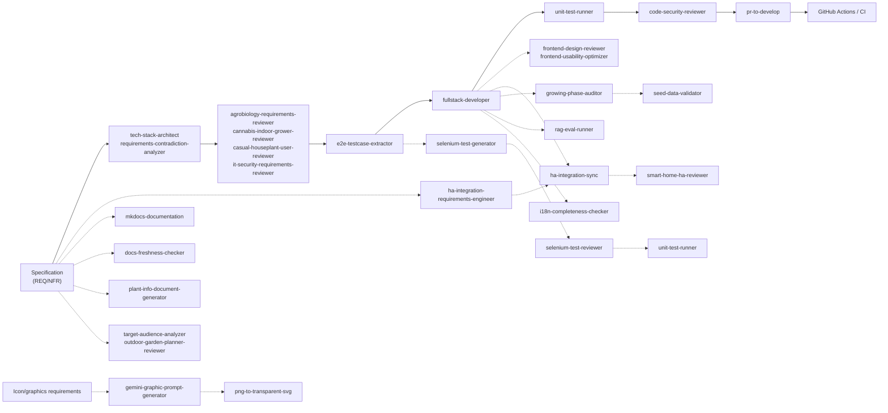

# Agent Catalog

Overview of all available Claude Code agents in the Kamerplanter project for autonomous feature implementation, requirements engineering, code reviews and documentation.

!!! info "As of: 2026-03-31 — 30 agents registered"
    This catalog is automatically generated and updated by the `agent-catalog-generator` agent.

---

## Quick Reference

| Agent | Model | Task | Category |
|-------|--------|------|----------|
| `agent-catalog-generator` | haiku | Generates this catalog | Documentation |
| `agrobiology-requirements-reviewer` | sonnet | Botanical expert review of requirements | Analysis & Review |
| `cannabis-indoor-grower-reviewer` | sonnet | Validate cannabis cultivation specifications | Analysis & Review |
| `casual-houseplant-user-reviewer` | sonnet | Layperson suitability of houseplant features | Analysis & Review |
| `code-security-reviewer` | sonnet | Code security audit (OWASP Top 10) | Analysis & Review |
| `docs-freshness-checker` | sonnet | Check documentation freshness and completeness | Documentation |
| `e2e-testcase-extractor` | sonnet | Derive E2E test cases from specifications | Testing & QA |
| `frontend-design-reviewer` | sonnet | UI/UX, responsive design, kiosk mode review | Design & Graphics |
| `frontend-usability-optimizer` | sonnet | Optimize React/MUI components for better UX | Design & Graphics |
| `fullstack-developer` | opus | Implement features Backend+Frontend | Development |
| `gemini-graphic-prompt-generator` | sonnet | Gemini prompts for icons and illustrations | Design & Graphics |
| `growing-phase-auditor` | sonnet | Validate and correct plant phase data | Testing & QA |
| `ha-integration-requirements-engineer` | sonnet | Derive Home Assistant integration requirements | Analysis & Review |
| `ha-integration-sync` | opus | Synchronize HA integration with backend API | Development |
| `i18n-completeness-checker` | haiku | Check i18n translations for completeness | Testing & QA |
| `it-security-requirements-reviewer` | sonnet | Review security & GDPR in requirements | Analysis & Review |
| `mkdocs-documentation` | sonnet | Create and maintain MkDocs documentation | Documentation |
| `outdoor-garden-planner-reviewer` | sonnet | Validate outdoor garden requirements | Analysis & Review |
| `plant-info-document-generator` | sonnet | Research detailed plant profile documents | Documentation |
| `png-to-transparent-svg` | haiku | PNG with checkerboard background to transparent SVG | Development |
| `pr-to-develop` | sonnet | Prepare GitHub pull request for develop | Development |
| `rag-eval-runner` | sonnet | Execute RAG quality benchmark and analyze | Testing & QA |
| `requirements-contradiction-analyzer` | sonnet | Find contradictions in requirements (RAG) | Analysis & Review |
| `seed-data-validator` | sonnet | Check YAML seed data quality | Testing & QA |
| `selenium-test-generator` | opus | Generate NFR-008-compliant Selenium E2E tests | Testing & QA |
| `selenium-test-reviewer` | sonnet | Review Selenium tests for quality and maintainability | Testing & QA |
| `smart-home-ha-reviewer` | sonnet | Review HA integration against specification | Analysis & Review |
| `target-audience-analyzer` | sonnet | Analyze target audiences and market potential | Analysis & Review |
| `tech-stack-architect` | sonnet | Validate tech stack against requirements | Analysis & Review |
| `unit-test-runner` | sonnet | Run unit tests and static analysis | Testing & QA |

---

## Agents by Category

=== "Analysis & Review"

    | Agent | Focus |
    |-------|-------|
    | [`agrobiology-requirements-reviewer`](#agrobiology-requirements-reviewer) | Botanical correctness, indoor/hydroponics, VPD, lighting technology |
    | [`cannabis-indoor-grower-reviewer`](#cannabis-indoor-grower-reviewer) | Cannabis cultivation legality, specification |
    | [`casual-houseplant-user-reviewer`](#casual-houseplant-user-reviewer) | Layperson usability, houseplant care |
    | [`code-security-reviewer`](#code-security-reviewer) | OWASP Top 10, auth, tenant isolation, injection |
    | [`ha-integration-requirements-engineer`](#ha-integration-requirements-engineer) | Home Assistant entity mappings, coordinators |
    | [`it-security-requirements-reviewer`](#it-security-requirements-reviewer) | Auth, authorization, GDPR, data minimization |
    | [`outdoor-garden-planner-reviewer`](#outdoor-garden-planner-reviewer) | Outdoor growing, overwintering, crop rotation, community gardens |
    | [`requirements-contradiction-analyzer`](#requirements-contradiction-analyzer) | Contradictions, consistency, RAG analysis |
    | [`smart-home-ha-reviewer`](#smart-home-ha-reviewer) | Home Assistant specification, integration |
    | [`target-audience-analyzer`](#target-audience-analyzer) | Target audiences, market potential, personas |
    | [`tech-stack-architect`](#tech-stack-architect) | Tech stack validation, dependencies |

=== "Development"

    | Agent | Focus |
    |-------|-------|
    | [`fullstack-developer`](#fullstack-developer) | Features Backend+Frontend, FastAPI, React |
    | [`ha-integration-sync`](#ha-integration-sync) | Synchronize HA integration with API |
    | [`png-to-transparent-svg`](#png-to-transparent-svg) | PNG to SVG with transparency conversion |
    | [`pr-to-develop`](#pr-to-develop) | Prepare GitHub PR with CI validation |

=== "Testing & QA"

    | Agent | Focus |
    |-------|-------|
    | [`e2e-testcase-extractor`](#e2e-testcase-extractor) | Derive E2E test cases from specifications |
    | [`growing-phase-auditor`](#growing-phase-auditor) | Validate plant phase data |
    | [`i18n-completeness-checker`](#i18n-completeness-checker) | Check i18n translations for completeness |
    | [`rag-eval-runner`](#rag-eval-runner) | Execute RAG quality benchmark and analyze |
    | [`seed-data-validator`](#seed-data-validator) | YAML seed data quality |
    | [`selenium-test-generator`](#selenium-test-generator) | Generate Selenium E2E tests |
    | [`selenium-test-reviewer`](#selenium-test-reviewer) | Review Selenium tests |
    | [`unit-test-runner`](#unit-test-runner) | Run unit tests and static analysis |

=== "Design & Graphics"

    | Agent | Focus |
    |-------|-------|
    | [`frontend-design-reviewer`](#frontend-design-reviewer) | Responsive design, kiosk mode, touch targets |
    | [`frontend-usability-optimizer`](#frontend-usability-optimizer) | Form usability, labels, help texts, mobile-first |
    | [`gemini-graphic-prompt-generator`](#gemini-graphic-prompt-generator) | Gemini image generation prompts |

=== "Documentation"

    | Agent | Focus |
    |-------|-------|
    | [`agent-catalog-generator`](#agent-catalog-generator) | Generate this catalog |
    | [`docs-freshness-checker`](#docs-freshness-checker) | Check documentation freshness and completeness |
    | [`mkdocs-documentation`](#mkdocs-documentation) | Create MkDocs documentation |
    | [`plant-info-document-generator`](#plant-info-document-generator) | Research plant profile documents |

---

## Agent Details

### `agent-catalog-generator`

**Model:** haiku | **Tools:** Read, Write, Glob, Grep

**Role:** Technical writer who systematically reads all agent definitions and generates a compact, developer-friendly catalog.

??? example "When to use?"
    - After adding new agents to `.claude/agents/`
    - When onboarding new developers
    - To maintain a central agent reference

**Workflow:**
1. Read all agent definitions from `.claude/agents/*.md`
2. Parse YAML frontmatter and Markdown body
3. Group and sort agents by category
4. Generate documentation catalog with tables, tabs and details
5. Insert RAG-optimized metadata

**Output:** `docs/de/development/agent-catalog.md` — This catalog with overview, tables, categorization and decision guidance

---

### `agrobiology-requirements-reviewer`

**Model:** sonnet | **Tools:** Read, Write, Glob, Grep

**Role:** Agrobiology expert with 20+ years of practical experience in indoor growing, hydroponics, houseplants and protected cultivation, who checks requirements for biological correctness and completeness.

??? example "When to use?"
    - Requirements for indoor growing, hydroponics, houseplants
    - Light parameters (PPFD, DLI), VPD, EC values, substrates
    - Plant protection, phenology, phase control

**Workflow:**
1. Read and classify requirement documents (indoor/hydroponics/outdoor)
2. Check biological correctness (light, temperature, VPD, substrates)
3. Work through completeness checklists (houseplants, hydroponics, IPM)
4. Evaluate data source availability
5. Create report with findings (errors/incomplete/inaccurate)

**Output:** `spec/analysis/agrobiology-review.md` — Detailed report with botanical findings, correction proposals and data sources

---

### `cannabis-indoor-grower-reviewer`

**Model:** sonnet | **Tools:** Read, Write, Glob, Grep

**Role:** Cannabis cultivation specialist who reviews specifications for legality, feasibility and best practice compliance.

??? example "When to use?"
    - Specify or validate cannabis cultivation features
    - Check legal requirements (CanG, PflSchG)
    - Review indoor growing specifications

**Workflow:**
1. Identify all cannabis-specific requirements
2. Check legal basis (CanG licensing requirements, PflSchG pre-harvest intervals)
3. Evaluate genetic data, phenotypes, terpenes
4. Validate growing parameters (photoperiod, VPD, EC)
5. Report with legal checks and best-practice deviations

**Output:** `spec/analysis/cannabis-grower-review.md` — Legality check, growing parameter validation, risk assessment

---

### `casual-houseplant-user-reviewer`

**Model:** sonnet | **Tools:** Read, Write, Glob, Grep

**Role:** Disorganized houseplant owner without a green thumb, who checks requirements for everyday usability and beginner friendliness.

??? example "When to use?"
    - Requirements for casual users (laypeople)
    - Test onboarding, watering reminders, problem detection
    - Evaluate language and comprehensibility
    - Check effort-to-benefit ratio

**Workflow:**
1. Read all requirements from a layperson's perspective
2. Identify dealbreaker features (e.g. photo recognition)
3. Mark frustrating and overwhelming aspects
4. Estimate effort per week
5. Conduct competitor comparison (Planta, Greg)
6. Report with dealbreakers, optimizations, effort analysis

**Output:** `spec/analysis/casual-houseplant-user-review.md` — Layperson perspective, dealbreakers, effort analysis, competitor comparison

---

### `code-security-reviewer`

**Model:** sonnet | **Tools:** Read, Edit, Bash, Glob, Grep

**Role:** Application security engineer who checks implemented backend and frontend code for OWASP Top 10 vulnerabilities and fixes them.

??? example "When to use?"
    - After feature implementation by the fullstack developer
    - Check injection, auth bypass, tenant isolation, secret leaks
    - Implement security fixes
    - Before production deployment

**Workflow:**
1. Analyze backend and frontend code (discovery)
2. Systematically check OWASP A01 through A10
3. Validate tenant isolation, RBAC, JWT, secrets
4. Immediately fix critical vulnerabilities (P0/P1)
5. Security report with resolved and open items

**Output:** `spec/analysis/code-security-review.md` — Security audit, P0/P1/P2/P3 findings, compliance matrix

---

### `docs-freshness-checker`

**Model:** sonnet | **Tools:** Read, Glob, Grep, Bash

**Role:** Documentation Quality Engineer who checks existing documentation (docs/de/, docs/en/) and ADRs for freshness, completeness and consistency with implemented code.

??? example "When to use?"
    - Check documentation for staleness
    - Identify missing doc pages for implemented features
    - Ensure DE/EN parity
    - Validate documentation quality before release

**Workflow:**
1. Determine implementation status (API routers, domain models, frontend pages)
2. Load documentation structure (docs/de, docs/en, ADRs)
3. Compare API documentation vs. code (implemented/documented)
4. Check user guide completeness (features have docs?)
5. Validate DE/EN parity (file and content comparison)
6. Verify ADR freshness (status, technology references)
7. Find dead links and code references

**Output:** `spec/analysis/docs-freshness-report.md` — Report with API gaps, user guide errors, parity violations, ADR findings, dead links

---

### `e2e-testcase-extractor`

**Model:** sonnet | **Tools:** Read, Write, Glob, Grep

**Role:** Elite QA architect who systematically derives E2E test cases from specifications from the end-user perspective (browser view).

??? example "When to use?"
    - Specifications are available and test cases are needed
    - Reconcile test coverage against spec
    - Create RAG-optimized test case documents
    - Establish requirement traceability

**Workflow:**
1. Read specifications and decompose into testable scenarios
2. Derive test cases for each UI element (happy path + errors)
3. Structure test cases: preconditions → test steps → expected results
4. Add RAG metadata (frontmatter, tags)
5. Generate structured test case files

**Output:** `spec/test-cases/TC-{REQ-ID}.md` — RAG-optimized test case documents with traceability

---

### `frontend-design-reviewer`

**Model:** sonnet | **Tools:** Read, Write, Glob, Grep

**Role:** Frontend designer with 15+ years of experience in responsive design, kiosk systems and touch interfaces for demanding work environments.

??? example "When to use?"
    - Review UI/UX requirements
    - Responsive design (mobile/tablet/desktop/kiosk)
    - Validate touch target sizes
    - Test kiosk mode with dirty hands

**Workflow:**
1. Classify all requirements by operating context
2. Check responsive design (breakpoints, fluid grids)
3. Evaluate kiosk mode (64–72px touch targets, simplification)
4. Validate mobile on-site scenarios
5. Report with design findings and wireframe proposals

**Output:** `spec/analysis/frontend-design-review.md` — Responsive matrix, kiosk detail assessment, touch target audit, wireframes

---

### `frontend-usability-optimizer`

**Model:** sonnet | **Tools:** Read, Write, Edit, Bash, Glob, Grep

**Role:** UX engineer who optimizes React/MUI components according to mobile-first principles for better usability (labels, help texts, validation, layout).

??? example "When to use?"
    - After fullstack developer feature implementation
    - Optimize forms and dialogs
    - Add technical term explanations (tooltips)
    - Improve responsive layouts

**Workflow:**
1. Read code and identify usability problems
2. Add descriptive texts and help texts
3. Optimize field ordering and validation
4. Implement mobile-first progressive enhancement
5. Perform UI-NFR compliance check
6. Run tests and output summary

**Output:** Optimized code in `src/frontend/` + summary with usability improvements and compliance checks

---

### `fullstack-developer`

**Model:** opus | **Tools:** Read, Write, Edit, Bash, Glob, Grep

**Role:** Senior full-stack developer who fully implements features (backend FastAPI + frontend React) in strict compliance with all NFRs.

??? example "When to use?"
    - Implement features (backend+frontend)
    - Design and write APIs
    - Create database schemas
    - Build React components
    - Write Celery tasks

**Workflow:**
1. Read requirements specifications
2. Backend: ArangoDB models, APIs, services, tests
3. Frontend: React components, Redux slices, tests
4. Comply with all NFRs and UI-NFRs
5. Write and validate unit tests

**Output:** Production-ready implementation in backend + frontend with tests; the `unit-test-runner` can pass green

---

### `gemini-graphic-prompt-generator`

**Model:** sonnet | **Tools:** Read, Write, Glob, Grep

**Role:** Visual design director who generates precise, production-ready Google Gemini prompts for icons, illustrations and marketing materials.

??? example "When to use?"
    - Icons and illustrations for the app
    - Onboarding images, empty-state graphics
    - Corporate design graphics (green #2e7d32)
    - Light/dark mode variants

**Workflow:**
1. Analyze design requirements
2. Apply Kamerplanter corporate design (colors, style)
3. Write Gemini prompts with design details
4. Specify light/dark mode variants
5. Define quality criteria (transparency, resolution)

**Output:** Gemini image generation prompts for designers/marketing — e.g. for icons, illustrations

---

### `growing-phase-auditor`

**Model:** sonnet | **Tools:** Read, Write, Edit, Glob, Grep, Bash, WebSearch, WebFetch

**Role:** Horticultural scientist who checks growth phase data (bloom_months, harvest_months, etc.) in seed YAML for biological correctness and chronological consistency.

??? example "When to use?"
    - Validate and correct plant phase data
    - Check bloom_months, direct_sow_months, harvest_months
    - Biological plausibility (late frosts, frost dates, vernalization)
    - Correct YAML files directly

**Workflow:**
1. Read all seed YAML files
2. Validate against 5 check rules (gaps, biology, plausibility)
3. Correction proposals with WebSearch verification
4. Correct YAML files directly with the Edit tool
5. Create report with findings and corrections

**Output:** Corrected YAML files + `spec/analysis/growing-phase-audit.md` with findings and verification

---

### `ha-integration-requirements-engineer`

**Model:** sonnet | **Tools:** Read, Write, Glob, Grep

**Role:** Home Assistant specialist with 8+ years of HACS integration development, who derives concrete HA integration requirements from REQ documents.

??? example "When to use?"
    - Plan Home Assistant integration
    - Design entity mappings and coordinators
    - Specify service calls
    - Extend HA-CUSTOM-INTEGRATION.md

**Workflow:**
1. Read REQ documents
2. Apply three-sided model (export A, import B, control C)
3. Define entity taxonomies
4. Design coordinator data structures
5. Specify API requirements

**Output:** `spec/ha-integration/HA-CUSTOM-INTEGRATION.md` — Entity mappings, coordinators, services, events

---

### `ha-integration-sync`

**Model:** opus | **Tools:** Read, Write, Edit, Bash, Glob, Grep

**Role:** Home Assistant integration developer who synchronizes the kamerplanter-ha custom integration with the current backend API without altering existing domain logic.

??? example "When to use?"
    - Backend APIs change (new endpoints)
    - HA integration needs to be updated
    - API schemas change

**Workflow:**
1. Capture backend API endpoints
2. Analyze HA API client (api.py)
3. Perform delta analysis (new/changed endpoints)
4. Adapt coordinator, sensor and service code
5. Deploy HA integration

**Output:** Updated HA integration files + deployment instructions

---

### `i18n-completeness-checker`

**Model:** haiku | **Tools:** Read, Glob, Grep, Bash

**Role:** i18n quality auditor for React/TypeScript applications using react-i18next who checks translation files for completeness and consistency.

??? example "When to use?"
    - Check translations for gaps
    - Identify missing language keys
    - Find unused keys
    - Detect structural inconsistencies

**Workflow:**
1. Load both translation files (DE/EN) and extract keys
2. Perform key comparison (missing in EN/DE, structural differences)
3. Search frontend code for i18n key usage
4. Perform quality checks (empty values, identical DE/EN, placeholder consistency)
5. Output report categorized by severity

**Output:** `spec/analysis/i18n-completeness-report.md` — Missing keys, orphaned keys, identical values, empty entries

---

### `it-security-requirements-reviewer`

**Model:** sonnet | **Tools:** Read, Write, Glob, Grep

**Role:** IT security architect with 15+ years of experience who checks requirements for security, data protection and GDPR compliance.

??? example "When to use?"
    - Check requirements for security gaps
    - Authentication, authorization, encryption
    - Validate GDPR compliance
    - Check data minimization

**Workflow:**
1. Read all requirements
2. Create security index (data, access, interfaces)
3. Validate data protection requirements (GDPR Art. 15–21)
4. Reconcile OWASP ASVS against specs
5. Report with security gaps and GDPR recommendations

**Output:** `spec/analysis/it-security-review.md` — Security assessment, GDPR audit, recommendations

---

### `mkdocs-documentation`

**Model:** sonnet | **Tools:** Read, Write, Edit, Bash, Glob, Grep

**Role:** Technical writer and documentation engineer who creates and maintains user-friendly, multilingual documentation in MkDocs Material format.

??? example "When to use?"
    - Create/update documentation pages
    - Write ADRs (Architecture Decision Records)
    - Compose guides and tutorials
    - Generate API docs

**Workflow:**
1. Write documentation in MkDocs Material format
2. German and English in parallel (i18n)
3. Use Mermaid diagrams for visualizations
4. Use mkdocstrings for API docs from docstrings
5. Test with local mkdocs preview

**Output:** `docs/de/` and `docs/en/` — User and admin documentation

---

### `outdoor-garden-planner-reviewer`

**Model:** sonnet | **Tools:** Read, Write, Glob, Grep

**Role:** Ambitious hobby gardener with 15 years of outdoor gardening and an 80m² community garden plot, who checks requirements for practicality and everyday relevance.

??? example "When to use?"
    - Review outdoor growing features
    - Validate overwintering, crop rotation, companion planting
    - Check community garden functions
    - Seasonal planning and phenology integration

**Workflow:**
1. Read requirements from a hobby gardener's perspective
2. Identify garden life workflows
3. Assess outdoor everyday practicality
4. Validate crop rotation, overwintering, companion planting features
5. Report with practical notes and improvement proposals

**Output:** `spec/analysis/outdoor-garden-planner-review.md` — Hobby gardener perspective, practical feedback

---

### `plant-info-document-generator`

**Model:** sonnet | **Tools:** Read, Write, Glob, Grep, WebSearch, WebFetch

**Role:** Agricultural botanist with 20+ years of practical experience (nursery, indoor growing, allotment garden) who researches and documents detailed plant profile documents.

??? example "When to use?"
    - Create plant profiles for the database
    - Research cultivation, fertilization and care information
    - Generate import documents (REQ-012)
    - Compile botanical data

**Workflow:**
1. Analyze user input (plant name, list)
2. Research scientific names
3. Capture taxonomy, phases, nutrients, IPM, companion planting
4. Verify sources (RHS, USDA, DWD)
5. Output structured document for data import

**Output:** Detailed plant information documents for data import

---

### `png-to-transparent-svg`

**Model:** haiku | **Tools:** Read, Write, Bash, Glob

**Role:** Image processing specialist who converts PNG images with checkerboard backgrounds into clean SVGs with true transparency.

??? example "When to use?"
    - Convert AI-generated icons with checkerboard backgrounds
    - Gemini/DALL-E/Midjourney images to SVG
    - Screenshots with checkerboard to SVG

**Workflow:**
1. Analyze PNG input (check alpha channel)
2. Detect and remove checkerboard pattern
3. Generate cleaned PNG with true alpha transparency
4. Vectorize PNG to SVG using vtracer
5. Save SVG file

**Output:** Transparent SVG files → `assets/icons/` or user-defined target folder

---

### `pr-to-develop`

**Model:** sonnet | **Tools:** Read, Bash, Glob, Grep

**Role:** Release engineer who prepares GitHub pull requests from feature branches to `develop` with CI validation and meaningful documentation.

??? example "When to use?"
    - Feature branch is fully implemented
    - Create PR to develop
    - Validate CI tests (GitHub Actions)
    - Prepare code review

**Workflow:**
1. Branch analysis (commits since develop)
2. Analyze changed files (backend/frontend/spec)
3. Identify REQ/NFR numbers
4. Create PR title and detailed description
5. Set labels and wait for CI

**Output:** GitHub pull request to `develop` with title, description, labels, CI status

---

### `rag-eval-runner`

**Model:** sonnet | **Tools:** Read, Write, Edit, Bash, Glob, Grep

**Role:** RAG Quality Engineer with expertise in Information Retrieval, LLM Evaluation and Knowledge Base Optimization who executes the Kamerplanter RAG benchmark and optimizes it.

??? example "When to use?"
    - Execute RAG evaluations (smoke or full)
    - Classify errors systematically (retrieval, generation, synonyms, knowledge-gap)
    - Improve knowledge quality
    - Identify and fix regressions

**Workflow:**
1. Infrastructure check (Embedding Service, Ollama, VectorDB)
2. Archive previous result, execute smoke test
3. Run full benchmark if needed
4. Load results and compare trends
5. Classify errors via decision tree (synonym-gap, generation-miss, retrieval-miss, knowledge-gap)
6. Suggest prioritized improvements
7. Optionally apply quick fixes (extend synonyms, adjust questions, create knowledge chunks)

**Output:** `tests/rag-eval/eval_report.md` — Error classification, category trends, prioritized improvements

---

### `requirements-contradiction-analyzer`

**Model:** sonnet | **Tools:** Read, Write, Glob, Grep, Bash

**Role:** Requirements engineer who systematically analyzes requirement documents using RAG for contradictions between functional and non-functional requirements.

??? example "When to use?"
    - Check requirements for consistency
    - Find contradictions (FR vs. NFR)
    - Ensure specification quality
    - QA preparation

**Workflow:**
1. Read all requirement documents (RAG retrieval)
2. Classify requirements (FR/NFR)
3. Build requirements index
4. Systematically check for contradictions
5. Generate report with contradiction findings

**Output:** `spec/analysis/contradiction-analysis.md` — Contradictions, inconsistencies, recommendations

---

### `seed-data-validator`

**Model:** sonnet | **Tools:** Read, Write, Glob, Grep, Bash, WebSearch, WebFetch

**Role:** Data quality engineer who checks YAML seed data for completeness, consistency, referential integrity and botanical plausibility.

??? example "When to use?"
    - Check seed data quality
    - Find missing mandatory fields
    - Validate schema compliance
    - Verify fertilizer products (3-source check)

**Workflow:**
1. Read YAML seed files
2. Check schema compliance
3. Validate referential integrity
4. Assess botanical plausibility (optionally with agrobiology reviewer)
5. Multi-source verification (manufacturer, SDS, retailer)
6. Report with data quality findings

**Output:** `spec/analysis/seed-data-validation.md` — Data quality report with findings

---

### `selenium-test-generator`

**Model:** opus | **Tools:** Read, Write, Edit, Glob, Grep, Bash

**Role:** QA engineer and Selenium expert who generates NFR-008-compliant Python Selenium tests with page object pattern and screenshot checkpoints.

??? example "When to use?"
    - Generate E2E tests from test case documents
    - Write Selenium tests for features
    - Convert test case documents to Python tests

**Workflow:**
1. Read NFR-008 and test case documents
2. Analyze requirements (testable)
3. Create page objects
4. Generate test classes with pytest
5. Integrate screenshot and logging functionality
6. Validate tests locally

**Output:** `tests/e2e/test_*.py` — NFR-008-compliant Selenium tests with report generation

---

### `selenium-test-reviewer`

**Model:** sonnet | **Tools:** Read, Write, Edit, Glob, Grep, Bash

**Role:** QA specialist who reviews existing Selenium tests for quality, maintainability, flakiness and NFR-008 compliance and optimizes them.

??? example "When to use?"
    - Check Selenium tests for quality
    - Reduce test flakiness
    - Optimize page object structure
    - Validate NFR-008 compliance

**Workflow:**
1. Analyze existing Selenium tests
2. Check against NFR-008 requirements
3. Identify flakiness problems
4. Optimize code quality and maintainability
5. Create report with recommendations

**Output:** Optimized Selenium tests + quality report

---

### `smart-home-ha-reviewer`

**Model:** sonnet | **Tools:** Read, Write, Glob, Grep

**Role:** Home Assistant integration reviewer who checks the kamerplanter-ha custom integration against specification and best practices.

??? example "When to use?"
    - Validate HA integration against spec
    - Check entity mappings
    - Review coordinator logic
    - Validate service calls and events

**Workflow:**
1. Analyze HA integration code
2. Check against HA-CUSTOM-INTEGRATION.md
3. Validate entity taxonomies
4. Review coordinator data flow
5. Report with compliance and optimizations

**Output:** `spec/ha-integration/HA-REVIEW.md` — HA integration review with findings

---

### `target-audience-analyzer`

**Model:** sonnet | **Tools:** Read, Write, Glob, Grep

**Role:** Market and UX analyst who systematically analyzes and documents the target audiences, personas and market potential of the application.

??? example "When to use?"
    - Target audience profiling
    - Market potential analysis
    - Develop personas
    - Collect user research data

**Workflow:**
1. Analyze requirements and contexts
2. Identify potential target audiences
3. Create personas with goals, pain points, motivation
4. Estimate market size and potential
5. Report with personas and market analysis

**Output:** `spec/analysis/target-audience-analysis.md` — Target audience analysis, personas, market potential

---

### `tech-stack-architect`

**Model:** sonnet | **Tools:** Read, Write, Glob, Grep

**Role:** Tech architect who validates the defined tech stack (FastAPI, React, ArangoDB, Redis, Kubernetes) against requirements and justifies technology decisions.

??? example "When to use?"
    - Validate tech stack against requirements
    - Review technology choice decisions
    - Check dependency management
    - Document architecture decisions

**Workflow:**
1. Read requirements and NFRs
2. Define tech stack (backend, frontend, databases, infra)
3. Reconcile requirements against stack
4. Evaluate alternative technologies
5. Report with validation and justifications

**Output:** `spec/stack.md` or technology decision record — Tech stack validation with justifications

---

### `unit-test-runner`

**Model:** sonnet | **Tools:** Read, Edit, Bash, Glob, Grep

**Role:** QA engineer and test specialist who runs unit tests (pytest, vitest) and static analysis (Ruff, ESLint, TypeScript), analyzes errors and proposes fixes.

??? example "When to use?"
    - After feature implementation by the fullstack developer
    - Run unit tests and fix errors
    - Perform static analysis (linting)
    - Validate merge readiness

**Workflow:**
1. Run backend Ruff (lint + format)
2. Run frontend TypeScript and ESLint
3. Run backend unit tests (pytest)
4. Run frontend unit tests (vitest)
5. Analyze test failures and implement minimal fixes
6. Perform regression check
7. Report with test results and merge status

**Output:** Test results + test report — green tests or failure analysis with fixes

---

## Decision Guide

!!! tip "Which agent do I need?"

    | I want to... | Agent |
    |--------------|-------|
    | ...validate the tech stack against requirements | `tech-stack-architect` |
    | ...check requirements for contradictions | `requirements-contradiction-analyzer` |
    | ...derive E2E test cases from specs | `e2e-testcase-extractor` |
    | ...generate Selenium tests | `selenium-test-generator` |
    | ...review Selenium tests for quality | `selenium-test-reviewer` |
    | ...check botanical correctness of requirements | `agrobiology-requirements-reviewer` |
    | ...validate UI/UX and kiosk mode | `frontend-design-reviewer` |
    | ...make forms more user-friendly | `frontend-usability-optimizer` |
    | ...validate cannabis cultivation requirements | `cannabis-indoor-grower-reviewer` |
    | ...analyze target audiences and market potential | `target-audience-analyzer` |
    | ...review outdoor garden requirements | `outdoor-garden-planner-reviewer` |
    | ...check layperson suitability for houseplant features | `casual-houseplant-user-reviewer` |
    | ...plan Home Assistant integration | `ha-integration-requirements-engineer` |
    | ...synchronize HA integration with API | `ha-integration-sync` |
    | ...check HA integration against spec | `smart-home-ha-reviewer` |
    | ...review security requirements | `it-security-requirements-reviewer` |
    | ...check implemented code for security | `code-security-reviewer` |
    | ...implement features (backend + frontend) | `fullstack-developer` |
    | ...run unit tests and static analysis | `unit-test-runner` |
    | ...execute RAG evaluations and optimize | `rag-eval-runner` |
    | ...validate plant phase data | `growing-phase-auditor` |
    | ...check seed data quality | `seed-data-validator` |
    | ...check i18n translations for completeness | `i18n-completeness-checker` |
    | ...research plant profiles | `plant-info-document-generator` |
    | ...check documentation freshness | `docs-freshness-checker` |
    | ...create MkDocs documentation | `mkdocs-documentation` |
    | ...prepare GitHub PR to develop | `pr-to-develop` |
    | ...create Gemini image generation prompts | `gemini-graphic-prompt-generator` |
    | ...convert PNG with checkerboard to SVG | `png-to-transparent-svg` |
    | ...update the agent catalog | `agent-catalog-generator` |

---

## Notes for Developers

- **Start an agent:** `/agent <agent-name>` in the Claude Code chat
- **Reports:** Analysis agents write to `spec/analysis/`, Selenium reports to `test-reports/`, test cases to `spec/test-cases/`, documentation to `docs/`
- **Model choice:** `opus` = highest quality (complex features), `sonnet` = best value (review, analysis), `haiku` = fast & cheap (simple tasks)
- **Tool availability:** Not all agents have all tools — e.g. `png-to-transparent-svg` has no Edit tool

---

## Agent Dependencies and Workflow Suggestions

**Legend:**
- Solid arrows: Standard workflow (spec → implementation → QA → PR)
- Dotted arrows: Parallel or optional workflows (design, HA, documentation, graphics, QA)

---

## Category Overview

**Analysis & Review (11 agents):** Evaluate requirements and code against quality criteria. No implementation.

**Development (4 agents):** Write or optimize productive code and integration code.

**Testing & QA (8 agents):** Generate, validate or run tests. Ensure quality.

**Design & Graphics (3 agents):** UI/UX optimization and asset generation.

**Documentation (4 agents):** Create and maintain documentation and plant profiles.

---

**Catalog updated:** 2026-03-31
**Agents documented:** 30
**Generated by:** `agent-catalog-generator`
