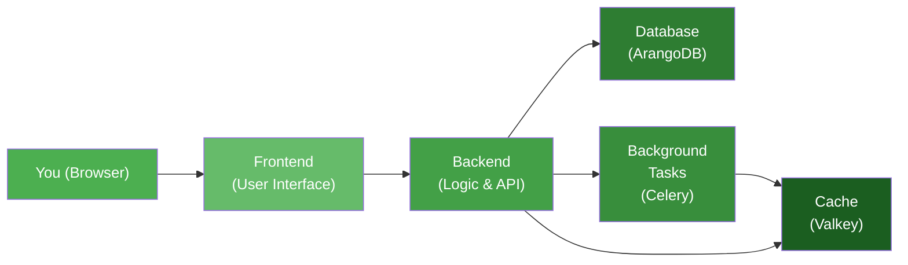

# Getting Started

Welcome to Kamerplanter! This guide will take you from zero to a running application in just a few minutes.

## Which path is right for you?

=== "I just want to try it out"

    All you need is Docker on your computer. In **5 minutes** you'll have Kamerplanter running and can start adding your first plants.

    **Continue to:** [Quick Start](quickstart.md)

=== "I want to run it permanently"

    You're planning to install Kamerplanter on a Raspberry Pi, NAS, or home server for long-term use.

    **Continue to:** [Installation](installation.md) and then [First Deployment](first-deployment.md)

---

## How Kamerplanter works

Kamerplanter consists of several building blocks that work together:

That sounds like a lot, but **Docker Compose starts everything automatically** with a single command. You don't need to set up the individual components yourself.

---

## What to expect after starting

1. You open Kamerplanter in your browser
2. The **Onboarding Wizard** greets you and guides you through the setup
3. You choose your experience level and a starter kit (e.g. "Windowsill Herbs" or "Balcony Tomatoes")
4. Kamerplanter automatically creates plants, locations, and tasks for you
5. You land on your personal dashboard

Learn more about the Onboarding Wizard in the [User Guide](../user-guide/onboarding.md).

---

## In this section

| Page | Description | Time needed |
|------|-------------|:-----------:|
| [Installation](installation.md) | Check prerequisites and install Docker | 10 min |
| [Quick Start](quickstart.md) | Start Kamerplanter and add your first plants | 5 min |
| [First Deployment](first-deployment.md) | Run permanently on your own server | 15 min |
