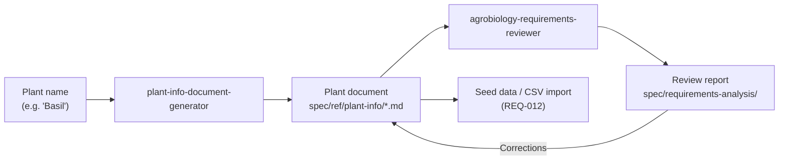

# Preparing Plant Data via AI Prompt

Kamerplanter manages 80+ structured fields per plant species -- from taxonomy and nutrient profiles to pest data and companion planting relationships. Manually collecting this data from various sources is time-consuming. That's why we use **Claude Code Agents** to fully prepare and quality-check new plants.

## Overview: The AI Pipeline



The workflow consists of three steps:

1. **Generation** -- An AI agent researches and creates the plant document
2. **Review** -- A second agent checks the data for scientific accuracy
3. **Import** -- The reviewed document serves as the basis for data import

---

## Step 1: Generate Plant Document

The `plant-info-document-generator` agent automatically researches all relevant data and creates a structured Markdown document under `spec/ref/plant-info/`.

### Invocation in Claude Code

```
Create a plant document for basil
```

or for multiple plants at once:

```
Create plant documents for: rosemary, thyme, oregano, sage
```

Claude Code recognizes the context and automatically activates the `plant-info-document-generator` agent.

### What the Agent Does

1. **Analyze input** -- Identifies the scientific name, family, and genus
2. **Research** -- Searches the web for:
    - Taxonomy and master data (GBIF, RHS, USDA)
    - Growth phases with PPFD, VPD, temperature per phase
    - Nutrient profiles (NPK, EC, pH per phase)
    - Pests and diseases with beneficial organisms
    - Care and overwintering instructions
    - Crop rotation and companion planting partners
3. **Create document** -- Writes a complete document with all Kamerplanter field references

### Result

The document is saved as:

```
spec/ref/plant-info/<scientific_name_snake_case>.md
```

Example: `spec/ref/plant-info/ocimum_basilicum.md`

### Document Structure

Each generated document contains these sections:

| Section | Content | Kamerplanter Reference |
|---------|---------|----------------------|
| 1. Taxonomy & Master Data | Botanical classification, sowing/harvest times, propagation, toxicity | REQ-001 Species/Cultivar |
| 2. Growth Phases | Phase overview, requirement profiles, nutrient profiles, transition rules | REQ-003 Phase Control |
| 3. Fertilization | Recommended products (mineral + organic), feeding schedule, mixing order | REQ-004 Nutrient Logic |
| 4. Care Instructions | Care profile, annual calendar, overwintering | REQ-022 Care Reminders |
| 5. Pests & Diseases | Pests, diseases, beneficial organisms, treatment methods | REQ-010 IPM System |
| 6. Crop Rotation & Companion Planting | Good/bad neighbors, crop rotation classification | REQ-013 Planting Runs |
| 7. Similar Species | Alternatives and related species | -- |
| 8. CSV Import Data | Ready-made CSV lines for REQ-012 import | REQ-012 Master Data Import |

Each table includes a `KA-Field` column referencing the exact Kamerplanter database field.

---

## Step 2: Scientific Review

The `agrobiology-requirements-reviewer` agent checks the document from an agrobiology expert's perspective.

### Invocation in Claude Code

```
Review the plant document spec/ref/plant-info/ocimum_basilicum.md for scientific accuracy
```

### What the Review Agent Checks

- **Taxonomy** -- Scientific names per APG IV, correct family assignment
- **Light data** -- PPFD/DLI instead of Lux, photoperiodism correct
- **Climate data** -- VPD calculation plausible, day/night temperature separated
- **Nutrients** -- EC ranges realistic, mixing order correct (CalMag before sulfates)
- **Pests** -- Scientific names, IPM tier approach (prevention > monitoring > intervention)
- **Toxicity** -- ASPCA data for cats/dogs verified
- **Companion planting** -- Compatibilities biologically justified

### Result

The review report is saved under:

```
spec/requirements-analysis/plant-info-agrobiology-review-<batch>.md
```

Findings are classified as:

| Category | Meaning |
|----------|---------|
| :red_circle: Scientifically Wrong | Immediate correction needed |
| :orange_circle: Incomplete | Important aspects missing |
| :yellow_circle: Too Vague | Needs precision |
| :green_circle: Note | Best practice recommendation |

---

## Step 3: Import into Kamerplanter

The reviewed documents serve as the basis for data import:

### Option A: Seed Data (Developer)

Plant data is built into a Python seed script at `src/backend/app/migrations/seed_plant_info.py`. The seed reads the Markdown documents and creates the corresponding ArangoDB documents.

### Option B: CSV Import (End User)

Each plant document contains ready-made CSV lines in section 8 that can be uploaded via the REQ-012 import function.

---

## Existing Plant Documents

Currently 32 plants are fully documented:

```
spec/ref/plant-info/
```

Including vegetables (tomato, pepper, cucumber, zucchini, ...), herbs (basil, parsley, dill, chives, ...), ornamentals (dahlia, petunia, sunflower, ...), and houseplants (monstera, peace lily, spider plant, guzmania).

---

## Tips for Best Results

!!! tip "Provide specific cultivar names"
    Instead of "tomato", try "tomato San Marzano" -- the agent can then research cultivar-specific data (maturity time, resistances, growth type) more accurately.

!!! tip "Specify the growing context"
    "Basil for indoor growing in a grow tent" yields different results than "basil for the garden" -- especially for light, temperature, and fertilization data.

!!! tip "Use batch processing"
    Request multiple related plants at once (e.g., all kitchen herbs) -- the agent can then document companion planting relationships between them right away.

!!! warning "Always run the review"
    AI-generated data can contain errors. The `agrobiology-requirements-reviewer` typically finds 2--5 corrections per document. EC values, toxicity data, and pest scientific names deserve particular scrutiny.

---

## Involved Claude Code Agents

| Agent | File | Task |
|-------|------|------|
| `plant-info-document-generator` | `.claude/agents/plant-info-document-generator.md` | Researches and creates plant documents |
| `agrobiology-requirements-reviewer` | `.claude/agents/agrobiology-requirements-reviewer.md` | Scientific review (botany, crop science, IPM) |
