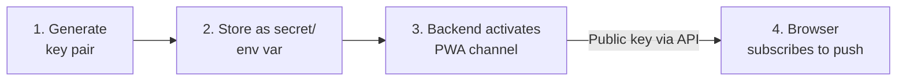

# Set Up Browser Push (Web Push / VAPID)

Kamerplanter can deliver care reminders and other notifications as **browser push** on desktop and mobile — even when the app is not open. This channel (`channel_key: "pwa"`) is built on the Web Push standard and requires a **VAPID key pair** that the operator generates once and stores in the backend.

!!! info "Who is this guide for?"
    These steps are aimed at **operators/administrators** of the Kamerplanter instance. End users then enable browser push with a single click in the notification settings — they never manage keys.

## What are VAPID keys?

VAPID (*Voluntary Application Server Identification*) identifies the sending server to the browsers' push services (Google FCM, Mozilla, Apple). The key pair consists of:

| Key | Use | Visibility |
|-----|-----|------------|
| **Public key** | Delivered to the browser and used when subscribing (`PushManager.subscribe`). | Public — not sensitive |
| **Private key** | Signs every outgoing push message on the server. | **Secret** — backend only |

The two keys belong together: a generated pair stays valid for the entire lifetime of the instance. Changing the public key invalidates all existing browser subscriptions — users would have to re-enable browser push.

## Overview

<!-- diagram-source: user-described — Operator generates a VAPID key pair, stores it as a backend secret, the backend activates the PWA channel and serves the public key to the browser, which subscribes for push -->


## Step 1 — Generate the key pair

Generate the pair once on any machine. There are two equivalent ways:

=== "Node.js (recommended)"

    ```bash
    npx web-push generate-vapid-keys
    ```

    Output:

    ```
    Public Key:
    BNm... (87 characters, Base64url)

    Private Key:
    8Kv... (Base64url)
    ```

=== "Python (pywebpush)"

    ```bash
    pip install pywebpush
    python3 - <<'PY'
    from py_vapid import Vapid
    from py_vapid.utils import b64urlencode
    from cryptography.hazmat.primitives import serialization

    v = Vapid()
    v.generate_keys()
    pub_raw = v.public_key.public_bytes(
        serialization.Encoding.X962,
        serialization.PublicFormat.UncompressedPoint,
    )
    priv_raw = v.private_key.private_numbers().private_value.to_bytes(32, "big")
    pub, priv = b64urlencode(pub_raw), b64urlencode(priv_raw)
    assert pub_raw[0] == 0x04 and len(pub_raw) == 65 and len(pub) == 87, "invalid public key"
    assert len(priv_raw) == 32 and len(priv) == 43, "invalid private key"
    print("VAPID_PUBLIC_KEY =", pub)
    print("VAPID_PRIVATE_KEY=", priv)
    PY
    ```

    The `assert` lines guarantee the command only ever prints a valid pair (public = uncompressed P-256 point, 65 bytes/87 chars; private 32 bytes/43 chars) — otherwise it fails with `AssertionError` instead of emitting an unusable key. The `b64urlencode` step is required because `v.public_key`/`v.private_key` are key objects and only serialization yields the Base64url strings.

Note down both keys — the private key is not shown again after generation.

!!! tip "Validate the key"
    A valid `VAPID_PUBLIC_KEY` is **87 characters** long and decodes to **65 bytes** (uncompressed P-256 point, starts with `0x04`). Quick check — must print `65`:
    ```bash
    echo -n '<PUBLIC_KEY>' | tr '_-' '/+' | base64 -d 2>/dev/null | wc -c
    ```
    If it reports a different length, the pair was generated incorrectly — regenerate it (most robustly with `npx web-push generate-vapid-keys`). A key that is too long causes the browser to report "The provided applicationServerKey is not valid" when subscribing.

## Step 2 — Store the keys in the backend

The browser push channel is configured via **three environment variables**. All three must be set, otherwise the channel stays disabled (see [Troubleshooting](#troubleshooting)).

| Variable | Description |
|----------|-------------|
| `VAPID_PUBLIC_KEY` | The public key from step 1. |
| `VAPID_PRIVATE_KEY` | The private key from step 1. Keep it **server-side only**. |
| `VAPID_CONTACT_EMAIL` | Contact address in the form `mailto:admin@example.com`. Push services use it if there is a problem with your server. |

=== "Docker Compose (.env)"

    Add the values to the `.env` file in the repository root:

    ```bash
    VAPID_PUBLIC_KEY=BNm...
    VAPID_PRIVATE_KEY=8Kv...
    VAPID_CONTACT_EMAIL=mailto:admin@example.com
    ```

=== "Kubernetes / Helm"

    Create the keys as a Kubernetes Secret — **not** in plaintext in `values.yaml`:

    ```yaml
    apiVersion: v1
    kind: Secret
    metadata:
      name: kamerplanter-vapid
    type: Opaque
    stringData:
      VAPID_PUBLIC_KEY: "BNm..."
      VAPID_PRIVATE_KEY: "8Kv..."
      VAPID_CONTACT_EMAIL: "mailto:admin@example.com"
    ```

    The backend reads the variables via `envFrom` from the referenced secret (just like `kamerplanter-secrets`). See [Helm Charts](../deployment/helm.md).

!!! danger "Never expose the private key"
    The `VAPID_PRIVATE_KEY` must **never** appear in the frontend, in logs, in `values.yaml`, or in public configuration files — it signs all push messages from your instance. Treat it like `JWT_SECRET_KEY`: as a secret only.

## Step 3 — Restart the backend

Restart the backend so the new variables are loaded:

=== "Docker Compose"

    ```bash
    docker compose up -d --force-recreate backend
    ```

=== "Kubernetes"

    ```bash
    kubectl rollout restart deployment/kamerplanter-backend
    ```

On startup the backend registers the PWA channel automatically as soon as all three variables are present.

## Step 4 — Verify the setup

1. **Public key is served** — the endpoint returns the configured key:

   ```bash
   curl https://<your-instance>/api/v1/t/<tenant-slug>/notifications/pwa/vapid-public-key
   # {"vapid_public_key": "BNm..."}
   ```

2. **Enable in the app** — log in as a user, open **Settings → Notifications**, and enable **Browser Push**. The browser asks for notification permission. If it shows "Not configured", one of the three variables is empty or the backend was not restarted.

3. **Send a test message** — use the "Test notification" button in the notification settings to confirm a push message arrives.

!!! note "HTTPS required"
    Browsers only allow Web Push and service workers over **HTTPS** (exception: `localhost` during development). Behind a reverse proxy, TLS must be enabled.

## Troubleshooting

| Symptom | Cause & fix |
|---------|-------------|
| Notification settings show "Not configured" | At least one of the three `VAPID_*` variables is empty, or the backend was not restarted after setting them. Check all three and restart. |
| `vapid-public-key` endpoint returns an empty value / 404 | `VAPID_PUBLIC_KEY` not set, or the tenant slug in the URL is wrong. |
| Browser push cannot be enabled | The page is not served over HTTPS, or the user blocked notification permission in the browser. |
| Browser reports "The provided applicationServerKey is not valid" | The `VAPID_PUBLIC_KEY` is not a valid P-256 key (not 87 characters / 65 bytes — see [Validate the key](#step-1-generate-the-key-pair)). Regenerate the **entire pair** and replace both keys — trimming only the public key does not work, as it must match the private key. |
| Subscription exists but no messages arrive | The `VAPID_PRIVATE_KEY` does not match the public key (mixed pairs), or `VAPID_CONTACT_EMAIL` is not in the `mailto:…` format. Regenerate the key pair together. |

## Related topics

- [Environment Variables](../reference/environment-variables.md#browser-push-pwa-vapid) — reference for all `VAPID_*` variables
- [Home Assistant Integration](home-assistant-integration.md) — alternative notification channel
- [Care Reminders](../user-guide/care-reminders.md) — the trigger for most push notifications
