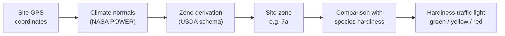

# Climate Zones & Hardiness

!!! info "API only / operator configuration"
    Kamerplanter already computes your site's hardiness zone fully automatically in the background — from your GPS coordinates and your site's long-term climate data. In the site form of the web interface, however, you currently only see the result reflected in the existing free-text **Climate zone** field (see [Locations & Substrates](../user-guide/locations-substrates.md#filling-in-basic-data)) — a dedicated button to trigger an immediate re-derivation and a provenance display ("automatically derived" / "manually set") don't exist there yet. The full feature is already available via the REST API — see [For Technical Users / Self-Hosters](#for-technical-users-self-hosters) below. <!-- REQ-039 -->

Kamerplanter determines how winter-hardy your site is automatically from your GPS coordinates — you don't have to look up which zone you're in yourself. This zone feeds the hardiness traffic light for your perennial plants (see [Overwintering](../user-guide/overwintering.md)) and helps you see whether a species will survive at your site without extra protection.

---

## What Are Hardiness Zones?

Hardiness zones (following the scheme of the **U.S. Department of Agriculture (USDA)**) classify locations by their **mean annual minimum temperature** (averaged over roughly 30 years) into zones **1–13**. Each zone is further split into two half-zones, `a` and `b` (e.g. `7a`, `8b`), each spanning roughly 2.8 °C. The lower the zone number, the colder the location in winter.

For Germany, Austria, and Switzerland, zones **5a to 9a** are the most relevant: alpine and highland elevations tend to sit at 5a–6a, the common lowlands at 6b–7b, and the mildest special locations (Rhine valley, Lake Constance, Ticino) reach 8a to 9a.

This zone scheme ties several things together in Kamerplanter: the structured **hardiness zone** field of a site (automatically derived or manually set), a species' hardiness rating in master data, and its four-level frost sensitivity rating (from "sensitive" to "very hardy"). The former free-text **Climate zone** field on a site (see [Locations & Substrates](../user-guide/locations-substrates.md)) remains for compatibility — Kamerplanter automatically keeps it in sync with the derived or manually set zone. <!-- REQ-039 -->

---

## How the Zone Is Determined

<!-- diagram-source: user-described — deriving a site's hardiness zone from GPS via REQ-041 climate normals, then comparing it to a species' hardiness to produce the traffic-light rating -->


For locations in Germany, Austria, and Switzerland, Kamerplanter does not use a ready-made map — a freely licensed DACH hardiness zone map does not exist. Instead, Kamerplanter calculates the zone itself: from the coldest monthly mean minimum temperature of your site's long-term [climate normals](../user-guide/weather-sources.md#climate-at-the-site), classified into one of 26 USDA half-zones (`1a`–`13b`) using a fixed, license-free temperature-band schema — no proprietary USDA/PHZM/PRISM map data is used.

- **Automatic background computation**: Once GPS coordinates are set for your outdoor or greenhouse site and at least one usable climate-normal record is available, a quarterly background task (on the 1st of January, April, July, and October) recomputes the zone automatically — with no action needed from you, just like the [climate normals](../user-guide/weather-sources.md#climate-at-the-site) themselves.
- **Manual override**: You can override the derived zone by hand at any time — for example, if your site has a known microclimate (courtyard, south-facing slope). A manually set zone is never overwritten again by the automatic refresh. This currently only works via the API — a control for it in the site form doesn't exist yet (see [For Technical Users / Self-Hosters](#for-technical-users-self-hosters) below).
- **Traceability**: For every derived zone, Kamerplanter stores where it came from (automatically derived from GPS coordinates or manually set) and when it was last computed — also currently only retrievable via the API, not yet shown in the site form.
- **GPS only, no postal code**: Derivation currently works exclusively from GPS coordinates; postal-code-based derivation is not (yet) implemented.

---

## The Hardiness Traffic Light

The hardiness traffic light (see [Overwintering](../user-guide/overwintering.md)) compares a species' hardiness rating with the hardiness zone of its site. It prefers the structured, automatically derived zone; if no zone has been computed yet for a site, it falls back to the free text in the **Climate zone** field. <!-- REQ-022, REQ-039 -->

Kamerplanter checks the following rules in order — the first one that matches decides the traffic light:

| Light | Meaning | Rule |
|-------|---------|------|
| 🔴 Red | Must overwinter frost-free | The species is rated frost-sensitive, **or** the site zone is more than one zone colder than the species' minimum required zone. |
| 🟡 Yellow | Protection needed (mulch, fleece) | The species is rated moderately hardy, **or** the site zone exactly matches the species' minimum required zone or is up to one zone colder, **or** neither a zone nor a hardiness rating is known. |
| 🟢 Green | Hardy, no protection needed | Neither of the above rules applies — the site zone (where known) is warmer than the species' minimum required zone. |

Example: A fig tree that, according to master data, needs at least zone 8a, at a site in zone 7a — the site zone is exactly one zone colder than the minimum required → yellow or red rating, depending on whether the specific cultivar is itself rated frost-sensitive.

!!! tip "What you'll see"
    As soon as you assign a perennial plant to a site, the "Care" > "Overwintering" section of its plant page immediately shows you whether it's hardy there or needs protection — based on exactly this zone comparison. See [Overwintering](../user-guide/overwintering.md) for details on the display.

---

## Frost Reference Dates for the Sowing Calendar

Every zone catalog entry carries typical dates for the last and first frost. As long as you haven't set your own frost dates or a weather API connection for your site, Kamerplanter automatically prefills these reference values into the frost date fields of your [Sowing Calendar](../user-guide/calendar.md) — once your site's hardiness zone has been derived at least once.

---

## For Technical Users / Self-Hosters {#for-technical-users-self-hosters}

!!! note "Audience: operators and developers"
    The following sections are for people who run or administer their own Kamerplanter instance. None of these steps are needed for everyday use in the garden — the zone is derived automatically in the background once GPS coordinates and climate normals are available for the site.

### Fetching the Global Zone Catalog

```bash
curl -H "Authorization: Bearer <JWT>" \
  http://localhost:8000/api/v1/hardiness-zones | python3 -m json.tool
```

### Reading a Site's Hardiness Zone

```bash
curl -H "Authorization: Bearer <JWT>" \
  http://localhost:8000/api/v1/t/<tenant-slug>/sites/<site_key>/hardiness | python3 -m json.tool
```

### Re-Deriving or Manually Setting a Zone Immediately

Instead of waiting for the next quarterly background run, you can trigger the derivation for a site immediately — provided [climate normals](../reference/api-reference.md#site-climate-normals-nasa-power) already exist for it:

```bash
curl -X POST -H "Authorization: Bearer <JWT>" \
  "http://localhost:8000/api/v1/t/<tenant-slug>/sites/<site_key>/resolve-hardiness-zone"
```

An already manually set zone is left untouched unless you force the re-derivation with `?force=true`. To set a zone manually (and permanently protect it from the automatic refresh), use the regular site update and pass `hardiness_zone` in the request body — see [Environment Variables — Hardiness Zones](../reference/environment-variables.md#hardiness-zones-usda) and [API Reference — Hardiness Zones](../reference/api-reference.md#hardiness-zones-usda) for details.

---

## Frequently Asked Questions

??? question "Can I override the automatically derived zone?"
    Yes, this is always possible. A manually set zone is no longer overwritten by the automatic refresh. Setting it currently only works via the API (see above).

??? question "Where does the climate data for the zone derivation come from?"
    From the same [climate normals](../user-guide/weather-sources.md#climate-at-the-site) that also feed the "Climate at the Site" section: the satellite- and model-based reanalysis service **NASA POWER** from NASA Earth observation (CC BY 4.0 license, no registration and no API key needed). A ready-made US hardiness zone map (e.g. phzmapi.org) only covers the US and is not used for DACH locations — Kamerplanter instead calculates the zone itself from the temperature-band schema.

??? question "What happens if I haven't entered GPS coordinates?"
    Without GPS coordinates, a zone cannot be derived automatically, since climate normals also won't be fetched for your site in that case. You can still set the zone manually.

??? question "Why don't I see a button to derive the zone automatically in the site form?"
    This doesn't exist in the web interface yet — the derivation instead runs automatically in the background via a quarterly task once GPS coordinates and climate normals are available for your site. Triggering it manually and immediately is currently only possible via the API.

---

## See Also

- [Locations & Substrates](../user-guide/locations-substrates.md)
- [Weather Sources per Location — Climate at the Site](../user-guide/weather-sources.md#climate-at-the-site)
- [Overwintering](../user-guide/overwintering.md)
- [Growth Phases](../user-guide/growth-phases.md)
- [Calendar & Sowing Calendar](../user-guide/calendar.md)
- [API Reference — Hardiness Zones](../reference/api-reference.md#hardiness-zones-usda)
- [Environment Variables — Hardiness Zones](../reference/environment-variables.md#hardiness-zones-usda)
