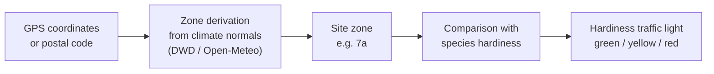

# Climate Zones & Hardiness

!!! warning "Not yet implemented"
    This planned feature is not yet built. The following sections describe the planned behavior in future tense. Currently, the "Climate zone" field on a site is a freely editable text field with no automatic derivation and no fixed format — see [Locations & Substrates](../user-guide/locations-substrates.md). <!-- REQ-039 -->

Kamerplanter will automatically determine how winter-hardy your location is — based on your GPS coordinates or postal code, instead of you having to look up which zone you are in yourself. This zone will feed the hardiness traffic light for your perennial plants and warn you before you plant a frost-sensitive species at a location that is too cold for it.

---

## What Are Hardiness Zones?

Hardiness zones (following the scheme of the **U.S. Department of Agriculture (USDA)**) classify locations by their **mean annual minimum temperature** (averaged over roughly 30 years) into zones **1–13**. Each zone is further split into two half-zones, `a` and `b` (e.g. `7a`, `8b`), each spanning roughly 2.8 °C. The lower the zone number, the colder the location in winter.

For Germany/Austria/Switzerland, zones **6a to 8b** are the most relevant — roughly: higher elevations and the east tend toward 6b/7a, mild wine-growing and Rhine regions reach up to 8b.

This zone scheme is already referenced in several places in Kamerplanter, but currently only as freely typed text without validation or derivation:

- the **Climate zone** field on a site (see [Locations & Substrates](../user-guide/locations-substrates.md))
- the hardiness rating of a species in master data
- the four-level frost sensitivity rating of a species in master data (from "sensitive" to "very hardy")

This planned feature will tie these loose threads together into a canonical zone reference with automatic derivation. <!-- REQ-039 -->

---

## How the Zone Will Be Determined

<!-- diagram-source: user-described — deriving a site's hardiness zone from GPS/postal code via climate-normal data, then comparing it to a species' hardiness to produce the traffic-light rating -->

For locations in Germany, Austria, and Switzerland, the zone will **not** come from a ready-made map — a freely licensed DACH hardiness zone map does not exist. Instead, Kamerplanter will **calculate the zone itself**: from the daily minimum temperatures of the latest climate-normal period (German Weather Service Open Data or the Open-Meteo Historical Weather API), averaged into an annual minimum and classified into a USDA zone.

- **Automatic derivation**: A "Determine zone automatically" button will appear on the site form once GPS coordinates or a postal code are set.
- **Manual override**: You will always be able to override the derived zone by hand — e.g. if your location has a known microclimate (courtyard, south-facing slope).
- **Traceability**: For each zone, Kamerplanter will show where it came from (automatically derived or manually set) and when it was last updated.
- **Periodic refresh**: Automatically derived zones are planned to be recalculated quarterly; manually set zones remain untouched.

---

## The Hardiness Traffic Light

The planned hardiness traffic light (see [Care Reminders](../user-guide/care-reminders.md)) is currently based on a simple text comparison between a species' frost sensitivity and the site's freely entered climate-zone text. This planned feature will replace this comparison with a numeric zone match: <!-- REQ-022, REQ-039 -->

| Light | Meaning | Rule (planned) |
|-------|---------|-----------------|
| 🟢 Green | Hardy, no protection needed | Species is hardy or very hardy **and** site zone ≥ species' minimum zone |
| 🟡 Yellow | Protection needed (mulch, fleece) | Species is moderately hardy **or** zone difference ≤ 1 |
| 🔴 Red | Must overwinter frost-free | Species is frost-sensitive **or** zone difference > 1 |

Example: A fig tree that, according to master data, needs at least zone 8a, at a location in zone 7a → one zone too cold → yellow or red rating, depending on the cultivar's frost sensitivity.

!!! tip "What will change for you"
    When adding a perennial plant, you will be warned immediately if the chosen species is not hardy at your location — including an understandable explanation such as "Site 7a, species needs at least 8a → 1 zone too cold." This replaces today's manual lookup.

---

## Frost Reference Dates for the Sowing Calendar

Every zone reference will carry typical dates for the last and first frost. As long as you have not set your own frost dates or a weather API connection, these reference values are planned to automatically prefill the frost date fields of your [Sowing Calendar](../user-guide/calendar.md).

---

## Frequently Asked Questions

??? question "Can I override the automatically derived zone?"
    Yes, this will always be possible. A manually set zone will no longer be overwritten by the automatic refresh.

??? question "Where does the climate data for Germany come from?"
    From open, license-safe sources: the climate normals of the German Weather Service (under Germany's Geodata Usage Ordinance, GeoNutzV) and the Open-Meteo Historical Weather API (CC-BY-4.0). A ready-made US hardiness zone map (e.g. phzmapi.org) only covers the US and will not be used for DACH locations.

??? question "What happens if I have not entered GPS coordinates?"
    Without GPS coordinates or a postal code, a zone cannot be derived automatically. You will still be able to enter the zone manually.

---

## See Also

- [Locations & Substrates](../user-guide/locations-substrates.md)
- [Care Reminders — Overwintering Management](../user-guide/care-reminders.md)
- [Growth Phases](../user-guide/growth-phases.md)
- [Calendar & Sowing Calendar](../user-guide/calendar.md)
- [Sensors — Weather API](../user-guide/sensors.md#outdoor-sensors-setting-up-a-weather-api)
