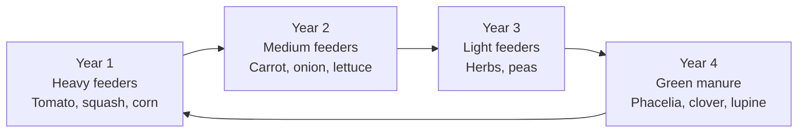

# Companion Planting

Companion planting means growing different plant species together in one space so they
support each other. Kamerplanter gives you concrete recommendations based on a
compatibility database and shows which combinations work well — and which you should
avoid.

---

## Prerequisites

- At least one location (bed or greenhouse) set up in Kamerplanter
- Plant species available in master data (or imported via search)

---

## What Is Companion Planting — and Why Does It Work?

Plants influence each other in various ways:

| Mechanism | Example | Effect |
|-----------|---------|--------|
| **Pest repellency** | Marigolds next to tomatoes | Nematodes repelled by root secretions |
| **Aromatic effect** | Basil next to tomatoes | Essential oils confuse whiteflies |
| **Nitrogen fixation** | Beans next to corn | Root bacteria fix atmospheric nitrogen |
| **Root zone use** | Onion + carrot | Different depths, no nutrient competition |
| **Shade effect** | Lettuce under tomatoes | Lettuce thrives in partial shade, soil stays moist |
| **Pollinator attraction** | Phacelia next to vegetable bed | Wild bees are attracted |

!!! tip "Companion planting is not a miracle cure"
    Companion planting supports your garden but does not replace good soil care,
    irrigation, and crop rotation. Treat it as one measure among several.

---

## Classic Combinations

### The Three Sisters (Corn, Beans, Squash)

One of the world's oldest companion planting systems — developed by the Haudenosaunee
(Iroquois):

```
Corn         → Climbing support for beans, shades squash soil
Beans        → Nitrogen fixation for corn and squash
Squash       → Large leaves shade the soil, retain moisture
```

!!! example "Setting up in Kamerplanter"
    Create a planting run of type "mixed_culture" and choose corn as the primary plant.
    The system suggests beans and squash as companions.

### Tomato & Basil

Probably the most well-known companion planting pair in greenhouse and outdoor growing:

- Basil acts as pest repellent (whitefly, aphids)
- Shared water needs and temperature requirements simplify care
- Both require a sunny location

**Compatibility score in Kamerplanter:** 0.9 (highly recommended)

### Carrot & Onion

Classic vegetable pairing:

- Onions and carrots use different soil layers
- Onion scent disrupts carrot fly oviposition
- Carrot foliage disrupts the onion fly

### Marigolds & Calendula as Universal Companions

Two flowers that can be used almost anywhere:

| Plant | Effect | Recommended neighbors |
|-------|--------|-----------------------|
| **Tagetes** (French marigold) | Nematodes, whiteflies, root secretions deter slugs | Tomatoes, peppers, lettuce |
| **Calendula** (pot marigold) | Aphid repellent, attracts beneficials (hoverflies, ladybugs) | Almost all vegetables |

!!! tip "Marigolds as bed border"
    Plant marigolds all around a vegetable bed as a living border. Even if you do not
    record data in Kamerplanter, the entire bed benefits from the protective effect.

### Herbs as Pest Control

| Herb | Effect |
|------|--------|
| Basil | Whitefly, aphids |
| Lavender | Mites, moths (scent) |
| Sage | Cabbage fly, caterpillars |
| Summer savory | Black bean aphid |
| Dill | Confuses carrot fly females; attracts hoverflies |
| Coriander | Repels aphids, attracts hoverflies |

---

## Bad Neighbors — What to Avoid

!!! danger "Fennel: The loner"
    Fennel is incompatible with nearly every other garden plant. It secretes allelopathic
    substances that inhibit the growth of tomatoes, peppers, bush beans, and lettuce.
    Plant fennel in its own bed or in a container at the edge of the garden.

| Incompatible pair | Reason | Recommendation |
|------------------|--------|---------------|
| Tomato + potato | Same Solanaceae family, shared diseases (late blight) | Keep at least 10 m apart |
| Fennel + tomato | Allelopathy from fennel secondary metabolites | Separate beds |
| Onion + peas | Growth inhibition of peas | Different bed sections |
| Potato + squash | Strong nutrient competition | Plan rotation accordingly |

---

## Using Companion Planting in Kamerplanter

### Step 1: Create a planting run as mixed culture

1. Navigate to **Planting Runs** and click **New Run**.
2. Select **Mixed Culture** as the run type.
3. Choose your primary plant (e.g., tomato).
4. The system immediately shows you recommendations for companion plants.

!!! info "Screenshot pending"
    This screenshot will be added in a future version.

### Step 2: Select companion plants

Kamerplanter distinguishes three entry roles:

| Role | Meaning |
|------|---------|
| **Primary** | Main plant of the bed (e.g., tomato) |
| **Companion** | Beneficial companion (e.g., basil) |
| **Trap crop** | Actively attracts pests to protect the primary plant (e.g., marigolds) |

For each recommendation, the system shows:

- **Compatibility score** (0.0–1.0): Higher = more recommended
- **Effect type**: Pest repellency, growth enhancement, soil improvement, etc.
- **Rationale**: Short explanation (e.g., "Whitefly repellent via essential oils")
- **Match level**: Species level (exact) or family level (fallback, 20% score reduction)

### Step 3: Compatibility check

Once you have assembled a plant combination, check the overall compatibility:

- **Green**: All combinations are compatible
- **Yellow (warning)**: One or more incompatible pairs found; planting possible but
  not recommended
- **Red**: Critically incompatible combination (e.g., fennel + tomato)

!!! note "Family-level fallback"
    If no specific entry exists for a species pair, the system checks the family level.
    A family-level match is reduced by 20% in score and marked as "family level" so
    you can distinguish it from species-level matches.

---

## Integrating Crop Rotation

Companion planting and crop rotation complement each other. Kamerplanter tracks a
4-year cycle per bed:



For companion planting: plants from the same nutrient category do not improve soil
health — combine heavy feeders with legumes where possible.

---

## Frequently Asked Questions

??? question "What does 'allelopathy' mean?"
    Allelopathy describes the ability of plants to release chemical compounds that
    inhibit or promote the growth of neighboring plants. Fennel is the best-known
    example of negative allelopathy in the garden.

??? question "Does companion planting work in greenhouses and indoors?"
    Yes, with limitations. Aromatic pest repellency works indoors too. However, space
    is often limited, and some companions (e.g., tall marigold varieties) can hinder
    air circulation. Kamerplanter marks recommendations that are primarily validated
    for outdoor food crops.

??? question "Where does the compatibility data come from?"
    The seed data in Kamerplanter is based on established gardening references and
    recognized companion planting sources. Each entry carries a source citation
    (e.g., "Mein schoener Garten", "fryd.app", "experiential knowledge").

??? question "Can I add my own compatibility pairs?"
    Currently only platform admins manage the global compatibility edges. You can
    record your own observations in the plant diary (PlantDiaryEntry).

## See also

- [Planting Runs](../user-guide/planting-runs.md)
- [Locations & Substrates](../user-guide/locations-substrates.md)
- [Pest Management (IPM)](../user-guide/pest-management.md)
- [GDD Calculation](gdd-calculation.md)
