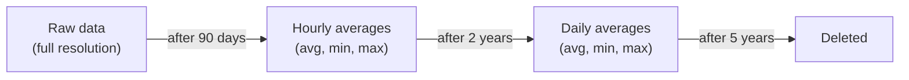
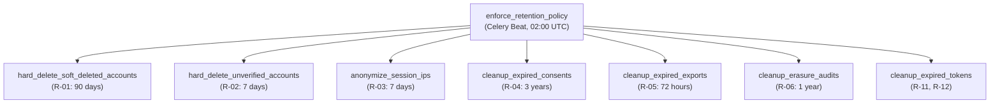
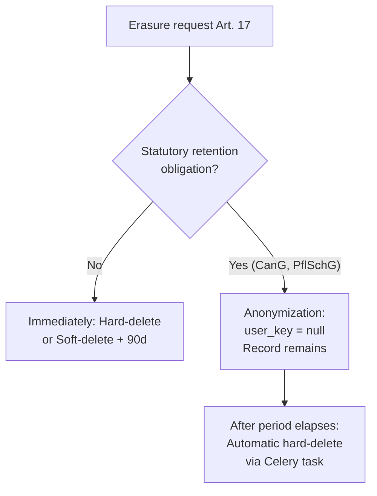

# Data Retention & Anonymization

Kamerplanter stores data only as long as technically or legally required. This document
describes the retention matrix, the automated enforcement mechanism (Celery task),
TimescaleDB aggregation for sensor data, and configuration via environment variables.

Basis: NFR-011 (Data Retention & Storage Limits), GDPR Art. 5(1)(e).

---

## Retention Matrix — Personal Data

| Ref | Data Category | Retention Period | Action after Period | Legal Basis |
|-----|--------------|-----------------|---------------------|------------|
| R-01 | Soft-deleted user accounts | 90 days after soft-delete | Hard-delete (incl. edges, auth providers, sessions) | GDPR Art. 17 |
| R-02 | Unconfirmed accounts | 7 days after creation | Hard-delete | Art. 5(1)(e), purpose lapse |
| R-03 | IP addresses in sessions | 7 days after storage | Anonymization (IPv4: last octet → `0`) | Art. 5(1)(c) data minimization |
| R-04 | Consent records | 3 years after revocation | Hard-delete | Art. 7(1) accountability |
| R-05 | Export files (GDPR Art. 15/20) | 72 hours after completion | Delete file, set status to `expired` | Purpose lapse |
| R-06 | Erasure audit logs | 1 year after completion | Hard-delete | Art. 5(2) accountability |
| R-07 | Email change requests | 24 hours | Hard-delete expired tokens | Purpose lapse |
| R-11 | Expired refresh tokens | Immediately on expiry | Hard-delete (TTL index) | Purpose lapse |
| R-12 | Expired invitations | 30 days after expiry | Hard-delete | Purpose lapse |

### IP Anonymization (R-03)

IP addresses are automatically anonymized after 7 days — not deleted, as they may
still be needed for detecting compromised sessions:

- **IPv4:** Last octet set to `0` — `192.168.1.42` → `192.168.1.0`
- **IPv6:** Truncated to `/48` prefix — `2001:db8:85a3::8a2e:370:7334` → `2001:db8:85a3::`

The `ip_anonymized_at` field is set to the time of anonymization.

---

## Retention Matrix — Sensor Data

Sensor data can indirectly allow inferences about the presence and behavior of persons
(CO2 curves, motion sensors, manual overrides). They are therefore subject to a tiered
retention policy in TimescaleDB:



| Stage | Time range | Resolution | TimescaleDB view |
|-------|-----------|-----------|-----------------|
| 1 — Raw data | 0–90 days | Full measurement resolution | `sensor_readings` |
| 2 — Hourly | 90 days–2 years | 1 value per hour | `sensor_hourly` |
| 3 — Daily | 2–5 years | 1 value per day | `sensor_daily` |
| Expiry | After 5 years | — | Automatically deleted |

!!! note "Climate extreme events are retained permanently"
    Frost, heat waves, and storm events are archived permanently as `ClimateEvent`
    documents in ArangoDB — without personal reference. This is relevant for perennial
    plants (fruit trees, perennials) where climate history is needed over many years.

### TimescaleDB Continuous Aggregates

Automatic downsampling is handled by TimescaleDB Continuous Aggregates and Retention
Policies:

```sql
-- Stage 2: Hourly averages (automatically after 90 days)
CREATE MATERIALIZED VIEW sensor_hourly
  WITH (timescaledb.continuous) AS
  SELECT
    time_bucket('1 hour', timestamp) AS bucket,
    location_key,
    sensor_type,
    AVG(value)   AS avg_value,
    MIN(value)   AS min_value,
    MAX(value)   AS max_value,
    COUNT(*)     AS sample_count
  FROM sensor_readings
  GROUP BY bucket, location_key, sensor_type;

-- Stage 3: Daily averages (automatically after 2 years)
CREATE MATERIALIZED VIEW sensor_daily
  WITH (timescaledb.continuous) AS
  SELECT
    time_bucket('1 day', bucket) AS bucket,
    location_key,
    sensor_type,
    AVG(avg_value) AS avg_value,
    MIN(min_value) AS min_value,
    MAX(max_value) AS max_value,
    SUM(sample_count) AS sample_count
  FROM sensor_hourly
  GROUP BY time_bucket('1 day', bucket), location_key, sensor_type;

-- Retention policies (automatic deletion)
SELECT add_retention_policy('sensor_readings', INTERVAL '90 days');
SELECT add_retention_policy('sensor_hourly',   INTERVAL '2 years');
SELECT add_retention_policy('sensor_daily',    INTERVAL '5 years');
```

---

## Statutory Minimum Retention Periods

These records **must not** be deleted before the statutory period has elapsed.
For a GDPR erasure request (Art. 17), they are **anonymized** (user reference removed)
but not deleted (Art. 17(3)(b)):

| Ref | Data Category | Minimum Period | Legal Basis |
|-----|--------------|---------------|------------|
| R-16 | Harvest data (HarvestBatch, QualityAssessment, YieldMetric) | 5 years | CanG (German Cannabis Act) |
| R-17 | Treatment applications (TreatmentApplication) | 3 years | PflSchG §11 (Plant Protection Act) |
| R-18 | Inspection records | 3 years | PflSchG §11 |

!!! danger "Deletion lock"
    Deleting an active harvest or treatment record would violate CanG or PflSchG.
    The system prevents this technically — on an erasure request, the user reference
    (`user_key`) is set to `null`; the record itself remains until the statutory
    period has elapsed.

---

## Celery Enforcement: Automated Execution

The Celery task `enforce_retention_policy` runs **daily at 02:00 UTC** and orchestrates
all retention sub-tasks:



Each sub-task logs the number of processed records via structlog:

```json
{
  "event": "retention.run_completed",
  "results": {
    "hard_delete_soft_deleted_accounts": {"deleted_count": 3},
    "anonymize_session_ips": {"anonymized_count": 47},
    "cleanup_expired_exports": {"expired_count": 1}
  },
  "duration_ms": 1234
}
```

### Prometheus Metrics

The retention task exposes the following metrics:

| Metric | Type | Labels | Description |
|--------|------|--------|-------------|
| `retention_records_processed_total` | Counter | `category`, `action` | Records processed per category and action (`delete`/`anonymize`/`expire`) |
| `retention_run_duration_seconds` | Histogram | — | Duration of the full retention run |
| `retention_run_errors_total` | Counter | `category` | Errors per category |

---

## Configuration via Environment Variables

All periods are configurable via environment variables. The prefix `RETENTION_` is prepended:

```bash
# Personal data
RETENTION_SOFT_DELETE_RETENTION_DAYS=90      # R-01: Soft-deleted accounts
RETENTION_UNVERIFIED_ACCOUNT_DAYS=7          # R-02: Unconfirmed accounts
RETENTION_IP_ANONYMIZATION_DAYS=7            # R-03: IP anonymization
RETENTION_CONSENT_RETENTION_YEARS=3          # R-04: Consent records
RETENTION_EXPORT_FILE_RETENTION_HOURS=72     # R-05: Export files
RETENTION_ERASURE_AUDIT_RETENTION_YEARS=1    # R-06: Audit logs
RETENTION_EMAIL_CHANGE_RETENTION_HOURS=24    # R-07: Email change requests
RETENTION_INVITATION_RETENTION_DAYS=30       # R-12: Expired invitations

# Sensor data (TimescaleDB)
RETENTION_SENSOR_RAW_RETENTION_DAYS=90       # R-14 Stage 1
RETENTION_SENSOR_HOURLY_RETENTION_YEARS=2    # R-14 Stage 2
RETENTION_SENSOR_DAILY_RETENTION_YEARS=5     # R-14 Stage 3
RETENTION_ACTOR_LOG_RAW_RETENTION_DAYS=90    # R-15 Stage 1
RETENTION_ACTOR_LOG_AGGREGATED_RETENTION_YEARS=1  # R-15 Stage 2
```

!!! warning "Statutory minimums cannot be undercut"
    The following values can be increased but **not reduced** below the statutory
    minimums. A validation check at application startup enforces these floors:

    ```bash
    RETENTION_HARVEST_DATA_MIN_RETENTION_YEARS=5   # R-16, CanG — MINIMUM
    RETENTION_TREATMENT_MIN_RETENTION_YEARS=3      # R-17, PflSchG — MINIMUM
    RETENTION_INSPECTION_MIN_RETENTION_YEARS=3     # R-18, PflSchG — MINIMUM
    ```

---

## Interaction with GDPR Erasure Requests

When a data subject submits an erasure request under GDPR Art. 17, the following
procedure applies:



| Data category | Procedure |
|--------------|-----------|
| User account | Soft-delete → hard-delete after 90 days |
| Consent records | Delete immediately (on revocation) |
| Export files | Delete immediately |
| Harvest data, treatments, inspections | Anonymize, do not delete (Art. 17(3)) |
| Shared tenant data (pins, shopping lists) | Anonymize user reference, content remains |

---

## Frequently Asked Questions

??? question "Can I extend the 90-day soft-delete period?"
    Yes, via `RETENTION_SOFT_DELETE_RETENTION_DAYS`. Reducing it below 30 days is not
    recommended, as users would have no opportunity to recover accidentally deleted
    accounts.

??? question "What happens to tenant data when the last admin of a tenant is deleted?"
    The Celery task `detect_orphaned_tenants` detects tenants without an active admin
    and sets an `orphaned_since` timestamp. A platform admin can then appoint an
    emergency admin.

??? question "How can I verify that the retention task is running correctly?"
    Check the Prometheus metric `retention_run_duration_seconds` or look in the
    structured logs (structlog) for the event `retention.run_completed`. In the
    Kubernetes cluster: `kubectl logs -l app=celery-beat`.

??? question "Are sensor data deleted when an account is deleted?"
    Sensor data in TimescaleDB has no direct user reference — it is assigned to a
    location (`location_key`). On account deletion, sensor data is retained and is
    only subject to the time-based retention policies (R-14).

## See also

- [Environment Variables](../reference/environment-variables.md)
- [Database Schema](../reference/database-schema.md)
- [Kubernetes Deployment](../deployment/kubernetes.md)
