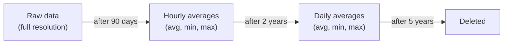
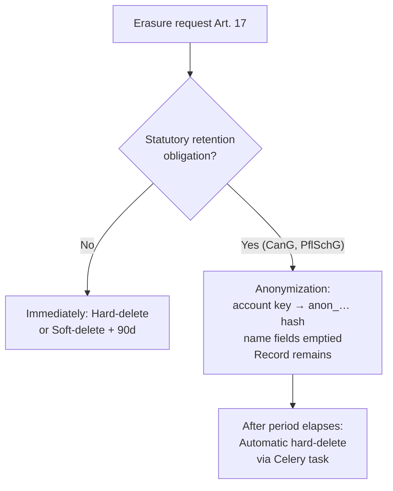

# Data Retention & Anonymization

Kamerplanter stores data only as long as technically or legally required. This document
describes the retention matrix, the automated enforcement mechanism (Celery task),
TimescaleDB aggregation for sensor data, and configuration via environment variables.

Basis: GDPR Art. 5(1)(e). <!-- NFR-011 -->

---

## Retention Matrix — Personal Data

| Ref | Data Category | Retention Period | Action after Period | Legal Basis |
|-----|--------------|-----------------|---------------------|------------|
| R-01 | Soft-deleted user accounts | 90 days after soft-delete | Hard-delete (incl. edges, auth providers, sessions) | GDPR Art. 17 |
| R-02 | Unconfirmed accounts | 7 days after creation | Hard-delete (`app.tasks.auth_tasks.cleanup_unverified_accounts`, daily) | Art. 5(1)(e), purpose lapse |
| R-03 | IP addresses in sessions | 7 days after storage | Anonymization (IPv4: last octet → `0`) | Art. 5(1)(c) data minimization |
| R-04 | Consent records | 3 years after revocation | **Not implemented:** no task deletes `consent_records`; the IP address of a consent record is not anonymized either | Art. 7(1) accountability |
| R-05 | Export files (GDPR Art. 15/20) | 72 hours after completion | Delete file first, then set status to `expired` | Purpose lapse |
| R-06 | Erasure audit (completed requests) | 1 year after completion | Hard-delete (`retention.purge_expired_erasure_records`, daily at 04:30 UTC) | Art. 5(2) accountability |
| R-07 | Email change requests | 24 hours after creation | Set status to `expired` (no hard-delete) | Purpose lapse |
| R-11 | Expired refresh tokens | Immediately on expiry | Hard-delete (TTL index) | Purpose lapse |
| R-12 | Expired invitations | 30 days after expiry | **Partially implemented:** status is set to `expired`; deletion after 30 days does not happen | Purpose lapse |

Every period except R-11 and R-12 is read from exactly one setting (see
[Environment Variables](../reference/environment-variables.md#datenschutz-dsgvo-req-025-nfr-011)
for the exact names). For R-01, R-05 and R-07 there were already documented, older
variable names before this change, but they had no effect — the code used fixed values.
These older names now actually work and remain valid as aliases in addition. Every
period comparison compares instants rather than strings, so a record is not captured too
early or too late by a differently spelled timestamp.

### Unconfirmed Accounts (R-02)

A never-confirmed account is removed automatically by the daily
`app.tasks.auth_tasks.cleanup_unverified_accounts` task — `RETENTION_UNVERIFIED_ACCOUNT_DAYS`
days after registration (default 7 days, minimum 1 day). The task runs the same full erasure
as a self-filed erasure request, with the same erasure request as proof and the same
automatic retry on a failed step — more on this further below under "All deletion paths do
the same".

### IP Anonymization (R-03)

IP addresses are automatically anonymized `RETENTION_IP_ANONYMIZATION_DAYS` days after
the session was issued (default 7 days, minimum 1 day) — not deleted, as they may still
be needed for detecting compromised sessions:

- **IPv4:** Last octet set to `0` — `192.168.1.42` → `192.168.1.0`
- **IPv6:** Truncated to `/48` prefix — `2001:db8:85a3::8a2e:370:7334` → `2001:db8:85a3::`

The `ip_anonymized_at` field is set to the time of anonymization. This covers session IP
addresses only — the IP address held by a consent record (see R-04 above) is not touched
by it.

### Export files: the file first, then the status (R-05)

The period is configurable via `RETENTION_EXPORT_FILE_RETENTION_HOURS` (default 72
hours, minimum 1 hour; the older name `PRIVACY_EXPORT_RETENTION_HOURS` remains valid as
an alias). Cleanup of an expired data export runs in a fixed order: the export file is
deleted
from object storage first, and only then does the export switch to the `expired`
status. If deleting the file fails, the export is left unchanged — the next hourly
run retries it. Downloads are already refused once the 72-hour window has passed,
regardless of the stored status. If no object storage is configured on the instance,
the file cannot be deleted at all: the export is left open, and the run logs an error
instead of flipping the status anyway.

### Erasure Record Purge (R-06)

The daily `retention.purge_expired_erasure_records` task (04:30 UTC, after the erasure
task at 04:00 UTC) hard-deletes completed erasure requests (`erasure_requests`,
`status=completed`) whose `completed_at` is more than `RETENTION_ERASURE_AUDIT_RETENTION_YEARS`
years in the past (default 1 year, minimum 1 year, counted in calendar years). This applies
regardless of who triggered the erasure (`origin`: `self_service`, `platform_admin`, or
`unverified_cleanup`).

A request that is still open or only partially completed (`scheduled`, `in_progress`,
`partially_completed`) is never purged — it is still owed a run. A completed request
without a `completed_at` is kept too. The run logs only the number of purged requests,
never an account or request key.

### Email Change Requests (R-07)

The hourly `retention.expire_email_change_requests` task (minute 15) sets a still
unconfirmed email-change request to `expired` `RETENTION_EMAIL_CHANGE_RETENTION_HOURS`
hours after the request (default 24 hours, minimum 1 hour; the older name
`PRIVACY_EMAIL_CHANGE_TTL_HOURS` remains valid as an alias). The record is not
hard-deleted.

---

## Retention Matrix — Sensor Data

Sensor data can indirectly allow inferences about the presence and behavior of persons
(CO2 curves, motion sensors, manual overrides). They are therefore subject to a tiered
retention policy in TimescaleDB:

<!-- diagram-source: user-described — tiered TimescaleDB sensor-data downsampling pipeline from raw to deletion -->

```mermaid
flowchart LR
    A["Raw data<br/>(full resolution)"]
    B["Hourly averages<br/>(avg, min, max)"]
    C["Daily averages<br/>(avg, min, max)"]
    D["Deleted"]

    A -- "after 90 days" --> B
    B -- "after 2 years" --> C
    C -- "after 5 years" --> D
```

| Stage | Time range | Resolution | TimescaleDB view |
|-------|-----------|-----------|-----------------|
| 1 — Raw data | 0–90 days | Full measurement resolution | `sensor_readings` |
| 2 — Hourly | 90 days–2 years | 1 value per hour | `sensor_hourly` |
| 3 — Daily | 2–5 years | 1 value per day | `sensor_daily` |
| Expiry | After 5 years | — | Automatically deleted |

!!! note "Climate extreme events are retained permanently"
    Frost, heat waves, and storm events are archived permanently as `ClimateEvent`
    documents in ArangoDB — without personal reference. This is relevant for perennial
    plants (fruit trees, perennials) where climate history is needed over many years.

### TimescaleDB Continuous Aggregates

Automatic downsampling is handled by TimescaleDB Continuous Aggregates and Retention
Policies:

```sql
-- Stage 2: Hourly averages (automatically after 90 days)
CREATE MATERIALIZED VIEW sensor_hourly
  WITH (timescaledb.continuous) AS
  SELECT
    time_bucket('1 hour', timestamp) AS bucket,
    location_key,
    sensor_type,
    AVG(value)   AS avg_value,
    MIN(value)   AS min_value,
    MAX(value)   AS max_value,
    COUNT(*)     AS sample_count
  FROM sensor_readings
  GROUP BY bucket, location_key, sensor_type;

-- Stage 3: Daily averages (automatically after 2 years)
CREATE MATERIALIZED VIEW sensor_daily
  WITH (timescaledb.continuous) AS
  SELECT
    time_bucket('1 day', bucket) AS bucket,
    location_key,
    sensor_type,
    AVG(avg_value) AS avg_value,
    MIN(min_value) AS min_value,
    MAX(max_value) AS max_value,
    SUM(sample_count) AS sample_count
  FROM sensor_hourly
  GROUP BY time_bucket('1 day', bucket), location_key, sensor_type;

-- Retention policies (automatic deletion)
SELECT add_retention_policy('sensor_readings', INTERVAL '90 days');
SELECT add_retention_policy('sensor_hourly',   INTERVAL '2 years');
SELECT add_retention_policy('sensor_daily',    INTERVAL '5 years');
```

---

## Statutory Minimum Retention Periods

These records **must not** be deleted before the statutory period has elapsed.
For a GDPR erasure request (Art. 17), they are **anonymized** (user reference removed)
but not deleted (Art. 17(3)(b)):

| Ref | Data Category | Minimum Period | Legal Basis |
|-----|--------------|---------------|------------|
| R-16 | Harvest data (HarvestBatch, QualityAssessment, YieldMetric) | 5 years | CanG (German Cannabis Act) |
| R-17 | Treatment applications (TreatmentApplication) | 3 years | PflSchG §11 (German Plant Protection Act) |
| R-18 | Inspection records | 3 years | PflSchG §11 (German Plant Protection Act) |

!!! danger "Deletion lock"
    Deleting an active harvest or treatment record would violate the CanG (German Cannabis Act) or PflSchG (German Plant Protection Act).
    Account deletion therefore does not delete these records; it only removes the
    personal reference. The record itself remains until the statutory period has elapsed.

### What an anonymized record looks like

The account reference is not set to `null`; it is replaced. Its new form depends on
whether the erased account's records must stay linkable to each other for an audit:

| Record | Field holding the account reference | Replaced by | Also emptied |
|--------|-------------------------------------|-------------|--------------|
| Harvest (HarvestBatch) | `harvested_by_key` | Tombstone hash `anon_…` | `harvester` |
| Quality assessment (QualityAssessment) | `assessed_by_key` | Tombstone hash `anon_…` | `assessed_by` |
| Treatment (TreatmentApplication) | `applied_by_key` | Tombstone hash `anon_…` | `applied_by` |
| Inspection (Inspection) | `inspected_by_key` | Tombstone hash `anon_…` | `inspector` |
| Task (Task) | `assigned_to_user_key` | Marker `_anonymized` | — |
| Diary entry (PlantDiaryEntry) | `created_by`, `analysis_requested_by`, `analysis_claimed_by` | Marker `_anonymized` | — |
| Task comment | `created_by` | Marker `_anonymized` | — |
| Invitation you sent | `invited_by_user_key` | Marker `_anonymized` | — |
| File in a garden (photo, import file) | `created_by` | Marker `_anonymized` | — |
| Import job | `uploaded_by` | Marker `_anonymized` | — |
| Weather-source setting of a site | `updated_by` | Marker `_anonymized` | — |
| Manual actuator override | `created_by` | Marker `_anonymized` | — |
| AI audit entry | `user_key` | Marker `_anonymized` | — |
| Pest photo you promoted as an admin | `promoted_by` | Marker `_anonymized` | — |
| Personal garden whose only active member you are | — | fully deleted, see below | — |
| Community garden, or garden with other members, you created | `owner_user_key` | Marker `_anonymized` | for your personal garden also its name and short name, see below |
| Erasure audit (ErasureRequest) | `user_key` | Tombstone hash `anon_…` | — |
| MCP audit entry of a service account | `service_account_key` | Tombstone hash `anon_…` | — |

- The **tombstone hash** is `anon_` followed by 16 hex characters. It is derived from the
  account key and the secret salt `ERASURE_TOMBSTONE_SALT`, cannot be reversed, and is
  always the same for the same account. The harvests, treatments and inspections of an
  erased account therefore stay linkable to each other for an audit without naming anyone.
- The **name fields** (`harvester`, `assessed_by`, `applied_by`, `inspector`) are free
  text someone typed in when recording. A name is personal data on its own, so they are
  emptied in the same step.
- **Quality assessments** are part of the harvest documentation and are now anonymized
  exactly like the harvest itself. They also appear in your data access report
  (GDPR Art. 15).
- **Yield metrics** (YieldMetric) carry no account reference, so there is nothing to
  anonymize.

!!! warning "Older records without an account reference"
    Harvests, treatments, inspections and quality assessments carry the account-reference
    field only since a migration. Records written before it hold `null` there and only the
    typed-in name. The system does not guess an owner from free text, so account deletion
    does not reach these older records; their name field stays as it was entered.

### What happens to your personal garden

When you register, Kamerplanter creates a personal garden for you. What happens to it
on account deletion depends on whether anyone else is still an active member:

- **You are its only active member** — the normal case — and the garden is fully
  deleted through the [tenant-erasure inventory](#tenant-deletion): sites, plants,
  planting runs, diary, tasks, tanks and everything else in it is gone afterward. Only
  harvest, quality, treatment and inspection records remain — as with any account
  deletion — under your tombstone hash, because the CanG (5 years) and PflSchG
  (3 years) require it; their free-text name fields are emptied. This garden deletion
  gets its own deletion record, and your erasure request states in the end what
  happened to the garden.
- **Another active member is still in it** — a personal tenant can, like any tenant,
  take further members (see [Tenants & Gardens](../user-guide/tenants.md)) — it stays
  as it was, and only your owner reference is removed:
    - The owner reference is replaced with `_anonymized`.
    - The name and the short name become `anonymized-` followed by a string that cannot
      be traced back to the key. The short name stays unique, and no new garden can take
      it first: Kamerplanter never hands out short names that start with `anonymized`.
    - Who takes over the garden afterward is currently not defined by Kamerplanter.

!!! danger "This affects your own data irreversibly, too"
    There is no separate switch to keep only the personal garden while deleting your
    account: if you are its only active member, it is irreversibly gone with
    everything in it — sites, plants, diary, photos, tasks, tanks. Download your data
    export first (GDPR Art. 15/20) if you want to keep a copy of anything.

If the deployment cannot delete your personal garden — for example because a
sensor-reading store, the tombstone salt, or the reference-index/pest-image store is
missing or misconfigured — it refuses the entire account deletion before anything
changes, and retries automatically once the configuration is fixed (see below, "All
deletion paths do the same").

A community garden you founded keeps its name, because the name belongs to the group.
Only the owner reference is replaced. The owner reference grants no rights; rights come
from the role in a membership, so nothing needs to be handed over.

An AI tip you dismissed stays dismissed for the other members of your garden. Only
the note that you dismissed it is replaced with `_anonymized`.

Accounts that were never confirmed, and that Kamerplanter removes once the period runs
out, go through the same full deletion as any other account deletion — with the same
erasure request as proof and the same automatic retry if a step fails.

### What else is deleted

Besides the familiar categories, account deletion also deletes these records, which
belong only to you and fall under no retention period:

- your AI assistant conversations
- your notifications and your notification settings
- your calendar feeds: the feed link stops working after the deletion
- your plant-disease diagnosis requests
- your location assignments in gardens you were a member of
- invitations you accepted (they name your email address)
- the file entries of your own pest photos — the original file and its preview images (WebP, 128/512/1280 px) are already deleted at this point
- your contributed reference-image vectors for plant recognition (curated reference images contributed by other users are unaffected)
- your contributed pest-recognition vectors — regardless of whether your contribution was still promoted or had already been demoted at the time of deletion

The daily cleanup deactivates accounts that were never confirmed right away and deletes
them the same way. It now also removes their membership and location assignments. If a
step fails, the erasure request is left open and — as described further below —
automatically retried with backoff instead of being silently dropped. The personal
garden of such an account is handled the same way as for any other account deletion
(see above, [What happens to your personal garden](#what-happens-to-your-personal-garden)).

!!! info "What is deliberately left alone"
    Some fields are named "… by" but hold free text someone typed in when recording,
    such as "performed by" on watering and tank logs or "created by" on workflow
    templates. The system does not attribute such free text to an account and leaves it
    unchanged on deletion.

### Logs of an erasure

The log lines of an erasure do not name your account key. They carry a salted
reference instead, so the lines of one erasure can be linked to each other without
naming anyone. They cannot be linked to the pseudonymised erasure audit, though.

??? info "For operators: the `subject=` field in log lines"
    Log lines carry a `subject=` field instead of an account key or email address. It holds a salted,
    purpose-separated reference (`sub_` followed by 16 hex characters, an HMAC of the
    account key keyed with `ERASURE_TOMBSTONE_SALT`). The lines of one account stay
    correlatable with each other without naming anyone. The reference is deliberately
    **not** the tombstone hash (`anon_…`) that the erasure audit and the anonymised
    harvest and treatment records keep: someone holding only the logs cannot join them
    to those retained records. If the salt is missing or too short, the line carries the
    constant `anon_unavailable` instead — never the account key in the clear.

    Registration and email events additionally log fields such as `email_sha256` — a
    keyed digest of the email address (an HMAC with `ERASURE_TOMBSTONE_SALT`, 16 hex
    characters), never the address itself. A plain SHA-256 could be reversed with a
    list of addresses; the keyed digest cannot without the salt. Without a valid salt
    the field reads `unavailable`. Object-storage log
    lines (`storage_put_object`, `storage_delete_object`, and similar) mask the account
    segment of export-bundle keys: `privacy/exports/<account key>/<export>.json` becomes
    `privacy/exports/<subject>/<export>.json`.

    Error texts in these lines (`error=`) are cleaned the same way: the account key is
    replaced by the reference, and export-bundle paths are masked. Where an error text can
    contain a third party's address (a rejected email recipient), only the error type is
    logged (`error_type=`). Email addresses inside an error text become
    `<email:…>` digests, and URL query strings (which can hold coordinates or API keys)
    become `?<redacted>`.

    IP addresses appear in the application's log lines at most truncated the R-03 way (IPv4 last octet
    `0`, IPv6 `/48`), as `ip_prefix=`.

    How long your log
    pipeline (container runtime, Loki, `json-file` rotation) keeps the lines is your
    decision as operator — set a bounded retention and record it (NFR-011 §3.4).

    To attribute a log line to an account, an operator must compute the reference with
    the same salt themselves — grepping for the account key does not work.

### All deletion paths do the same

It makes no difference whether a platform admin deletes your account through user
management, the daily cleanup removes a never-confirmed account, or you file an erasure
request yourself: all three paths run the same erasure, with the same erasure request as
proof. It cleans object storage (originals along with their preview images) and the
recognition base (only your own reference-image and pest-image contributions — curated
references stay), deletes your other records, anonymizes the ones under a retention
obligation as described above, and removes your account last. The database part runs as
one unit: it is either done completely or not at all.

The difference is timing: your own request is carried out by the daily run only once the
90 days have passed. A deletion by a platform admin or by the cleanup for never-confirmed
accounts instead runs at once — your account is deactivated and all sessions ended first,
then the erasure runs without waiting. In all three cases: afterward the request reads
`completed` and carries the tombstone hash instead of your account key. If a run fails,
the request stays open as `partially_completed` and is retried automatically with backoff
until it succeeds (see below). While a request is open, you cannot file a second one; a
second deletion attempt by a platform admin instead resumes the open request at once.

Attachments are deduplicated per tenant by the file's SHA-256 hash (issue #1770): if a
second member uploads exactly the same file (or you do, in another category), a record
of its own is created, but the bytes are stored once and referenced by both records. Storage cleanup
(Phase 0) therefore only deletes the file once no other record still points to it; if a
record belonging to another member still points to it, the object is kept. The erasure
request (`erasure_requests`) counts both: `storage_objects_removed` (objects actually
deleted) and `storage_objects_retained_shared` (objects kept because another member's
record still holds them). The same numbers are logged by the
`retention.erasure.storage_hard_delete` line as `deleted` and `retained_shared`, per scope
and tenant. If the other member deletes their record while your erasure is running, no one
holds the object once the ArangoDB step has run, so the erasure asks again afterwards and
removes it. That is counted as `storage_objects_released`, stored with the `completed`
status; a failure there is logged as `retention.erasure.shared_object_release_failed`.

??? info "For operators: retries and log levels"
    Every failed attempt is counted on the request (`attempt_count`, `last_attempt_at`),
    and the next attempt waits 1, 2, 4 and then at most 7 days (`next_attempt_at`). The
    request stays selected; until then the daily run skips it with
    `retention.erasure.deferred` (info level). The `origin` field (`self_service`,
    `platform_admin`, or `unverified_cleanup`) records who triggered the request; attempt
    counting, backoff, and log levels behave the same for all three. The object-storage
    and reference-index
    cleanup runs only once per request: once it has finished
    (`pre_arango_completed_at`), a later attempt repeats only the database part.

    `retention.erasure.failed` and `retention.erasure.steps_unreached` appear at error
    level only on the first failure and on the fifth attempt (`escalated=true`), at info
    level in between. Each run reports the number of open, failing requests as
    `open_failing` in the `retention.execute_scheduled_erasures.completed` event.

    A missing `ERASURE_TOMBSTONE_SALT` is a configuration error: every run writes exactly
    one `retention.execute_scheduled_erasures.not_configured` line at error level, spends
    no attempt and touches no data. Once it is fixed, all open requests run on the next
    daily run.

    A missing `INFERENCE_SERVICE_ENABLED`/`INFERENCE_SERVICE_URL` **on the celery-worker**
    while reference-image contributions already exist on the index is a configuration
    error too (issue #1753) — but it only holds requests that have not yet passed Phase
    0.5 (reference-index cleanup). Those requests stay `partially_completed` with an
    operator-facing message, spending no attempt; the run also writes one
    `retention.execute_scheduled_erasures.reference_index_not_configured` line at error
    level. See [Setting Up Plant Identification](../deployment/inference-service.md) for
    the configuration.

    The same check applies to contributed pest-recognition vectors (issue #1759): if
    neither `PEST_DETECTION_ENABLED` nor `INFERENCE_SERVICE_ENABLED` is set on the
    celery-worker while a pest-photo contribution was ever promoted into the recognition
    base, the worker holds the affected requests the same way, with the same log line. A
    tenant deletion is refused with HTTP 503 in this case instead of leaving vectors
    behind; if the inference-service is merely unreachable at the moment, it instead
    responds with HTTP 502 and can be retried.

    Since this change, the database part of an account deletion is preceded by the
    [tenant-erasure inventory](#tenant-deletion) for every personal garden of the
    person. If the same configuration a tenant deletion needs is missing
    (sensor-reading store, `ERASURE_TOMBSTONE_SALT`, reference-index or pest-image
    store), the daily run holds the request the same way, spending no attempt; an
    immediate deletion by a platform admin instead responds with HTTP 503. The erasure
    request records the outcome per personal garden (erased, retained with a reason, or
    already absent) and reaches `completed` only once this step has run.

---

## Tenant Deletion

When a platform admin or a member with the Management extra permission deletes a
tenant, the system follows its own process, similarly shaped to account erasure — the
difference is that the entire domain data of a garden is affected, not just the records
of a single account. <!-- Issue #1769 -->

### Order

1. **Upfront checks:** The special, technical platform tenant cannot be deleted (`403`).
   If the instance is not correctly configured for tenant deletion (missing
   `ERASURE_TOMBSTONE_SALT`, a misconfigured reference index or pest-image store), the
   system refuses the deletion with `503` and changes nothing.
2. **Proof and lock:** A deletion record is created (it names neither the tenant's name,
   slug nor owner), and every membership is deactivated immediately — nobody has access
   anymore after that.
3. **External cleanup:** Contributed recognition vectors and pest prototypes are
   removed, followed by the tenant's sensor readings in the time-series database and
   all binary data under the object-storage prefix `t/{tenant_key}/`.
4. **One database transaction:** Every domain record the tenant holds is deleted —
   sites, plants, planting runs, diary entries, tasks, tanks, sensors, feeding and
   watering logs, notifications, calendar feeds, its own master-data entries,
   memberships, invitations, location assignments and API keys restricted to the
   tenant — together with every link to a
   deleted record, and finally the tenant record itself.

### What is retained

As with account erasure, the statutory minimum retention period for harvest and
treatment documentation applies (R-16 through R-18, see above): harvest batches,
quality assessments, treatments and inspections remain but are pseudonymized — each
affected member's account reference is replaced by their tombstone hash, and name
fields are emptied. The AI call log and the MCP call log are likewise retained until
their own retention window expires, as is the deletion record itself — it is the proof
of the deletion and drives its retry.

### Completeness is measured, not assumed

After the transaction, the system counts whether any record — even in a collection
that is not part of the declared inventory — still references the tenant. If so, or if
a step failed (e.g. the inference service was unreachable, `502`), the deletion record
stays `partially_completed`. The daily retry run picks it up at 04:30 UTC — after the
account erasures — and retries every open tenant deletion with the same backoff as
account erasure: 1, 2, 4 and then at most 7 days. A second deletion attempt for the
same tenant while one is already running responds with `409` instead of starting
another attempt.

### What is not affected

The members' own accounts are unaffected — they keep their account and their
memberships in other tenants. A member's personal tenant is not touched by the deletion
of an *other* tenant. Deleting your own account, however, runs your personal tenant
through this exact tenant-erasure inventory — fully, if you are its only active member;
with only the owner reference replaced, if another active member uses it (see above,
[What happens to your personal garden](#what-happens-to-your-personal-garden)).

---

## Celery Enforcement: Automated Execution

Each rule runs as its own Celery beat task on a schedule that matches its period.
There is no central task that orchestrates every rule in one shared run, and none is
planned: a single daily schedule would even be wrong for the hour-granular periods
(R-05, R-07) — a run at 02:00 UTC would overshoot a 24-hour period by up to a day,
keeping the record longer than declared.

| Rule | Celery task | Schedule (UTC) | Period setting |
|------|-------------|-----------------|-----------------|
| R-01 | `retention.execute_scheduled_erasures` | daily, 04:00 | `RETENTION_SOFT_DELETE_RETENTION_DAYS` |
| R-02 | `app.tasks.auth_tasks.cleanup_unverified_accounts` | daily | `RETENTION_UNVERIFIED_ACCOUNT_DAYS` |
| R-03 | `app.tasks.auth_tasks.anonymize_old_ips` | daily | `RETENTION_IP_ANONYMIZATION_DAYS` |
| R-05 | `retention.expire_data_exports` | hourly, minute 20 | `RETENTION_EXPORT_FILE_RETENTION_HOURS` |
| R-06 | `retention.purge_expired_erasure_records` | daily, 04:30 | `RETENTION_ERASURE_AUDIT_RETENTION_YEARS` |
| R-07 | `retention.expire_email_change_requests` | hourly, minute 15 | `RETENTION_EMAIL_CHANGE_RETENTION_HOURS` |
| R-11 | `app.tasks.auth_tasks.cleanup_expired_tokens` | hourly | Expiry of the token |
| R-12 | `app.tasks.tenant_tasks.cleanup_expired_invitations` | daily | Expiry of the invitation (status `expired` only) |

Each task logs its run in structured form (structlog) under its own event name with
counters, for example:

- `retention.execute_scheduled_erasures.completed` (`processed`)
- `cleanup_unverified_accounts` (`removed`, `failed`, `deferred`, `skipped`, `blocked`)
- `anonymize_old_ips` (`anonymized`)
- `retention.expire_data_exports.completed` (`expired`)
- `retention.purge_expired_erasure_records.completed` (`purged`, `held_without_tombstone`)
- `retention.expire_email_change_requests.completed` (`expired`)
- `cleanup_expired_tokens` (`removed`)
- `expired_invitations_cleaned` (`count`)

There is no single event line that summarizes every rule.

### Metrics

There are currently no Prometheus metrics for the retention runs (internal reference:
issue #1800). The only observability source is the structured log lines above, for
example via `kubectl logs -l app=celery-beat`.

---

## Configuration via Environment Variables

Every period is read from exactly one setting (`RetentionService`); its constructor
checks the same floor again:

| Setting | Rule | Default | Minimum | Older name (still valid) |
|---------|------|---------|---------|---------------------------|
| `RETENTION_SOFT_DELETE_RETENTION_DAYS` | R-01 | 90 | 1 | `PRIVACY_HARD_DELETE_AFTER_DAYS` |
| `RETENTION_UNVERIFIED_ACCOUNT_DAYS` | R-02 | 7 | 1 | — |
| `RETENTION_IP_ANONYMIZATION_DAYS` | R-03 | 7 | 1 | — |
| `RETENTION_EXPORT_FILE_RETENTION_HOURS` | R-05 | 72 | 1 | `PRIVACY_EXPORT_RETENTION_HOURS` |
| `RETENTION_ERASURE_AUDIT_RETENTION_YEARS` | R-06 | 1 | 1 | — |
| `RETENTION_EMAIL_CHANGE_RETENTION_HOURS` | R-07 | 24 | 1 | `PRIVACY_EMAIL_CHANGE_TTL_HOURS` |

If both names of a row are set, the `RETENTION_*` name wins. The older names were
documented before this change but had no effect — the code used fixed values; they now
actually apply.

!!! warning "Not yet implemented"
    For the following rules there is no effective environment variable — no code reads
    them (internal reference: issue #1800):

    - **R-04** (consent records): `RETENTION_CONSENT_RETENTION_YEARS` — there is no task
      that deletes `consent_records`.
    - **R-12** (expired invitations): `RETENTION_INVITATION_RETENTION_DAYS` — the daily
      task only sets expired invitations to `expired`; it does not delete them.
    - **R-14** (sensor data): `RETENTION_SENSOR_*` — the periods (90 days / 2 years /
      5 years) are fixed values in the TimescaleDB migration and cannot be changed via
      an environment variable.
    - **R-15** (actor logs): there is no actor-log store in the code, so there is no
      `RETENTION_ACTOR_LOG_*` setting either.
    - **R-16 through R-18** (harvest, treatment and inspection data): for these
      statutory minimum periods there is no `_MIN_RETENTION_YEARS` setting and no
      startup check that enforces a floor — nothing deletes these records
      automatically, so there is nothing to bound. On account erasure they are
      anonymized instead and kept indefinitely (see above).

---

## Interaction with GDPR Erasure Requests

When a data subject submits an erasure request under GDPR Art. 17, the following
procedure applies:

<!-- diagram-source: user-described — decision flow for a GDPR Art. 17 erasure request under statutory retention -->

```mermaid
flowchart TD
    A["Erasure request Art. 17"] --> B{"Statutory retention<br/>obligation?"}
    B -- "No" --> C["Immediately: Hard-delete<br/>or Soft-delete + 90d"]
    B -- "Yes (CanG, PflSchG)" --> D["Anonymization:<br/>account key → anon_… hash<br/>name fields emptied<br/>Record remains"]
    D --> E["After period elapses:<br/>Automatic hard-delete<br/>via Celery task"]
```

| Data category | Procedure |
|--------------|-----------|
| User account | Soft-delete → hard-delete after 90 days |
| Consent records | Delete immediately (on revocation) |
| Export files | Delete immediately |
| Harvest data, quality assessments, treatments, inspections | Anonymize (tombstone hash `anon_…`, name fields emptied), do not delete (Art. 17(3)) |
| Tasks, task comments, diary entries, files, import jobs, settings and overrides in a (possibly shared) garden | Replace the account reference with `_anonymized`, content remains |
| Personal garden whose only active member you are | Fully delete (tenant-erasure inventory); harvest/treatment/inspection records pseudonymized as above |
| Community garden, or garden with other members, you created | Replace the owner reference; for your personal garden also its name and short name |
| Erasure audit | Replace the account reference with the tombstone hash, keep for 1 year |
| Memberships, location assignments, sessions, API keys, consents, export requests, favorites, pest detections, own pest photos, AI conversations, notifications, calendar feeds, diagnosis requests, accepted invitations | Delete |

---

## Sweep: Orphaned Pest-Recognition Prototypes

Before issue #1766, deleting a pest-photo contribution left its recognition
prototype behind in the inference service's reference index
(`pest_embeddings`, `source = user_contributed`). Such rows name no user —
the Art. 17 account erasure finds prototypes only through a user's
contribution documents and therefore cannot reach them; only a tenant
deletion removed them along the way.

The Celery task `pest_image.sweep_orphaned_prototypes` (beat entry
`retention-sweep-orphaned-pest-prototypes-daily`, **daily at 04:30 UTC**,
after the scheduled erasures at 04:00 UTC) closes this gap:

1. It pages through the contribution keys the index holds
   (`POST /pest/reference/contributions/keys` on the inference service).
2. It checks in ArangoDB which of those keys still have a
   `pest_image_contributions` document.
3. It deletes the prototypes of the others — active and deactivated rows
   alike — in batches of 500 through the same
   `POST /pest/reference/contributions/erase` endpoint the Art. 17 erasure
   uses.

**Idempotent:** a second run finds no orphan left and removes nothing.
**Fails loud:** if the inference service is unreachable, the task fails (log
event `pest_prototype_orphan_sweep_failed`), nothing is recorded, and the
next beat run retries. A celery-worker missing both
`PEST_DETECTION_ENABLED`/`INFERENCE_SERVICE_ENABLED`, once a pest-photo
contribution has ever been promoted into the recognition base, refuses the
run just like the scheduled erasure does (issue #1759). Without those flags
and without that promotion marker the task reports `skipped` (log event
`pest_prototype_orphan_sweep_skipped`) and records **no** run — it never saw
the index.

Each run's counts are recorded in the `system_settings` singleton document
under `pest_prototype_orphan_sweep` (`first_run_at`, `last_run_at`,
`last_examined`, `last_orphaned`, `last_removed`, `total_removed`,
`binding`) and as the log event `pest_prototype_orphan_sweep_completed`
(`examined`/`orphaned`/`removed`/`binding`) — both name counts only, never a
key.

Deactivated (demoted) prototypes whose contribution document still exists
are left untouched by the sweep (curation).

??? question "How do I trigger the sweep immediately instead of waiting for 04:30 UTC?"
    ```bash
    kubectl exec deploy/<release>-celery-worker -- \
      celery -A app.tasks call pest_image.sweep_orphaned_prototypes
    ```
    The worker needs the same flags as the scheduled erasure:
    `PEST_DETECTION_ENABLED` or `INFERENCE_SERVICE_ENABLED` plus
    `INFERENCE_SERVICE_URL`, and `INTERNAL_SERVICE_TOKEN`. Details:
    [Setting Up Plant Identification](../deployment/inference-service.md).

---

## Migration v0062: Splitting Shared Attachments Into Owned Records

Before issue #1770, a second upload of the same bytes within a tenant got back the
**first** uploader's record — even across categories, for example between a
pest-image contribution and a documentary photo (diary, task, inspection,
harvest/storage observation, plant gallery). If the first uploader deleted their
account, the second member's record was hard-deleted or anonymized along with it; if the
second uploader deleted their account, the erasure never reached their contribution
because no record belonged to them.

The migration `v0062_split_shared_attachment_ownership` brings existing data as close to
the new shape as the data allows to reconstruct:

1. **The unique index on `attachments.storage_key` is dropped.** Several uploaders now
   share one stored file; a non-unique index replaces it.
2. **Every pest-image contribution gets its own `pest_reference` record**, unless the
   record it pointed to was already its own: a new record with the deterministic key
   `pic-<contribution key>` is created over the same stored file, named after the
   contributor, and the contribution is repointed to it. The original uploader's filename
   is not carried over.
3. **A `pest_reference` record that a documentation carrier references** (diary entry,
   task, inspection, harvest/storage observation, plant gallery) is recategorized into a
   record of that category — otherwise it would be hard-deleted when the pest-image
   owner is erased, instead of being anonymized and retained like every other
   documentary photo.

Run it like any migration via `python -m app.migrations upgrade`; `--dry-run` computes
every change and logs it (`split_shared_attachment_ownership_dry_run`, with the same
counters) without writing anything. An interrupted run leaves no inconsistent state: the
split key is deterministic and written with an `UPSERT`, so a re-run picks up exactly
where it left off.

!!! danger "Not reversible"
    Rolling back would re-create exactly the shared ownership this migration removes.

!!! warning "What the migration cannot reconstruct"
    Two identical **documentary** photos (e.g. two diary uploads of the same file by two
    members) left only one record and no trace of the second uploader before #1770 — the
    carrying records (diary, task, …) mostly have no per-photo owner field. Such records
    are left unchanged; their file is never hard-deleted, because the documentation rule
    anonymizes and retains it — so nothing is lost. The second uploader's Art. 15 data
    export, however, will not list a record they never had.

---

## Frequently Asked Questions

??? question "Can I extend the 90-day soft-delete period?"
    Yes, via `RETENTION_SOFT_DELETE_RETENTION_DAYS` (minimum 1 day). Reducing it below
    30 days is not recommended, as users would have no opportunity to recover
    accidentally deleted accounts.

??? question "What happens to tenant data when the last admin of a tenant is deleted?"
    The Celery task `detect_orphaned_tenants` detects tenants without an active admin
    and sets an `orphaned_since` timestamp. A platform admin can then appoint an
    emergency admin.

??? question "How can I verify that the retention tasks are running correctly?"
    There is no Prometheus metric for this. Look in the structured logs (structlog)
    instead, for the event of the task in question, for example
    `retention.execute_scheduled_erasures.completed` or `anonymize_old_ips` (see above).
    In the Kubernetes cluster: `kubectl logs -l app=celery-beat`.

??? question "Are sensor data deleted when an account is deleted?"
    Sensor data in TimescaleDB has no direct user reference — it is assigned to a
    location (`location_key`), not an account. If your personal garden is unaffected by
    the deletion (another active member is still in it, see [What happens to your
    personal garden](#what-happens-to-your-personal-garden)), its sensor data is
    retained and is only subject to the time-based retention policies. If your personal
    garden is fully deleted instead, because you were its only active member, its sensor
    data is deleted with it — like with any [tenant deletion](#tenant-deletion).

## See also

- [Environment Variables](../reference/environment-variables.md)
- [Database Schema](../reference/database-schema.md)
- [Kubernetes Deployment](../deployment/kubernetes.md)
