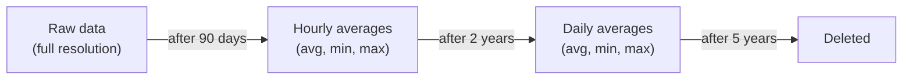
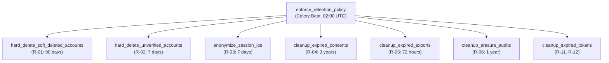
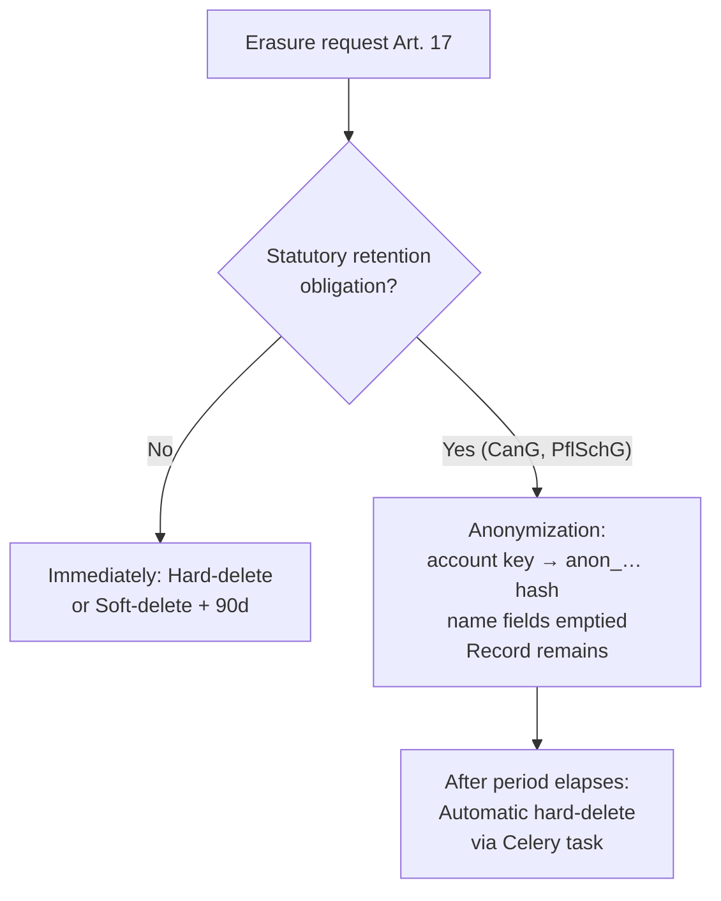

# Data Retention & Anonymization

Kamerplanter stores data only as long as technically or legally required. This document
describes the retention matrix, the automated enforcement mechanism (Celery task),
TimescaleDB aggregation for sensor data, and configuration via environment variables.

Basis: GDPR Art. 5(1)(e). <!-- NFR-011 -->

---

## Retention Matrix — Personal Data

| Ref | Data Category | Retention Period | Action after Period | Legal Basis |
|-----|--------------|-----------------|---------------------|------------|
| R-01 | Soft-deleted user accounts | 90 days after soft-delete | Hard-delete (incl. edges, auth providers, sessions) | GDPR Art. 17 |
| R-02 | Unconfirmed accounts | 7 days after creation | Hard-delete (`app.tasks.auth_tasks.cleanup_unverified_accounts`, daily) | Art. 5(1)(e), purpose lapse |
| R-03 | IP addresses in sessions | 7 days after storage | Anonymization (IPv4: last octet → `0`) | Art. 5(1)(c) data minimization |
| R-04 | Consent records | 3 years after revocation | Hard-delete | Art. 7(1) accountability |
| R-05 | Export files (GDPR Art. 15/20) | 72 hours after completion | Delete file first, then set status to `expired` | Purpose lapse |
| R-06 | Erasure audit (completed requests) | 1 year after completion | Hard-delete (`retention.purge_expired_erasure_records`, daily at 04:30 UTC) | Art. 5(2) accountability |
| R-07 | Email change requests | 24 hours | Hard-delete expired tokens | Purpose lapse |
| R-11 | Expired refresh tokens | Immediately on expiry | Hard-delete (TTL index) | Purpose lapse |
| R-12 | Expired invitations | 30 days after expiry | Hard-delete | Purpose lapse |

### Unconfirmed Accounts (R-02)

A never-confirmed account is removed automatically by the daily
`app.tasks.auth_tasks.cleanup_unverified_accounts` task — `RETENTION_UNVERIFIED_ACCOUNT_DAYS`
days after registration (default 7 days, minimum 1 day). The task runs the same full erasure
as a self-filed erasure request, with the same erasure request as proof and the same
automatic retry on a failed step — more on this further below under "All deletion paths do
the same".

### IP Anonymization (R-03)

IP addresses are automatically anonymized after 7 days — not deleted, as they may
still be needed for detecting compromised sessions:

- **IPv4:** Last octet set to `0` — `192.168.1.42` → `192.168.1.0`
- **IPv6:** Truncated to `/48` prefix — `2001:db8:85a3::8a2e:370:7334` → `2001:db8:85a3::`

The `ip_anonymized_at` field is set to the time of anonymization.

### Export files: the file first, then the status (R-05)

Cleanup of an expired data export runs in a fixed order: the export file is deleted
from object storage first, and only then does the export switch to the `expired`
status. If deleting the file fails, the export is left unchanged — the next hourly
run retries it. Downloads are already refused once the 72-hour window has passed,
regardless of the stored status. If no object storage is configured on the instance,
the file cannot be deleted at all: the export is left open, and the run logs an error
instead of flipping the status anyway.

### Erasure Record Purge (R-06)

The daily `retention.purge_expired_erasure_records` task (04:30 UTC, after the erasure
task at 04:00 UTC) hard-deletes completed erasure requests (`erasure_requests`,
`status=completed`) whose `completed_at` is more than `RETENTION_ERASURE_AUDIT_RETENTION_YEARS`
years in the past (default 1 year, minimum 1 year, counted in calendar years). This applies
regardless of who triggered the erasure (`origin`: `self_service`, `platform_admin`, or
`unverified_cleanup`).

A request that is still open or only partially completed (`scheduled`, `in_progress`,
`partially_completed`) is never purged — it is still owed a run. A completed request
without a `completed_at` is kept too. The run logs only the number of purged requests,
never an account or request key.

---

## Retention Matrix — Sensor Data

Sensor data can indirectly allow inferences about the presence and behavior of persons
(CO2 curves, motion sensors, manual overrides). They are therefore subject to a tiered
retention policy in TimescaleDB:

<!-- diagram-source: user-described — tiered TimescaleDB sensor-data downsampling pipeline from raw to deletion -->

```mermaid
flowchart LR
    A["Raw data<br/>(full resolution)"]
    B["Hourly averages<br/>(avg, min, max)"]
    C["Daily averages<br/>(avg, min, max)"]
    D["Deleted"]

    A -- "after 90 days" --> B
    B -- "after 2 years" --> C
    C -- "after 5 years" --> D
```

| Stage | Time range | Resolution | TimescaleDB view |
|-------|-----------|-----------|-----------------|
| 1 — Raw data | 0–90 days | Full measurement resolution | `sensor_readings` |
| 2 — Hourly | 90 days–2 years | 1 value per hour | `sensor_hourly` |
| 3 — Daily | 2–5 years | 1 value per day | `sensor_daily` |
| Expiry | After 5 years | — | Automatically deleted |

!!! note "Climate extreme events are retained permanently"
    Frost, heat waves, and storm events are archived permanently as `ClimateEvent`
    documents in ArangoDB — without personal reference. This is relevant for perennial
    plants (fruit trees, perennials) where climate history is needed over many years.

### TimescaleDB Continuous Aggregates

Automatic downsampling is handled by TimescaleDB Continuous Aggregates and Retention
Policies:

```sql
-- Stage 2: Hourly averages (automatically after 90 days)
CREATE MATERIALIZED VIEW sensor_hourly
  WITH (timescaledb.continuous) AS
  SELECT
    time_bucket('1 hour', timestamp) AS bucket,
    location_key,
    sensor_type,
    AVG(value)   AS avg_value,
    MIN(value)   AS min_value,
    MAX(value)   AS max_value,
    COUNT(*)     AS sample_count
  FROM sensor_readings
  GROUP BY bucket, location_key, sensor_type;

-- Stage 3: Daily averages (automatically after 2 years)
CREATE MATERIALIZED VIEW sensor_daily
  WITH (timescaledb.continuous) AS
  SELECT
    time_bucket('1 day', bucket) AS bucket,
    location_key,
    sensor_type,
    AVG(avg_value) AS avg_value,
    MIN(min_value) AS min_value,
    MAX(max_value) AS max_value,
    SUM(sample_count) AS sample_count
  FROM sensor_hourly
  GROUP BY time_bucket('1 day', bucket), location_key, sensor_type;

-- Retention policies (automatic deletion)
SELECT add_retention_policy('sensor_readings', INTERVAL '90 days');
SELECT add_retention_policy('sensor_hourly',   INTERVAL '2 years');
SELECT add_retention_policy('sensor_daily',    INTERVAL '5 years');
```

---

## Statutory Minimum Retention Periods

These records **must not** be deleted before the statutory period has elapsed.
For a GDPR erasure request (Art. 17), they are **anonymized** (user reference removed)
but not deleted (Art. 17(3)(b)):

| Ref | Data Category | Minimum Period | Legal Basis |
|-----|--------------|---------------|------------|
| R-16 | Harvest data (HarvestBatch, QualityAssessment, YieldMetric) | 5 years | CanG (German Cannabis Act) |
| R-17 | Treatment applications (TreatmentApplication) | 3 years | PflSchG §11 (German Plant Protection Act) |
| R-18 | Inspection records | 3 years | PflSchG §11 (German Plant Protection Act) |

!!! danger "Deletion lock"
    Deleting an active harvest or treatment record would violate the CanG (German Cannabis Act) or PflSchG (German Plant Protection Act).
    Account deletion therefore does not delete these records; it only removes the
    personal reference. The record itself remains until the statutory period has elapsed.

### What an anonymized record looks like

The account reference is not set to `null`; it is replaced. Its new form depends on
whether the erased account's records must stay linkable to each other for an audit:

| Record | Field holding the account reference | Replaced by | Also emptied |
|--------|-------------------------------------|-------------|--------------|
| Harvest (HarvestBatch) | `harvested_by_key` | Tombstone hash `anon_…` | `harvester` |
| Quality assessment (QualityAssessment) | `assessed_by_key` | Tombstone hash `anon_…` | `assessed_by` |
| Treatment (TreatmentApplication) | `applied_by_key` | Tombstone hash `anon_…` | `applied_by` |
| Inspection (Inspection) | `inspected_by_key` | Tombstone hash `anon_…` | `inspector` |
| Task (Task) | `assigned_to_user_key` | Marker `_anonymized` | — |
| Diary entry (PlantDiaryEntry) | `created_by`, `analysis_requested_by`, `analysis_claimed_by` | Marker `_anonymized` | — |
| Task comment | `created_by` | Marker `_anonymized` | — |
| Invitation you sent | `invited_by_user_key` | Marker `_anonymized` | — |
| File in a garden (photo, import file) | `created_by` | Marker `_anonymized` | — |
| Import job | `uploaded_by` | Marker `_anonymized` | — |
| Weather-source setting of a site | `updated_by` | Marker `_anonymized` | — |
| Manual actuator override | `created_by` | Marker `_anonymized` | — |
| AI audit entry | `user_key` | Marker `_anonymized` | — |
| Pest photo you promoted as an admin | `promoted_by` | Marker `_anonymized` | — |
| Garden you created | `owner_user_key` | Marker `_anonymized` | for your personal garden also its name and short name, see below |
| Erasure audit (ErasureRequest) | `user_key` | Tombstone hash `anon_…` | — |
| MCP audit entry of a service account | `service_account_key` | Tombstone hash `anon_…` | — |

- The **tombstone hash** is `anon_` followed by 16 hex characters. It is derived from the
  account key and the secret salt `ERASURE_TOMBSTONE_SALT`, cannot be reversed, and is
  always the same for the same account. The harvests, treatments and inspections of an
  erased account therefore stay linkable to each other for an audit without naming anyone.
- The **name fields** (`harvester`, `assessed_by`, `applied_by`, `inspector`) are free
  text someone typed in when recording. A name is personal data on its own, so they are
  emptied in the same step.
- **Quality assessments** are part of the harvest documentation and are now anonymized
  exactly like the harvest itself. They also appear in your data access report
  (GDPR Art. 15).
- **Yield metrics** (YieldMetric) carry no account reference, so there is nothing to
  anonymize.

!!! warning "Older records without an account reference"
    Harvests, treatments, inspections and quality assessments carry the account-reference
    field only since a migration. Records written before it hold `null` there and only the
    typed-in name. The system does not guess an owner from free text, so account deletion
    does not reach these older records; their name field stays as it was entered.

### What happens to your personal garden

When you register, Kamerplanter creates a personal garden for you. Its name and the
short name in its address come from your display name. Account deletion does not
delete this garden, because it can hold records under a statutory retention period,
such as harvests under the CanG. Instead, it stops naming you:

- The owner reference is replaced with `_anonymized`.
- The name and the short name become `anonymized-` followed by a string that cannot
  be traced back to the key. The short name stays unique, and no new garden can take
  it first: Kamerplanter never hands out short names that start with `anonymized`.

A community garden you founded keeps its name, because the name belongs to the group.
Only the owner reference is replaced. The owner reference grants no rights; rights come
from the role in a membership, so nothing needs to be handed over.

An AI tip you dismissed stays dismissed for the other members of your garden. Only
the note that you dismissed it is replaced with `_anonymized`.

Accounts that were never confirmed, and that Kamerplanter removes once the period runs
out, go through the same full deletion as any other account deletion — with the same
erasure request as proof and the same automatic retry if a step fails.

### What else is deleted

Besides the familiar categories, account deletion also deletes these records, which
belong only to you and fall under no retention period:

- your AI assistant conversations
- your notifications and your notification settings
- your calendar feeds: the feed link stops working after the deletion
- your plant-disease diagnosis requests
- your location assignments in gardens you were a member of
- invitations you accepted (they name your email address)
- the file entries of your own pest photos — the original file and its preview images (WebP, 128/512/1280 px) are already deleted at this point
- your contributed reference-image vectors for plant recognition (curated reference images contributed by other users are unaffected)
- your contributed pest-recognition vectors — regardless of whether your contribution was still promoted or had already been demoted at the time of deletion

The daily cleanup deactivates accounts that were never confirmed right away and deletes
them the same way. It now also removes their membership and location assignments. If a
step fails, the erasure request is left open and — as described further below —
automatically retried with backoff instead of being silently dropped. The personal
garden of such an account is not yet anonymized by that cleanup.

!!! info "What is deliberately left alone"
    Some fields are named "… by" but hold free text someone typed in when recording,
    such as "performed by" on watering and tank logs or "created by" on workflow
    templates. The system does not attribute such free text to an account and leaves it
    unchanged on deletion.

### Logs of an erasure

The log lines of an erasure do not name your account key. They carry a salted
reference instead, so the lines of one erasure can be linked to each other without
naming anyone. They cannot be linked to the pseudonymised erasure audit, though.

??? info "For operators: the `subject=` field in log lines"
    Log lines carry a `subject=` field instead of an account key or email address. It holds a salted,
    purpose-separated reference (`sub_` followed by 16 hex characters, an HMAC of the
    account key keyed with `ERASURE_TOMBSTONE_SALT`). The lines of one account stay
    correlatable with each other without naming anyone. The reference is deliberately
    **not** the tombstone hash (`anon_…`) that the erasure audit and the anonymised
    harvest and treatment records keep: someone holding only the logs cannot join them
    to those retained records. If the salt is missing or too short, the line carries the
    constant `anon_unavailable` instead — never the account key in the clear.

    Registration and email events additionally log fields such as `email_sha256` — a
    keyed digest of the email address (an HMAC with `ERASURE_TOMBSTONE_SALT`, 16 hex
    characters), never the address itself. A plain SHA-256 could be reversed with a
    list of addresses; the keyed digest cannot without the salt. Without a valid salt
    the field reads `unavailable`. Object-storage log
    lines (`storage_put_object`, `storage_delete_object`, and similar) mask the account
    segment of export-bundle keys: `privacy/exports/<account key>/<export>.json` becomes
    `privacy/exports/<subject>/<export>.json`.

    Error texts in these lines (`error=`) are cleaned the same way: the account key is
    replaced by the reference, and export-bundle paths are masked. Where an error text can
    contain a third party's address (a rejected email recipient), only the error type is
    logged (`error_type=`). Email addresses inside an error text become
    `<email:…>` digests, and URL query strings (which can hold coordinates or API keys)
    become `?<redacted>`.

    IP addresses appear in the application's log lines at most truncated the R-03 way (IPv4 last octet
    `0`, IPv6 `/48`), as `ip_prefix=`.

    How long your log
    pipeline (container runtime, Loki, `json-file` rotation) keeps the lines is your
    decision as operator — set a bounded retention and record it (NFR-011 §3.4).

    To attribute a log line to an account, an operator must compute the reference with
    the same salt themselves — grepping for the account key does not work.

### All deletion paths do the same

It makes no difference whether a platform admin deletes your account through user
management, the daily cleanup removes a never-confirmed account, or you file an erasure
request yourself: all three paths run the same erasure, with the same erasure request as
proof. It cleans object storage (originals along with their preview images) and the
recognition base (only your own reference-image and pest-image contributions — curated
references stay), deletes your other records, anonymizes the ones under a retention
obligation as described above, and removes your account last. The database part runs as
one unit: it is either done completely or not at all.

The difference is timing: your own request is carried out by the daily run only once the
90 days have passed. A deletion by a platform admin or by the cleanup for never-confirmed
accounts instead runs at once — your account is deactivated and all sessions ended first,
then the erasure runs without waiting. In all three cases: afterward the request reads
`completed` and carries the tombstone hash instead of your account key. If a run fails,
the request stays open as `partially_completed` and is retried automatically with backoff
until it succeeds (see below). While a request is open, you cannot file a second one; a
second deletion attempt by a platform admin instead resumes the open request at once.

??? info "For operators: retries and log levels"
    Every failed attempt is counted on the request (`attempt_count`, `last_attempt_at`),
    and the next attempt waits 1, 2, 4 and then at most 7 days (`next_attempt_at`). The
    request stays selected; until then the daily run skips it with
    `retention.erasure.deferred` (info level). The `origin` field (`self_service`,
    `platform_admin`, or `unverified_cleanup`) records who triggered the request; attempt
    counting, backoff, and log levels behave the same for all three. The object-storage
    and reference-index
    cleanup runs only once per request: once it has finished
    (`pre_arango_completed_at`), a later attempt repeats only the database part.

    `retention.erasure.failed` and `retention.erasure.steps_unreached` appear at error
    level only on the first failure and on the fifth attempt (`escalated=true`), at info
    level in between. Each run reports the number of open, failing requests as
    `open_failing` in the `retention.execute_scheduled_erasures.completed` event.

    A missing `ERASURE_TOMBSTONE_SALT` is a configuration error: every run writes exactly
    one `retention.execute_scheduled_erasures.not_configured` line at error level, spends
    no attempt and touches no data. Once it is fixed, all open requests run on the next
    daily run.

    A missing `INFERENCE_SERVICE_ENABLED`/`INFERENCE_SERVICE_URL` **on the celery-worker**
    while reference-image contributions already exist on the index is a configuration
    error too (issue #1753) — but it only holds requests that have not yet passed Phase
    0.5 (reference-index cleanup). Those requests stay `partially_completed` with an
    operator-facing message, spending no attempt; the run also writes one
    `retention.execute_scheduled_erasures.reference_index_not_configured` line at error
    level. See [Setting Up Plant Identification](../deployment/inference-service.md) for
    the configuration.

    The same check applies to contributed pest-recognition vectors (issue #1759): if
    neither `PEST_DETECTION_ENABLED` nor `INFERENCE_SERVICE_ENABLED` is set on the
    celery-worker while a pest-photo contribution was ever promoted into the recognition
    base, the worker holds the affected requests the same way, with the same log line. A
    tenant deletion is refused with HTTP 503 in this case instead of leaving vectors
    behind; if the inference-service is merely unreachable at the moment, it instead
    responds with HTTP 502 and can be retried.

---

## Celery Enforcement: Automated Execution

!!! warning "Not yet implemented"
    There is no central `enforce_retention_policy` task that orchestrates every retention
    rule in one shared run, as shown in the diagram below, or that produces the log line
    and Prometheus metrics shown further down. The diagram, the JSON example and the
    metrics table describe a planned target state.

    Each rule actually runs as its own Celery task on its own schedule:

    - R-01: `retention.execute_scheduled_erasures` (daily, 04:00 UTC)
    - R-02: `app.tasks.auth_tasks.cleanup_unverified_accounts` (daily)
    - R-03: `app.tasks.auth_tasks.anonymize_old_ips` (daily)
    - R-05: `retention.expire_data_exports` (hourly, minute 20)
    - R-06: `retention.purge_expired_erasure_records` (daily, 04:30 UTC)
    - R-07: `retention.expire_email_change_requests` (hourly, minute 15)
    - R-11: `app.tasks.auth_tasks.cleanup_expired_tokens` (hourly)
    - R-12: `app.tasks.tenant_tasks.cleanup_expired_invitations` (daily)

    R-04 (consent records) currently has no automated cleanup task.

The Celery task `enforce_retention_policy` runs **daily at 02:00 UTC** and orchestrates
all retention sub-tasks:

<!-- diagram-source: user-described — enforce_retention_policy Celery master task fanning out to retention sub-tasks -->

```mermaid
flowchart TD
    Master["enforce_retention_policy<br/>(Celery Beat, 02:00 UTC)"]

    Master --> T1["hard_delete_soft_deleted_accounts<br/>(R-01: 90 days)"]
    Master --> T2["hard_delete_unverified_accounts<br/>(R-02: 7 days)"]
    Master --> T3["anonymize_session_ips<br/>(R-03: 7 days)"]
    Master --> T4["cleanup_expired_consents<br/>(R-04: 3 years)"]
    Master --> T5["cleanup_expired_exports<br/>(R-05: 72 hours)"]
    Master --> T6["cleanup_erasure_audits<br/>(R-06: 1 year)"]
    Master --> T7["cleanup_expired_tokens<br/>(R-11, R-12)"]
```

Each sub-task logs the number of processed records via structlog:

```json
{
  "event": "retention.run_completed",
  "results": {
    "hard_delete_soft_deleted_accounts": {"deleted_count": 3},
    "anonymize_session_ips": {"anonymized_count": 47},
    "cleanup_expired_exports": {"expired_count": 1}
  },
  "duration_ms": 1234
}
```

### Prometheus Metrics

The retention task exposes the following metrics:

| Metric | Type | Labels | Description |
|--------|------|--------|-------------|
| `retention_records_processed_total` | Counter | `category`, `action` | Records processed per category and action (`delete`/`anonymize`/`expire`) |
| `retention_run_duration_seconds` | Histogram | — | Duration of the full retention run |
| `retention_run_errors_total` | Counter | `category` | Errors per category |

---

## Configuration via Environment Variables

!!! warning "Not yet implemented"
    Of the variables in the block below, the backend currently reads only two:
    `RETENTION_UNVERIFIED_ACCOUNT_DAYS` (R-02) and `RETENTION_ERASURE_AUDIT_RETENTION_YEARS`
    (R-06) — both with a minimum of `1`, see [Environment Variables](../reference/environment-variables.md#datenschutz-dsgvo-req-025-nfr-011).
    Every other `RETENTION_*` name in this block is a planned, unified naming scheme; the
    backend does not read it. The corresponding periods are partly configurable already,
    but under different names: R-01 via `PRIVACY_HARD_DELETE_AFTER_DAYS`, R-05 via
    `PRIVACY_EXPORT_RETENTION_HOURS`, R-07 via `PRIVACY_EMAIL_CHANGE_TTL_HOURS`. For R-03,
    R-04, R-12, and the sensor-data and statutory-minimum variables below, there is
    currently no environment variable at all; the values used in the code are hard-coded.

All periods are configurable via environment variables. The prefix `RETENTION_` is prepended:

```bash
# Personal data
RETENTION_SOFT_DELETE_RETENTION_DAYS=90      # R-01: Soft-deleted accounts
RETENTION_UNVERIFIED_ACCOUNT_DAYS=7          # R-02: Unconfirmed accounts — implemented
RETENTION_IP_ANONYMIZATION_DAYS=7            # R-03: IP anonymization
RETENTION_CONSENT_RETENTION_YEARS=3          # R-04: Consent records
RETENTION_EXPORT_FILE_RETENTION_HOURS=72     # R-05: Export files
RETENTION_ERASURE_AUDIT_RETENTION_YEARS=1    # R-06: Audit logs — implemented
RETENTION_EMAIL_CHANGE_RETENTION_HOURS=24    # R-07: Email change requests
RETENTION_INVITATION_RETENTION_DAYS=30       # R-12: Expired invitations

# Sensor data (TimescaleDB)
RETENTION_SENSOR_RAW_RETENTION_DAYS=90       # R-14 Stage 1
RETENTION_SENSOR_HOURLY_RETENTION_YEARS=2    # R-14 Stage 2
RETENTION_SENSOR_DAILY_RETENTION_YEARS=5     # R-14 Stage 3
RETENTION_ACTOR_LOG_RAW_RETENTION_DAYS=90    # R-15 Stage 1
RETENTION_ACTOR_LOG_AGGREGATED_RETENTION_YEARS=1  # R-15 Stage 2
```

!!! warning "Statutory minimums cannot be undercut"
    The following values can be increased but **not reduced** below the statutory
    minimums. A validation check at application startup enforces these floors:

    ```bash
    RETENTION_HARVEST_DATA_MIN_RETENTION_YEARS=5   # R-16, CanG — MINIMUM
    RETENTION_TREATMENT_MIN_RETENTION_YEARS=3      # R-17, PflSchG — MINIMUM
    RETENTION_INSPECTION_MIN_RETENTION_YEARS=3     # R-18, PflSchG — MINIMUM
    ```

---

## Interaction with GDPR Erasure Requests

When a data subject submits an erasure request under GDPR Art. 17, the following
procedure applies:

<!-- diagram-source: user-described — decision flow for a GDPR Art. 17 erasure request under statutory retention -->

```mermaid
flowchart TD
    A["Erasure request Art. 17"] --> B{"Statutory retention<br/>obligation?"}
    B -- "No" --> C["Immediately: Hard-delete<br/>or Soft-delete + 90d"]
    B -- "Yes (CanG, PflSchG)" --> D["Anonymization:<br/>account key → anon_… hash<br/>name fields emptied<br/>Record remains"]
    D --> E["After period elapses:<br/>Automatic hard-delete<br/>via Celery task"]
```

| Data category | Procedure |
|--------------|-----------|
| User account | Soft-delete → hard-delete after 90 days |
| Consent records | Delete immediately (on revocation) |
| Export files | Delete immediately |
| Harvest data, quality assessments, treatments, inspections | Anonymize (tombstone hash `anon_…`, name fields emptied), do not delete (Art. 17(3)) |
| Tasks, task comments, diary entries, files, import jobs, settings and overrides in a (possibly shared) garden | Replace the account reference with `_anonymized`, content remains |
| Gardens you created | Replace the owner reference; for your personal garden also its name and short name |
| Erasure audit | Replace the account reference with the tombstone hash, keep for 1 year |
| Memberships, location assignments, sessions, API keys, consents, export requests, favorites, pest detections, own pest photos, AI conversations, notifications, calendar feeds, diagnosis requests, accepted invitations | Delete |

---

## Sweep: Orphaned Pest-Recognition Prototypes

Before issue #1766, deleting a pest-photo contribution left its recognition
prototype behind in the inference service's reference index
(`pest_embeddings`, `source = user_contributed`). Such rows name no user —
the Art. 17 account erasure finds prototypes only through a user's
contribution documents and therefore cannot reach them; only a tenant
deletion removed them along the way.

The Celery task `pest_image.sweep_orphaned_prototypes` (beat entry
`retention-sweep-orphaned-pest-prototypes-daily`, **daily at 04:30 UTC**,
after the scheduled erasures at 04:00 UTC) closes this gap:

1. It pages through the contribution keys the index holds
   (`POST /pest/reference/contributions/keys` on the inference service).
2. It checks in ArangoDB which of those keys still have a
   `pest_image_contributions` document.
3. It deletes the prototypes of the others — active and deactivated rows
   alike — in batches of 500 through the same
   `POST /pest/reference/contributions/erase` endpoint the Art. 17 erasure
   uses.

**Idempotent:** a second run finds no orphan left and removes nothing.
**Fails loud:** if the inference service is unreachable, the task fails (log
event `pest_prototype_orphan_sweep_failed`), nothing is recorded, and the
next beat run retries. A celery-worker missing both
`PEST_DETECTION_ENABLED`/`INFERENCE_SERVICE_ENABLED`, once a pest-photo
contribution has ever been promoted into the recognition base, refuses the
run just like the scheduled erasure does (issue #1759). Without those flags
and without that promotion marker the task reports `skipped` (log event
`pest_prototype_orphan_sweep_skipped`) and records **no** run — it never saw
the index.

Each run's counts are recorded in the `system_settings` singleton document
under `pest_prototype_orphan_sweep` (`first_run_at`, `last_run_at`,
`last_examined`, `last_orphaned`, `last_removed`, `total_removed`,
`binding`) and as the log event `pest_prototype_orphan_sweep_completed`
(`examined`/`orphaned`/`removed`/`binding`) — both name counts only, never a
key.

Deactivated (demoted) prototypes whose contribution document still exists
are left untouched by the sweep (curation).

??? question "How do I trigger the sweep immediately instead of waiting for 04:30 UTC?"
    ```bash
    kubectl exec deploy/<release>-celery-worker -- \
      celery -A app.tasks call pest_image.sweep_orphaned_prototypes
    ```
    The worker needs the same flags as the scheduled erasure:
    `PEST_DETECTION_ENABLED` or `INFERENCE_SERVICE_ENABLED` plus
    `INFERENCE_SERVICE_URL`, and `INTERNAL_SERVICE_TOKEN`. Details:
    [Setting Up Plant Identification](../deployment/inference-service.md).

---

## Frequently Asked Questions

??? question "Can I extend the 90-day soft-delete period?"
    Yes, via `RETENTION_SOFT_DELETE_RETENTION_DAYS`. Reducing it below 30 days is not
    recommended, as users would have no opportunity to recover accidentally deleted
    accounts.

??? question "What happens to tenant data when the last admin of a tenant is deleted?"
    The Celery task `detect_orphaned_tenants` detects tenants without an active admin
    and sets an `orphaned_since` timestamp. A platform admin can then appoint an
    emergency admin.

??? question "How can I verify that the retention task is running correctly?"
    Check the Prometheus metric `retention_run_duration_seconds` or look in the
    structured logs (structlog) for the event `retention.run_completed`. In the
    Kubernetes cluster: `kubectl logs -l app=celery-beat`.

??? question "Are sensor data deleted when an account is deleted?"
    Sensor data in TimescaleDB has no direct user reference — it is assigned to a
    location (`location_key`). On account deletion, sensor data is retained and is
    only subject to the time-based retention policies (R-14).

## See also

- [Environment Variables](../reference/environment-variables.md)
- [Database Schema](../reference/database-schema.md)
- [Kubernetes Deployment](../deployment/kubernetes.md)
