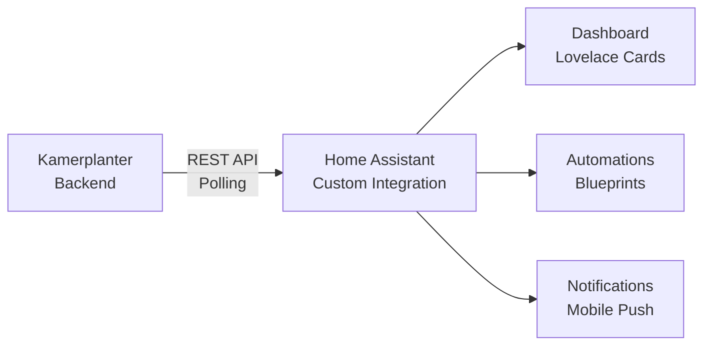
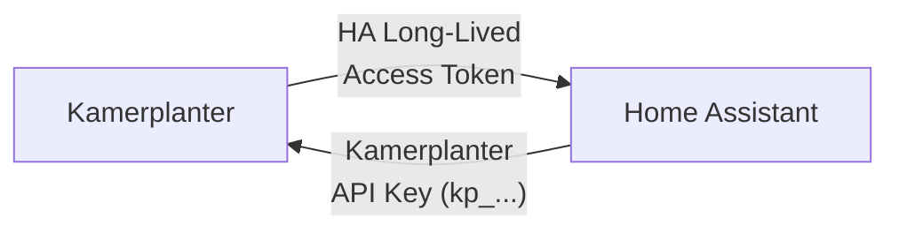

# Home Assistant Integration

Kamerplanter integrates with Home Assistant via a **Custom Integration**. All plant data, tank values, tasks, and calendar entries appear as native HA entities and can be used in dashboards, automations, and notifications.

## Overview



| Aspect | Details |
|--------|---------|
| **Repository** | `kamerplanter-ha` (standalone GitHub repo) |
| **Installation** | HACS (Home Assistant Community Store) or manual |
| **Communication** | REST API polling against Kamerplanter backend |
| **Authentication** | API key (`kp_` prefix) or Light mode (no auth) |
| **Minimum HA version** | Home Assistant Core 2024.1+ |

!!! info "Separate repository"
    The HA integration is **not** part of the Kamerplanter backend. It is developed and installed as a standalone HACS repository.

---

## Installation

### Via HACS (recommended)

1. Open **HACS** in Home Assistant
2. Click **Integrations** > **Custom Repositories**
3. Add the repository `kamerplanter/kamerplanter-ha`
4. Search for **Kamerplanter** and click **Install**
5. Restart Home Assistant

### Manual Installation

1. Download the latest release from GitHub
2. Copy `custom_components/kamerplanter/` to your HA `config/custom_components/` directory
3. Restart Home Assistant

---

## Prerequisites: Bidirectional API Access

For a full integration, **both systems need mutual API access**. This requires a token exchange:



| Direction | Token | Purpose | Where to create |
|-----------|-------|---------|----------------|
| **HA → Kamerplanter** | Kamerplanter API key (`kp_` prefix) | HA reads plant data, tank values, tasks | Kamerplanter: **Settings** > **API Keys** |
| **Kamerplanter → HA** | HA Long-Lived Access Token | Kamerplanter reads sensor data, controls actuators (REQ-005, REQ-018) | Home Assistant: **Profile** > **Long-Lived Access Tokens** |

!!! warning "Both tokens required"
    Without the **Kamerplanter API key**, the HA integration cannot query data. Without the **HA Access Token**, Kamerplanter cannot read sensor data from Home Assistant or control actuators. For read-only use (HA dashboard only), the Kamerplanter API key alone is sufficient.

### Setting Up Tokens

**1. Create Kamerplanter API key** (for HA → Kamerplanter):

1. In Kamerplanter: **Settings** > **API Keys** > **New Key**
2. Copy the generated key (`kp_...`)
3. In Home Assistant: Enter during the Kamerplanter integration config flow

**2. Create HA Access Token** (for Kamerplanter → HA):

1. In Home Assistant: **Profile** (bottom left) > **Long-Lived Access Tokens** > **Create Token**
2. Copy the token
3. In Kamerplanter: **Settings** > **Home Assistant** > Enter URL and token
    - Or via environment variables: `HA_URL` and `HA_ACCESS_TOKEN`

---

## Setup

After installation, a 4-step wizard guides you through configuration:

### Step 1: Kamerplanter URL

Enter the URL of your Kamerplanter instance:

- Local: `http://raspberry:8000` or `http://192.168.1.50:8000`
- External: `https://kamerplanter.example.com`

The integration automatically checks reachability via `/api/health`.

### Step 2: Authentication

| Mode | Description |
|------|------------|
| **Light mode** | No authentication required (REQ-027) |
| **API key** | API key with `kp_` prefix (recommended) |
| **Login** | Username and password as fallback |

### Step 3: Select Tenant

For multi-tenant setups (e.g. community gardens), select the desired tenant from the list. For single users, this step is skipped.

### Step 4: Configure Entities

Choose which plants, locations, and tanks should be created as HA entities. By default, all available entities are created.

---

## Available Entities

The integration automatically creates entities for all selected plants, locations, and tanks.

### Plant Entities

| Entity | Type | Unit | Description |
|--------|------|------|------------|
| `sensor.kp_{plant}_phase` | Sensor | -- | Current growth phase |
| `sensor.kp_{plant}_days_in_phase` | Sensor | days | Days in current phase |
| `sensor.kp_{plant}_vpd_target` | Sensor | kPa | VPD target for current phase |
| `sensor.kp_{plant}_ec_target` | Sensor | mS/cm | EC target for current phase |
| `sensor.kp_{plant}_photoperiod` | Sensor | h | Photoperiod (light/dark) |
| `sensor.kp_{plant}_gdd_accumulated` | Sensor | GDD | Accumulated growing degree days |
| `sensor.kp_{plant}_harvest_readiness` | Sensor | % | Harvest readiness |
| `sensor.kp_{plant}_karenz_remaining` | Sensor | days | Remaining safety interval (IPM) |
| `sensor.kp_{plant}_next_watering` | Sensor | -- | Next watering date |
| `sensor.kp_{plant}_health_score` | Sensor | % | Health score |
| `binary_sensor.kp_{plant}_needs_attention` | Binary Sensor | -- | Plant needs attention |

### Tank Entities

| Entity | Type | Unit | Description |
|--------|------|------|------------|
| `sensor.kp_{tank}_ec` | Sensor | mS/cm | Electrical conductivity |
| `sensor.kp_{tank}_ph` | Sensor | pH | pH value |
| `sensor.kp_{tank}_fill_level` | Sensor | % | Fill level |
| `sensor.kp_{tank}_water_temp` | Sensor | C | Water temperature |
| `sensor.kp_{tank}_solution_age_days` | Sensor | days | Nutrient solution age |
| `binary_sensor.kp_{tank}_alert_active` | Binary Sensor | -- | Tank alert active |

### Location Entities

| Entity | Type | Description |
|--------|------|------------|
| `sensor.kp_{location}_active_plants` | Sensor | Number of active plants |
| `sensor.kp_{location}_vpd_current` | Sensor | Current VPD value |

### Calendar & Tasks

| Entity | Type | Description |
|--------|------|------------|
| `calendar.kp_tasks` | Calendar | All Kamerplanter events (iCal feed) |
| `todo.kp_{location}_tasks` | Todo | Pending tasks per location |

---

## Polling Intervals

The integration uses multiple coordinators with different polling intervals:

| Data Type | Default Interval | Minimum |
|-----------|-----------------|---------|
| Plants | 5 minutes | 2 minutes |
| Locations | 5 minutes | 2 minutes |
| Tanks | 2 minutes | 1 minute |
| Alerts | 1 minute | 30 seconds |
| Tasks | 5 minutes | 2 minutes |

Intervals can be adjusted in the integration options.

---

## Automation Examples

### Phase Change: Switch Light Schedule

When Kamerplanter reports a phase change to "flowering", the light schedule is automatically switched to 12h/12h:

```yaml
alias: "KP: Flowering Start - 12/12 Light"
trigger:
  - platform: state
    entity_id: sensor.kp_northern_lights_phase
    to: "flowering"
action:
  - service: automation.turn_off
    target:
      entity_id: automation.light_18_6_veg
  - service: automation.turn_on
    target:
      entity_id: automation.light_12_12_bloom
  - service: notify.mobile_app_phone
    data:
      title: "Kamerplanter: Flowering started"
      message: "Northern Lights entering flowering. Light switched to 12/12."
```

### VPD Control with Kamerplanter Target

Kamerplanter provides the optimal VPD target per phase. Home Assistant controls the humidifier:

```yaml
alias: "KP: VPD Control"
trigger:
  - platform: template
    value_template: >
      {{ states('sensor.growzelt_vpd') | float(0) >
         (states('sensor.kp_northern_lights_vpd_target') | float(1.0) + 0.2) }}
    id: vpd_too_high
  - platform: template
    value_template: >
      {{ states('sensor.growzelt_vpd') | float(0) <
         (states('sensor.kp_northern_lights_vpd_target') | float(1.0) - 0.1) }}
    id: vpd_ok
action:
  - choose:
      - conditions:
          - condition: trigger
            id: vpd_too_high
        sequence:
          - service: switch.turn_on
            target:
              entity_id: switch.humidifier_tent_1
      - conditions:
          - condition: trigger
            id: vpd_ok
        sequence:
          - service: switch.turn_off
            target:
              entity_id: switch.humidifier_tent_1
```

### Low Tank: Refill Reminder

```yaml
alias: "KP: Tank refill"
trigger:
  - platform: numeric_state
    entity_id: sensor.kp_main_tank_fill_level
    below: 20
action:
  - service: notify.mobile_app_phone
    data:
      title: "Tank almost empty!"
      message: >
        Fill level: {{ states('sensor.kp_main_tank_fill_level') }}%.
        EC: {{ states('sensor.kp_main_tank_ec') }} mS/cm,
        pH: {{ states('sensor.kp_main_tank_ph') }}
```

### Frost Warning: Greenhouse Heating

```yaml
alias: "KP: Frost warning - heating on"
trigger:
  - platform: state
    entity_id: binary_sensor.kp_greenhouse_frost_warning
    to: "on"
action:
  - service: switch.turn_on
    target:
      entity_id: switch.greenhouse_heating
  - service: climate.set_temperature
    target:
      entity_id: climate.greenhouse
    data:
      temperature: 5
  - service: notify.mobile_app_phone
    data:
      title: "Frost warning!"
      message: "Heating activated (frost protection 5 degrees C)."
```

### Harvest Readiness: Push Notification

```yaml
alias: "KP: Harvest almost ready"
trigger:
  - platform: numeric_state
    entity_id: sensor.kp_white_widow_harvest_readiness
    above: 80
condition:
  - condition: template
    value_template: >
      {{ states('sensor.kp_white_widow_karenz_remaining') | int(99) == 0 }}
action:
  - service: notify.mobile_app_phone
    data:
      title: "Harvest ready!"
      message: >
        Readiness: {{ states('sensor.kp_white_widow_harvest_readiness') }}%.
        Safety interval elapsed. Check trichomes!
```

---

## Accessing Phase Attributes via Jinja2 Templates

The `phase_timeline` and `phase` sensors provide structured attributes that can be combined in Jinja2 templates. This allows you to access detailed phase information directly in dashboards or automations.

### Retrieve Current Phase Details

The `phase_timeline` sensor stores each phase as an attribute with status, start date, and duration. The `phase` sensor returns the current phase name -- combining both gives you dynamic access:

```yaml
# Days in current phase (dynamic)
{{ state_attr('sensor.kp_345249_phase_timeline',
              states('sensor.kp_345249_phase')).days }}

# Start date of current phase
{{ state_attr('sensor.kp_345249_phase_timeline',
              states('sensor.kp_345249_phase')).started }}

# Status of current phase (current/completed)
{{ state_attr('sensor.kp_345249_phase_timeline',
              states('sensor.kp_345249_phase')).status }}
```

### Query a Specific Phase Directly

```yaml
# When did the vegetative phase start?
{{ state_attr('sensor.kp_345249_phase_timeline', 'vegetative').started }}

# How many days did germination last?
{{ state_attr('sensor.kp_345249_phase_timeline', 'germination').days }}
```

### Progress Attributes

The `phase_timeline` sensor provides additional progress attributes:

```yaml
# Name of the current phase
{{ state_attr('sensor.kp_345249_phase_timeline', 'current_phase_name') }}

# Days in current phase
{{ state_attr('sensor.kp_345249_phase_timeline', 'days_in_phase') }}

# Next planned phase (for planting runs)
{{ states('sensor.kp_345249_next_phase') }}
```

### Example: Markdown Card with Phase Info

```yaml
type: markdown
content: >
  **{{ states('sensor.kp_345249_phase') | title }}** for
  {{ state_attr('sensor.kp_345249_phase_timeline',
                 states('sensor.kp_345249_phase')).days }} days
  (started: {{ state_attr('sensor.kp_345249_phase_timeline',
                           states('sensor.kp_345249_phase')).started }})

  Next phase: **{{ states('sensor.kp_345249_next_phase') | default('--') }}**
```

### Example: Conditional Automation Based on Phase Duration

```yaml
alias: "KP: Flowering reminder after 8 weeks"
trigger:
  - platform: template
    value_template: >
      {{ state_attr('sensor.kp_345249_phase_timeline',
                     states('sensor.kp_345249_phase')).days | int(0) >= 56 }}
condition:
  - condition: state
    entity_id: sensor.kp_345249_phase
    state: "flowering"
action:
  - service: notify.mobile_app_phone
    data:
      title: "8 weeks of flowering reached"
      message: >
        Plant has been flowering for
        {{ state_attr('sensor.kp_345249_phase_timeline', 'flowering').days }}
        days. Check trichomes!
```

!!! tip "General attribute access pattern"
    The pattern `state_attr('sensor.kp_{id}_phase_timeline', states('sensor.kp_{id}_phase'))` works for all Kamerplanter plants and planting runs. For runs, additional attributes like `phase_week`, `phase_progress_pct`, and `remaining_days` are available.

---

## Lovelace Custom Cards

In addition to standard HA cards, the `kamerplanter-ha` repository provides optional **Custom Lovelace Cards**:

- **Tank Card** -- Fill level, EC, pH, and water temperature at a glance
- **Phase Timeline Card** -- Visual phase progression of a plant
- **Nutrient Mix Card** -- Current mix with individual components

Cards are configured via the standard HA editor (entity picker, no YAML required).

---

## Troubleshooting

| Error | Cause | Solution |
|-------|-------|---------|
| "Kamerplanter not reachable" | Backend offline or wrong URL | Check URL, start backend |
| "API key invalid" | Key revoked or incorrect | Generate new API key in Kamerplanter |
| Entity shows "unavailable" | Coordinator update failed | Check logs, increase polling interval |

Diagnostics data is available under **Settings** > **Integrations** > **Kamerplanter** > **Diagnostics**.

---

## See Also

- [Sensors](../user-guide/sensors.md) -- Hybrid sensors with HA as data source
- [Calendar](../user-guide/calendar.md) -- iCal feed for HA calendar entity
- [Tank Management](../user-guide/tanks.md) -- Tank entities in detail
