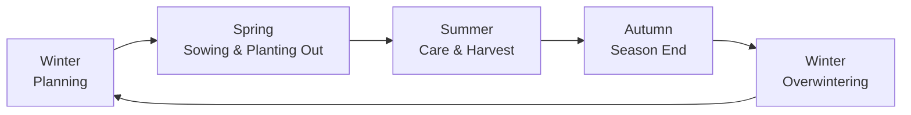

# The Outdoor Garden Year

This journey walks you through a complete outdoor gardening year — from winter planning through sowing and care to overwintering. It chains together existing Kamerplanter pages into a single thread; it does not describe any new features. Where a feature is only partially built or not yet implemented, this page says so honestly.

<!-- Target audience: ZG-002 Outdoor / Vegetable Gardener -->

---

## Who Is This Journey For?

For anyone growing vegetables, herbs, or ornamentals in beds, raised beds, or on a balcony who wants to use Kamerplanter for seasonal planning — from crop rotation to sowing dates to overwintering frost-tender plants.

## Prerequisites

- At least one location with beds or slots — see [Locations & Substrates](../user-guide/locations-substrates.md)
- Plant species with an assigned botanical family in master data (for crop rotation and companion planting)

---

## The Yearly Cycle at a Glance

The following steps follow this cycle. You don't need to work through them in order — jump in wherever your season currently stands.

---

## Step 1: Winter Planning — Checking the Sowing Calendar and Crop Rotation

Before the new season starts, it's worth looking at two things: what's coming up when, and which family grew where in recent years?

Open the [Calendar](../user-guide/calendar.md) and switch to the **Sowing Calendar** view. It shows you, week by week and per species, when indoor sowing, planting out, growth, and harvest typically happen — across the entire calendar year. The **Season Overview** next to it gives you a 12-month summary with the number of sowing, harvest, and bloom events per month.

At the same time, check [Crop Rotation](companion-planting.md#crop-rotation) for your beds: which botanical family grew there over the last three years? Kamerplanter automatically warns you when you create a plant if the same family is returning too soon.

!!! tip "Combine both views"
    Use the season overview for a rough yearly plan, and the sowing calendar once you need to know the exact timing for a specific species.

---

## Step 2: Thinking Ahead About Companion Planting

Before you decide what goes next to what in a bed, take a look at [Companion Planting & Crop Rotation](companion-planting.md). The page explains which species support each other (e.g. tomato & basil) and which you should keep apart (e.g. fennel from almost everything). Compatibility and incompatibility data is maintained in master data; when you create a single plant with a slot, Kamerplanter automatically checks the directly adjacent slots.

---

## Step 3: Sowing and Planting-Out Timing — Ice Saints and Phenology

Two concepts accompany you as an outdoor gardener whenever you plan timing — both are established gardening knowledge, regardless of whether you look them up in software.

**The Ice Saints** (German: *Eisheilige*) are a series of feast days in mid-May (traditionally 11–15 May, often already 11–13 May in northern Germany) considered the last statistical cold snap of spring. Ground frost can still occur across Central Europe up to this date — which is why the rule of thumb is to only plant frost-sensitive plants (tomatoes, squash, dahlias) outdoors afterward. The last of the five days, "Cold Sophie" (15 May), traditionally marks the end of the frost risk.

**Phenology** is the observation of recurring natural events as time markers — instead of a fixed calendar date, you use the actual state of nature's development on the ground. The German Weather Service divides the year into ten phenological seasons based on indicator plants. Two well-known examples from gardening practice:

- **Forsythia bloom** (early spring) — time to plant early potatoes and direct-sow peas.
- **Elderflower bloom** (early summer) — time to direct-sow frost-tender cucurbits such as cucumbers and zucchini.

The advantage of phenology over a fixed date: it automatically accounts for whether a given spring is early or late — regardless of what the calendar says.

!!! info "How Kamerplanter reflects this today"
    The sowing calendar marks the Ice Saints as a dashed line (default date: 15 May) and automatically never places the planting-out date of frost-sensitive species before it — see [Priority rules for date calculation](../user-guide/calendar.md#sowing-calendar-outdoor). A custom date for the Ice Saints or the last frost can currently only be set via the technical API, not through a form field on the site.

    For phenology, the [task categories](../user-guide/tasks.md#task-categories) already include a **Phenological Task** category for tasks tied to a natural event rather than a fixed date. Automatic detection of natural events (e.g. from a phenology data source) or an automatically generated phenological calendar does not exist yet. You currently create a phenological task manually and enter your own observation date as the due date.

---

## Step 4: Tasks and Care Through the Season

Once you have sown and planted out, [Tasks](../user-guide/tasks.md) accompany you through the season. For recurring outdoor work such as bed preparation or turning compost, create your own recurring tasks or use a matching [workflow template](../user-guide/tasks.md#using-workflow-templates).

For the ongoing care of individual plants, the automatic [Care Reminders](../user-guide/care-reminders.md) take over. The data model already includes ten dedicated [outdoor care styles](../user-guide/care-reminders.md#outdoor-care-styles) (e.g. `outdoor_annual_veg`, `fruit_tree`, `rose`, `frost_tender_tuber`) with matching watering and fertilizing intervals for typical outdoor crops.

!!! info "Outdoor care styles currently API only"
    These ten outdoor presets are not yet selectable in the care profile dialog's UI — you currently only see the nine houseplant presets there. Until this is wired up to the UI, an outdoor care style can only be set via the technical API. Without your own assignment, Kamerplanter uses one of the nine houseplant styles as an approximation for outdoor plants.

---

## Step 5: End of Season — Overwintering

In autumn, the question arises for perennial and frost-tender plants: do they stay outside, do they need winter protection, or must they be dug up and stored frost-free?

!!! warning "Overwintering management not yet implemented"
    An automatic hardiness traffic light, frost-forecast-driven reminders, and a dedicated tuber-cycle tab (digging → storage → pre-sprouting → planting) are planned for Kamerplanter but not yet implemented — see [Care Reminders — Overwintering Management](../user-guide/care-reminders.md#overwintering-management). Until then, plan digging and storage dates for dahlias, gladioli, and container plants yourself as a [task](../user-guide/tasks.md), for example using the "Seasonal Task" category.

---

## Step 6: Outlook — Climate Zones and Hardiness

In the longer term, Kamerplanter is planned to automatically derive your location's hardiness zone from your GPS coordinates or postal code, and feed that into a hardiness traffic light for your perennial plants.

!!! info "Planned feature"
    This feature is specified but not yet implemented. Details on the planned behavior are in [Climate Zones & Hardiness](climate-zones.md). Until then, the climate zone on a location is a freely editable text field with no automatic derivation.

---

## Frequently Asked Questions

??? question "Where do I enter my last frost date if it differs from the defaults?"
    Currently only via the technical API — there is no form field on the site for this yet. Without your own value, Kamerplanter uses fixed defaults for Central Europe (1 May last frost, 15 May Ice Saints). Details: [Sowing Calendar — Choosing Year and Site](../user-guide/calendar.md#choosing-year-and-site).

??? question "Can I tie a task to the forsythia bloom instead of a date?"
    You can create a task in the "Phenological Task" category and give it a due date once you have observed the forsythia bloom in your area yourself. There is no automatic detection of the event yet — the observation remains your job for now.

??? question "Do I have to remember crop rotation myself, or does Kamerplanter track it?"
    Kamerplanter remembers the planting history per slot and checks it automatically as soon as you create a single plant with a slot — see [Crop Rotation](companion-planting.md#crop-rotation). This currently only applies to individually created plants, not to those generated automatically from a planting run.

---

## See Also

- [Calendar](../user-guide/calendar.md)
- [Companion Planting & Crop Rotation](companion-planting.md)
- [Tasks](../user-guide/tasks.md)
- [Care Reminders](../user-guide/care-reminders.md)
- [Climate Zones & Hardiness](climate-zones.md)
- [Locations & Substrates](../user-guide/locations-substrates.md)
