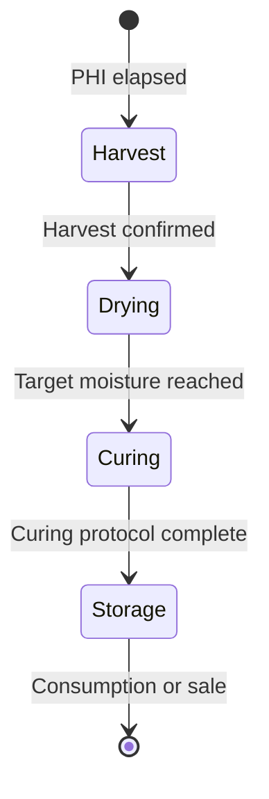

# Post-Harvest: Drying, Curing & Storage

!!! info "Partially implemented"
    **Harvest recording** (HarvestBatch, quality assessment, yield metrics) is fully implemented. **Drying and curing phases** (state machine, environment monitoring during drying) are specified but not yet modeled as separate phases in the code.

The post-harvest phase begins at cutting and ends when your product is stored or
processed. Kamerplanter accompanies this process with protocol templates, quality
assessments, and environment monitoring — so you stay in control of quality, aroma,
and shelf life.

---

## Prerequisites

- A completed or in-progress harvest in Kamerplanter (REQ-007)
- No active IPM treatment pre-harvest interval (PHI) for the affected plants

---

## Pre-Harvest Interval Gate: System Protection

!!! danger "Harvest blocked during active treatments"
    If a plant protection treatment with a defined pre-harvest interval (PHI) is still
    active, Kamerplanter automatically blocks harvest creation.

    **Pre-harvest interval (PHI)** is the minimum period between the last treatment
    and harvest that must be observed according to pesticide registration requirements.

    The system shows you the exact date from which harvest is permitted. Consult your
    horticultural advisor if you have questions about compliance.

---

## Harvest Workflow in Kamerplanter

1. Navigate to the planting run and open the **Harvest** section.
2. The system automatically checks all pre-harvest intervals.
3. Create a **harvest batch** (HarvestBatch) with weight, date, and initial quality rating.
4. Set up a **post-harvest protocol** and select the protocol type.
5. Record regular **measurements** (weight, temperature, humidity).

---

## Drying

### Cannabis, Hops & Herbs (Slow-Dry Method)

The slow-dry method is the most gentle drying technique and best preserves terpenes
and aromas.

**Optimal conditions:**

| Parameter | Target | Critical limits |
|-----------|--------|----------------|
| Temperature | 15–21 °C | Above 25 °C: terpene loss |
| Relative humidity | 45–55 % | Above 65 %: mold risk (Botrytis) |
| Duration | 7–14 days | — |
| Air exchange | Light airflow | No direct draft onto the harvest |

!!! warning "Watch the mold threshold"
    Relative humidity above 65 % dramatically increases mold risk. Botrytis (gray
    mold) can destroy an entire harvest within a few days. Kamerplanter sends an alert
    when calibrated sensors exceed this threshold.

**Readiness check (snap test):**
A thin stem should snap when bent but not splinter. Leaves should be dry and crispy,
flower stems flexible but not pliable.

### Chili & Peppers

| Method | Duration | Temperature | Notes |
|--------|----------|------------|-------|
| Air drying | 2–4 weeks | Room temperature | Slow, best aroma |
| Dehydrator | 6–12 hours | 50–60 °C | Fast, slight aroma loss |

### Onions & Garlic (Two-Phase Drying)

!!! example "Phase separation: curing vs. storage"
    Onions and garlic require two distinct climate phases:

    **Phase 1 — Skin hardening (curing):** 2–3 weeks at 25–30 °C, low humidity.
    UV exposure is desirable in this phase — it promotes skin hardening and antimicrobial
    effects. Well-ventilated, sunny location.

    **Phase 2 — Long-term storage:** Dark, 10–15 °C, 60–70 % humidity.
    No light! Light promotes sprouting and greening.

---

## Curing (Conditioning/Fermentation)

### Cannabis — Jar Curing

Curing is the process that significantly improves the quality of dried cannabis.
Chlorophyll breaks down and terpenes continue to develop.

**Process:**

1. Fill dried buds into airtight glass jars (mason jars) — maximum 2/3 full.
2. Store jars at 62 % relative humidity (Boveda 62 packs recommended).
3. **Follow the burping schedule:**

| Period | Frequency | Duration per session |
|--------|-----------|---------------------|
| Week 1–2 | 2 x daily | 15 minutes |
| Week 3–4 | 1 x daily | 10 minutes |
| Week 5+ | 1 x weekly | 5 minutes |

4. Minimum duration: 4 weeks. Optimal result: 6–8 weeks.

!!! tip "Boveda packs"
    Boveda 62 % packs regulate humidity in the jar automatically in both directions.
    They are not a moisture source but a buffer. Replace them when they are fully
    hardened.

### Sauerkraut

| Phase | Duration | Temperature | Salt content |
|-------|----------|------------|-------------|
| Phase 1 (Leuconostoc) | 1–3 days | 18–22 °C | 2–2.5 % |
| Phase 2 (Lactobacillus) | 4–21 days | 15–18 °C | 2–2.5 % |

The vegetables must be fully submerged under the brine. Ready when pH is below 4.0 and
no more gas production.

### Kimchi

Kimchi has a different profile (higher salt concentration, different temperature
pattern):

- **Phase 1 (room temperature):** 1–3 days at 18–22 °C — initial fermentation
- **Phase 2 (cold fermentation):** 2–5 °C in the refrigerator, 2–4 weeks

Salt content: 3–5 % (higher due to gochugaru and fish sauce).

---

## Storage

### Temperature Zones at a Glance

| Zone | Temperature | Suitable for |
|------|------------|-------------|
| Cool | 0–5 °C | Root vegetables (in sand), apples, cabbage |
| Cellar | 10–15 °C | Squash, onions, potatoes, cannabis (cured) |
| Room temperature | 18–22 °C | Dried herbs, seeds, dried fruit |

### Humidity by Product

| Humidity | Products |
|---------|---------|
| High (80–95 %) | Root vegetables in moist sand |
| Medium (60–70 %) | Squash, onions after hardening |
| Low (40–50 %) | Dried herbs, cannabis, hops |

### Ethylene Management for Vegetables and Fruit

!!! warning "Keep ethylene producers away from sensitive produce"
    Ethylene is a plant ripening gas. Ethylene producers (tomato, apple, banana, avocado)
    dramatically accelerate the ripening of sensitive products:

    **Ethylene-sensitive products:** Lettuce, cucumber, broccoli, carrot, herbs

    **Never** store these together with tomatoes, apples, or bananas — it leads to rapid
    yellowing, bitterness, and premature spoilage.

---

## Quality Assessment

### Trichome Check (Cannabis)

| Trichome color | Ripeness | Recommendation |
|---------------|---------|---------------|
| Clear/transparent | Unripe | Do not harvest yet |
| Milky/cloudy | Ripe (peak potency) | Begin harvest |
| Amber | Overripe | Harvest immediately; more sedating effect |

### Quality Scoring in Kamerplanter

After harvest and at the end of the curing process, record a quality assessment
(QualityAssessment) in Kamerplanter:

- **Visual condition**: Excellent / Good / Acceptable / Concerning / Critical
- **Aroma quality**: Excellent / Good / Acceptable / Off / Moldy
- **Weight progression**: Weigh daily or weekly and record in Kamerplanter
- **Water activity (a_w)**: Cannabis target: 0.55–0.65; mold from a_w > 0.65

!!! tip "Record weight daily"
    Daily weighing lets you objectively track drying progress. Cannabis typically loses
    75–80 % of its fresh weight during drying. A weight curve display shows you when
    the plateau has been reached.

---

## Frequently Asked Questions

??? question "How do I detect mold early?"
    Mold (Botrytis, Aspergillus) initially appears as gray or white fuzz and smells
    musty or earthy-moldy. Check daily — especially dense spots. When in doubt:
    remove affected material immediately and store it separately.

??? question "Can I speed up drying with a dehydrator?"
    Yes, but with quality trade-offs. Above 40 °C, terpenes begin to evaporate; above
    60 °C, enzymatic processes are lost. For cannabis and hops, slow-dry at room
    temperature is recommended. Culinary mushrooms and vegetables tolerate higher
    temperatures better.

??? question "How long does dried cannabis keep?"
    With correct storage (14–18 °C, 58–62 % RH, dark, airtight) 12–24 months without
    significant quality loss. After that, THC and terpene levels measurably decline.

??? question "Do I have to manually enter all measurements in Kamerplanter?"
    No. If you have linked sensors (e.g., via Home Assistant), temperature and humidity
    are imported automatically. You only need to record weight and visual assessment
    manually.

## See also

- [Harvest (REQ-007)](../user-guide/harvest.md)
- [Pest Management (IPM)](../user-guide/pest-management.md)
- [Sensors](../user-guide/sensors.md)
- [VPD Optimization](vpd-optimization.md)
