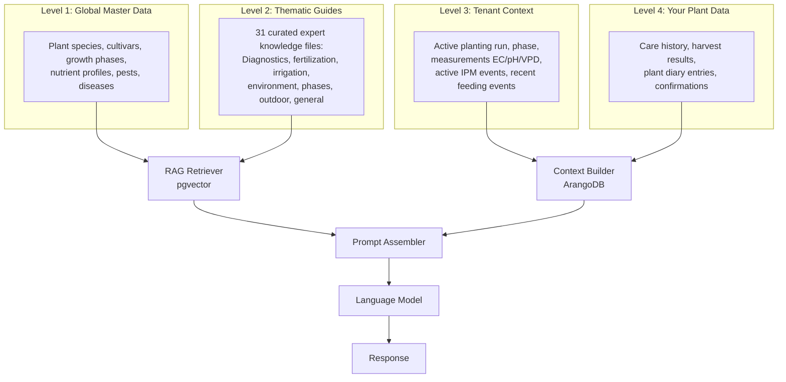

# Understanding the RAG Knowledge Base

The AI Assistant in Kamerplanter does not answer from the memory of a general language model — it grounds every response in your own data and a curated knowledge base. This technique is called **Retrieval-Augmented Generation (RAG)**. This page explains how the system is structured and why it works the way it does.

---

## Why RAG?

A language model answering solely from its training has two weaknesses:

1. **Hallucinations** — It invents plausible-sounding but incorrect facts
2. **No context** — It does not know your specific plant, your current measurements, or your care history

RAG solves both problems: before generating every response, the system searches a verified database for relevant information and provides it to the model as a foundation. The model then combines these facts with your concrete situation — instead of speculating from memory.

!!! tip "Simply explained"
    Think of RAG as a very well-prepared assistant: before answering your question, they quickly looked up the relevant reference books. They don't make things up — they explain what they found.

---

## The 4-Level Model

Kamerplanter's knowledge base consists of four levels that are combined for every request.



**Levels 1 and 2** are stored as vectors and retrieved via similarity search.
**Levels 3 and 4** are injected as structured text into every request at runtime.

### Level 1: Global Master Data

The Kamerplanter master data forms the foundation of all recommendations:

- Plant species with taxonomy, care requirements, and characteristics
- Cultivars with specific traits
- Growth phase definitions with VPD targets, light and temperature requirements
- Nutrient profiles per species and phase
- Pest and disease data with symptoms and treatment methods

This data is re-indexed weekly.

### Level 2: Thematic Guides

Thematic guides contain cross-cutting knowledge that cannot be derived from master data — expert knowledge that applies across many plant species and situations. The knowledge base currently includes 31 curated guides in seven categories:

| Category | Example Guides |
|----------|---------------|
| Diagnostics | Nutrient deficiency symptoms, pH/EC deviations, early pest detection, root health |
| Environment | VPD optimization, light fundamentals, temperature control, CO₂ enrichment |
| Fertilization | EC management (hydroponics/soil), organic outdoor fertilization, CalMag correction, mixing order |
| Irrigation | Irrigation strategies by substrate, recognizing overwatering, water quality |
| Phases | Germination, vegetative optimization, flowering management, harvest timing, overwintering |
| Outdoor | Season planning, companion planting, crop rotation, weather reactions |
| General | Beginner's guide, common mistakes to avoid, yield optimization |

!!! note "Agrobiologically reviewed"
    All guides are reviewed for technical accuracy before inclusion in the knowledge base. The system also includes 100 benchmark questions against which every new version of the knowledge base is tested.

### Level 3: Tenant Context (Real-Time)

For every request, the Context Builder fetches the current state of your grow from the database:

- Active planting runs with current growth phase and phase duration
- Latest measurements: EC, pH, VPD, temperature, humidity
- Active IPM events (pest infestations, diseases, ongoing treatments)
- Last feeding events with quantities and products

### Level 4: Your Plant Data (Real-Time)

With your consent, personal care data also flows into the context:

- Care confirmations (when watered, fertilized, trained)
- Plant diary entries
- Results from past harvests

---

## An Example Flow

Here is how a typical request moves through the system:

!!! example "Example: Yellowing Leaves"

    **Your question:** "My lower leaves are turning yellow — what could be the cause?"

    **Step 1 — Context Builder reads your data:**
    ```
    Species: Cannabis sativa 'Northern Lights'
    Phase: Flowering, Day 21
    EC: 1.2 mS/cm, pH: 5.8, VPD: 1.1 kPa
    Last feeding: 2 days ago (standard nutrient solution)
    ```

    **Step 2 — RAG Retriever finds relevant chunks:**
    - Master data chunk: "Cannabis sativa, Flowering phase, NPK target 5-15-14"
    - Guide chunk: "Nitrogen deficiency: lower leaves yellow, raise EC..."
    - Guide chunk: "Flowering management: N demand drops from week 3, natural N draw-down..."

    **Step 3 — Model combines everything:**
    > "Your Northern Lights is in week 3 of flowering. Yellowing lower leaves can indicate N deficiency, BUT: natural N draw-down in lower leaves during late flower is normal. Your EC is at 1.2 — that's a bit low for week 3 flowering. Recommendation: raise EC to 1.4–1.6, do NOT increase the N ratio (PK phase). If more than 30% of leaves are affected, consider a light N boost."

Without the thematic guides, the model would only know the master data context and give generic tips. Without your real-time context (EC 1.2, week 3 flower), the model would not know the situation is borderline.

---

## Knowledge Base Quality Assurance

### Agrobiological Review

All guides and master data are reviewed by experienced growers for technical accuracy before inclusion. Particular attention is paid to:

- Correct VPD and EC target values per phase and substrate
- Agreement of symptom descriptions with current literature
- Safety notices (mixing order, pre-harvest intervals)

### Benchmark Evaluation

The system includes 100 benchmark questions whose answers are automatically evaluated with every knowledge base update:

- **Topic Match** — Are the retrieved RAG chunks relevant to the question?
- **LLM-as-Judge** — A second model evaluates factual accuracy and actionability
- **A/B Comparison** — When models or guide versions change: improvement over baseline?

---

## Adding Custom Guides (Admin)

Tenant admins can add custom thematic guides to the local knowledge base. This is useful for:

- Cultivar-specific specialist knowledge
- Internal protocols and operational experience
- Guides in other languages

### YAML Format

```yaml
---
title: My Custom Guide Title
category: fertilization   # diagnostics | environment | fertilization | irrigation | phases | outdoor | general
tags: [ec, nutrient, hydroponics]
expertise_level: [intermediate, expert]
applicable_phases: [vegetative, flowering]
chunks:
  - id: my-first-chunk
    title: Section Title
    content: |
      Knowledge goes here as free text. The content is vectorized
      and retrieved for matching queries.

      Tip: Concrete, action-oriented text works better
      than general descriptions.
    metadata:
      nutrient: nitrogen
      substrate: coco
```

### Uploading a Guide

1. Open **Settings > AI Knowledge Base**
2. Click **Upload Guide**
3. Select your YAML file
4. The system validates the format and shows a preview
5. Confirm with **Import**

The new guide is included in the vector database at the next re-index cycle (daily, 06:00 UTC). You can also trigger a re-index manually.

!!! warning "Quality responsibility"
    Custom guides are not automatically reviewed. You are responsible for the technical accuracy of your guides. Incorrect guides can degrade the quality of AI responses.

---

## Reindexing the Knowledge Base (Operator/Developer)

After modifying knowledge YAML files under `spec/knowledge/`, the vectors in pgvector must be recomputed. This happens automatically once a week (Sunday 03:00 UTC) but can also be triggered manually.

### Prerequisites

- Knowledge YAML files are mounted in the container at `/app/knowledge` (automatic with Skaffold deployment)
- VectorDB (pgvector) and Embedding Service must be running
- `vectordb_enabled: true` in the backend configuration

### Workflow: Edit chunk → deploy → reindex → test

```bash
# 1. Edit knowledge YAML files
#    e.g. spec/knowledge/diagnostik/naehrstoffmangel-symptome.yaml

# 2. Redeploy (so the files are available in the container)
skaffold dev   # or: skaffold run

# 3. Trigger the Celery reindex task manually
kubectl exec -it deploy/celery-worker -- \
  celery -A app.tasks call app.tasks.vector_indexing_tasks.reindex_vector_chunks

# 4. Run the benchmark (optional, recommended)
cd tools/rag-eval
source ~/.venvs/rag-eval/bin/activate
python eval_rag.py
```

### Alternative: Trigger the task via Python interpreter

```bash
kubectl exec -it deploy/celery-worker -- python -c "
from app.tasks.vector_indexing_tasks import reindex_vector_chunks
result = reindex_vector_chunks.delay()
print(f'Task ID: {result.id}')
"
```

### What happens during reindex?

1. All YAML files under `/app/knowledge` are read
2. Each chunk is vectorized using the embedding model (`paraphrase-multilingual-MiniLM-L12-v2`, 384 dimensions)
3. Vectors are upserted into `ai_vector_chunks` (existing chunks are updated, new ones added)
4. The task returns a summary: number of files, number of chunks, duration

!!! tip "Fast feedback loop"
    For iterative knowledge base improvement, use this cycle:

    1. Run benchmark → identify failures
    2. Add or improve chunks in the YAML files
    3. Deploy and reindex
    4. Re-run benchmark → verify score improvement

    See `tools/rag-eval/README.md` for benchmark tool details.

---

## Frequently Asked Questions

??? question "Can the AI search the internet for additional information?"
    No. The system performs no internet searches. All answers are based exclusively on the local knowledge base (master data, guides) and your own plant data. This is a deliberate design decision to avoid hallucinations and ensure data privacy.

??? question "How current are the thematic guides?"
    Guides are maintained with each Kamerplanter release. The exact status is noted in the version documentation ([Changelog](../changelog/index.md)). Custom guides you upload remain current until you update or delete them.

??? question "What happens if no matching guide chunk is found?"
    The system falls back to master data (Level 1) and uses the structured context (Levels 3+4). Response quality is lower in this case, but the system still responds — without hallucinating.

??? question "Are my custom guides shared with other users?"
    No. Custom guides are tenant-scoped — they are only visible within your garden/organization and are not shared with the global knowledge base or other tenants.

---

## See Also

- [AI Assistant](../user-guide/ai-assistant.md)
- [AI Provider Setup](../user-guide/ai-providers.md)
- [AI Architecture (Developer)](../architecture/ai-architecture.md)
- [VPD Optimization](vpd-optimization.md)
- [Nutrient Mixing](nutrient-mixing.md)
