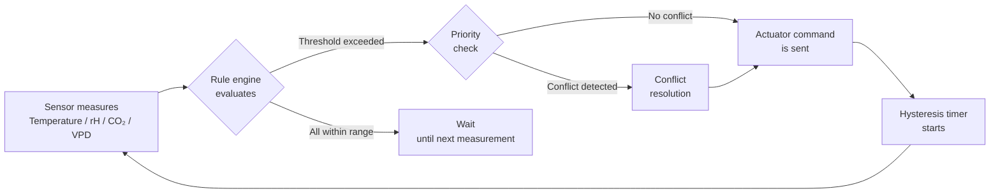
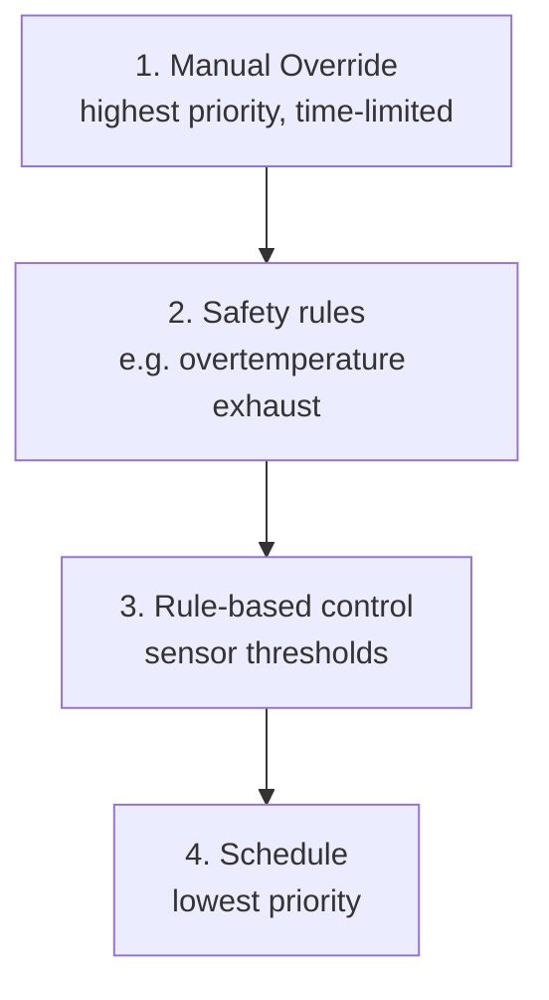

# Environment Control & Actuators

!!! warning "Not yet implemented"
    This feature is **specified but not yet implemented** (REQ-018). This documentation describes the planned behavior. Currently only the Home Assistant communication layer exists (reading sensor data). The rule engine, schedules, hysteresis, and actuator control are not yet coded.

Kamerplanter closes the control loop between sensors and actuators: the system measures temperature, humidity, CO₂ and VPD, evaluates these values against your rules, and then automatically controls devices like fans, humidifiers or irrigation valves. You can manually intervene at any time and temporarily override automations.

---

## Prerequisites

- At least one location (Site/Location) is set up — see [Locations & Substrates](locations-substrates.md)
- Sensors are delivering measurements — see [Sensors](sensors.md)
- For automatic control via Home Assistant: HA integration is set up — see [Home Assistant Integration](../guides/home-assistant-integration.md)

---

## The Sensor-Actuator Control Loop

Every automatic control action follows the same cycle:



The system evaluates rules cyclically every 60 seconds. Every executed action is permanently stored in the **Control Log** with timestamp, trigger and protocol.

---

## Adding Actuators

An **actuator** is a controllable device assigned to a location.

### Add a New Actuator

1. Navigate to **Locations** > desired location > **Actuators**
2. Click **New Actuator**
3. Fill in the required fields:

    | Field | Description | Example |
    |-------|-------------|---------|
    | **Name** | Descriptive name | Exhaust Fan Tent 1 |
    | **Type** | Type of device | `exhaust_fan` |
    | **Protocol** | Communication method | `home_assistant` |

4. Fill in additional fields depending on the protocol (see below)

### Protocol Comparison

=== "Home Assistant (recommended)"
    Kamerplanter sends service calls to Home Assistant, which handles the actual device control.

    - Enter the **HA Entity ID** (e.g. `switch.exhaust_fan_tent1`)
    - Bidirectional: HA reports state changes back
    - Fallback: if HA is unreachable, the system automatically creates manual tasks

    !!! info "HA integration not set up?"
        If no HA integration is configured, HA-specific fields are hidden. The system then shows only MQTT and Manual as options.

=== "MQTT (direct)"
    For IoT devices without Home Assistant integration.

    - Enter the **command topic** (e.g. `kamerplanter/actuators/fan1/set`)
    - **State topic** for feedback (optional)
    - Suitable for ESPHome devices, Shelly switches, etc.

=== "Manual (fallback)"
    The actuator exists in the system but is controlled physically by hand. Instead of sending commands, the system creates **tasks** (REQ-006) telling you when to intervene manually.

    !!! tip "Getting started without a smart home"
        Manual mode is ideal if you do not yet have a smart home. You still receive rule-based recommendations as a task: "Turn on humidifier — VPD is at 1.8 kPa, target: 1.2 kPa".

### Actuator Types

| Type key | Device | Typical control variable |
|----------|--------|--------------------------|
| `light` | Main lighting (dimmable) | Photoperiod, DLI |
| `exhaust_fan` | Exhaust fan | Temperature, CO₂, VPD |
| `circulation_fan` | Circulation fan | Schedule |
| `humidifier` | Humidifier | VPD, humidity |
| `dehumidifier` | Dehumidifier | VPD, humidity |
| `heater` | Heater | Temperature |
| `co2_doser` | CO₂ dosing unit | CO₂ concentration, PPFD |
| `irrigation_valve` | Irrigation valve | Substrate moisture, schedule |
| `dosing_pump` | Dosing pump | Schedule, EC value |

---

## Setting Up Schedules

Schedules are the simplest form of control — a device switches at fixed times.

### Add a New Schedule

1. Navigate to **Locations** > Actuator > **Schedules**
2. Click **New Schedule**
3. Choose the schedule type:

    - **Daily** — same times every day (e.g. lights 06:00–00:00)
    - **Weekly** — different times per day of the week
    - **Interval** — every N minutes/hours (e.g. irrigation every 4h)
    - **Sunrise/Sunset** — dynamic based on location

!!! example "Example: 18/6 light schedule"
    - Type: Daily
    - On: 06:00
    - Off: 00:00
    - Priority: 10

!!! warning "Important for short-day plants"
    Short-day plants (e.g. Cannabis sativa in the flowering phase) are sensitive to light interruptions. The dark period must not be interrupted. Make sure no other schedule or safety rule interferes with the dark period.

---

## Rule-Based Control

Rules react automatically to sensor values. They are evaluated after every measurement.

### Add a New Rule

1. Navigate to **Locations** > desired location > **Rules**
2. Click **New Rule**
3. Configure condition and action:

    | Field | Description | Example |
    |-------|-------------|---------|
    | **Sensor value** | Which measurement to monitor | VPD |
    | **Condition** | When should the rule trigger | `>` 1.5 kPa |
    | **Action** | What should happen | Turn on humidifier |
    | **Safety rule** | High priority, cannot be deactivated | No |

### Configuring Hysteresis

Hysteresis prevents an actuator from switching too rapidly (oscillation):

```
Example: VPD humidifier control

  Switch ON at:  VPD > 1.5 kPa   ← upper threshold
  Switch OFF at: VPD < 1.2 kPa   ← lower threshold
  Min runtime:   5 minutes
  Min pause:     3 minutes
```

!!! info "Why hysteresis matters"
    Without hysteresis, a humidifier would switch on and off every second at VPD = 1.5 kPa. This stresses the device and creates no stable climate zone. With hysteresis, the humidifier runs until the VPD value has dropped well below 1.5 kPa.

### Example Rules for a Typical Grow Tent

| Rule | Condition | Action | Type |
|------|-----------|--------|------|
| VPD correction humidifier | VPD > 1.5 kPa | Humidifier on | Sensor rule |
| VPD correction dehumidifier | VPD < 0.8 kPa | Dehumidifier on | Sensor rule |
| Overtemperature exhaust | Temperature > 30°C | Exhaust 100% | **Safety rule** |
| CO₂ exhaust coupling | CO₂ doser active | Exhaust at 20% | Sensor rule |
| Tank protection | Tank fill level < 5% | Stop irrigation | Safety rule |

---

## Phase-Linked Profiles

The system links growth phases (REQ-003) to actuator settings. When the phase changes, the light schedule and climate targets are automatically adjusted.

!!! example "Example: Transition Vegetative → Flowering"
    - Photoperiod changes from 18/6 to 12/12
    - VPD target drops from 1.2 kPa to 1.0 kPa (tighter stomata during flowering)
    - CO₂ target rises from 800 to 1,000 ppm (higher photosynthesis rate)

Gradual transitions are possible: the system can reduce the photoperiod from 18h to 12h over 7 days instead of switching abruptly.

---

## The Priority System

When multiple rules address the same actuator simultaneously, the following order applies:



!!! warning "Manual override expires"
    A manual override is active for 2 hours by default. After that, the automation takes over again. You can adjust the duration when setting the override.

---

## Graceful Degradation on HA Failure

If Home Assistant is unreachable:

1. The system detects the connection loss within 60 seconds
2. The **fail-safe state** is activated for each affected actuator:

    | Actuator type | Fail-safe state | Reason |
    |---------------|----------------|--------|
    | Exhaust fan | ON (100%) | Prevent overtemperature |
    | Heater | OFF | Fire/overheating protection |
    | Irrigation | OFF | Flood protection |
    | CO₂ doser | OFF | Poisoning protection |
    | Light | Last state | Dark period is critical |
    | Dosing pump | OFF | Overdosing protection |

3. The system generates manual tasks as a substitute for the failed automation
4. Once the HA connection is restored, all fail-safe states are lifted

---

## Emergency Stop

For emergency situations there are predefined emergency-stop scenarios:

!!! danger "Execute emergency stop"
    Navigate to **Locations** > **Emergency Stop** or use the red button in the dashboard.

    | Scenario | Action |
    |---------|--------|
    | **Water leak** | All pumps and valves OFF |
    | **CO₂ leak** | CO₂ doser OFF, exhaust 100% |
    | **Fire alarm** | All power consumers OFF |

---

## Control Log

All actions are permanently logged. Navigate to **Locations** > Location > **Log** to see:

- Timestamp of the action
- Trigger (schedule, rule, phase change, manual, safety, fallback)
- Actuator and command
- Protocol (HA, MQTT, Manual)
- Success status and error message if applicable

---

## Frequently Asked Questions

??? question "My humidifier keeps switching on and off constantly — what should I do?"
    This indicates missing or too-tight hysteresis. Open the VPD humidifier rule and increase the gap between the on and off threshold. Recommendation: at least 0.3 kPa difference. Also increase the minimum runtime to 5–10 minutes.

??? question "The rule is not being executed even though the sensor value exceeds the threshold."
    Check the following: (1) Is the rule active? (2) Is a manual override currently active? (3) Is the actuator still in the minimum pause after the last switch? (4) Is a higher-priority rule interfering?

??? question "Kamerplanter cannot reach HA — what happens to my plants?"
    The system automatically activates fail-safe states and creates manual tasks. The exhaust fan runs at 100%, for example, to prevent overtemperature. You are notified via the notification bell.

??? question "Can I use actuators without Home Assistant?"
    Yes. Choose MQTT (for direct IoT connections) or Manual as the protocol. In manual mode, the system creates tasks instead of sending direct commands.

---

## See Also

- [Setting Up Sensors](sensors.md)
- [Growth Phases](growth-phases.md)
- [Home Assistant Integration](../guides/home-assistant-integration.md)
- [VPD Optimization](../guides/vpd-optimization.md)
- [Tank Management](tanks.md)
