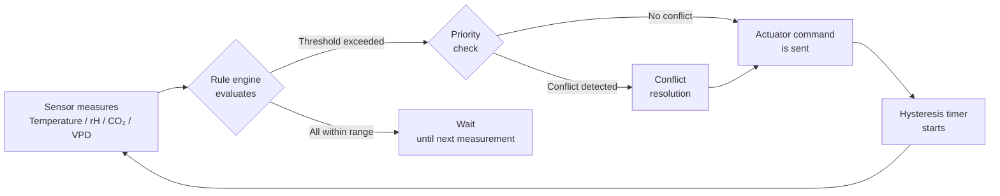
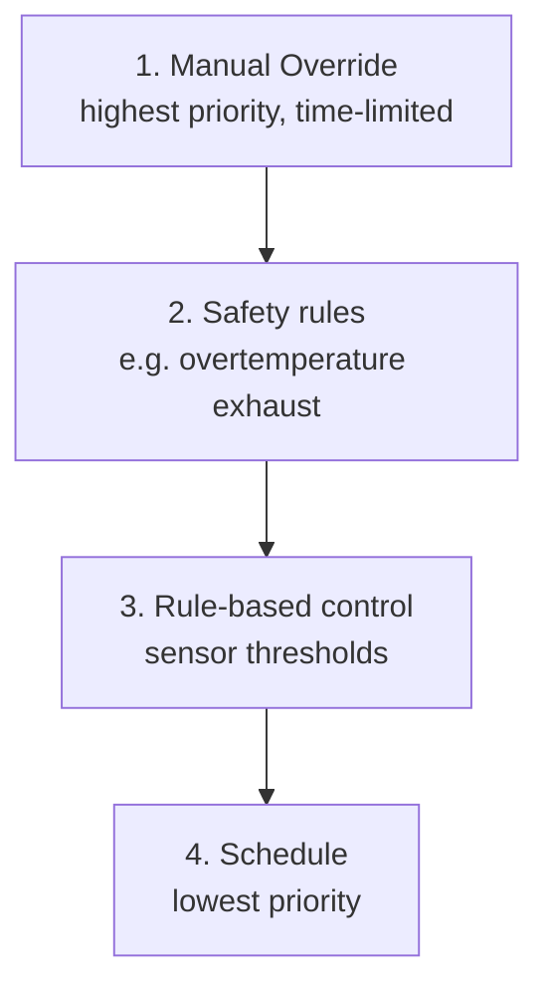

# Environment Control & Actuators

!!! note "Partially available"
    The automatic control loop (priority system, hysteresis, schedules, rules, and phase-linked climate profiles) already runs fully in the backend. In the UI you can currently create actuators, switch them on/off directly, and trigger an emergency stop. Schedules, rules, phase-linked profiles, an actuator's safe value envelope, and the time-limited manual override are still only reachable via the API — the affected sections below are marked individually. <!-- REQ-018 -->

Kamerplanter closes the control loop between sensors and actuators: the system measures temperature, humidity, CO₂ and the vapor pressure deficit (VPD), evaluates these values against configured rules, and uses them to control devices like fans, humidifiers or irrigation valves. You can intervene directly at any time by manually switching an actuator on or off.

---

## Prerequisites

- At least one location with an area (Site & Location) is set up — see [Locations & Substrates](locations-substrates.md)
- For automatic control via Home Assistant: HA integration is set up — see [Home Assistant Integration](../guides/home-assistant-integration.md)
- For sensor rules: sensors are delivering measurements — see [Sensors](sensors.md)

---

## The Sensor-Actuator Control Loop

Every automatic control action follows the same cycle:

<!-- diagram-source: user-described — automatic control loop: sensor reading, rule evaluation, priority check, actuator command, hysteresis timer -->

```mermaid
flowchart LR
    S[Sensor measures<br/>Temperature / rH / CO₂ / VPD] --> E{Rule engine<br/>evaluates}
    E -->|Threshold exceeded| P{Priority<br/>check}
    E -->|All within range| W[Wait<br/>until next measurement]
    P -->|No conflict| A[Actuator command<br/>is sent]
    P -->|Conflict detected| K[Conflict<br/>resolution]
    K --> A
    A --> H[Hysteresis timer<br/>starts]
    H --> S
```

The backend evaluates rules and schedules cyclically every 30 seconds. Every executed command is permanently stored with timestamp, trigger (schedule, rule, manual, safety, fallback) and success status — there is no dedicated view for it in the UI yet, see [For Technical Users / Self-Hosters](#for-technical-users-self-hosters).

!!! note "Operator kill switch"
    If the automatic control loop hasn't been enabled by your operator, the system does not automatically evaluate schedules and rules. Actuators can still be switched manually at any time regardless. Details in [For Technical Users / Self-Hosters](#for-technical-users-self-hosters).

---

## Adding Actuators

An **actuator** is a controllable device (e.g. a fan, light, or pump) assigned to an area (Location).

### Add a New Actuator

1. Open **Environment Control** > **Actuators & Control** in the sidebar.
2. Click **Add actuator**.
3. Choose **Site** and **Location**, and give it a **name**.
4. Choose **actuator type** and **protocol** — depending on the protocol, one more required field appears (see below).
5. Optional: **power draw** (used for the consumption overview) and **notes**.

### Protocol Comparison

=== "Home Assistant (recommended)"
    Kamerplanter sends service calls to Home Assistant, which handles the actual device control.

    - Enter the **Home Assistant entity ID** (e.g. `light.growzelt_1` or `switch.exhaust`)
    - Only shown when an HA integration is set up — without it, the form shows only MQTT and Manual as protocol options
    - Fallback: if Home Assistant is unreachable when a command is sent, the system automatically creates a manual task instead of discarding the command

=== "MQTT (direct)"
    For IoT devices without Home Assistant integration.

    - Enter the **MQTT command topic** (e.g. `growroom1/actuator1/set`) — the topic commands are published to
    - Suitable for ESPHome devices, Shelly switches, etc.

    !!! info "No dedicated MQTT broker client yet"
        An MQTT command is currently logged and recorded as sent — an actual connection to an MQTT broker is not yet wired up in the backend. Feedback via a state topic is present in the data model but likewise not yet connected.

=== "Manual (fallback)"
    The actuator exists in the system but is controlled physically by hand. Instead of sending commands, the system creates a **task** for every action, telling you when to intervene. <!-- REQ-006 -->

    !!! tip "Getting started without a smart home"
        Manual mode is ideal if you don't yet have a smart home. As soon as you switch the actuator on or off from its card, the system creates the corresponding task.

### Safe Value Envelope

!!! info "API only: Configuring the min/max value envelope"
    For an actuator to accept a *numeric* command (e.g. a dimmer or percentage level), a valid value envelope (`min_value`/`max_value`) must be set first — the UI's creation form does not support this yet. Without a configured envelope, the system refuses every numeric command (`422` error); plain on/off commands are unaffected. You set the envelope via `PUT /actuators/{key}`, see [For Technical Users / Self-Hosters](#for-technical-users-self-hosters). Every value sent is also automatically clamped into this envelope — a value that's too high or too low never reaches the device unchanged.

### Actuator Types

<!-- Source: src/frontend/src/pages/environment/ActuatorDialog.tsx (ACTUATOR_TYPES), src/frontend/src/i18n/locales/en/translation.json (enums.actuatorType) -->

| Type key | Device |
|----------|--------|
| `light` | Light |
| `exhaust_fan` | Exhaust fan |
| `circulation_fan` | Circulation fan |
| `heater` | Heater |
| `cooler` | Cooler |
| `humidifier` | Humidifier |
| `dehumidifier` | Dehumidifier |
| `co2_doser` | CO₂ doser |
| `irrigation_valve` | Irrigation valve |
| `pump` | Pump |
| `dosing_pump` | Dosing pump |
| `chiller` | Chiller (nutrient solution cooling) |
| `air_pump` | Air pump |
| `uv_sterilizer` | UV sterilizer |
| `shade_screen` | Shade screen |
| `roof_vent` | Roof vent |
| `energy_screen` | Energy screen |
| `fogger` | Fogger |
| `generic_switch` | Generic switch |

---

## Operating Actuators

Every actuator's card shows its current state (on/off/fault) and whether the device is reachable online.

- **Turn on** / **Turn off** send a direct command to the actuator immediately — regardless of what any active rule or schedule currently intends.
- If the transmission fails (e.g. because Home Assistant is unreachable), the system doesn't report it as an error — it automatically creates a manual task instead: "Device is not directly reachable — the command was queued as a manual task instead."

!!! note "Direct command vs. time-limited override"
    Clicking **Turn on**/**Turn off** sets the state immediately, but it is **not** protected from the next automatic evaluation: if a rule or schedule is active for the actuator (currently only configurable via the API), it can overwrite the state at the next evaluation. To reliably override an automation for a limited time, use the **time-limited manual override** instead — it automatically wins the priority ladder (see below), but is currently only settable via the API, see [For Technical Users / Self-Hosters](#for-technical-users-self-hosters).

---

## Automatic Control: Priority and Hysteresis

For every actuator, Kamerplanter cyclically evaluates which control source should currently win. When multiple sources compete for the same actuator, the following order applies:

<!-- diagram-source: user-described — actuator priority order from manual override down through safety rules, rule-based control, and schedule -->

```mermaid
flowchart TB
    M[1. Manual Override<br/>highest priority, time-limited]
    S[2. Safety rules<br/>e.g. overtemperature exhaust]
    R[3. Rule-based control<br/>sensor thresholds]
    Z[4. Schedule<br/>lowest priority]
    M --> S --> R --> Z
```

When a rule or schedule wins, the resulting command is sent to the actuator and — just like a direct command — clamped to the configured safe value envelope.

### Configuring Hysteresis

Sensor rules use **hysteresis** to prevent an actuator from switching on and off every second around a threshold that's just barely reached:

```
Example: VPD humidifier control

  Switch ON at:  VPD > 1.5 kPa   ← upper threshold (on_threshold)
  Switch OFF at: VPD < 1.2 kPa   ← lower threshold (off_threshold)
  Min runtime:   5 minutes        (min_on_duration_seconds)
  Min pause:     3 minutes        (min_off_duration_seconds)
```

!!! info "Why hysteresis matters"
    Without hysteresis, a humidifier would switch on and off every second at VPD = 1.5 kPa. This stresses the device and creates no stable climate zone. With hysteresis, the humidifier runs until the VPD value has dropped well below 1.5 kPa.

You set these hysteresis values per rule via the API, see [For Technical Users / Self-Hosters](#for-technical-users-self-hosters) — there is no form for it in the UI yet.

---

## When Home Assistant Is Unreachable

If a command to Home Assistant fails — whether triggered by a click on the card, a rule, or a schedule — Kamerplanter marks the actuator as **offline** and automatically creates a **manual task**, instead of discarding the command without result. If the actuator itself is configured with the **Manual** protocol, the same applies to every action from the start — a live command is never sent.

!!! warning "Not yet implemented: automatic per-type fail-safe states"
    Every actuator can already have an individual fail-safe state configured (e.g. "exhaust automatically to 100%"). An automatic switch into that state upon a detected HA outage — independent of an actual command attempt — is planned but not yet implemented. Until then, an actuator stays in its last known state until the next command (manual, rule-driven, or schedule-driven) fails and the task is created.

---

## Emergency Stop

For emergencies there is an immediate emergency stop.

!!! danger "Executing an emergency stop"
    Click **Emergency stop** at the top of the **Environment Control & Actuators** page and confirm the dialog. All powered devices (light, heater, CO₂ doser, pumps, irrigation, dosing pump, humidifier, dehumidifier, cooler, air pump, UV sterilizer, fogger, exhaust and circulation fan) are switched off immediately. This action cannot be undone.

Besides this fire-alarm scenario, the system knows two more predefined scenarios that are currently only triggerable via the API:

| Scenario | Action | Triggerable via |
|---------|--------|-------------------|
| Fire alarm | All powered devices OFF | UI button or API |
| Water leak | Pump, irrigation valve, dosing pump OFF | API only |
| CO₂ leak | CO₂ doser OFF, exhaust fan ON | API only |

Every affected actuator is addressed **individually**: if switching off a single device fails (e.g. because Home Assistant can't currently reach it), the emergency stop is **not** aborted — every other device is still switched off. Kamerplanter then tells you exactly which devices weren't reached, for example: "Emergency stop partially executed: 4 actuator(s) switched off, 1 actuator(s) could NOT be switched off (Exhaust Fan Tent 1). Please check and disconnect these devices manually right away." — so you know immediately which device to disconnect by hand.

---

## For Technical Users / Self-Hosters {#for-technical-users-self-hosters}

The following functions are already fully implemented in the backend, but still **lack a user interface** — you can currently only reach them via the REST API, under the tenant-scoped path `/api/v1/t/{tenant_slug}/`. Read calls accept any active membership; write calls (create, command, override, rules, schedules, emergency stop) require at least the **Grower** role; deleting an actuator requires **Admin**.

!!! info "API only: Safe value envelope"
    `PUT /actuators/{key}` with the fields `min_value`/`max_value` sets the range within which an actuator may be driven numerically. Without a configured envelope, every numeric command is refused with `422`; every value sent is additionally clamped automatically into `[min_value, max_value]`.

!!! info "API only: Time-limited manual override"
    `POST /actuators/{key}/override` with `expires_at` (required, ISO 8601 timestamp) plus optionally `override_value` or `override_state` (`on`/`off`) sets an override that beats every rule and schedule until it expires. There is **no** default duration — `expires_at` must always be explicitly in the future; an already expired timestamp is rejected with `422`. `DELETE /actuators/{key}/override` clears an active override early.

!!! info "API only: Schedules"
    `POST /actuators/{key}/schedules` creates a schedule (`schedule_type`: `daily`/`weekly`/`interval`/`sunrise_sunset`, `priority` 1–100, `entries` with `time_on`/`time_off`/optional `value`/`days_of_week`). `GET`/`PUT`/`DELETE` and `POST .../toggle` manage existing schedules.

!!! info "API only: Rules and hysteresis"
    `POST /actuators/{key}/rules` creates a sensor-based rule: `sensor_parameter` (e.g. `vpd_kpa`), `condition` (operator `gt`/`lt`/`gte`/`lte`/`between`/`outside` with a threshold or range), `action` (command plus optional value), and `hysteresis` (`on_threshold`, `off_threshold`, `min_on_duration_seconds`, `min_off_duration_seconds`, `cooldown_seconds`), plus `is_safety_rule` for a higher-priority safety rule. `POST /rules/{key}/test` checks a rule against submitted test values without triggering it (dry run).

!!! info "API only: Phase-linked profiles"
    `POST /phase-control-profiles` creates a climate-target profile (photoperiod, light PPFD, day/night temperature, humidity, VPD target, CO₂ enrichment, DLI target, and more). `POST /phase-control-profiles/{key}/apply` applies a profile to a location; `transition_days` drives a gradual transition instead of an abrupt switch.

!!! info "API only: Control log"
    `GET /actuators/{key}/events` returns the complete, immutable history of every executed command (timestamp, trigger, protocol, success/error message) for an actuator. `GET /locations/{location_key}/control-events` returns the same history location-wide; `GET /actuators/{key}/events/stats` returns an aggregated analysis.

!!! info "API only: Water-leak and CO₂-leak emergency stop"
    The emergency-stop button in the UI only triggers the fire-alarm scenario. You reach the other two predefined scenarios via `POST /emergency-stop` with `{"scenario": "water_leak"}` or `{"scenario": "co2_leak"}`.

!!! note "Automatic control loop behind an operator kill switch"
    The periodic evaluation of rules/schedules (every 30 seconds), the hourly override-expiry sweep, and the 5-minute online/offline sync with Home Assistant only run once the operator has set `ACTUATOR_CONTROL_LOOP_ENABLED=true` (default: disabled). Direct commands, overrides, and the emergency stop always work via the API regardless. Details in [Environment Variables — Environment Control & Actuators](../reference/environment-variables.md#environment-control-actuators-req-018).

---

## Frequently Asked Questions

??? question "Why does my click on \"Turn on\" get reversed again after a short time?"
    If a rule or schedule is active for the actuator, it can overwrite the direct command at the next automatic evaluation. For a reliable, time-limited override, use the manual override instead (currently API only, see above) — it automatically takes priority over rules and schedules.

??? question "I send a numeric value to an actuator and get an error — why?"
    No safe value envelope (`min_value`/`max_value`) is configured for the actuator yet. Without this envelope, the system refuses every numeric command so that no unbounded value reaches the hardware. Plain on/off commands are unaffected.

??? question "Kamerplanter can't reach Home Assistant — what happens to my plants?"
    The failed command isn't discarded: Kamerplanter marks the actuator as offline and automatically creates a manual task so you can intervene.

??? question "Can I use actuators without Home Assistant?"
    Yes. Choose MQTT (for direct IoT connections) or Manual as the protocol. In manual mode, the system creates a task for every action instead of sending a direct command.

??? question "What happens if the emergency stop can't reach a device?"
    The remaining devices are still switched off — a single failed device does not abort the emergency stop. Kamerplanter then lists by name which devices weren't reached, so you can disconnect them manually right away.

---

## See Also

- [Setting Up Sensors](sensors.md)
- [Growth Phases](growth-phases.md)
- [Home Assistant Integration](../guides/home-assistant-integration.md)
- [VPD Optimization](../guides/vpd-optimization.md)
- [Tank Management](tanks.md)
