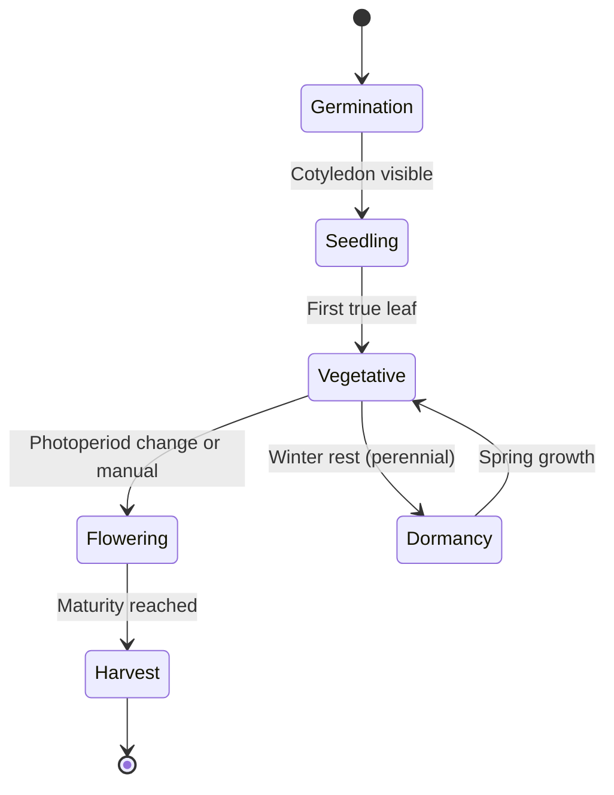

# Growth Phases

Every plant in Kamerplanter passes through a sequence of growth phases. The system automatically adjusts recommendations for watering, fertilisation, light, and climate to the current phase. This ensures each plant receives exactly what it needs at its current stage of development.

---

## Prerequisites

- At least one plant set up (via planting runs or individually)
- Helpful: matching nutrient plans for the respective phases (optional but recommended)

---

## The Phase Sequence

Kamerplanter guides each plant along a fixed phase sequence. Backward transitions are not possible — a plant that has reached the flowering phase cannot return to the vegetative phase.

**Phase overview:**

| Phase | Description | Typical Duration |
|-------|-------------|-----------------|
| **Germination** | Seed germinates, first roots and cotyledons form | 3–10 days |
| **Seedling** | First true leaves appear, plant is still delicate | 1–3 weeks |
| **Vegetative** | Strong leaf and stem growth | 2–8 weeks |
| **Flowering** | Flower formation, fruit development, aroma and compound build-up | 6–12 weeks |
| **Harvest** | Plant is ready for harvest | Harvest window |
| **Dormancy** | Rest phase for perennial plants (e.g. berry bushes in winter) | Seasonal |

!!! note "Not all phases apply to every plant"
    Herbs such as basil or lettuce do not have a pronounced flowering phase in the resin-development sense. For such plants the master data defines which phases are available and which can be skipped.

---

## Viewing the Current Phase of a Plant

1. Navigate to **Plants** and open a plant by clicking its name.
2. The detail page shows the current phase with a coloured chip at the top.
3. The **Growth Phases** tab shows the complete phase history with the date of each transition.

---

## Triggering a Phase Transition Manually

Kamerplanter does not automatically detect when a plant is ready for the next transition — you make that decision as a grower. The system supports you with information and recommendations.

### Step 1: Open the Plant

Navigate to your plant and open the **Growth Phases** tab.

### Step 2: Trigger the Phase Transition

Click **Change Phase** (or the specific phase name, e.g. "Switch to Flowering"). A confirmation dialog appears.

### Step 3: Enter Details

In the dialog you can optionally enter:

- **Transition date**: Today by default, but can be set in the past
- **Notes**: Observations accompanying the transition (e.g. "First flower sites visible")

### Step 4: Confirm

Click **Save**. The phase changes immediately. Recommendations in the app adjust automatically.

!!! warning "Phase transitions are irreversible"
    Once a plant has moved to the next phase, this transition cannot be undone. Check carefully whether the plant is genuinely ready before confirming.

---

## Batch Phase Transition for Entire Groups

If you want to move multiple plants to the next phase simultaneously (e.g. 10 tomato seedlings to the vegetative phase at once), use planting runs:

1. Open the relevant **Planting Run** under **Runs**.
2. Click **Batch Phase Change**.
3. Select the target plants and target phase.
4. Confirm — all eligible plants transition simultaneously.

More information: [Planting Runs](planting-runs.md)

---

## Phase Profiles and Recommendations

Each phase has its own resource profile. When you open the detail view of a phase (tab **Growth Phases** → click a phase), you see the target values:

### VPD Target (Vapor Pressure Deficit)

The Vapor Pressure Deficit (VPD) describes how strongly the air draws moisture from the leaves. Too high causes drought stress; too low promotes mould.

| Phase | VPD Target |
|-------|-----------|
| Germination / Seedling | 0.4–0.8 kPa |
| Vegetative | 0.8–1.2 kPa |
| Flowering | 1.0–1.5 kPa |

### Photoperiod

The day length (hours of light per day) controls the transition to flowering in many plants.

| Phase | Typical Photoperiod (short-day plants) |
|-------|---------------------------------------|
| Vegetative | 18/6 (18 h light, 6 h dark) |
| Flower induction | 12/12 (12 h light, 12 h dark) |

!!! tip "Automatic flower induction"
    For plants with defined phase data in the master records, Kamerplanter shows at which day length flowering is expected to begin automatically.

### NPK Profile (Nutrient Ratio)

The nitrogen-phosphorus-potassium ratio changes across phases:

- **Vegetative**: High nitrogen (N) for leaf growth
- **Flowering**: Less nitrogen, more phosphorus (P) and potassium (K)
- **Late flowering**: Minimal nitrogen, high PK share

---

## Perennial Plants: Dormancy and Seasonal Cycles

Perennial plants (houseplants, berry bushes, fruit trees) do not go through a single lifecycle ending in harvest; instead they follow seasonal annual cycles.

### Activating the Dormancy Phase

1. Open the plant and navigate to **Growth Phases**.
2. Click **Enter Dormancy** (visible for perennial plants).
3. Confirm the start date of the rest phase.

During the dormancy phase:
- Fertilisation recommendations are suspended
- Watering intervals are extended
- Seasonal tasks appear (e.g. "Apply winter protection")

### Returning from Dormancy

Click **Resume Growth**. Kamerplanter resets the cycle to the vegetative phase and reactivates all recommendations.

---

## Frequently Asked Questions

??? question "What happens if I trigger the phase transition too early?"
    Recommendations adapt to the new phase immediately. Since transitions cannot be reversed it is worth being patient and observing the plant carefully. Notes on the transition help with later analysis.

??? question "Can I define custom phases?"
    Custom phase definitions are possible via the master data of the plant species. Consult the expert settings or the master data documentation.

??? question "Does Kamerplanter show when a plant is ready to harvest?"
    Kamerplanter calculates a harvest window forecast based on days spent in the flowering phase and Growing Degree Days (GDD). This forecast is a guideline — the final decision is yours.

??? question "What is the difference between flushing and dormancy?"
    **Flushing** is a pre-harvest phase where nutrient supply is reduced before the plant is harvested. **Dormancy** is the natural rest phase of perennial plants in winter. Both are distinct states in the system and are mutually exclusive.

---

## See Also

- [Master Data: Plant Species](plant-management.md)
- [Fertilization](fertilization.md)
- [Harvest](harvest.md)
- [Planting Runs](planting-runs.md)
