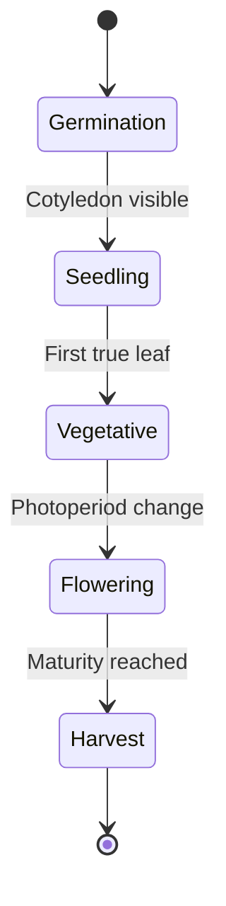

# Growth Phases

Kamerplanter guides each plant through defined growth phases: Germination, Seedling, Vegetative, Flowering, Harvest. Each phase has distinct VPD (Vapor Pressure Deficit) targets, photoperiod settings, and NPK profiles.

!!! note "Placeholder"
    This content will be elaborated in a subsequent step.

## Phase Overview

## See Also

- [Master Data](plant-management.md)
- [Fertilization](fertilization.md)
