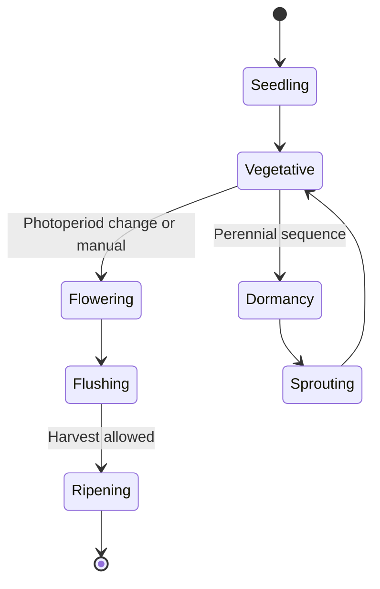

# Growth Phases

Every plant in Kamerplanter passes through a sequence of growth phases. The system automatically adjusts recommendations for watering, fertilization, light, and climate to the current phase. This ensures each plant receives exactly what it needs at its current stage of development.

---

## Prerequisites

- At least one plant set up (via planting runs or individually)
- Helpful: matching nutrient plans for the respective phases (optional but recommended)

---

## The 10 Phase Types

Kamerplanter ships with ten pre-built phase types. Each plant species only uses the subset that makes sense for it — which subset that is depends on the assigned **phase sequence** (see the next section).

<!-- Source: src/backend/app/migrations/seed_data/phase_sequences.yaml (phase_definitions) -->

| Phase type | Description | Typical duration |
|-----------|-------------|----------------|
| **Germination** | Seed germinates, first roots form | 7 days |
| **Seedling** | Establishment after germination, still delicate | 14 days |
| **Vegetative** | Active leaf and stem growth | 45 days |
| **Flowering** | Flower formation and pollination | 30 days |
| **Fruiting** | Fruit development after pollination | 75 days |
| **Ripening** | Final maturation before harvest | 14 days |
| **Dormancy** | Rest period for perennial plants | 120 days |
| **Sprouting** | New growth after dormancy | 21 days |
| **Senescence** | Leaf fall, preparation for dormancy | 21 days |
| **Flushing** | Pre-harvest flush with plain water | 14 days |

The listed duration is a guideline from the phase definition — individual phase sequences can override it (see below).

!!! note "\"Harvest\" is no longer its own phase"
    Unlike earlier versions, there is no separate phase called "Harvest". Instead, each phase definition **within a sequence** marks via an "allows harvest" flag whether harvesting is permitted during it — usually the **Ripening** phase, and for some perennial crops **Fruiting** itself. This also correctly represents plants with continuous harvest (e.g. tomatoes that ripen continuously over weeks).

---

## Phase Sequences: How a Species Moves Through Phases

A **phase sequence** is an ordered chain of phase types that makes sense for a plant species or a group of similar species. Kamerplanter ships with 11 pre-built sequences, for example:

| Sequence | For | Example phase chain |
|--------|-----|---------------------|
| **Indoor Default Cycle** | Cannabis and similar indoor crops | Seedling → Vegetative → Flowering → Flushing → Ripening (harvest) |
| **Annual Harvest Crop** | Lettuce, herbs | Germination → Seedling → Vegetative → Ripening (harvest) → Senescence |
| **Standard Perennial** | Perennial ornamentals | Dormancy → Sprouting → Vegetative → Flowering → Senescence (repeats) |
| **Full Fruit Cycle Perennial** | Fruit trees with multi-year fruiting | Dormancy → Sprouting → Vegetative → Flowering → Fruiting → Ripening (harvest) → Senescence (repeats) |
| **Biennial with Vernalization** | Biennial vegetables (e.g. carrot, onion grown for seed) | Germination → Seedling → Vegetative → Dormancy (cold period) → Flowering → Ripening (harvest) |

<!-- Source: src/backend/app/migrations/seed_data/phase_sequences.yaml (phase_sequences) -->

For every phase, a sequence defines whether it is **recurring** (perennial plants go through the cycle again), whether it is a **terminal phase** (the sequence ends there), and whether **harvest is allowed** during it. Which sequence a plant species uses is part of the species' lifecycle configuration in the master data.

<!-- diagram-source: derived from phase_sequences.yaml — indoor_default and perennial_standard sequence patterns -->

```mermaid
stateDiagram-v2
    [*] --> Seedling
    Seedling --> Vegetative
    Vegetative --> Flowering : Photoperiod change or manual
    Flowering --> Flushing
    Flushing --> Ripening : Harvest allowed
    Ripening --> [*]

    Vegetative --> Dormancy : Perennial sequence
    Dormancy --> Sprouting
    Sprouting --> Vegetative
```

!!! note "Not all phases apply to every plant"
    Herbs such as basil or lettuce do not go through a pronounced flowering phase the way resin-producing plants do. Which phases a species goes through is determined entirely by its assigned phase sequence — not all ten phase types occur in every sequence.

---

## Managing Phase Definitions and Sequences

Advanced users can create their own phase types and sequences, or review the existing ones:

- **Phase Definitions** (`/phasen/definitionen`): a list of all phase types with name, typical duration, watering interval, and stress tolerance. The ten built-in phase types are marked as "system" entries and cannot be deleted while they are used in a sequence. Add your own via **Create Definition**.
- **Phase Sequences** (`/phasen/ablaeufe`): a list of all phase sequences with cycle type (annual, biennial, perennial), number of phases, and total duration. In a sequence's detail view you add phases, reorder them ("Move up"/"Move down"), and set per phase whether it is a **terminal phase**, **recurring**, or **allows harvest**. For repeating sequences you also choose which phase the cycle restarts at after the terminal phase.

Both pages are available in the navigation under **Phases**. Since they edit fundamental system data, they are — like other master data areas — intended primarily for advanced users.

---

## Viewing the Current Phase of a Plant

1. Navigate to **Plants** and open a plant by clicking its name.
2. The detail page shows the current phase with a colored chip at the top.
3. The **Growth Phases** tab shows the complete phase history with the date of each transition.

---

## Automatic Phase Transitions

In addition to the manual transition (see below), a phase transition within a sequence can also be triggered automatically. Kamerplanter supports three trigger types:

- **Time-based**: The transition fires automatically once a plant has spent a defined number of days in its current phase.
- **Photoperiod-based**: The transition to flowering fires once the effective day length (hours of light per day) drops below (short-day plants) or rises above (long-day plants) a species-specific threshold. Kamerplanter derives this day length in two ways: for **indoor plants** it is taken from the location's light schedule (the grow light's on/off times, e.g. 12/12 to induce flowering); for **outdoor plants** it is computed from the astronomical day length at the site, which requires GPS coordinates to be configured (see [Locations and Substrates](locations-substrates.md)). When an artificially lit location has a valid light schedule, that schedule takes precedence — an artificially lit plant does not experience the natural day length.
- **Vernalization-based**: For biennial plants with a cold requirement (e.g. carrot grown for seed), Kamerplanter counts cold days; once the species-specific minimum is reached, the transition from dormancy to flowering is unlocked automatically.

For plant species with a so-called "indeterminate" growth habit — this includes many tomato, pepper and cucumber varieties as well as numerous houseplants — Kamerplanter suppresses automatic advances once the plant has reached its stable, permanently productive phase. Instead of linearly advancing towards fruit ripening and the end of the cycle, the plant stays in that one phase, where growth, flowering and fruit set continue concurrently and harvest is ongoing.

!!! note "Partially available: classification as \"indeterminate\""
    The logic that detects and suppresses the automatic advance is fully implemented and already active for the indeterminate species tomato, pepper and cucumber. Whether a species is classified as "determinate", "indeterminate" or "semi-determinate" cannot yet be maintained via the UI or the public API, though — the classification is part of the lifecycle configuration and is being extended to further species step by step. <!-- REQ-003 E4 -->

!!! note "Partially available"
    The evaluation logic for automatic transitions is fully implemented. Whether and how often your Kamerplanter operator actually schedules the background check depends on the specific installation. To be safe, don't rely exclusively on automatic transitions — check your plants' phase status regularly and trigger transitions manually when needed (see below).

---

## Triggering a Phase Transition Manually

You can trigger a phase transition manually at any time, regardless of whether automatic transitions are also configured for the phase — for example, if you want to move a plant earlier or later than the system suggests, based on your own observation.

### Step 1: Open the Plant

Navigate to your plant and open the **Growth Phases** tab.

### Step 2: Trigger the Phase Transition

Click **Change Phase** (or the specific phase name, e.g. "Switch to Flowering"). A confirmation dialog appears.

### Step 3: Enter Details

In the dialog you can optionally enter:

- **Transition date**: Today by default, but can be set in the past
- **Notes**: Observations accompanying the transition (e.g. "First flower sites visible")

### Step 4: Confirm

Click **Save**. The phase changes immediately. Recommendations in the app adjust automatically.

!!! warning "Phase transitions are irreversible"
    Once a plant has moved to the next phase, this transition cannot be undone. Check carefully whether the plant is genuinely ready before confirming.

---

## Batch Phase Transition for Entire Groups

If a plant belongs to an active planting run, it shares its phase with all other plants in that run — the phase is tracked at the run level, not per individual plant. A phase change therefore always affects **all** plants in the run at once; there is no option to select individual plants for a batch transition.

1. Open the relevant **Planting Run** under **Runs**.
2. Click **Batch Phase Change**.
3. Select the target phase (e.g. "Vegetative" → "Flowering").
4. Confirm — all plants in the run transition together.

More information: [Planting Runs](planting-runs.md)

### Why plants in a run can't be transitioned individually

As long as a plant belongs to an active or planned planting run, a direct phase change on that individual plant is blocked — the app reports a conflict in this case (error code `phase.run_owned`). The reasoning: the run and the individual plant should not drift apart. If you want to develop a plant independently of the group, detach it from the run first (see [Detaching Individual Plants from a Run](planting-runs.md#detaching-individual-plants-from-a-run)) and then change its phase individually.

---

## Phase Profiles and Recommendations

Each phase has its own resource profile. When you open the detail view of a phase (tab **Growth Phases** → click a phase), you see the target values:

### VPD Target (Vapor Pressure Deficit)

The Vapor Pressure Deficit (VPD) describes how strongly the air draws moisture from the leaves. Too high causes drought stress; too low promotes mould.

| Phase | VPD Target |
|-------|-----------|
| Germination / Seedling | 0.4–0.8 kPa |
| Vegetative | 0.8–1.2 kPa |
| Flowering | 1.0–1.5 kPa |

### Photoperiod

The day length (hours of light per day) controls the transition to flowering in many plants.

| Phase | Typical Photoperiod (short-day plants) |
|-------|---------------------------------------|
| Vegetative | 18/6 (18 h light, 6 h dark) |
| Flower induction | 12/12 (12 h light, 12 h dark) |

!!! tip "Automatic flower induction"
    For plants with defined phase data, flowering can be triggered photoperiodically — indoors from the location's light schedule, outdoors from the astronomical day length when GPS coordinates are configured (see [Automatic Phase Transitions](#automatic-phase-transitions)).

### NPK Profile (Nutrient Ratio)

The nitrogen-phosphorus-potassium ratio changes across phases:

- **Vegetative**: High nitrogen (N) for leaf growth
- **Flowering**: Less nitrogen, more phosphorus (P) and potassium (K)
- **Late flowering**: Minimal nitrogen, high PK share

Each phase also has a target pH stored for the nutrient solution. The pH value affects how well individual micronutrients (iron, manganese, zinc, copper, boron) can be taken up by the plant: outside an optimal window of pH 6.0–6.5, these micronutrients increasingly lock out (chlorosis risk — pale, yellowish leaf veins), while molybdenum behaves the other way round and becomes more available as pH rises.

!!! note "Partially available: target pH & micronutrient availability per phase"
    Kamerplanter already calculates the pH-dependent micronutrient availability for every phase in the background. A warning or recommendation about it in the nutrient UI does not exist yet, though — that is planned for a future extension of the fertilization logic. <!-- REQ-003 E8 -->

### Distinguishing Planned from Premature Bolting

For some biennial crops (e.g. leafy vegetables such as spinach or lettuce), heat or long-day stress can cause a plant to bolt towards flowering much earlier than planned, losing its harvest window prematurely. Kamerplanter distinguishes such a stress-induced, premature transition from planned bolting — for example the regular flower induction in the second growing season for biennial crops with a cold requirement.

!!! note "Partially available: flagging premature transitions"
    Kamerplanter detects and records a stress-induced, premature phase transition in the phase history, distinguished from a planned transition; for spinach, such a long-day-triggered bolting transition is already seeded. A dedicated indicator for this in the phase-history view of the UI (e.g. a hint chip) does not exist yet, though. <!-- REQ-003 E6 -->

---

## Perennial Plants: Dormancy and Seasonal Cycles

Perennial plants (houseplants, berry bushes, fruit trees) use a recurring phase sequence instead of a single lifecycle ending in harvest — they go through dormancy, sprouting, growth, and flowering in a yearly loop.

### Activating the Dormancy Phase

1. Open the plant and navigate to **Growth Phases**.
2. Click **Enter Dormancy** (visible for perennial plants).
3. Confirm the start date of the rest phase.

During dormancy:
- Fertilization recommendations are suspended
- Watering intervals are extended
- Seasonal tasks appear (e.g. "Apply winter protection")

### Returning from Dormancy

Click **Resume Growth**. Kamerplanter resets the cycle to the vegetative phase (or sprouting, depending on the assigned sequence) and reactivates all recommendations.

---

## Removing a Plant: Recording the Ending Type and Loss Cause {#pflanze-entfernen}

When a plant reaches the end of its lifecycle — whether through harvest, natural senescence, or an unexpected loss — you remove it via the **Remove Plant** button on its detail page. You can optionally record **how** the lifecycle ended. <!-- REQ-003 E5 -->

### Step 1: Open the Detail Page

Navigate to **Plants → Plant Instances** and open the relevant plant.

### Step 2: Open the Removal Dialog

Click **Remove Plant**. A dialog asks how the plant's lifecycle ended.

### Step 3: Choose the Ending Type (Optional)

| Ending Type | Meaning |
|--------------|-----------|
| Unspecified (just remove) | The plant is removed without classification (previous behaviour) |
| Harvested | Planned end after harvest |
| Senesced (natural end) | Planned end at the natural end of the cycle |
| Died (loss) | Unplanned loss — additionally asks for the loss cause |
| Cancelled | You deliberately end the crop early |

!!! tip "The classification is optional"
    You can confirm the dialog without a selection — the plant is then simply marked as removed, as before, without recording an ending type.

### Step 4: Provide a Cause for "Died"

If you select **Died (loss)**, you must also select a loss cause before you can confirm:

| Loss Cause | Example |
|----------------|---------|
| Disease | Fungal infection, root rot |
| Pest infestation | Spider mites, aphids |
| Frost | Unexpected cold snap |
| Heat | Heat stress, sunburn |
| Drought | Watered too infrequently |
| Waterlogging | Substrate permanently too wet |
| Neglect | Extended absence without cover |
| Mechanical damage | Broken, bent over |
| Unknown | Cause can no longer be determined |

!!! note "The current growth phase is frozen"
    Classifying a plant as "Died" freezes its current growth phase: the open phase-history entry is closed, but **no** automatic transition into a senescence phase happens. This keeps it visible which phase the loss actually occurred in — an important basis for the [loss-cause analysis](#ueberlebensrate-verlustursachen) below.

### Step 5: Confirm

Click **Remove Plant**. Open tasks and care reminders for this plant are automatically removed from the queue; already completed or skipped tasks remain as history. <!-- REQ-022 -->

!!! warning "Cannot be undone"
    A removed plant cannot be reactivated, and the chosen ending type/loss cause cannot be edited afterwards. Double-check the classification before confirming.

---

## Survival Rate and Loss-Cause Analysis {#ueberlebensrate-verlustursachen}

On the **Plants → Plant Instances** overview page, Kamerplanter shows a summary analysis of all recorded plants as soon as at least one plant exists: the **survival rate** — the share of all plants that did **not** end as an unplanned loss — plus a breakdown by ending type, growth phase, and loss cause. <!-- REQ-003 G1 -->

!!! note "What counts as \"survived\"?"
    Harvested, naturally senesced, and cancelled plants count as survived, as do all still-growing plants — only a plant with the ending type "Died (loss)" counts as a failure. This definition cannot be changed in the current version.

The analysis shows the same data twice, so it is usable even without the chart:

- **Table**: total count, active plants, survived plants and losses, plus a breakdown by ending type, growth phase, and loss cause.
- **Bar chart**: losses visualised, toggleable between **By Phase** (which growth phase has the most losses?) and **By Cause** (which cause drives the most losses?).

!!! example "Example"
    If the "By Phase" analysis shows a clear spike at "Seedling", that points to a systematic problem in the early establishment phase — e.g. substrate that is too dry or too wet right after transplanting.

Plants without an ending type set (simply removed, without classification) still count towards **Total** and **Active/Survived**, but do not appear in the breakdowns by ending type or cause.

<!-- Source: src/backend/app/domain/models/survival_stats.py, src/frontend/src/pages/pflanzen/SurvivalStatsPanel.tsx, src/frontend/src/pages/pflanzen/TerminationDialog.tsx -->

---

## Frequently Asked Questions

??? question "What happens if I trigger the phase transition too early?"
    Recommendations adapt to the new phase immediately. Since transitions cannot be reversed it is worth being patient and observing the plant carefully. Notes on the transition help with later analysis.

??? question "Can I define custom phases?"
    Yes. Under **Phases → Phase Definitions** (`/phasen/definitionen`) you create your own phase types, and under **Phases → Phase Sequences** (`/phasen/ablaeufe`) you combine them into a custom sequence for one or more species.

??? question "Does Kamerplanter show when a plant is ready to harvest?"
    Kamerplanter does not calculate an automatic harvest date itself. Instead, you record ripeness observations (e.g. trichome colour, pistil colour, estimated days to harvest) — the app collects these in the plant's ripeness history as a decision aid. The final decision is yours. More information: [Harvest](harvest.md).

??? question "What is the difference between flushing and dormancy?"
    **Flushing** is a pre-harvest phase where nutrient supply is reduced before the plant is harvested. **Dormancy** is the natural rest phase of perennial plants in winter. Both are distinct phase types and are mutually exclusive within a sequence.

??? question "Can I change the ending type or loss cause afterwards?"
    No. The classification happens once, in the removal dialog when you remove the plant, and cannot be edited afterwards.

---

## See Also

- [Master Data: Plant Species](plant-management.md)
- [Fertilization](fertilization.md)
- [Harvest](harvest.md)
- [Planting Runs](planting-runs.md)
