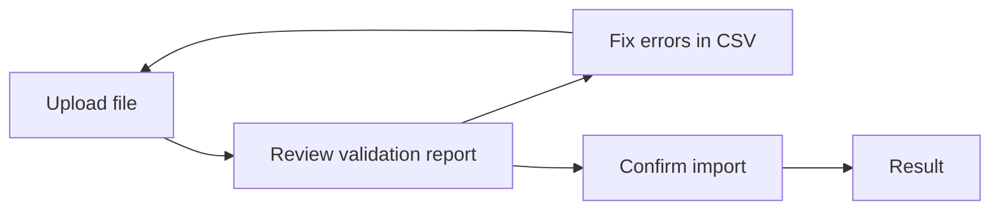

<!-- Source: src/frontend/src/pages/stammdaten/ImportPage.tsx, src/backend/app/api/v1/imports/router.py, src/backend/app/domain/services/import_service.py, src/backend/app/domain/engines/{csv_parser,import_engine,row_validator}.py, src/frontend/src/i18n/locales/en/translation.json (pages.import) -->

# Master Data Import

With the master data import, you don't have to create plant species, cultivars, and botanical families one by one — you can bring them in all at once from a CSV file (a plain-text, comma-separated table). This is especially useful when you first set up your instance or want to update many records at the same time.

---

## Prerequisites

- You are logged in — the import is available to any authenticated account; no special role is required.
- Your file is in **CSV format** (comma-, semicolon-, or tab-separated), encoded as UTF-8 or Latin-1.

## Supported Data Types

| Data Type | Label in the UI | Unique Identifier |
|-----------|-----------------|--------------------|
| Botanical species | Species | Scientific name |
| Cultivar | Cultivars | Parent species + cultivar name |
| Botanical family | Botanical Families | Name |

!!! warning "Cultivar import: validation only, records are not created yet"
    You can already select, upload, and validate the **Cultivars** data type — the validation report reliably shows you which rows would be correct. However, when you confirm the import, new cultivars are **not yet** created in the database. Until this is available, create cultivars via **Master Data → Add Cultivar** on the species detail page (see [Managing Cultivars](plant-management.md#managing-cultivars)).

## Downloading a CSV Template

So you don't have to guess which columns are expected, Kamerplanter provides a matching template for each data type:

1. Navigate to **Master Data → Import**
2. Select the desired **data type** at the top (Species, Cultivars, or Botanical Families)
3. Click **Download Template**

This downloads a CSV file with exactly the column headers supported for the selected data type. Fill in your data row by row below the header.

!!! tip "Use AI-generated CSV data"
    The [AI pipeline](../guides/ai-plant-data-pipeline.md) provides ready-made CSV rows in section 8 of each plant document, already in the correct format — you can paste these directly into the downloaded template.

### Required Fields per Data Type

| Data Type | Required Columns | Other Supported Columns |
|-----------|-------------------|---------------------------|
| Species | `scientific_name` | `common_name`, `family_name`, `growth_habit`, `cycle_type`, `root_type`, `description`, `container_suitable`, `recommended_container_volume_l`, `min_container_depth_cm`, `mature_height_cm`, `mature_width_cm`, `spacing_cm`, `indoor_suitable`, `balcony_suitable`, `greenhouse_recommended`, `support_required` |
| Cultivars | `species_key`, `cultivar_name` | `breeder`, `description`, `traits` |
| Botanical Families | `name` | `common_name`, `order_name`, `description` |

!!! note "Scientific name must follow the \"Genus species\" pattern"
    For the **Species** data type, `scientific_name` must start with a capitalized genus name followed by a lower-case species epithet, e.g. `Solanum lycopersicum`. If the value doesn't follow this pattern, the validation report flags an error.

!!! warning "For species, only three fields are actually saved"
    The species template contains many columns (growth habit, root type, suitability, dimensions, …), and these are confirmed as correct in the validation report. When creating a **new** species, Kamerplanter currently still only stores **Scientific Name**, **Common Name**, and **Description**. You'll need to add the remaining information afterwards on the [species detail page](plant-management.md#editing-a-species). For botanical families, on the other hand, all four columns are stored in full.

## Uploading a File

1. Navigate to **Master Data → Import**
2. Select the **data type** (Species, Cultivars, or Botanical Families)
3. Choose the **duplicate strategy** (see [Handling Duplicates](#handling-duplicates) below)
4. Click **Select CSV File** and choose your completed file
5. Click **Upload**

Kamerplanter automatically detects the encoding and delimiter (comma, semicolon, or tab) — you don't need to configure anything.

!!! note "Upload limits"
    An import file may be at most **10 MB** in size and contain at most **10,000 data rows**. Split larger data sets across multiple files.

## The Two-Phase Workflow

An import always runs through two separate steps: first your file is **checked without saving anything** (validation report), and only afterward do you confirm the actual import. This lets you see exactly what would happen beforehand and correct errors in your file before anything lands in the database.

<!-- diagram-source: user-described — two-phase CSV master-data import flow with a validation-and-fix loop before confirmation -->

### Step 1: Upload and Automatically Validate

As soon as you upload a file, Kamerplanter checks **every row individually** — before anything is saved. You are then automatically taken to the **Preview** step.

### Step 2: Review the Validation Report

The validation report shows you, per row:

- the parsed raw data,
- the status — **valid**, **invalid**, or **duplicate** —,
- for errors, a list of the affected fields with an error message (as a tooltip on the error chip).

At this point, **nothing has been saved yet**. If your file contains errors, use **Back** to return to the first step, fix the CSV file outside of Kamerplanter, and upload it again.

### Step 3: Confirm the Import

Once you're satisfied with the validation report, click **Confirm Import**. Only now are valid rows actually created as new records (or skipped/marked as failed, depending on the duplicate strategy). You'll then see the **Result** with a summary.

## Handling Validation Errors

A row is considered **invalid** if at least one of the following applies:

- A required field is empty (e.g. `scientific_name` for species).
- The scientific name doesn't match the "Genus species" pattern.
- A selection field (e.g. growth habit, root type, container suitability) contains a value that isn't one of the allowed options.
- The cell starts with a character that spreadsheet programs could interpret as a formula (e.g. `=`, `+`, `-`, `@`). Kamerplanter automatically strips this character for security reasons and flags it in the report.

Invalid rows are **not imported** when you confirm and count as "Failed" in the result.

!!! tip "Fix errors without starting over"
    You don't have to start from scratch after an error. Click **Back**, fix the affected cells in your CSV file, and upload it again — the previous job is discarded.

### Handling Duplicates

If a record with the same unique identifier already exists (e.g. the same scientific name), the validation report marks the row as a **duplicate**. How duplicates are handled is decided **before you upload** via the **duplicate strategy**:

| Option | Behavior |
|--------|----------|
| **Skip** | The row is ignored when confirming; the existing record stays unchanged. |
| **Update** | Intended for a future update of the existing record. |
| **Report Error** | The row is counted as a failure; nothing is saved. |

!!! warning "Update currently has no effect on existing records"
    The **Update** option does not yet modify existing records. Until this changes, choose **Skip** to avoid accidental duplicates, and edit existing entries directly in the relevant master data view instead (e.g. on the [species detail page](plant-management.md#editing-a-species)).

## Result After the Import

After confirming, Kamerplanter shows a summary with four metrics:

- **Created** — newly created records
- **Updated** — updated records (see the note above about the duplicate strategy)
- **Skipped** — duplicates skipped according to the chosen strategy
- **Failed** — rows that were not imported due to validation errors or an active "Report Error" strategy

If errors occurred, they are also listed. Use **New Import** to start the next run right away — e.g. to import another data type.

!!! note "No overview of past imports yet"
    Currently the UI only shows the import that's in progress. An overview page with the history of previous imports is not yet available in the web interface.

## Frequently Asked Questions

??? question "Can I confirm the same import more than once?"
    No. Once confirmed, the import job is complete. To process the same file again (e.g. after a correction), upload it again via **New Import**.

??? question "Are duplicates detected automatically when I upload again?"
    Yes, as long as the data type's unique identifier (e.g. scientific name for species, name for botanical families) already exists in the database. The row is then marked as a duplicate in the validation report.

??? question "What happens if I leave the page during the preview?"
    The unconfirmed import job is lost — nothing had been saved yet anyway. Upload the file again via New Import.

??? question "Can I also use the import for nutrient plans or other master data?"
    No, the CSV import currently supports only species, cultivars (validation only, see note above), and botanical families.

## See Also

- [Managing Master Data](plant-management.md) — Create and maintain species, cultivars, and families manually
- [Preparing Plant Data with AI](../guides/ai-plant-data-pipeline.md) — Generate ready-made CSV rows for import
- [Companion Planting & Crop Rotation](../guides/companion-planting.md) — Crop-rotation master data for botanical families
