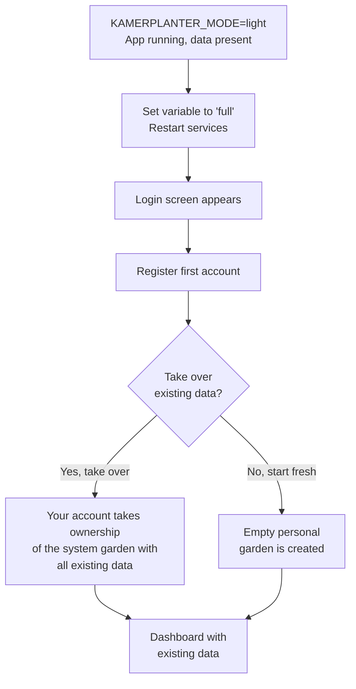

# Light Mode

Light Mode is an operating option for local Kamerplanter instances where you can open the app directly in your browser — without logging in or registering. You immediately see your plants, tasks, and calendar.

Perfect for: a Raspberry Pi on your home network, Docker Compose on your laptop, or just trying Kamerplanter out.

---

## When Should You Use Light Mode?

| Scenario | Light Mode | Full Mode |
|----------|:----------:|:---------:|
| I am the only user and don't need a login | Recommended | Possible |
| Family / household shares one instance on the LAN | Recommended | Possible |
| I want to try the app first | Recommended | Possible |
| Multiple people with separate accounts | Not suitable | Recommended |
| Publicly accessible instance (internet) | **Do not use** | Recommended |
| Community garden with role management | Not suitable | Recommended |

!!! danger "Security Warning: Closed Networks Only"
    Light Mode has no authentication. Anyone who can reach your instance on the network has full read and write access. Never run Light Mode on a publicly accessible address.

    Suitable environments: `localhost`, home network behind router firewall, Raspberry Pi without port forwarding.

---

## What Light Mode Changes

On first startup in Light Mode, the system automatically creates a **System User** (display name: "Gardener") and a **System Garden** (name: "My Garden"). All plants and data belong to this garden.

The table below shows which features are visible in each mode:

| Feature | Light Mode | Full Mode |
|---------|:----------:|:---------:|
| Login screen | Hidden | Visible |
| Registration | Hidden | Visible |
| Forgot password | Hidden | Visible |
| Garden switcher (tenant switcher) | Hidden | Visible |
| Member management | Hidden | Visible |
| Invitation system | Hidden | Visible |
| GDPR consent banner | Hidden | Visible |
| Privacy settings | Hidden | Visible |
| Account settings | Language & experience level only | Full |
| Task assignment to people | Hidden (single user) | Visible |
| Onboarding wizard | Starts directly on first open | After login |
| Manage plants | Full | Full |
| Manage locations | Full | Full |
| Care reminders | Full | Full |
| Fertilization & watering | Full | Full |
| Harvest management | Full | Full |
| Pest management (IPM) | Full | Full |
| Task planning | Full | Full |
| Phase control | Full | Full |
| Master data import | Full | Full |

---

## Enabling Light Mode

You enable Light Mode with a single environment variable in your Docker Compose configuration:

```yaml
# docker-compose.yml
services:
  backend:
    environment:
      KAMERPLANTER_MODE: light

  frontend:
    environment:
      VITE_KAMERPLANTER_MODE: light
```

A restart of the services is required after every change. Existing data is preserved.

!!! note "Default Mode"
    If you do not set the variable, Kamerplanter starts in Full Mode (`KAMERPLANTER_MODE=full`). Full Mode is the default for multi-user operation and SaaS installations.

---

## Switching Modes

### Upgrade: Light → Full

Want to share Kamerplanter with others or use multiple accounts? You can upgrade to Full Mode at any time.



After restarting in Full Mode you see the login screen. Register an account — a dialog will appear:

> "There is existing data (X plants, Y locations). Would you like to take it over into your account?"

**Yes, take over:** Your new account takes ownership of the system garden with all plants, locations, and nutrient plans. You can then invite additional members.

**No, start fresh:** An empty personal garden is created for your account. The old data remains in the database and can be viewed or deleted via the admin panel.

!!! tip "Tip"
    If you are unsure, choose "Yes, take over". You can always delete data afterwards — but you won't lose anything.

### Downgrade: Full → Light

Want to switch back from Full Mode to Light Mode?

!!! warning "Attention: Only the System Garden is Visible"
    In Light Mode only the system garden is accessible. If you created multiple gardens or user accounts in Full Mode, they are not visible in Light Mode. The data is **not lost** — it is fully accessible again when you next upgrade to Full.

Change the environment variable to `light` and restart the services. The system automatically reactivates the system user and system garden. You land directly on the dashboard without login.

### Round Trip: Light → Full → Light → Full

A full back-and-forth switch is possible and safe. All data remains in the database. When you next upgrade to Full you see the take-over dialog again — you can take over the existing data once more.

---

## Frequently Asked Questions

??? question "What happens if multiple people in the LAN access the Light Mode instance at the same time?"
    All devices on the network see the same data and act as the same system user. Changes made by one person are immediately visible to everyone else. There is no user separation — this is intentional for families and households.

??? question "Can I create backups in Light Mode?"
    Backups are created independently of the mode via ArangoDB backups or Docker volume backups. The mode has no influence on the backup strategy.

??? question "My network has a public IP address — can I still use Light Mode?"
    Only if the instance is exclusively reachable internally (firewall blocks the port externally, no port forwarding). If the instance is reachable via the internet, always use Full Mode with authentication.

??? question "I enabled Light Mode but the login screen still appears. Why?"
    Make sure you have set both `KAMERPLANTER_MODE=light` (backend) and `VITE_KAMERPLANTER_MODE=light` (frontend) and restarted both services. The frontend build reads the variable at startup — a restart of the frontend container is required.

??? question "Can I change the language and experience level in Light Mode?"
    Yes. **Account Settings** are available in a limited form in Light Mode: you can adjust language, timezone, and experience level. Password, sessions, and privacy settings are hidden because they are not relevant in Light Mode.

---

## See Also

- [Onboarding Wizard](onboarding.md) — First steps after startup
- [Locations & Substrates](locations-substrates.md) — Manage locations
- [Dashboard](dashboard.md) — Overview of your plants
