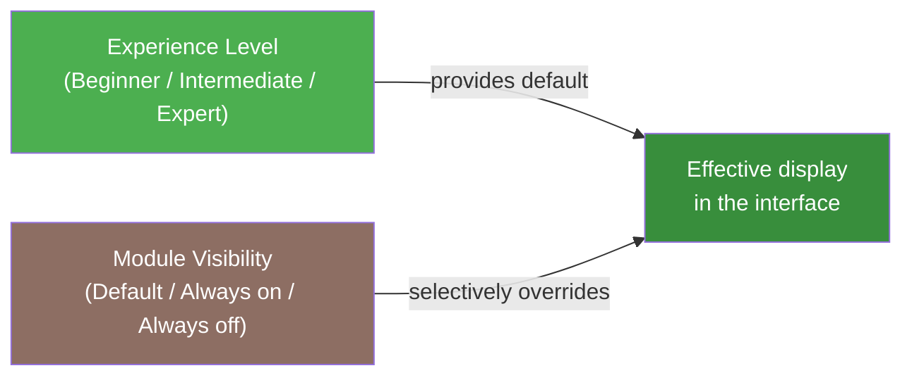

# Modules & Features

In your account settings, the **Modules & Features** tab lets you show or hide every sidebar navigation area — except the core modules — independently of, but building on, your chosen experience level. The result is a clean interface tailored exactly to the way you work.

!!! note "Display preference only"
    Showing and hiding modules is a **personal display preference**, not an access-control mechanism. The system continues to store all your data, and you can re-enable any hidden module at any time — without losing any data.

!!! note "New: every navigation area is now controllable"
    A few sidebar areas used to be unaffected by these settings — including **AI Assistant**, **Glossary**, **Overwintering**, **Phases** (Definitions & Sequences), and **Equipment & Inventory**. These five modules are now just as controllable as every other non-essential area.

---

## Prerequisites

- You are signed in (or using Light Mode on a local device).
- You have already set your experience level in the Onboarding Wizard or in your account settings (see [Onboarding Wizard](onboarding.md)).

---

## Opening the Settings

1. Click your **profile picture** or user icon in the top-right corner.
2. Select **Account Settings**.
3. Switch to the **Modules & Features** tab.

You will see a list of all modules you can show or hide, grouped by category.

---

## How Module Visibility Works

### Three states per module

Each module has three possible settings:

| Setting | Meaning |
|---------|---------|
| **Follows experience level** (default) | Visibility is determined by your chosen experience level (Beginner / Intermediate / Expert). No manual override. |
| **Always show** | The module is visible even if your experience level would hide it. Useful for individual specialist functions you want to access. |
| **Always hide** | The module is hidden even if your experience level would show it. Ideal for removing features you do not need. |

!!! tip "Tip: the default is always the most flexible option"
    As long as you leave a module set to **Follows experience level**, a later change to your experience level will automatically affect that module. Only explicitly overridden modules (always show / always hide) require a manual reset.

### What changes when a module is hidden

Hiding a module removes it consistently from:

- the **sidebar** (navigation items)
- the **dashboard** (related widgets and quick-actions)
- **shortcuts** and links elsewhere in the interface

Your **data within that module is fully preserved**. When you re-enable the module, the complete feature set is immediately available again.

### Direct URL access to hidden modules

If you navigate directly to a page belonging to a hidden module — via a URL or a saved link — you will see a friendly notice instead of a 404 error:

> "This module is hidden. Would you like to re-enable it?"

Clicking **Open in Settings** takes you directly to the Modules & Features tab. Shared or bookmarked links are never broken.

---

## Showing or Hiding a Module

### Step 1: Find the module in the list

Modules are organised into collapsible category sections (accordions). Use the **search field** at the top to quickly locate a specific module.

### Step 2: Change the setting

Toggle the switch next to the module:

- **On** — module is visible (always show)
- **Off** — module is hidden (always hide)

A small status label next to the switch shows the current effective state: "follows experience level: visible" or "manually hidden".

### Step 3: Reset to default

To remove a manual override and let the module follow your experience level again, click the **Reset** link next to that module.

Changes are saved immediately — no separate confirmation button is needed.

!!! example "Example: Houseplant grower hides Tank Management"
    You grow houseplants exclusively and do not need Tank Management or Harvest Batches. Set both modules to **Always hide**. Your sidebar and dashboard become immediately cleaner — your existing data in those areas remains untouched.

!!! example "Example: Beginner interested in pest control"
    You are a beginner, but you specifically want access to IPM (Integrated Pest Management). Set the **Pest Management (IPM)** module to **Always show**. It appears in the sidebar immediately — without switching your entire experience level to "Expert".

---

## Core Modules: Always Visible

The following modules are essential functions of the application and cannot be hidden. They appear in the Modules & Features tab as fixed entries labelled "Core function — always visible":

| Module | Description |
|--------|-------------|
| **Dashboard** | Your personal overview page |
| **My Plants** | Plant management and details |
| **Locations** | Location and substrate management |
| **Settings** | Account settings and preferences |
| **Onboarding** | Setup wizard |

---

## Available Modules (Overview)

The table below lists all modules you can show or hide, along with the default visibility threshold per experience level. <!-- Source: src/frontend/src/config/moduleCatalog.ts -->

| Module | Category | Default from level |
|--------|----------|-----------------:|
| Calendar | Care & Planning | Beginner |
| Watering Log | Care & Planning | Beginner |
| Tasks & Workflows | Care & Planning | Beginner |
| Fertilization & Nutrient Plans | Nutrition & Water | Intermediate |
| Tank Management | Nutrition & Water | Expert |
| Aquaponics | Nutrition & Water | Expert |
| Substrates | Nutrition & Water | Expert |
| Calculators (VPD/GDD/EC) | Nutrition & Water | Expert |
| Plant Protection (IPM) | Plant Protection | Expert |
| Harvest & Harvest Batches | Harvest | Expert |
| Post-Harvest | Harvest | Expert |
| Planting Runs | Cultivation | Expert |
| Propagation | Cultivation | Expert |
| Overwintering | Cultivation | Intermediate |
| Phases (Definitions & Sequences) | Cultivation | Expert |
| Equipment & Inventory | Inventory & Equipment | Beginner |
| Master Data (Species/Families/Import) | Master Data | Intermediate |
| Companion Planting & Crop Rotation | Master Data | Expert |
| Environment Control & Actuators | Automation | Beginner |
| AI Image Recognition | AI | Intermediate |
| AI Assistant | AI | Beginner |
| Glossary | Knowledge & Reference | Beginner |

!!! note "About the 'Default from level' column"
    This column shows from which experience level a module is visible by default, without any manual override. On the "Beginner" level, for example, the core modules plus Calendar, Watering Log, Tasks & Workflows, Environment Control & Actuators, Equipment & Inventory, AI Assistant, and Glossary are already shown by default. You can manually override any module at any time.

---

## Relationship to Experience Level

Module visibility and the [experience level](onboarding.md) complement each other but do not replace each other:

- The **experience level** controls how much detail and how many fields are shown *within* a module (e.g. advanced EC fields, technical parameters).
- **Module visibility** controls whether an entire functional area appears at all.

A level change automatically affects all modules for which you have **not** set a manual override. Modules you have explicitly shown or hidden remain unchanged.

---

## Light Mode (Without Login)

In [Light Mode](light-mode.md) — when Kamerplanter runs locally without registration — your module settings are stored in the **browser's local storage**. They are available immediately on that device.

When you later register or sign in, your locally stored settings are automatically migrated to your account. No preferences are lost.

---

## Frequently Asked Questions

??? question "Are my data deleted when I hide a module?"
    No. Hiding a module is a pure display preference. All data within the hidden module is fully preserved. When you re-enable the module, all your previous entries are immediately visible again.

??? question "What happens to notifications for hidden modules?"
    Notifications (e.g. care reminders) remain active even when the associated module is hidden. Module visibility only affects the visual display in the interface.

??? question "Can I reset all modules at once?"
    Currently you can reset modules individually or per category. A global "Reset all" function is planned.

??? question "Can another user in the same garden see my module settings?"
    No. Module visibility is a personal setting per user. Other members in your garden (tenant) have their own independent configuration.

??? question "Why are some modules not in the list?"
    Core modules (Dashboard, My Plants, Locations, Settings, Onboarding) cannot be hidden and therefore do not appear as switchable entries in the list.

---

## See Also

- [Onboarding Wizard](onboarding.md) — Set your experience level and choose a starter kit
- [Dashboard](dashboard.md) — Overview and widgets
- [Personalizing Your Dashboard](dashboard-personalization.md) — choose, arrange, and configure widgets
- [Tenant Management](tenants.md) — Manage multiple gardens and user roles
- [Light Mode](light-mode.md) — Run Kamerplanter without login
