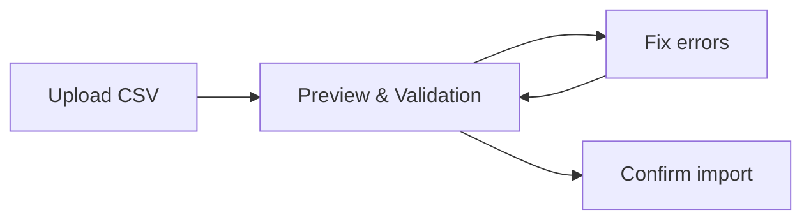

# Managing Master Data

Kamerplanter stores all basic plant data -- species, cultivars, and botanical families -- as **master data**. This forms the basis for planting runs, nutrient plans, phase control, and care reminders.

## Overview

Master data is the central knowledge base of the system. Each plant species is captured with up to 80+ structured fields:

| Entity | Description | Example |
|--------|------------|---------|
| **Botanical Family** | Plant family with crop rotation category | Solanaceae (nightshades) |
| **Species** | Botanical species with taxonomy, climate, light, propagation | *Solanum lycopersicum* (tomato) |
| **Cultivar** | Breeding variety with cultivar-specific properties | San Marzano, Cherry Roma |

The hierarchy is: Family → Species → Cultivar. Each cultivar belongs to exactly one species, each species to exactly one family.

## Managing Species

### Creating a Species

1. Navigate to **Master Data** > **Species**
2. Click **New Species**
3. Fill in at least the required fields:
    - **Scientific Name** (e.g. *Solanum lycopersicum*)
    - **Common Names** (e.g. Tomato, Tomate)
    - **Family** (e.g. Solanaceae)
    - **Genus** (e.g. Solanum)

!!! tip "Expertise levels affect field visibility"
    In **Beginner mode**, only the most important fields are shown. Advanced fields like allelopathy score, photoperiodism, or root type only appear in **Intermediate** or **Expert mode**. You can always access all fields via the "Show all fields" toggle, even in Beginner mode.

### Key Species Fields

| Field | Description | Example |
|-------|------------|---------|
| Lifecycle | Annual, Biennial, or Perennial | Annual |
| Growth Habit | Herb, Shrub, Tree, Vine | Herb |
| Root Type | Fibrous, Taproot, Tuberous, ... | Fibrous |
| Frost Sensitivity | Hardy, Half-hardy, Tender | Tender |
| Nutrient Demand | Heavy feeder, Medium feeder, Light feeder | Heavy feeder |
| Photoperiodism | Short-day, Long-day, Day-neutral | Day-neutral |
| Toxicity | Toxicity for cats/dogs (ASPCA data) | Toxic to cats |

### Editing a Species

1. Click on a species in the list
2. On the detail page you can edit all fields
3. The detail page also shows associated cultivars, growth phases, and nutrient plans

## Managing Cultivars

Cultivars are breeding varieties within a species. They inherit base properties from the species and add cultivar-specific data.

### Creating a Cultivar

1. Navigate to a **Species detail page**
2. In the **Cultivars** section, click **New Cultivar**
3. Fill in the fields:
    - **Name** (e.g. San Marzano)
    - **Breeder** (optional)
    - **Traits** (e.g. disease-resistant, high-yield, compact)

## Botanical Families

Families group related species and form the basis for crop rotation planning. Kamerplanter comes pre-installed with the most common families (Solanaceae, Brassicaceae, Fabaceae, Cucurbitaceae, ...).

### Creating a Family

1. Navigate to **Master Data** > **Botanical Families**
2. Click **New Family**
3. Enter the name and optionally the crop rotation category

---

## Preparing Master Data with AI

Manually collecting all plant data from various sources is time-consuming. Kamerplanter therefore offers an **AI-powered pipeline** that fully prepares and quality-checks new plants.

The pipeline uses Claude Code Agents to:

1. **Automatically generate plant documents** -- An agent researches taxonomy, growth phases, nutrient profiles, pests, and companion planting data
2. **Perform scientific review** -- A second agent checks the data from an agrobiology perspective
3. **Deliver import-ready CSV data** -- Each document contains ready-made CSV lines for bulk import

!!! example "Example invocation in Claude Code"
    ```
    Create a plant document for basil
    ```
    Claude Code recognizes the context and automatically starts the appropriate agent.

Currently over **32 plants** are fully documented -- including vegetables, herbs, ornamentals, and houseplants.

:material-arrow-right: **[Detailed guide: Preparing plant data with AI](../guides/ai-plant-data-pipeline.md)**

---

## Importing Master Data via CSV

For initial setup or batch updates, master data can be imported via CSV files. The import follows a secure **two-phase process**:



### Supported Entities

| Entity | Identification | Use Case |
|--------|---------------|----------|
| Species | `scientific_name` | Initial population of botanical species |
| Cultivar | `name` + `parent_species` | Cultivar catalog imports |
| BotanicalFamily | `name` | Plant families |
| NutrientPlan | `name` + `source_chart` | Manufacturer feeding charts |

### Performing an Import

1. Navigate to **Master Data** > **Import**
2. Select the **Entity** (Species, Cultivar, Family, or Nutrient Plan)
3. Upload your **CSV file** -- encoding and delimiter are auto-detected
4. Review the **Preview**: Each row is validated individually, errors are shown per field
5. Choose the **Duplicate strategy** (Skip, Update, or Fail)
6. Click **Confirm Import**

!!! tip "Download CSV templates"
    Under **Import** > **Templates**, CSV templates are available for each entity. These contain all supported columns with example values.

!!! tip "Use AI-generated CSV data"
    The [AI pipeline](../guides/ai-plant-data-pipeline.md) provides ready-made CSV lines in section 8 of each plant document that can be imported directly.

---

## Prerequisites

- Kamerplanter instance running and accessible
- For CSV import: CSV file in UTF-8 format

## See Also

- [Preparing plant data with AI](../guides/ai-plant-data-pipeline.md) -- Detailed guide to the AI pipeline
- [Growth Phases](growth-phases.md) -- Phase control per species
- [Planting Runs](planting-runs.md) -- Accompany plants from sowing to harvest
- [Fertilization](fertilization.md) -- Nutrient plans and feeding charts
