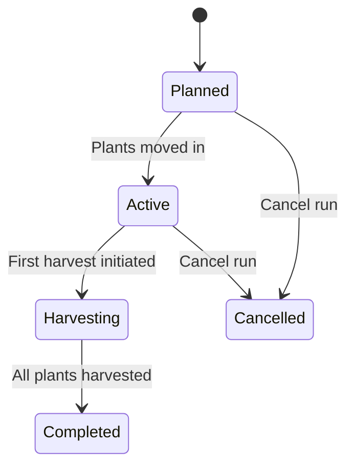

# Planting Runs

A planting run groups related plants for shared lifecycle tracking. Instead of managing 20 tomatoes individually, you create a run — and can then apply phase transitions, watering events, and harvest batches to the whole group at once.

---

## Prerequisites

- At least one site with a location
- Master data: plant species must be set up
- Optional: a nutrient plan for the group

---

## What Is a Planting Run?

A planting run is a lightweight group container. It has no lifecycle of its own — it simply groups plants. Each plant in the run retains full independence:

- Individual plants can be edited on their own
- A plant can be detached from the run at any time
- Phase transitions can be triggered for all plants simultaneously or for individual plants separately

**Three types of planting runs:**

| Type | Description | Example |
|------|-------------|---------|
| **Monoculture** | All plants are one species and one variety | 20 tomatoes "San Marzano" |
| **Clone** | Cuttings from one mother plant | 10 cannabis clones from mother "WW-01" |
| **Mixed culture** | Multiple species in one group | Tomatoes + basil + marigolds |

---

## Creating a New Planting Run

### Step 1: Navigate to Runs

Click **Runs** in the navigation. The overview shows all active and past planting runs.

### Step 2: Create a New Run

Click **New Run**. A dialog opens.

### Step 3: Enter Basic Data

| Field | Description | Example |
|-------|-------------|---------|
| Name | Unique name for the run | "Tomatoes Raised Bed A 2026" |
| Type | Monoculture, clone, or mixed culture | Monoculture |
| Site | Which facility? | "My Garden" |
| Location | Specific area | "Raised Bed A" |
| Planned Start | When to plant? | 15 April 2026 |
| Notes | Special goals or observations | "Trial without plastic cover" |

### Step 4: Add Plants to the Run

Click **Add Entry**:

1. Select the **species** from the master data.
2. Optionally select a **cultivar**.
3. Enter the **quantity** of plants.
4. Select the **role** (primary plant, companion plant, trap crop).
5. Select the **substrate**.

For mixed-culture runs you can add multiple entries with different species.

!!! example "Example: Mixed-culture bed"
    - Tomatoes "Roma", 8 plants, role: Primary
    - Basil "Genovese", 12 plants, role: Companion
    - Marigolds, 6 plants, role: Trap crop

### Step 5: Let Kamerplanter Create the Plants

Click **Create Plants**. Kamerplanter automatically creates all individual plants with sequential IDs (e.g. RAISEDBED-A_TOM_01 to RAISEDBED-A_TOM_08).

---

## Planting Run Status

A planting run passes through the following states:

| Status | Description |
|--------|-------------|
| **Planned** | Created, not yet started |
| **Active** | Plants moved in, growth running |
| **Harvesting** | First harvest complete, more to follow |
| **Completed** | All plants harvested or removed |
| **Cancelled** | Run was ended early |

---

## Batch Operations

The power of planting runs lies in batch operations — actions applied to all plants simultaneously.

### Batch Phase Transition

Move all plants in a run to the next phase at once:

1. Open the planting run.
2. Click **Batch Phase Change**.
3. Select the target phase (e.g. "Vegetative" → "Flowering").
4. Review the list of eligible plants (plants already in a later phase are excluded).
5. Confirm.

### Confirm Watering (Batch)

After watering, document the event for all plants simultaneously:

1. Click **Confirm Watering**.
2. The system suggests the amount and EC from the assigned nutrient plan.
3. Adjust values if you mixed differently.
4. Confirm — a feeding event is recorded for all plants.

### Create a Harvest Batch

Document a harvest for all plants in the run at once:

1. Click **Create Harvest Batch**.
2. The system checks all pre-harvest intervals.
3. Enter fresh weight and quality rating.
4. Confirm — a harvest batch linked to all plants in the run is created.

### Remove All Plants

Mark all plants as removed at the end of a cycle in one step:

1. Click **Remove All Plants**.
2. Confirm. The run moves to "Completed" status.

---

## Assigning a Nutrient Plan

You can assign a nutrient plan to a planting run to simplify watering planning:

1. Open the run.
2. Click **Assign Nutrient Plan**.
3. Select a plan from the list.

The plan defines which nutrients to use in which phase at which dosage. When watering, Kamerplanter automatically suggests the phase-appropriate dosages.

---

## Detaching Individual Plants

If one plant needs to follow a different path from the group (e.g. it shows deficiency symptoms and needs individual treatment):

1. Open the plant in the run list.
2. Click **Detach from Run**.
3. The plant stays active but is now independent.

Detaching a plant from the run does not delete the plant.

---

## Succession Sowing (Staggered Runs)

For continuous harvest (e.g. fresh lettuce every 3 weeks) Kamerplanter supports staggered planting runs:

1. Create the first run as usual.
2. Click **Create Follow-Up Planting**.
3. Select the interval (e.g. 21 days after the first run).
4. Kamerplanter copies the run configuration and shifts the start date accordingly.

---

## Frequently Asked Questions

??? question "Do I have to use planting runs?"
    No. You can also set up and manage plants individually. Planting runs are especially useful when you are growing multiple plants of the same species simultaneously and want to manage them together.

??? question "Can a plant belong to more than one run?"
    No. A plant can belong to at most one planting run. If you want to reassign a plant to a different run, detach it from the current one first.

??? question "What happens to plants when I cancel a run?"
    The plants remain in the system and are marked "active". They are simply no longer associated with the run. You can continue managing them individually or remove them manually.

??? question "Can I add plants to a running run later?"
    Yes, as long as the run has not been completed. Open the run and click **Add Plants**.

---

## See Also

- [Master Data: Plant Species](plant-management.md)
- [Growth Phases](growth-phases.md)
- [Harvest](harvest.md)
- [Fertilization](fertilization.md)
