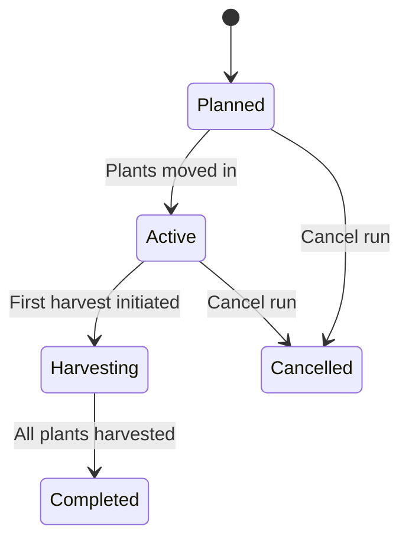

# Planting Runs

A planting run groups related plants for shared lifecycle tracking. Instead of managing 20 tomatoes individually, you create a run — and can then apply phase transitions and watering events to the whole group at once.

---

## Prerequisites

- At least one site with a location
- Master data: plant species must be set up
- Optional: a nutrient plan for the group

---

## What Is a Planting Run? {#what-is-a-planting-run}

A planting run is a lightweight group container. It has no lifecycle of its own — it simply groups plants. Each plant in the run retains full independence:

- Individual plants can be edited on their own (e.g. notes)
- A plant can be detached from the run at any time
- As long as a plant belongs to the run, its phase transitions only happen **together with the whole group** (batch phase transition) — a transition for that one plant alone is blocked until it has been detached from the run

**Two types of planting runs:**

| Type | Description | Example |
|------|-------------|---------|
| **Monoculture** | All plants are one species and one variety | 20 tomatoes "San Marzano" |
| **Clone** | Cuttings from one mother plant | 10 cannabis clones from mother "WW-01" |

!!! note "Mixed culture is not a separate run type"
    A planting run has no dedicated mixed-culture type and no roles (primary/companion/trap plant). Technically, you can still assign several different species to one run via multiple entries (e.g. for tightly interplanted crops at the same location) — but during a batch phase transition, Kamerplanter only considers the most common ("dominant") phase and moves only the matching plants along. For real mixed-culture beds (e.g. tomatoes + basil + marigolds), the recommended pattern is therefore **multiple separate runs per species at the same location**, combined with compatibility checks at the master-data/location level. See the [Companion Planting & Crop Rotation](../guides/companion-planting.md) guide for details.

---

## Creating a New Planting Run

### Step 1: Navigate to Runs

Click **Planting Runs** in the navigation, under the **Planting Runs** section. The overview shows all active and past planting runs.

### Step 2: Create a New Run

Click **Create Run**. A dialog opens.

### Step 3: Enter Basic Data

| Field | Description | Example |
|-------|-------------|---------|
| Name | Unique name for the run | "Tomatoes Raised Bed A 2026" |
| Planned Start | When to plant? | 15 April 2026 |
| Type (intermediate and above) | Monoculture or clone | Monoculture |
| Site (intermediate and above) | Which facility? | "My Garden" |
| Location (intermediate and above) | Specific area | "Raised Bed A" |
| Notes (intermediate and above) | Special goals or observations | "Trial without plastic cover" |
| Substrate Batch (expert) | Key of the linked substrate batch (see [Locations & Substrates](locations-substrates.md#substrate-batches-reuse-assignment)) | "SOIL-2026-03" |
| Source Plant (expert, "Clone" type only) | Key of the mother plant the clones come from | — |

!!! note "Experience levels"
    As in many forms, Kamerplanter shows or hides fields depending on your experience level. Use **Show all fields** to see every field at once, even as a beginner.

### Step 4: Set Up Entries — Create New Plants or Adopt Existing Ones

For a new run you have two options: create new plant entries (default) or take over existing, standalone plants into the run. These are mutually exclusive and toggled with the **Adopt existing plants** switch.

#### Creating new plant entries

Click **Add Entry** and fill in for each entry:

| Field | Description |
|-------|-------------|
| Species | From master data, required |
| Cultivar | Optional, depends on the selected species |
| Quantity | How many plants of this species/cultivar should be created in the run |
| ID Prefix | 2–5 uppercase letters used to build the plant ID (e.g. "TOM" for tomato). Kamerplanter suggests the prefix automatically from the genus or cultivar name — you can overwrite it |

You can add multiple entries if a run should contain several varieties of the same species or — with appropriate planning — several species at once (see the mixed-culture note above).

!!! info "For technical users"
    The data model also tracks a spacing value in cm (`spacing_cm`) and a note per entry. Both are shown in the run's details table once set — but the create form has no input fields for them yet. This setting is currently only available via the API.

#### Adopting existing plants

Turn on the **Adopt existing plants** switch to bring already existing, unassigned plants into the new run instead of creating new entries:

1. Turn on the switch. The input fields for new entries disappear, and a searchable list of all standalone plants appears instead.
2. Search by ID, name, or current phase and select the plants you want (or use **Select All**).
3. When you save, the selected plants are assigned to the newly created run without creating new plant records. The run switches directly to "Active".

This is useful if you first created individual plants and want to group them together afterwards.

!!! tip "Adopting plants later"
    Adoption is not limited to run creation: as long as a run is "Planned" or "Active", you can click **Adopt Plants** at the top of its detail page at any time to bring in further existing plants (of the same species as the existing entries).

### Step 5: Save the Run

Click **Create**.

- **New-entries mode:** The run is created with the entered entries in **"Planned"** status. The individual plant records do not exist yet — that requires a separate step (see below).
- **Adopt mode:** The selected existing plants are taken over immediately, and the run is already **"Active"** afterwards.

### Step 6: Create Plants From the Entries (new-entries mode only)

As long as a run is "Planned" and used entries (not adoption), the individual plants do not exist yet. To create them:

1. Open the run.
2. Click **Create Plants** at the top.
3. Confirm the number of plants to be created in the dialog.
4. Kamerplanter automatically creates all individual plants with sequential IDs in the format `LOCATION-KEY_PREFIX_SEQUENCE` (e.g. `raised-bed-a_TOM_01` to `raised-bed-a_TOM_08`, where `raised-bed-a` is the internal key of the chosen location) and sets the run to **"Active"**.

If a plant is assigned a slot in the process, Kamerplanter automatically checks crop rotation and companion-planting compatibility for it — exactly as for an individually created plant. A conflict for even a single plant blocks the creation of the **entire run**. See the [Companion Planting & Crop Rotation](../guides/companion-planting.md) guide for details.

<!-- Source: src/frontend/src/pages/durchlaeufe/PlantingRunCreateDialog.tsx, PlantingRunDetailPage.tsx, src/backend/app/domain/engines/planting_run_engine.py, src/backend/app/domain/services/planting_run_service.py (_validate_batch_planting) -->

---

## The Tabs on the Run Detail Page

The run's detail page is organized into five tabs:

| Tab | Content |
|-----|---------|
| Details | Overview with entries, assigned nutrient plan, dosage preview, and location/tank information |
| Plants | List of all plants in the run, including the detach action |
| Phases | Phase timeline per species, actual dates, plants grouped by phase |
| Fertilization & Watering | Assigned nutrient plan, watering calendar, dosage calculator |
| Activity Plan | Suggested or assigned care activities per phase |

The sections below cover the most important actions in these tabs.

---

## Planting Run Status

A planting run passes through the following states:

<!-- diagram-source: user-described — planting run status lifecycle from planned through harvesting to completed or cancelled -->

```mermaid
stateDiagram-v2
    [*] --> Planned
    Planned --> Active : Plants moved in
    Active --> Harvesting : First harvest initiated
    Harvesting --> Completed : All plants harvested
    Active --> Cancelled : Cancel run
    Planned --> Cancelled : Cancel run
```

| Status | Description |
|--------|-------------|
| **Planned** | Created, entries exist, but plant records have not been created yet |
| **Active** | Plants created or adopted, growth is running |
| **Harvesting** | Intermediate status intended for harvest runs |
| **Completed** | Run ended, all plants removed |
| **Cancelled** | Run was ended early |

!!! note "Partially available: „Harvesting" status"
    The "Harvesting" status is defined in the data model (as an intermediate step between "Active" and "Completed"), but nothing in the current UI sets it automatically — not even creating a harvest batch for a plant in the run. Runs currently move directly from "Active" to "Completed"/"Cancelled" (see [Ending a Run](#ending-a-run)).

---

## Phase History in the "Phases" Tab

In the **Phases** tab, Kamerplanter shows a visual phase timeline for every species represented in the run, plus a table with the actual history:

| Column | Description |
|--------|-------------|
| Phase | Phase name with a status chip (Completed / Current / Projected) |
| Actual Start / Actual End | Recorded actual dates; for projected phases, an estimated ("projected") date |
| Duration (Days) | Actual duration for completed phases, elapsed time for the current phase, typical duration for projected phases |

The pencil icon lets you correct the actual start or end date of a completed or current phase after the fact — for example when a transition was only entered into the system later. This correction applies to **all plants of the run together**: you can't correct it for individual plants — the correction always applies to the whole run.

Below that, Kamerplanter lists all plants, grouped by their current phase, with a direct link to each plant's detail page.

<!-- Source: src/frontend/src/pages/durchlaeufe/RunPhaseEditor.tsx -->

---

## Batch Operations

The power of planting runs lies in batch operations — actions applied to all eligible plants at once.

### Batch Phase Transition

Move all eligible plants in a run to the next phase at once:

1. Open the planting run ("Active" or "Harvesting" status).
2. Click **Phase Transition**.
3. Kamerplanter determines the currently most common ("dominant") phase among the still-active plants and suggests the phases that follow it in the phase sequence.
4. Select the target phase (e.g. "Vegetative" → "Flowering").
5. If the run contains several species (several entries with different species), Kamerplanter warns you that only compatible plants will be transitioned.
6. Confirm — Kamerplanter reports how many plants were transitioned, skipped (e.g. already in a later phase), or failed.

!!! note "Individual phase transitions are blocked within a run"
    As long as a plant belongs to a run, a phase transition is only possible for the whole group — a direct transition on the individual plant is rejected with the conflict `phase.run_owned`. For details and how to detach a plant if needed, see [Growth Phases: Why Plants in a Run Can't Be Transitioned Individually](growth-phases.md#why-plants-in-a-run-cant-be-transitioned-individually).

### Confirming Watering (Batch)

Once a nutrient plan is assigned, the **Fertilization & Watering** tab shows a calendar with the due watering/feeding dates. For a due date, you have two options:

- **Quick Confirm** — applies the system-suggested amount/EC directly, without further input.
- **Confirm Watering** — opens a dialog where you can enter the measured amount, EC, and pH manually, if you mixed differently.

Either way, a feeding event is recorded for the run.

### Ending a Run {#ending-a-run}

At the end of a cycle (or if you want to cancel it early), you end the entire run in one step:

1. Click **End Run** (visible as long as the run is active or in "Harvesting" status).
2. Choose the final status: **Cancelled** or **Completed**.
3. Confirm — all still-active plants in the run are marked as removed, and the run switches to the chosen final status.

Ending the run does not delete the plants from the system — they remain accessible but are no longer considered active.

### Completing the Harvest {#ernte-abschliessen}

Once a run has been harvested, you complete the harvest for **all still-active plants of the run in a single step**:

1. Click **Complete harvest** at the top of the detail page (visible as long as the run is active or in "Harvesting" status).
2. Confirm in the dialog — it shows how many plants are affected.
3. Every still-active plant of the run moves to its terminal "harvested" state: its phase history is closed, occupied slots are freed, and the plants disappear from the active task queue. The resulting phase transition then shows up in the **Plants** tab ("Current phase" / "Removed on" columns). Existing harvest batches are fully retained.

If no active plants remained when you clicked (the run was already fully harvested), you get a notice and nothing changes. The step **cannot be undone**.

!!! note "Harvest batches stay per plant"
    "Complete harvest" ends the plants' lifecycle but records **no** harvest quantities. Fresh weight, harvest type, and quality are still documented individually per plant via the **Harvest Batches** page (menu **Harvest**) — a run-level "harvest batch" feature for quantity recording does not exist. See the [Harvest](harvest.md) guide for details.

<!-- Source: src/frontend/src/pages/durchlaeufe/PlantingRunDetailPage.tsx, src/backend/app/domain/services/harvest_service.py (complete_harvest_for_run), src/backend/app/api/v1/harvest/tenant_router.py (POST /harvest/runs/{run_key}/complete); src/backend/app/domain/models/harvest.py (HarvestBatch.plant_key — no run_key) -->

---

## Activity Plan (Tab) {#activity-plan-tab}

The **Activity Plan** tab manages recurring care activities (e.g. topping, defoliation, repotting) for the run:

- **No plan assigned yet:** Click **Generate Plan** to produce a suggestion from the species-specific growth phases. Kamerplanter groups the suggested activities by phase and shows, for each one, the day offset, category, stress level, skill level, required tools, and a rationale.
- Adjust the suggestion: enable/disable individual activities with the switch, change the day offset, or remove an activity entirely.
- Kamerplanter flags activities whose stress level exceeds the tolerance of the respective phase.
- Click **Apply to Run** to turn the plan into actual tasks for the run.
- **Plan already assigned:** The tab instead shows a list of the assigned tasks grouped by phase, with progress (completed/total).

!!! note "Link to workflow templates"
    A generated and applied activity plan can be saved as a reusable workflow template and later applied to other plants of the same species. See the [Task Planning](tasks.md) guide for details.

<!-- Source: src/frontend/src/pages/durchlaeufe/ActivityPlanTab.tsx -->

---

## Assigning a Nutrient Plan

You can assign a nutrient plan to a planting run to simplify watering planning:

1. Open the run and switch to the **Fertilization & Watering** tab.
2. Click **Assign Nutrient Plan**.
3. Select a plan from the list.

The plan defines which nutrients to use in which phase at which dosage. When watering, Kamerplanter automatically suggests the phase-appropriate dosages.

---

## Detaching Individual Plants from a Run

If one plant needs to follow a different path from the group (e.g. it shows deficiency symptoms and needs individual treatment):

1. Switch to the **Plants** tab.
2. Click **Detach** in the row of the affected plant (only available while the run is active).
3. The plant stays active but is now independent — its phase can be transitioned individually again afterwards.

Detaching a plant from the run does not delete the plant.

---

## Plant Diary {#plant-diary}

Every plant in a run has its own diary — a tab on its detail page where you record observations, problems, milestones, measurements and photos, and optionally have individual entries assessed by your own AI agent. A tenant-wide overview brings together the entries of every plant, whether or not it belongs to a run. For details, including AI analysis, see [Diary](plant-diary.md).

!!! info "API only: fetching an entire run's diary entries in bulk"
    Besides the per-plant view there is a technical API endpoint that returns the diary entries of **every** plant in a run at once — useful for a combined evaluation, e.g. in your own reporting tool. There is currently no dedicated UI for it; the tenant-wide [diary overview](plant-diary.md#every-entry-at-a-glance-the-diary-overview) covers the same need across every plant, not only those of a single run.

<!-- Source: src/backend/app/domain/models/plant_diary_entry.py, src/backend/app/api/v1/planting_runs/tenant_router.py -->

---

## Frequently Asked Questions

??? question "Do I have to use planting runs?"
    No. You can also set up and manage plants individually. Planting runs are especially useful when you are growing multiple plants of the same species simultaneously and want to manage them together.

??? question "Can a plant belong to more than one run?"
    No. A plant can belong to at most one planting run. If you want to reassign a plant to a different run, detach it from the current one first.

??? question "What happens to plants when I end a run?"
    The plants remain in the system but are marked as removed and are no longer associated with the run. You can still view them afterwards.

??? question "Can I add plants to a running run later?"
    Yes, as long as the run has not been completed. Open the run and click **Adopt Plants** to take over existing, unassigned plants of the matching species. New entries can no longer be added through the UI once the run has been created.

---

## See Also

- [Master Data: Plant Species](plant-management.md)
- [Growth Phases](growth-phases.md)
- [Locations & Substrates](locations-substrates.md)
- [Companion Planting & Crop Rotation](../guides/companion-planting.md)
- [Task Planning](tasks.md)
- [Harvest](harvest.md)
- [Fertilization](fertilization.md)
